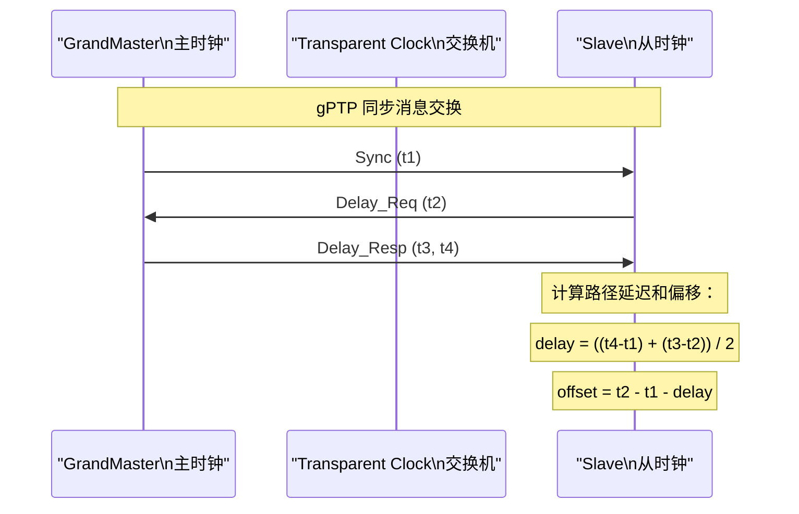
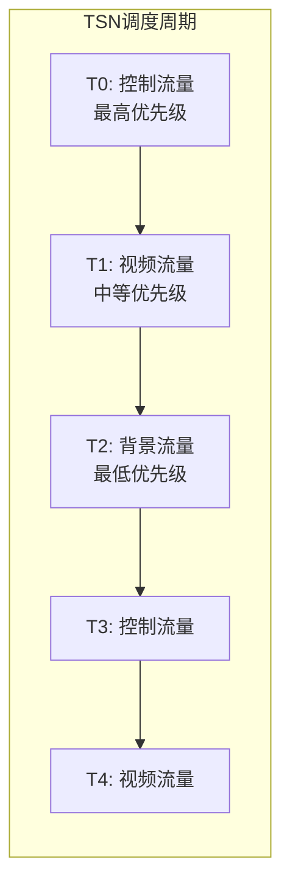

# TSN 时间敏感网络基础认知 [E→M]

> **本章学习目标**：
> - 理解 TSN（Time-Sensitive Networking） 从标准以太网演进的动机
> - 掌握 IEEE 802.1Qbv 门控调度 与 gPTP 时间同步
> - 了解 TSN 在自动驾驶和工业控制中的关键作用

---

## TSN 的诞生：以太网的"实时化改造"

---

### <strong>为什么需要 TSN：标准以太网不保证时延</strong>

TSN由 IEEE 802.1 工作组在 2012 年启动，
目标是为标准以太网添加确定性时延保障。

标准以太网的问题：
 
* 交换机的存储转发引入不可预测的排队延迟
 
* 突发流量会挤占实时流量
 
* 没有全局时间同步，无法协调多节点动作
 

TSN 通过时间同步（gPTP）、门控调度（Qbv）、帧抢占（Qbu）、流预留（Qcc）等机制，将以太网改造成确定性网络。
 

类比：标准以太网如同"没有红绿灯的城市道路"——车多了就堵，无法预测到达时间；TSN 如同"智能交通系统"——有全局时钟（gPTP）、红绿灯调度（Qbv）、紧急车辆优先（帧抢占），保证每辆车准时到达。
 

---

### <strong>gPTP：全局精确时间同步</strong>

gPTP（generalized Precision Time Protocol）是 IEEE 802.1AS 定义的时间同步：

| 特性 | NTP | PTP | gPTP | 差异 |
| --- | --- | --- | --- | --- |
| 精度 | 毫秒级 | 亚微秒级 | 纳秒级 | 用于实时控制 |
| 时间戳 | 软件 | 硬件+软件 | 硬件 | 消除软件延迟 |
| 拓扑 | 任意 | 主从 | 主从+驻留时间 | 网络透明时钟 |
| 应用场景 | 互联网 | 电信/金融 | 汽车/工业 | 确定性网络 |

gPTP 的关键创新：透明时钟（Transparent Clock）在交换机中测量报文驻留时间，从累积延迟中扣除，消除交换机引入的抖动。
 

---

### <strong>802.1Qbv 门控调度：时间片轮转的交换机</strong>

IEEE 802.1Qbv定义了时间感知的调度器：
 
* 将时间划分为 1ms 或更短的周期
 
* 每个时隙只允许特定优先级的流量通过
 
* 高优先级流量（如控制命令）独占某些时隙
 

| 机制 | 标准 | 功能 |
| --- | --- | --- |
| Qbv | 802.1Qbv | 门控调度，时间片轮转 |
| Qbu | 802.1Qbu | 帧抢占，中断低优先级帧 |
| Qci | 802.1Qci | 入口流量整形 |
| Qca | 802.1Qca | 路径控制和预留 |
| Qcc | 802.1Qcc | 流预留协议（SRP） |

---

## 本章小结

| 概念 | 一句话总结 |
| --- | --- |
| TSN | IEEE 802.1 时间敏感网络，确定性以太网 |
| gPTP | 纳秒级时间同步，透明时钟消除交换机抖动 |
| Qbv | 门控调度，时间片轮转控制流量 |
| Qbu | 帧抢占，高优先级可中断低优先级 |
| 透明时钟 | 交换机测量驻留时间，扣除累积延迟 |

---

## 练习

1. 为什么 gPTP 需要透明时钟？标准 PTP 在交换机网络中有什么问题？
2. 设计一个 TSN 调度表：周期 1ms，控制流量占 200μs，视频占 500μs，背景占 300μs。
3. TSN 和 EtherCAT 在确定性方面各有什么优劣？什么场景选 TSN，什么场景选 EtherCAT？
