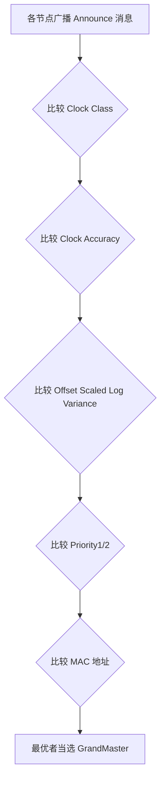
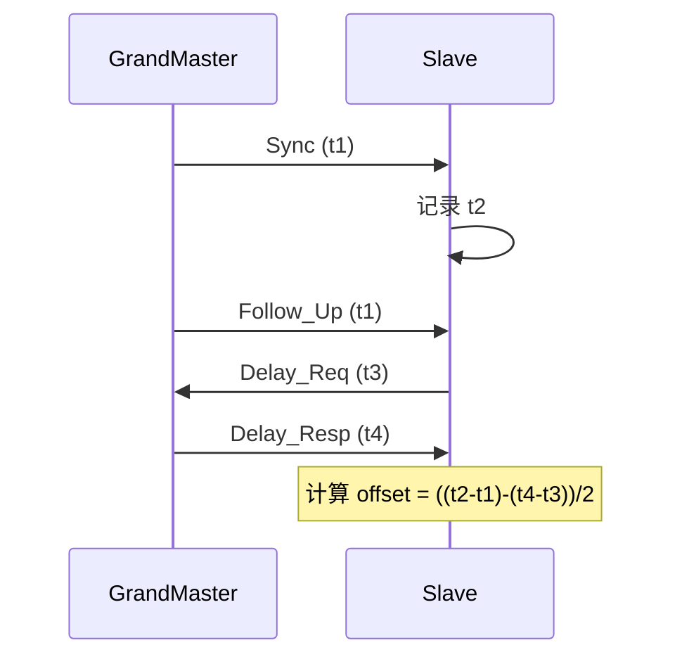

# gPTP 时间同步 [E]

> **本章学习目标**：
> - 理解 <span class="red">GrandMaster 选举</span> 的 BMC 算法与优先级比较规则
> - 掌握透明时钟的驻留时间测量与累积延迟校正方法
> - 了解 gPTP 消息交换序列与延迟计算原理

---

## GrandMaster 选举

---

### <strong>BMC 算法原理</strong>

<span class="badge-e">E</span><br>
<span class="red">BMC（Best Master Clock）</span> 算法是 gPTP 的核心，用于在分布式网络中自动选举最优时钟源作为 GrandMaster。<br>

<span class="blue">类比：BMC 如同公司选 CEO——每个候选人（时钟节点）提交简历（时钟质量参数），大家投票选出最优者。</span><br>



**表 3-1：BMC 比较优先级（从高到低）**<br>

| 优先级 | 字段 | 说明 | 典型值 |
| --- | --- | --- | --- |
| 1 | Priority1 | 用户可配置，强制优先级 | 128（默认） |
| 2 | Clock Class | 时钟类型与状态 | 6（同步于 GNSS） |
| 3 | Clock Accuracy | 时间精度量级 | 0x21（< 100 ns） |
| 4 | Offset Scaled Log Variance | 时钟稳定性度量 | 0x0000（最稳） |
| 5 | Priority2 | 次级用户配置 | 128（默认） |
| 6 | Clock Identity | 唯一标识符 | 基于 MAC 地址 |

<span class="orange"><strong>1. Clock Class 编码</strong></span><br>
* 6：同步于 GNSS/原子钟，最高等级。<br>
* 7：同步于 PTP，前一跳为等级 6。<br>
* 52：未校准，自由振荡。<br>
* 187：GrandMaster 丢失，正在寻找。<br>

<span class="orange"><strong>2. 选举结果传播</strong></span><br>
* 选举完成后，GrandMaster 周期性发送 Announce 消息（间隔 1s）。<br>
* 其他节点监听 Announce，若发现更优时钟，触发重新选举。<br>

---

## 透明时钟

---

### <strong>驻留时间测量</strong>

<span class="badge-e">E</span><br>
<span class="red">透明时钟（Transparent Clock, TC）</span> 是交换机中的 gPTP 功能模块，测量并补偿帧通过交换机产生的延迟。<br>

<span class="blue">透明时钟如同马拉松中的补给站——记录选手（数据帧）进站和出站的时间差，并在成绩单上扣除这段"停留时间"，确保总计时公平。</span><br>

**表 3-2：透明时钟类型对比**<br>

| 类型 | 测量范围 | 补偿位置 | 精度 | 复杂度 |
| --- | --- | --- | --- | --- |
| End-to-End TC | 全程延迟 | 路径累积 | 中 | 低 |
| Peer-to-Peer TC | 每跳延迟 | 本跳补偿 | 高 | 高 |

<span class="orange"><strong>3. 驻留时间计算</strong></span><br>

```c
// 驻留时间测量伪代码
// 文件：drivers/net/ethernet/xxx/tsn_tc.c

uint64_t measure_residence_time(struct sk_buff *skb) {
    uint64_t t_in, t_out;
    
    t_in = skb->_ptp_tstamp_in;   // 帧到达时刻（硬件时间戳）
    t_out = get_hw_timestamp();     // 帧离开时刻
    
    return t_out - t_in;            // 驻留时间（ns）
}
```

---

### <strong>累积延迟校正</strong>

<span class="badge-e">E</span><br>
<span class="red">累积延迟</span> 是 gPTP 同步误差的主要来源，包括链路传播延迟与设备驻留延迟。<br>

<span class="orange"><strong>4. 延迟组成</strong></span><br>
* 链路延迟：信号在铜缆/光纤中的传播时间，约 5 ns/m。<br>
* 驻留延迟：帧在交换机/路由器中的缓冲与处理时间，10~100 μs。<br>
* 处理延迟：协议栈解析与响应时间，通常 < 1 μs。<br>

<span class="orange"><strong>5. Correction Field 更新</strong></span><br>
* gPTP 报文头中的 Correction Field 累积记录全程延迟。<br>
* 每经过一个 TC，将本跳的驻留时间累加至 Correction Field。<br>
* 接收端从接收时间戳中减去 Correction Field，得到真实的 GrandMaster 时间。<br>

---

## gPTP 消息交换与延迟计算

---

### <strong>消息类型与时序</strong>

<span class="badge-e">E</span><br>
<span class="red">gPTP 消息</span> 分为事件消息（带时间戳）与普通消息（不带时间戳）两类。<br>



**表 3-3：gPTP 消息类型**<br>

| 消息 | 方向 | 时间戳 | 作用 |
| --- | --- | --- | --- |
| Sync | GM→Slave | t1（GM 发送时刻） | 传递 GrandMaster 时间 |
| Follow_Up | GM→Slave | — | 携带精确的 t1（两步模式） |
| Delay_Req | Slave→GM | t3（Slave 发送时刻） | 请求测量反向延迟 |
| Delay_Resp | GM→Slave | t4（GM 接收时刻） | 返回 t4 |
| Pdelay_Req | Peer→Peer | — | 对等延迟测量请求 |
| Pdelay_Resp | Peer→Peer | — | 对等延迟测量响应 |

<span class="orange"><strong>6. 延迟计算</strong></span><br>
* 主从路径延迟：delay = ((t2 - t1) + (t4 - t3)) / 2。<br>
* 时钟偏移：offset = (t2 - t1) - delay。<br>
* 假设双向延迟对称，即正向延迟 = 反向延迟。<br>

<span class="orange"><strong>7. 一步模式 vs 两步模式</strong></span><br>
* 一步模式：Sync 消息直接嵌入发送时间戳 t1，无需 Follow_Up。<br>
* 两步模式：Sync 发送时刻时间戳通过 Follow_Up 传递，兼容不支持硬件时间戳嵌入的链路。<br>

---

## 本章小结

| 小节 | 核心要点 |
| --- | --- |
| GrandMaster 选举 | BMC 六层比较（Priority1→Class→Accuracy→Variance→Priority2→MAC），Announce 消息传播 |
| 透明时钟 | E2E TC 累积全程延迟，P2P TC 每跳补偿，驻留时间写入 Correction Field |
| gPTP 消息交换 | Sync+Follow_Up+Delay_Req+Delay_Resp 四消息时序，delay/offset 公式计算 |

---

## 练习

1. **BMC 选举**：网络中有三个节点 A/B/C，参数分别为：A(P1=100, Class=7, Acc=0x21)，B(P1=128, Class=6, Acc=0x21)，C(P1=128, Class=6, Acc=0x22)。判断哪个节点当选 GrandMaster。

2. **延迟计算**：某 Slave 收到 Sync 时 t2=1000000 ns，Follow_Up 中 t1=900000 ns。发送 Delay_Req 时 t3=2000000 ns，收到 Delay_Resp 中 t4=2100000 ns。计算链路延迟与 Slave 时钟偏移。

3. **透明时钟**：某帧经过 3 个透明时钟，驻留时间分别为 15 μs、20 μs、10 μs，链路总长度 50 m。接收端测得总往返时间为 350 μs。计算 Correction Field 应写入的值及实际链路传播延迟。
