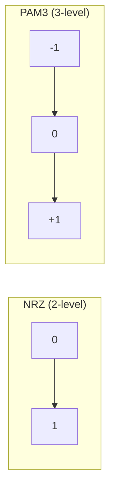
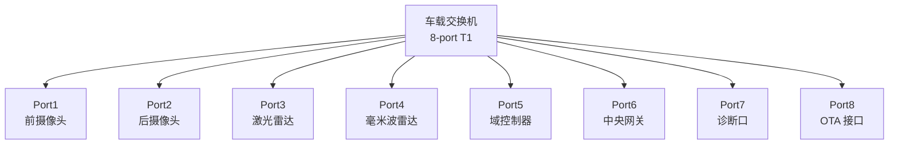
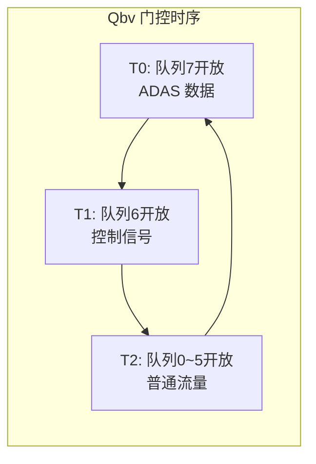

# 1000BASE-T1 与交换机 [E]

> **本章学习目标**：
> - 理解1000BASE-T1 PAM3 调制方式的电气特征与编码效率
> - 掌握车载以太网交换机的架构设计与端口调度机制
> - 了解 TSN（时间敏感网络）在车载交换机中的叠加方式

---

## 1000BASE-T1 PAM3

---

### <strong>PAM3 调制原理</strong>

E 
1000BASE-T1 是 IEEE 802.3bp 定义的车载千兆以太网标准，采用 PAM3（三电平脉冲幅度调制）替代传统的 PAM5 或 NRZ。 

类比：PAM3 如同音乐的三和弦——用 -1、0、+1 三个电平符号编码，比二进制的 0/1 更密集，每符号携带更多信息。 

<strong>1. 信号电平定义</strong> 
* PAM3 三个电平：-1（负电平）、0（零电平）、+1（正电平）。 
* 峰峰值电压约 2.0V，单端输出，无需差分对。 
* 相比 1000BASE-T 的 4 对双绞线，1000BASE-T1 仅需 1 对双绞线。 

**表 2-1：车载以太网速率对比**

| 标准 | 速率 | 调制 | 线对数 | 电缆 | 场景 |
| --- | --- | --- | --- | --- | --- |
| 100BASE-T1 | 100 Mbps | PAM3 | 1 | 非屏蔽双绞线 | 传感器/执行器 |
| 1000BASE-T1 | 1 Gbps | PAM3 | 1 | 非屏蔽双绞线 | ADAS/信息娱乐 |
| 2.5GBASE-T1 | 2.5 Gbps | PAM3 | 1 | 非屏蔽双绞线 | 高分辨率摄像头 |
| 5GBASE-T1 | 5 Gbps | PAM4 | 1 | 屏蔽双绞线 | 多传感器融合 |
| 10GBASE-T1 | 10 Gbps | PAM4 | 1 | 屏蔽双绞线 | 自动驾驶骨干 |

<strong>2. 编码与扰码</strong> 
* 1000BASE-T1 采用 80b/81b 编码 + 扰码，保证 DC 平衡与 EMI 抑制。 
* 扰码多项式：G(x) = x^7 + x^6 + 1，打散长连 0/1 序列。 

---

### <strong>物理层电气参数</strong>

E 
1000BASE-T1 物理层针对车载环境优化，满足温度范围、振动与 EMC 要求。 

**表 2-2：1000BASE-T1 电气参数**

| 参数 | 最小值 | 典型值 | 最大值 | 单位 |
| --- | --- | --- | --- | --- |
| 信号速率 | — | 750 | — | MBaud |
| 峰峰值电压 | — | 2.0 | 2.2 | V |
| 回波损耗 | — | — | -10 | dB |
| 插入损耗 (100m) | — | — | -20 | dB |
| 工作温度 | -40 | — | +125 | ℃ |
| 电缆长度 | — | 15 | 40 | m |

1000BASE-T1 的 750 MBaud 符号率 × 3 电平 ≈ 1.0 Gbps 有效带宽，编码效率约 80%。 

---

## 车载以太网交换机

---

### <strong>交换机架构</strong>

E 
车载以太网交换机是连接多路传感器、控制器与中央网关的核心网络设备。 

车载交换机如同城市交通枢纽——每个端口是一条高速公路入口，交换机负责将数据包精准送达目标端口，避免全城拥堵。 

**表 2-3：车载交换机关键特性**

| 特性 | 说明 | 优势 |
| --- | --- | --- |
| AVB/TSN 支持 | IEEE 802.1Qav/Qbv 门控调度 | 确定性时延 |
|  cut-through 转发 | 接收首部后即开始转发 | 极低转发延迟 |
| 端口镜像 | 复制指定端口流量至监控口 | 在线诊断 |
| VLAN 隔离 | 按域划分虚拟局域网 | 安全隔离 |
| 唤醒转发 | 支持 WoL（Wake on LAN） | 低功耗待机 |

<strong>1. Cut-through vs Store-and-forward</strong> 
* Cut-through：收到目的 MAC 后即开始转发，延迟 < 10 μs。 
* Store-and-forward：接收完整帧后校验 CRC 再转发，延迟约 1.2 μs/Byte。 
* 车载场景优先 Cut-through，追求极致低延迟。 

<strong>2. 端口调度</strong> 
* 每个端口独立 FIFO，支持 8 个优先级队列（IEEE 802.1p）。 
* 高优先级队列（如制动信号）可抢占低优先级队列（如日志上传）。 

---

## TSN 叠加

---

### <strong>TSN 在车载交换机中的实现</strong>

E 
TSN（Time-Sensitive Networking）是一组 IEEE 802.1 扩展标准，为以太网提供确定性传输能力。 

<strong>1. 时间同步（gPTP）</strong> 
* 802.1AS 定义 gPTP（generalized Precision Time Protocol），精度达 1 μs。 
* 车载网络中，中央网关作为 GrandMaster，各域控制器作为 Slave。 

<strong>2. 门控调度（Qbv）</strong> 
* 802.1Qbv 定义时间门控调度，将时间轴划分为固定时隙。 
* 每个时隙仅开放指定优先级队列，避免低优先级帧阻塞高优先级帧。 

<strong>3. 帧抢占（Qbu）</strong> 
* 802.1Qbu 允许高优先级帧中断低优先级帧的传输。 
* 被中断的低优先级帧在 64 Byte 边界处暂停，高优先级帧插入后立即恢复。 

---

## 本章小结

| 小节 | 核心要点 |
| --- | --- |
| 1000BASE-T1 PAM3 | 三电平调制，750 MBaud，1 对双绞线，80b/81b 编码 |
| 车载以太网交换机 | Cut-through 转发，8 优先级队列，端口镜像+VLAN |
| TSN 叠加 | gPTP 时间同步+Qbv 门控+Qbu 帧抢占，确定性时延 |

---

## 练习

1. **带宽计算**：1000BASE-T1 采用 PAM3，750 MBaud，80b/81b 编码。计算理论有效带宽。若实际测得 940 Mbps，编码开销占比约为多少？

2. **交换机设计**：设计一个 6 端口车载交换机，连接 4 路摄像头（每路 500 Mbps）+ 1 路激光雷达（1 Gbps）+ 1 路中央网关（2 Gbps）。计算背板带宽需求，并说明是否需要 TSN 门控。

3. **TSN 配置**：某车载交换机需保证制动信号（队列 7）的最大端到端延迟 < 500 μs。给出 Qbv 门控调度表的周期设计建议。
