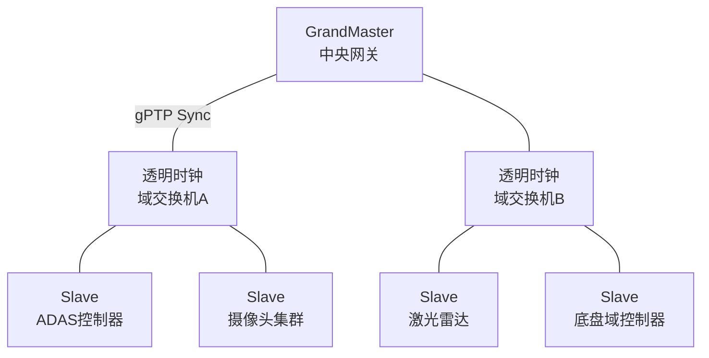
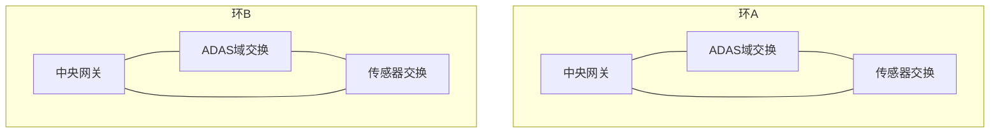

# TSN 在车载中的应用 [E]

> **本章学习目标**：
> - 理解 <span class="red">gPTP 车载部署</span> 的网络拓扑与主时钟选举机制
> - 掌握 Qbv 门控在车载交换机中的配置与调度表设计
> - 了解自动驾驶网络对确定性时延与带宽的需求

---

## gPTP 车载部署

---

### <strong>车载网络时间同步架构</strong>

<span class="badge-e">E</span><br>
<span class="red">gPTP（generalized Precision Time Protocol）</span> 是 IEEE 802.1AS 定义的时间同步协议，为车载 TSN 提供亚微秒级同步精度。<br>



<span class="blue">车载 gPTP 如同交响乐团的指挥——GrandMaster 是总指挥，透明时钟是中继传令员，各传感器与执行器是乐手，确保每个音符（数据帧）在精确的时刻奏响。</span><br>

<span class="orange"><strong>1. GrandMaster 选举</strong></span><br>
* 基于 BMC（Best Master Clock）算法，比较时钟等级（Clock Class）、精度（Accuracy）、稳定性（Variance）。<br>
* 车载场景中，中央网关通常作为首选 GrandMaster，具备高稳定性 OCXO 时钟源。<br>
* 若 GrandMaster 失效，次优节点自动切换，切换时间 < 100 ms。<br>

<span class="orange"><strong>2. 透明时钟（Transparent Clock）</strong></span><br>
* 交换机作为透明时钟，测量帧通过自身的驻留时间（Residence Time）。<br>
* 将 Residence Time 写入 gPTP 报文的 Correction Field，补偿传输延迟。<br>
* 类型：End-to-End TC（测量全程）与 Peer-to-Peer TC（测量每跳）。<br>

---

## Qbv 门控实现

---

### <strong>门控调度表设计</strong>

<span class="badge-e">E</span><br>
<span class="red">802.1Qbv 门控</span> 将时间划分为固定周期的时隙，每个时隙内仅开放指定优先级队列。<br>

**表 4-1：门控调度表示例（周期 1 ms）</strong>

| 时隙 | 开始 (μs) | 结束 (μs) | 开放队列 | 流量类型 |
| --- | --- | --- | --- | --- |
| 0 | 0 | 100 | 7 | ADAS 传感器数据 |
| 1 | 100 | 200 | 6 | 车辆控制信号 |
| 2 | 200 | 500 | 5~4 | 摄像头/雷达原始数据 |
| 3 | 500 | 900 | 3~1 | 信息娱乐/诊断 |
| 4 | 900 | 1000 | 0 | 后台日志/OTA |

<span class="blue">门控调度的本质是"时间切片"——为关键流量预留专属时间窗口，避免被突发大流量阻塞。</span><br>

<span class="orange"><strong>3. 门控列表配置</strong></span><br>

```bash
# Linux tc-taprio 配置 Qbv 门控
# 周期 1ms，5 个时隙

tc qdisc replace dev eth0 parent root handle 100 taprio \
  map 0 0 0 0 0 0 0 0 0 0 0 0 0 0 0 0 \
  queues 1@0 1@1 1@2 1@3 1@4 1@5 1@6 1@7 \
  base-time 0 \
  sched-entry S 80 100000 \   # 队列7开放 100μs (0x80)
  sched-entry S 40 100000 \   # 队列6开放 100μs (0x40)
  sched-entry S 30 300000 \   # 队列5~4开放 300μs (0x30)
  sched-entry S 0E 400000 \   # 队列3~1开放 400μs (0x0E)
  sched-entry S 01 100000     # 队列0开放 100μs (0x01)
```

<span class="orange"><strong>4. Guard Band 设计</strong></span><br>
* 时隙切换前需插入 Guard Band（保护带），防止低优先级帧跨时隙传输。<br>
* Guard Band 长度 = 最大帧传输时间 + 安全余量，通常为 125 μs（千兆网最大帧）。<br>

---

## 自动驾驶网络

---

### <strong>自动驾驶网络拓扑</strong>

<span class="badge-e">E</span><br>
<span class="red">自动驾驶网络</span> 是多域融合的高速骨干网，承载传感器融合、决策规划与车辆控制三类流量。<br>

**表 4-2：自动驾驶网络流量特征</strong>

| 流量类型 | 带宽需求 | 时延要求 | 抖动要求 | 优先级 |
| --- | --- | --- | --- | --- |
| 激光雷达点云 | 1~2 Gbps | < 5 ms | < 1 ms | 7 |
| 摄像头原始图 | 500 Mbps×8 | < 10 ms | < 2 ms | 6 |
| 毫米波雷达 | 50 Mbps×4 | < 5 ms | < 0.5 ms | 7 |
| 车辆控制 | 10 Mbps | < 1 ms | < 0.1 ms | 7 |
| 高精地图 | 100 Mbps | < 50 ms | < 5 ms | 5 |
| 信息娱乐 | 50 Mbps | < 100 ms | — | 2 |
| OTA/诊断 | 20 Mbps | 最佳努力 | — | 0 |

<span class="orange"><strong>5. 环形冗余拓扑</strong></span><br>
* 骨干网采用双环冗余（802.1CB FRER），单点故障时切换时间 < 1 ms。<br>
* 每帧产生两份副本，沿不同路径传输，接收端取先到的一份。<br>



<span class="orange"><strong>6. 时间触发以太网（TTE）</strong></span><br>
* 在 TSN 基础上进一步严格化，为关键控制信号分配固定时间槽（Time Slot）。<br>
* 制动、转向等信号在每周期固定时刻发送，端到端抖动 < 1 μs。<br>

---

## 本章小结

| 小节 | 核心要点 |
| --- | --- |
| gPTP 车载部署 | GrandMaster 选举+BMC，透明时钟补偿驻留时间，亚微秒级同步 |
| Qbv 门控实现 | 周期时隙划分，tc-taprio 配置，Guard Band 防跨隙传输 |
| 自动驾驶网络 | 多域融合骨干网，环形冗余+FRER，TTE 时间触发控制信号 |

---

## 练习

1. **gPTP 计算**：某车载网络中，GrandMaster 到 ADAS 控制器经过 3 跳透明时钟。每跳驻留时间 15 μs，链路传播延迟 2 μs。计算 ADAS 控制器与 GrandMaster 的时间偏差。

2. **门控设计**：设计一个 2 ms 周期的 Qbv 调度表，要求：激光雷达（队列7）占用 200 μs，摄像头（队列6）占用 400 μs，控制信号（队列5）占用 100 μs，其余流量共享剩余时间。给出 tc-taprio 配置命令。

3. **冗余分析**：某双环自动驾驶网络采用 802.1CB FRER，每帧产生两份副本。计算网络带宽开销增加百分比。若单环故障，剩余带宽是否满足激光雷达+摄像头+控制信号的总需求？
