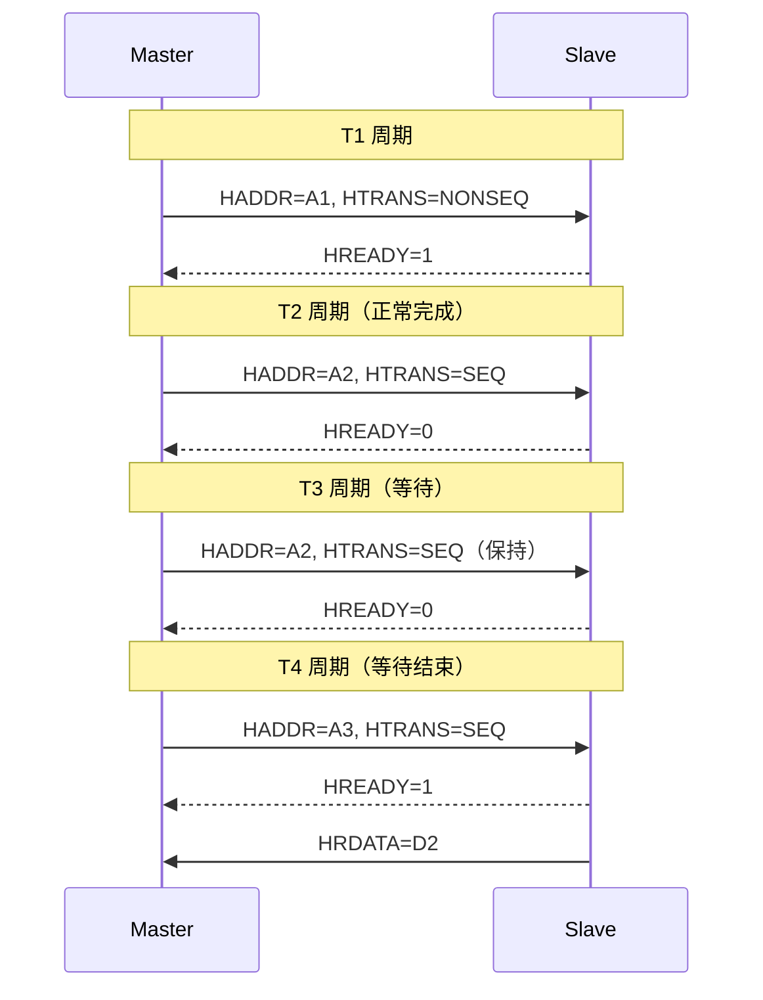

# AHB 基础认知与架构 [B→I]

> **本章学习目标**：
> - 理解 <span class="red">AHB（Advanced High-performance Bus）</span> 的设计定位
> - 掌握 AHB 的 <span class="red">单通道共享架构</span> 与信号定义
> - 了解 AHB-Lite 简化版与 AHB-Full 的区别

---

<span class="blue">从何而来 → 为什么需要 → 哪里用：</span><br>
<span class="red">AHB</span> 诞生于 <span class="green">1999 年</span>（AMBA 2 规范），前身是 <span class="green">ASB</span> 总线。<br>
在 AMBA 1 时代，<span class="green">ASB + APB</span> 架构仅支持单主单从，性能有限。<br>
随着 <span class="green">ARM9</span> 处理器的普及，需要更高带宽的总线连接 DMA 和外设。<span class="blue">AHB 引入流水线设计和多主仲裁，成为连接 Cortex-M 处理器与高速外设的主力总线。</span><br>
如今，AHB-Lite 是 <span class="green">Cortex-M0/M3/M4</span> 的标准总线，AHB-Full 用于 <span class="green">Cortex-A</span> 的外设总线。<br>

---

## AHB 的设计定位与演进

---

### <strong>为什么需要 AHB：AXI 与 APB 之间的桥梁</strong>

<span class="red">AHB</span> 诞生于 <span class="green">1999 年</span>（AMBA 2 规范），<br>
定位在 <span class="blue">"性能与复杂度的平衡点"</span>。<br>

<span class="blue">类比理解：AHB 如同"城市主干道"</span><br>
AXI 是"高速公路"（多车道、高速、贵），APB 是"社区小路"（单行道、低速、便宜）。<br>
AHB 是"城市主干道"（双向两车道、有红绿灯、适中），<br>
既能承载一定流量，又不需要高速公路的复杂基建。<br>

相比 <span class="green">AXI</span>，AHB 的架构更简单：<br>
* 地址和数据共用同一组总线（时分复用）<br>
* 不支持读写并行（一个时刻只能读或写）<br>
* 仲裁逻辑比 AXI Interconnect 简单得多<br>

相比 <span class="green">APB</span>，AHB 的性能更高：<br>
* 支持流水线（地址周期和数据周期重叠）<br>
* 支持突发传输（最多 16 beat）<br>
* 支持多主仲裁（AHB-Full）<br>

<span class="blue">AHB 的典型场景：USB Host、Ethernet MAC、SD 控制器等中等带宽外设。</span><br>

---

### <strong>AHB 的信号定义与电气特性</strong>

AHB 信号分为 <span class="green">全局信号、Master 信号、Slave 信号、仲裁信号</span>。<br>

| 信号名 | 宽度 | 方向 | 说明 |
| --- | --- | --- | --- |
| HCLK | 1 | 全局 | 总线时钟，所有信号在上升沿采样 |
| HRESETn | 1 | 全局 | 低电平复位 |
| HADDR | 32 | Master→Slave | 传输地址 |
| HTRANS | 2 | Master→Slave | 传输类型（IDLE/BUSY/NONSEQ/SEQ） |
| HWRITE | 1 | Master→Slave | 1=写，0=读 |
| HSIZE | 3 | Master→Slave | 传输大小（0=byte, 2=word） |
| HBURST | 3 | Master→Slave | 突发类型（SINGLE/INCR/WRAP4/8/16） |
| HWDATA | 32/64 | Master→Slave | 写数据 |
| HRDATA | 32/64 | Slave→Master | 读数据 |
| HREADY | 1 | Slave→Master | 1=传输完成，0=插入等待周期 |
| HRESP | 1 | Slave→Master | 响应状态（OKAY/ERROR） |

<span class="blue">AHB 的地址和数据共用 HADDR/HWDATA/HRDATA，通过 HTRANS 区分当前周期是地址还是数据阶段。</span><br>

---

### <strong>AHB-Lite vs AHB-Full：简化版与完整版</strong>

| 特性 | AHB-Lite | AHB-Full | 差异影响 |
| --- | --- | --- | --- |
| 多主支持 | 仅单 Master | 支持多 Master | AHB-Lite 无需仲裁器 |
| 仲裁信号 | 无 HBUSREQ/HGRANT | 有 HBUSREQ/HGRANT | AHB-Lite 面积小 30% |
| 突发重定义 | 不支持 | 支持 | AHB-Lite 突发固定 |
| 拆分传输 | 不支持 | 支持 | AHB-Lite 无响应反压 |
| 典型应用 | Cortex-M 系列 | Cortex-A 外设总线 | M 核用 Lite，A 核用 Full |

<span class="blue">Cortex-M0/M3/M4 的 AHB-Lite 总线面积约等于 2000 门，而 AHB-Full 的仲裁器约 5000 门。</span><br>

---

## AHB 的传输类型与状态机

---

### <strong>HTRANS 的 4 种传输类型</strong>

<span class="red">HTRANS</span> 定义当前周期的传输状态：<br>

| 编码 | 类型 | 含义 | 典型场景 |
| --- | --- | --- | --- |
| 00 | IDLE | 无传输 | Master 放弃总线 |
| 01 | BUSY | Master 忙，插入等待 | 流水线间隙 |
| 10 | NONSEQ | 新突发第一个 beat | 突发起始 |
| 11 | SEQ | 突发后续 beat | 突发中间 |

<span class="blue">NONSEQ 和 SEQ 的区别：NONSEQ 的地址与上一周期无关，SEQ 的地址基于上一地址递增。</span><br>

```verilog
// AHB Master 状态机（简化）
localparam IDLE = 2'b00;
localparam ADDR = 2'b01;
localparam DATA = 2'b10;

always @(posedge HCLK) begin
  case (state)
    IDLE: if (req) state <= ADDR;
    ADDR: state <= DATA;  // 地址周期固定 1 beat
    DATA: if (HREADY) state <= req ? ADDR : IDLE;
  endcase
end

// HTRANS 赋值
assign HTRANS = (state == ADDR && burst_cnt == 0) ? NONSEQ :
                (state == ADDR) ? SEQ : IDLE;
```

---

### <strong>HREADY 反压机制：Slave 插入等待周期</strong>

<span class="red">HREADY</span>是 AHB 的核心流控信号。<br>
当 Slave 无法在一个周期内完成响应时，<br>
拉低 HREADY 插入等待周期。<br>



<span class="blue">Slave 可通过 HREADY 反压 Master，最大等待周期无限制（但通常 < 16 cycle）。</span><br>

---

## 本章小结

| 概念 | 一句话总结 |
| --- | --- |
| AHB | 中等性能总线，地址/数据共用，单主时序 |
| AHB-Lite | 单主简化版，无仲裁，面积最小 |
| AHB-Full | 多主完整版，有仲裁和拆分传输 |
| HTRANS | 4 种类型：IDLE/BUSY/NONSEQ/SEQ |
| HREADY | Slave 反压信号，插入等待周期 |
| 突发 | INCR4/8/16 和 WRAP4/8/16，SINGLE 单拍 |

---

## 练习

1. 为什么 AHB 不能同时读和写，而 AXI 可以？<br>
2. AHB-Lite 和 AHB-Full 在 Cortex-M 和 Cortex-A 中如何选择？<br>
3. 设计一个 AHB Slave 寄存器模块：基地址 0x4000_0000，8 个 32-bit 寄存器，支持 HREADY 反压。
