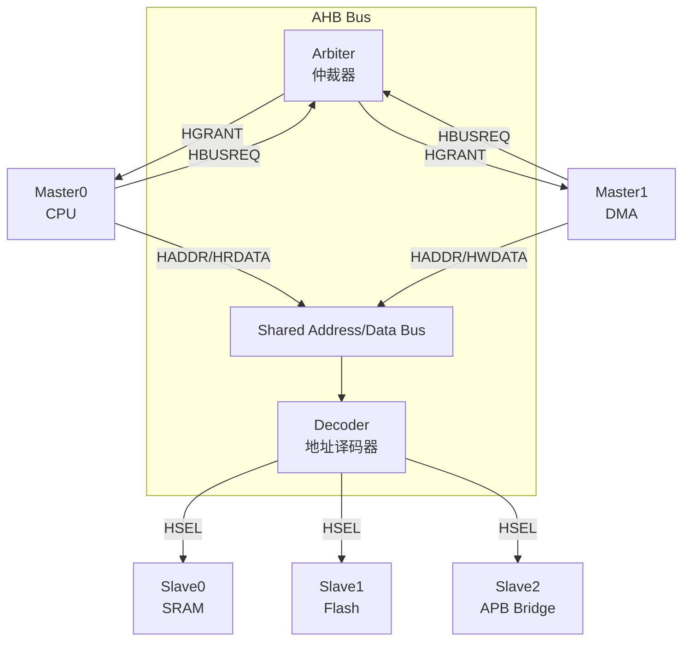
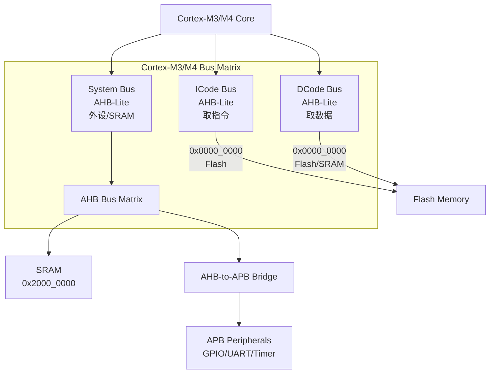

# AHB基础认知与架构

[B] [I]

---

### AHB定位

AHB（Advanced High-performance Bus）是AMBA2引入的中速共享总线，
 
位于AXI（高速主干道）和APB（低速支路）之间，承担"桥梁"角色。
 

| 总线 | 速率 | 拓扑 | 仲裁 | 典型负载 |
|------|------|------|------|----------|
| AXI | 数百MHz | Crossbar | 分布式 | CPU-DDR、GPU |
| AHB | ~100MHz | 共享总线 | 集中式仲裁 | DMA、LCD控制器、Flash |
| APB | ~33MHz | 无仲裁 | 无 | UART、GPIO、Timer |

关键认知：AHB不是"低配AXI"，而是不同设计哲学的产物——
 
共享总线面积小、功耗低，适合中速IP的批量互联。
 

类比：城市交通——
 
AXI像城市高架（多车道并行，容量大），
 
AHB像城市主干道（单方向多车共享，有红绿灯仲裁），
 
APB像小区内部路（慢行，无仲裁）。
 

---

### 主从架构：Master/Slave/Arbiter

| 组件 | 角色 | 核心功能 |
|------|------|----------|
| Master | 总线请求者 | CPU、DMA、LCD控制器 |
| Slave | 总线响应者 | SRAM、Flash、寄存器块、APB Bridge |
| Arbiter | 仲裁者 | 决定哪个Master获得总线使用权 |
| Decoder | 译码者 | 根据HADDR选择激活哪个Slave |

AHB Arbiter是集中式仲裁，所有Master的HBUSREQ汇总到这里，
 
Arbiter通过HGRANT信号把总线授权给某个Master。
 

---

### 信号定义

AHB核心信号分为地址/数据/控制/响应四组：

| 信号 | 方向 | 宽度 | 作用 |
|------|------|------|------|
| HCLK | 系统→所有 | 1 | 总线时钟 |
| HRESETn | 系统→所有 | 1 | 低电平复位 |
| HADDR | Master→Slave | 32 | 传输地址 |
| HWDATA | Master→Slave | 32/64/128 | 写数据 |
| HRDATA | Slave→Master | 32/64/128 | 读数据 |
| HWRITE | Master→Slave | 1 | 1=写，0=读 |
| HTRANS[1:0] | Master→Slave | 2 | 传输类型 |
| HBURST[2:0] | Master→Slave | 3 | 突发类型 |
| HSIZE[2:0] | Master→Slave | 3 | 传输大小 |
| HSEL | Decoder→Slave | 1 per slave | Slave选择 |
| HREADY | Slave→Master | 1 | Slave准备好接收/发送 |
| HRESP[1:0] | Slave→Master | 2 | 传输响应 |

#### HTRANS[1:0] 传输类型

| 编码 | 类型 | 说明 |
|------|------|------|
| 00 | IDLE | 总线空闲，无传输 |
| 01 | BUSY | Master正在忙，插入等待周期 |
| 10 | NONSEQ | 突发或单次传输的第一个地址 |
| 11 | SEQ | 突发传输的后续地址 |

#### HBURST[2:0] 突发类型

| 编码 | 类型 | 长度 |
|------|------|------|
| 000 | SINGLE | 1拍 |
| 001 | INCR | 未定义长度递增 |
| 010 | WRAP4 | 4拍回环 |
| 011 | INCR4 | 4拍递增 |
| 100 | WRAP8 | 8拍回环 |
| 101 | INCR8 | 8拍递增 |
| 110 | WRAP16 | 16拍回环 |
| 111 | INCR16 | 16拍递增 |

#### HSIZE[2:0] 传输大小

| 编码 | 大小 | 说明 |
|------|------|------|
| 000 | 8-bit | Byte |
| 001 | 16-bit | Halfword |
| 010 | 32-bit | Word |
| 011 | 64-bit | Doubleword |
| 100 | 128-bit | Word×4 |
| 101 | 256-bit | Word×8 |
| 110 | 512-bit | Word×16 |
| 111 | 1024-bit | Word×32 |

#### HRESP[1:0] 响应

| 编码 | 响应 | 说明 |
|------|------|------|
| 00 | OKAY | 传输成功 |
| 01 | ERROR | 传输失败 |
| 10 | RETRY | Slave忙，Master应重试 |
| 11 | SPLIT | Slave请求分割传输 |

---

### AHB-Lite简化版

AHB-Lite是AHB的精简子集，砍掉了多master支持：

| 特性 | 完整AHB | AHB-Lite |
|------|---------|----------|
| Master数量 | 多主 | 单主 |
| Arbiter | 需要 | 不需要 |
| HBUSREQ/HGRANT | 有 | 无 |
| 分割传输(SPLIT) | 支持 | 不支持 |
| 重试(RETRY) | 支持 | 简化处理 |
| 应用场景 | 复杂SoC | 简单MCU、教学 |

关键认知：AHB-Lite不是"功能不全"，而是"恰到好处"——
 
单master系统不需要仲裁，去掉这些信号后面积和功耗都下降。
 

---

### Cortex-M中的AHB应用

ARM Cortex-M 系列用 AHB-Lite 作为核心总线：

| 总线 | 用途 | 特点 |
|------|------|------|
| ICode | 指令取指 | 只读，专用于Flash取指 |
| DCode | 数据访问 | 读写，专用于Flash/SRAM数据 |
| System | 通用访问 | 连到Bus Matrix，分发给所有外设 |

易错点：Cortex-M的ICode和DCode总线都连到同一个Flash，
 
如果同时取指令和读常量，会有访问冲突，需要Bus Matrix仲裁。
 

---

**学习路径提示**：
 
- [B] 读者：理解AHB是"共享总线"，所有Master轮流用，Arbiter决定谁先谁后。
 
- [I] 读者：记住HTRANS/HBURST/HSIZE三个字段的含义，能看懂AHB波形。
 
