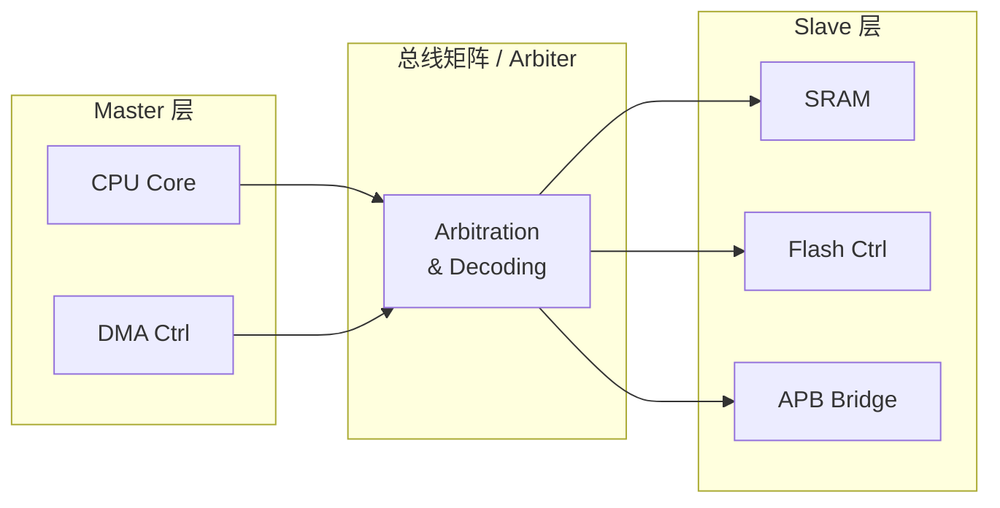
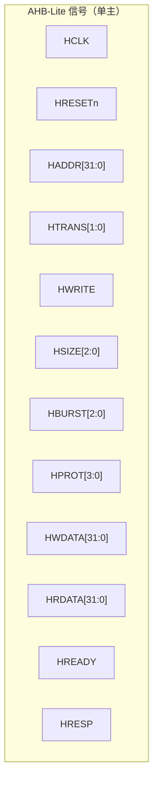
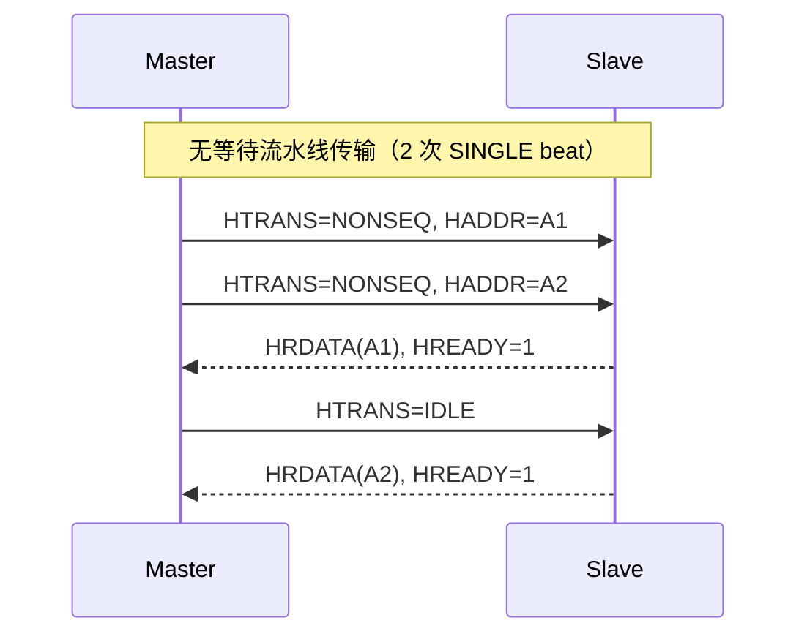
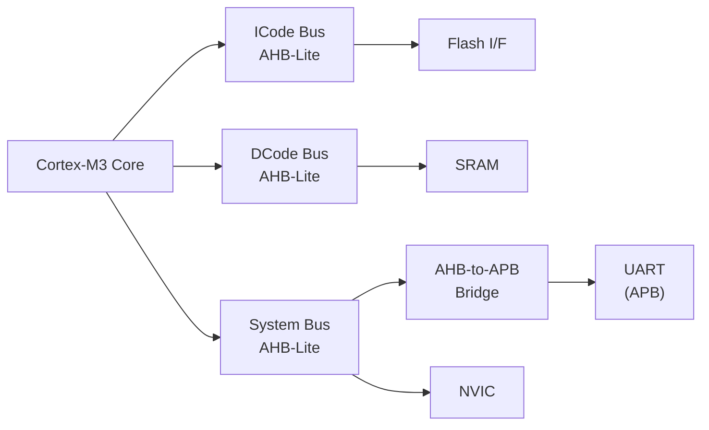

# AHB是什么——AMBA高速总线与流水线架构

<span class="badge-b">[B]</span> <span class="badge-i">[I]</span> <span class="badge-e">[E]</span> <span class="badge-m">[M]</span>

<span class="red">AHB（Advanced High-performance Bus）是 ARM AMBA 家族中的高速系统总线，专为处理器、DMA、内存控制器等高带宽主设备与高速从设备之间的互联而设计。</span> 它是理解片上系统总线分层的最佳入口——比 AXI 简单，比 APB 强大。

---

## 核心定义与价值

### <strong>AHB 在 AMBA 家族中的定位</strong>

AMBA 协议栈按速度和复杂度分为三层：

<br>

| 总线 | 典型带宽 | 关键特征 | 适用场景 |
|------|----------|----------|----------|
| AXI | 数 GB/s | 独立读写通道、乱序、QoS | 高性能 SoC、Cortex-A 系 |
| <span class="green">AHB</span> | 数百 MB/s | 流水线、突发、多主仲裁 | Cortex-M 系、外设桥接 |
| APB | 数十 MB/s | 无流水线、无突发、2 周期 | 低速寄存器接口 |

<br>

<span class="blue">AHB 不是 AXI 的"低配版"，而是不同功耗-性能-面积（PPA）权衡下的最优解。</span> 在 Cortex-M3/M4 中，AHB-Lite 承载了整个系统的数据主干道。

### <strong>主从架构：谁说了算</strong>

AHB 采用经典的主-从（Master-Slave）架构：

- <span class="green">Master（主设备）</span>：发起传输，如 CPU、DMA、加速器
- <span class="green">Slave（从设备）</span>：响应传输，如 SRAM、Flash、UART 控制器
- 总线矩阵 / 仲裁器：决定哪个 Master 获得总线访问权

<br>



<br>

### <strong>类比：高速公路收费站</strong>

想象一条多车道高速公路——AHB 就是这条高速公路。

- 每辆车上有一个"ETC 标签"（地址）和货物（数据）
- 收费站同时处理多辆车：<span class="blue">一辆车正在交钱（数据阶段），另一辆车已经在扫描标签（地址阶段）</span>
- 这就是 AHB 的<span class="red">流水线</span>——地址和数据阶段重叠，不停车收费
- 但所有车必须按顺序通过（无乱序），收费站一次只放行一个车队（突发传输）

---

## 核心机制原理解析

### <strong>1. AHB 信号全景图</strong>

AHB 信号分为系统信号、地址控制信号、数据信号和响应信号四类。

<br>

| 信号类别 | 信号名 | 宽度 | 方向 | 作用 |
|----------|--------|------|------|------|
| 系统 | <span class="green">HCLK</span> | 1 | 输入 | 总线时钟，所有传输同步于上升沿 |
| 系统 | <span class="green">HRESETn</span> | 1 | 输入 | 低电平有效复位 |
| 地址控制 | <span class="green">HADDR[31:0]</span> | 32 | M→S | 传输地址 |
| 地址控制 | <span class="green">HTRANS[1:0]</span> | 2 | M→S | 传输类型 |
| 地址控制 | <span class="green">HBURST[2:0]</span> | 3 | M→S | 突发类型 |
| 地址控制 | <span class="green">HSIZE[2:0]</span> | 3 | M→S | 传输大小（字节/半字/字） |
| 地址控制 | <span class="green">HWRITE</span> | 1 | M→S | 1=写，0=读 |
| 数据 | <span class="green">HWDATA[31:0]</span> | 32 | M→S | 写数据 |
| 数据 | <span class="green">HRDATA[31:0]</span> | 32 | S→M | 读数据 |
| 响应 | <span class="green">HRESP</span> | 1 | S→M | 传输响应（OKAY/ERROR） |
| 响应 | <span class="green">HREADY</span> | 1 | S→M | 从设备就绪信号 |

<br>

<span class="blue">注意：HREADY 是 AHB 中最关键的握手信号。它既用于从设备插入等待周期，也作为传输完成的标志。</span>

### <strong>2. HTRANS[1:0]：传输类型编码</strong>

<span class="red">HTRANS[1:0] 定义了当前地址周期中传输的类型，是理解 AHB 流水线的核心字段。</span>

<br>

| HTRANS[1:0] | 编码值 | 含义 | 场景 |
|-------------|--------|------|------|
| IDLE | 2'b00 | 无传输 | Master 空闲或放弃总线 |
| BUSY | 2'b01 | 忙周期 | 突发传输中 Master 尚未准备好 |
| NONSEQ | 2'b10 | 非连续传输 | 单次传输或突发的第一个 beat |
| SEQ | 2'b11 | 连续传输 | 突发传输的后续 beat |

<br>

- <span class="green">NONSEQ</span>：地址与上一次传输无关，是全新的一次访问
- <span class="green">SEQ</span>：地址 = 上一次地址 + HSIZE 增量（突发的连续 beat）
- <span class="green">BUSY</span>：Master 还在处理前一次数据，当前周期地址有效但数据无效
- <span class="green">IDLE</span>：Master 不打算传输，地址总线可以忽略

### <strong>3. HBURST[2:0]：突发传输编码</strong>

<span class="red">HBURST[2:0] 控制突发传输的模式，决定了地址如何递增以及突发长度。</span>

<br>

| HBURST[2:0] | 编码值 | 类型 | 长度 | 地址行为 |
|-------------|--------|------|------|----------|
| SINGLE | 3'b000 | 单次 | 1 beat | 无递增 |
| INCR | 3'b001 | 增量未定义 | 未定义 | 连续递增 |
| WRAP4 | 3'b010 | 4-beat 回绕 | 4 beats | 地址在 4-beat 边界回绕 |
| INCR4 | 3'b011 | 4-beat 增量 | 4 beats | 连续递增 |
| WRAP8 | 3'b100 | 8-beat 回绕 | 8 beats | 地址在 8-beat 边界回绕 |
| INCR8 | 3'b101 | 8-beat 增量 | 8 beats | 连续递增 |
| WRAP16 | 3'b110 | 16-beat 回绕 | 16 beats | 地址在 16-beat 边界回绕 |
| INCR16 | 3'b111 | 16-beat 增量 | 16 beats | 连续递增 |

<br>

<span class="blue">回绕（Wrap）突发用于 cache line fill：当地址到达 cache line 边界时自动回绕到 line 起始地址。</span> 增量（INCR）突发用于 DMA 线性缓冲区传输。

### <strong>4. HSIZE[2:0]：传输大小</strong>

| HSIZE[2:0] | 大小 | 字节数 | 典型场景 |
|------------|------|--------|----------|
| 3'b000 | Byte | 1 | 寄存器字节访问 |
| 3'b001 | Halfword | 2 | 16-bit 外设 |
| 3'b010 | Word | 4 | 32-bit ARM 指令/数据 |
| 3'b011 | Doubleword | 8 | 64-bit 数据（AHB5） |
| 3'b100 | 4-word line | 16 | Cache line |
| 3'b101 | 8-word line | 32 | Cache line |
| 3'b110 | 16-word line | 64 | Cache line |
| 3'b111 | 32-word line | 128 | Cache line |

<br>

### <strong>5. AHB-Lite：去掉仲裁的简化版</strong>

<span class="red">AHB-Lite 是 AHB 的子集，只支持单 Master，因此去掉了所有仲裁信号。</span>

<br>

| 特性 | 完整 AHB | AHB-Lite |
|------|----------|----------|
| 多主支持 | 是（HBUSREQ/HGRANT） | 否 |
| 仲裁器 | 需要 | 不需要 |
| 主设备数 | 多 | 1 |
| 应用场景 | 复杂 SoC | Cortex-M 系、简单系统 |
| 协议复杂度 | 高 | 低 |

<br>

AHB-Lite 的信号集：



<br>

<span class="blue">Cortex-M3/M4 使用 AHB-Lite 作为 ICode、DCode 和 System 总线，就是因为单核设计天然只需要一个 Master。</span>

### <strong>6. 单周期 vs 多周期传输</strong>

AHB 的基本传输单位是<span class="red">beat</span>，一个 beat 包含地址阶段和数据阶段。

<br>

- **单周期传输（无等待）**：地址阶段 1 周期 + 数据阶段 1 周期，但流水线重叠后等效为每周期 1 beat
- **多周期传输（有等待）**：从设备通过拉低 HREADY 插入 wait states，数据阶段延长

<br>



<br>

在第 1 个时钟上升沿，Master 输出 A1 地址；<br>
在第 2 个时钟上升沿，Master 输出 A2 地址，同时 Slave 返回 A1 的数据；<br>
在第 3 个时钟上升沿，Slave 返回 A2 的数据。<br>

<span class="blue">这就是流水线：地址和数据阶段重叠，每周期完成 1 beat，理想带宽 = 1 beat/clk。</span>

---

## 技术教学与实战

### <strong>Verilog 接口定义</strong>

```verilog
// AHB-Lite Master 接口（32-bit 数据总线）
module ahb_lite_master (
    input  wire        HCLK,
    input  wire        HRESETn,
    // Address phase
    output reg  [31:0] HADDR,
    output reg  [ 2:0] HBURST,
    output reg  [ 2:0] HSIZE,
    output reg  [ 1:0] HTRANS,
    output reg         HWRITE,
    output reg  [ 3:0] HPROT,
    // Data phase
    output reg  [31:0] HWDATA,
    input  wire [31:0] HRDATA,
    input  wire        HREADY,
    input  wire        HRESP
);

    // HTRANS 编码定义
    localparam TRANS_IDLE   = 2'b00;
    localparam TRANS_BUSY   = 2'b01;
    localparam TRANS_NONSEQ = 2'b10;
    localparam TRANS_SEQ    = 2'b11;

    // HBURST 编码定义
    localparam BURST_SINGLE = 3'b000;
    localparam BURST_INCR   = 3'b001;
    localparam BURST_INCR4  = 3'b011;
    localparam BURST_INCR8  = 3'b101;
    localparam BURST_INCR16 = 3'b111;

    // 状态机：发起一次 INCR4 突发写
    reg [2:0] burst_cnt;
    always @(posedge HCLK or negedge HRESETn) begin
        if (!HRESETn) begin
            HTRANS  <= TRANS_IDLE;
            burst_cnt <= 0;
        end else if (HREADY) begin
            if (burst_cnt == 0) begin
                HADDR   <= base_addr;
                HTRANS  <= TRANS_NONSEQ;
                HBURST  <= BURST_INCR4;
                HSIZE   <= 3'b010;  // Word
                HWRITE  <= 1'b1;
                burst_cnt <= 1;
            end else if (burst_cnt < 4) begin
                HTRANS  <= TRANS_SEQ;
                HADDR   <= HADDR + 4;  // Word 递增
                burst_cnt <= burst_cnt + 1;
            end else begin
                HTRANS  <= TRANS_IDLE;
            end
        end
    end
endmodule
```

<br>

### <strong>Linux 驱动关键结构体</strong>

AHB 本身不由 Linux 直接驱动，但挂在 AHB 上的设备通过 platform bus 注册。

```c
// arch/arm/mach-xxx/ 或 drivers/ 中的典型 platform 设备注册
static struct resource ahb_sram_resources[] = {
    [0] = {
        .start = 0x20000000,        // AHB 地址空间起始
        .end   = 0x2000FFFF,
        .flags = IORESOURCE_MEM,
    },
};

static struct platform_device ahb_sram_device = {
    .name = "ahb-sram",
    .id   = -1,
    .num_resources = ARRAY_SIZE(ahb_sram_resources),
    .resource = ahb_sram_resources,
};

// 驱动 probe 时通过 ioremap 映射 AHB 地址
static int __init ahb_driver_probe(struct platform_device *pdev)
{
    struct resource *res;
    void __iomem *base;

    res = platform_get_resource(pdev, IORESOURCE_MEM, 0);
    base = devm_ioremap_resource(&pdev->dev, res);
    if (IS_ERR(base))
        return PTR_ERR(base);

    // 现在可以通过 readl/writel 访问 AHB 设备寄存器
    u32 val = readl(base + 0x00);  // 读 AHB 从设备寄存器
    return 0;
}
```

<br>

### <strong>AMBA Designer 配置 AHB 接口</strong>

ARM AMBA Designer 工具链中，配置 AHB 接口的关键参数：

```
# AMBA Designer 配置片段（IP-XACT 风格）
component: {
    busInterface: {
        name: "AHB_SLV",
        interfaceMode: "slave",
        busType: {vendor: "AMBA4", library: "busdef", name: "AHB", version: "r0p0"},
        abstractionType: {vendor: "AMBA4", library: "abstractiondef", name: "AHB_rtl", version: "r0p0"},
        portMaps: {
            HCLK     -> {physicalPort: "HCLK"},
            HRESETn  -> {physicalPort: "HRESETn"},
            HADDR    -> {physicalPort: "HADDR[31:0]"},
            HTRANS   -> {physicalPort: "HTRANS[1:0]"},
            HWRITE   -> {physicalPort: "HWRITE"},
            HSIZE    -> {physicalPort: "HSIZE[2:0]"},
            HBURST   -> {physicalPort: "HBURST[2:0]"},
            HWDATA   -> {physicalPort: "HWDATA[31:0]"},
            HRDATA   -> {physicalPort: "HRDATA[31:0]"},
            HREADY   -> {physicalPort: "HREADY"},
            HRESP    -> {physicalPort: "HRESP"}
        }
    }
}
```

<br>

### <strong>工具：仿真波形抓取</strong>

使用 Verilator/VCS 仿真时，提取 AHB 信号的典型脚本：

```tcl
# VCS 波形查看脚本（tcl）
# 加载 AHB 信号组
wave add /tb/u_top/u_ahb_matrix/HCLK
wave add /tb/u_top/u_ahb_matrix/HADDR
wave add /tb/u_top/u_ahb_matrix/HTRANS
wave add /tb/u_top/u_ahb_matrix/HBURST
wave add /tb/u_top/u_ahb_matrix/HREADY
wave add /tb/u_top/u_ahb_matrix/HRDATA

# 设置颜色：地址阶段蓝色，数据阶段绿色
wave format /tb/u_top/u_ahb_matrix/HADDR -color blue
wave format /tb/u_top/u_ahb_matrix/HRDATA -color green

# 搜索突发传输开始点
grep HTRANS "10"  # NONSEQ = 2'b10
```

<br>

---

## 嵌入式专属实战场景

### <strong>Cortex-M3 总线矩阵</strong>

Cortex-M3 采用三路 AHB-Lite 总线：

<br>

| 总线 | 连接对象 | 用途 |
|------|----------|------|
| ICode | Flash/SRAM 接口 | 指令取指，取指 32-bit |
| DCode | SRAM/外设 | 数据访问，调试时共享 |
| System | AHB-to-APB Bridge | 外设、NVIC、SysTick |

<br>



<br>

<span class="blue">ICode 和 DCode 总线可以同时访问不同地址空间，实现取指和数据访问的并行——这是 AHB-Lite 单主架构在多总线设计中的巧妙应用。</span>

### <strong>性能速算</strong>

假设 AHB 总线：

- 时钟频率 HCLK = 100 MHz
- 数据总线宽度 32-bit（4 字节）
- 理想突发传输，无 wait states

<br>

理论带宽 = 100M × 4B = <span class="green">400 MB/s</span>

实际带宽受以下因素衰减：
- Wait states（HREADY=0）
- IDLE 周期（总线空闲）
- 仲裁延迟（多主系统）
- 非 32-bit 对齐访问导致的额外周期

---

## 历史演进与前沿

### <strong>AMBA 2.0 → AMBA 3 → AMBA 5</strong>

<br>

| 版本 | 年份 | AHB 演进 | 关键变化 |
|------|------|----------|----------|
| AMBA 2 | 1999 | AHB 初始版 | 流水线、突发、多主仲裁 |
| AMBA 3 | 2003 | AHB-Lite | 单主简化，去掉仲裁 |
| AMBA 4 | 2010 | AHB4 | 加入 Exclusive access（用于原子操作） |
| AMBA 5 | 2017 | AHB5 | TrustZone、Extended Memory、QoS |

<br>

### <strong>AHB vs AXI：什么时候选 AHB</strong>

<br>

| 维度 | AHB | AXI |
|------|-----|-----|
| 通道数 | 1 组地址+数据 | 5 独立通道 |
| 乱序支持 | 无 | 有（依赖 ID） |
| 读写并发 | 无 | 有 |
| QoS | 无（AHB5 有基础 QoS） | 有 |
| 面积开销 | 小 | 大（约 2-3x） |
| 设计复杂度 | 低 | 高 |
| 适用场景 | MCU、中速 SoC | 应用处理器、高性能 SoC |

<br>

<span class="blue">在 Cortex-M 系列和 FPGA 软核设计中，AHB 仍然是性价比最优的选择。AXI 的复杂度只有在大于 2-3 个高性能 Master 时才值得。</span>

---

## 本章小结

<br>

| 知识点 | 核心结论 |
|--------|----------|
| AHB 定位 | AMBA 中速层，介于 AXI 和 APB 之间 |
| 架构 | 主从 + 流水线 + 突发传输 |
| HTRANS | 2-bit 编码，IDLE/BUSY/NONSEQ/SEQ |
| HBURST | 3-bit 编码，8 种突发模式 |
| AHB-Lite | 单主简化版，无仲裁，Cortex-M 标配 |
| 带宽公式 | HCLK × bus_width × (1 - wait_ratio) |

---

## 练习

1. <span class="purple">为什么 AHB 的 SEQ 传输地址不需要 Master 重新计算完整地址？</span>

2. 设计一个 4-beat INCR 突发读的 Verilog 状态机，要求正确处理 HREADY 插入的 wait states。

3. <span class="purple">对比 AHB-Lite 和完整 AHB 的信号差异，列出至少 3 个 AHB-Lite 省略的信号。</span>

4. 假设 HCLK = 50 MHz，总线宽度 16-bit，每 4 个 beat 有 1 个 wait state，计算有效带宽。

5. <span class="purple">在 Cortex-M3 中，为什么 ICode 和 DCode 分别使用独立的 AHB-Lite 总线而非共享一条？</span>
