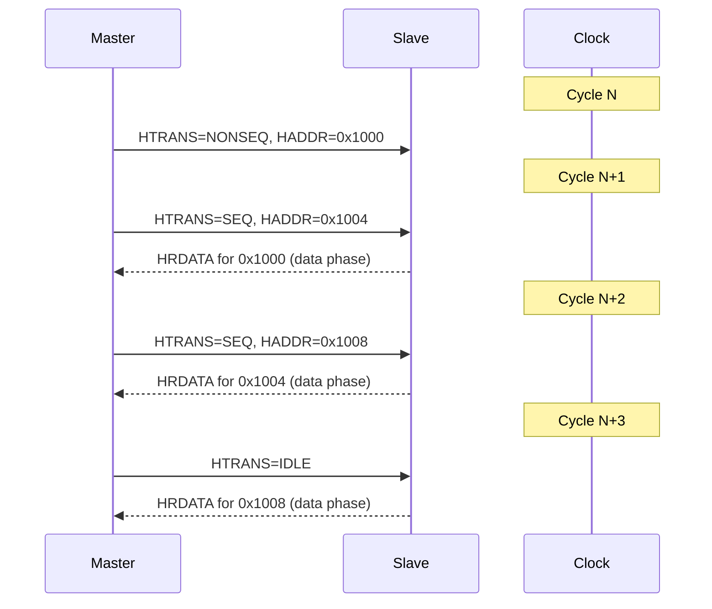
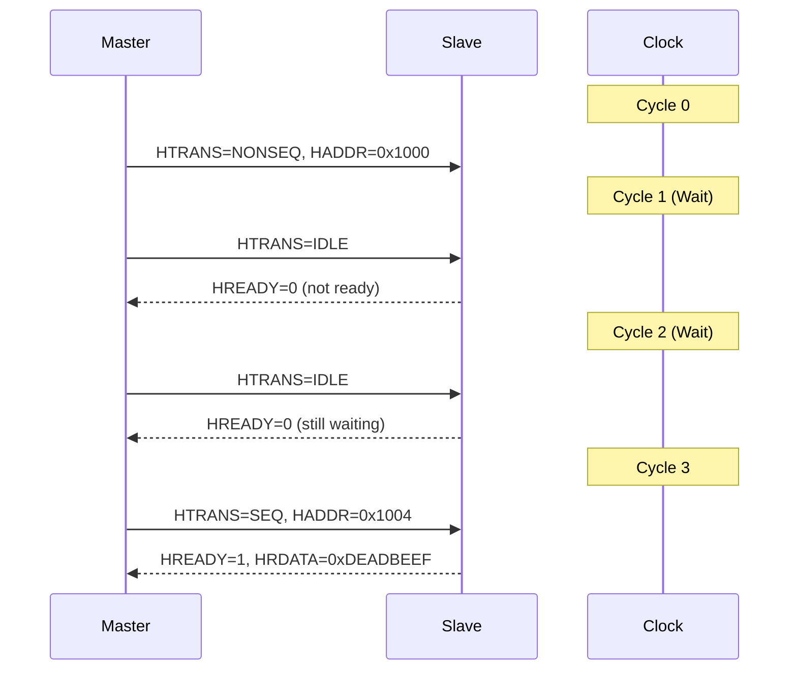

# AHB传输时序与流水线

<span class="badge-i">[I]</span>

---

### 传输类型：IDLE/BUSY/NONSEQ/SEQ

HTRANS[1:0] 决定当前时钟周期总线上的传输性质：

| HTRANS | 含义 | 地址阶段行为 |
|--------|------|--------------|
| 00 IDLE | 空闲，无有效传输 | 地址总线不关心 |
| 01 BUSY | Master忙，插入等待 | 地址与上一拍相同 |
| 10 NONSEQ | 新传输的第一个地址 | 全新地址 |
| 11 SEQ | 突发的后续地址 | 地址 = 上一拍 + size |

<span class="red">NONSEQ 到 SEQ 的切换</span>标志着突发传输的开始：
<br>
第一拍是 NONSEQ（全新地址），后面全是 SEQ（递增地址）。
<br>

```verilog
// HTRANS sequence for an INCR4 burst
// Cycle 0: HTRANS = NONSEQ, HADDR = 0x1000
// Cycle 1: HTRANS = SEQ,    HADDR = 0x1004
// Cycle 2: HTRANS = SEQ,    HADDR = 0x1008
// Cycle 3: HTRANS = SEQ,    HADDR = 0x100C
```

#### BUSY 插入场景

Master 还没准备好下一拍数据时插入 BUSY：
<br>

```verilog
// Master needs 1 extra cycle to prepare data
// Cycle 0: HTRANS = NONSEQ, HADDR = 0x1000
// Cycle 1: HTRANS = BUSY,   HADDR = 0x1000 (same)
// Cycle 2: HTRANS = SEQ,    HADDR = 0x1004
```

<span class="blue">易错点：BUSY只能在突发的中间插入，不能在第一个拍（NONSEQ前）或最后一个拍后插入。</span>
<br>

---

### 流水线机制：地址阶段与数据阶段重叠

<span class="red">AHB 流水线</span>是高性能的核心——地址和数据阶段错开一个周期：
<br>
- 当前时钟：送地址（Address Phase）
<br>
- 下一个时钟：送/收数据（Data Phase）
<br>
- 再下一个时钟：数据才有效
<br>



类比：餐厅流水线——
<br>
第1分钟：服务员点单（地址阶段）
<br>
第2分钟：厨师做菜+服务员点下一单（数据+新地址重叠）
<br>
第3分钟：上第1桌菜+厨师做第2桌菜（数据阶段持续）
<br>

---

### 突发传输：SINGLE/INCR/WRAP

#### SINGLE 单次传输

```verilog
// SINGLE transfer
// Cycle 0: HTRANS = NONSEQ, HBURST = SINGLE, HADDR = 0x2000
// Cycle 1: HTRANS = IDLE (or next transaction)
// Data phase in Cycle 1
```

SINGLE 就是一笔独立的读写，没有后续拍。
<br>

#### INCR 递增突发

```verilog
// INCR4 burst, 32-bit bus
// Cycle 0: HTRANS=NONSEQ, HBURST=INCR4, HSIZE=010(4B), HADDR=0x3000
// Cycle 1: HTRANS=SEQ,    HADDR=0x3004
// Cycle 2: HTRANS=SEQ,    HADDR=0x3008
// Cycle 3: HTRANS=SEQ,    HADDR=0x300C
```

#### WRAP 回环突发

```verilog
// WRAP4 burst, 32-bit bus, 16-byte boundary
// Boundary = 4 beats × 4 bytes = 16 bytes
// Start at 0x300C (near boundary)
// Cycle 0: HTRANS=NONSEQ, HBURST=WRAP4, HADDR=0x300C
// Cycle 1: HTRANS=SEQ,    HADDR=0x3000  <-- wraps!
// Cycle 2: HTRANS=SEQ,    HADDR=0x3004
// Cycle 3: HTRANS=SEQ,    HADDR=0x3008
```

| HBURST | 长度 | 地址序列示例 (32-bit, start=0x300C) |
|--------|------|--------------------------------------|
| WRAP4  | 4    | 0x300C, 0x3000, 0x3004, 0x3008       |
| WRAP8  | 8    | 0x300C, 0x3010... wraps at 32B        |
| WRAP16 | 16   | 0x300C, 0x3010... wraps at 64B        |

<span class="blue">关键认知：WRAP的边界由"突发长度 × 每拍大小"决定，不是固定值。</span>
<br>

---

### 等待状态：HREADY低电平插入

Slave 无法在一个时钟内完成响应时，拉低 <span class="red">HREADY</span>：
<br>



| 信号 | 行为 | 约束 |
|------|------|------|
| HREADY | 低=等待，高=完成 | 最多可插入无限等待 |
| HTRANS | Master在等期间 | 必须保持BUSY或IDLE |

<span class="blue">易错点：HREADY低电平期间，Master不能改变HADDR，必须保持地址稳定。</span>
<br>

---

### 代码：AHB Master状态机

```verilog
module ahb_master (
    input  wire        hclk,
    input  wire        hreset_n,
    // AHB signals
    output reg  [31:0] haddr,
    output reg  [2:0]  hburst,
    output reg  [2:0]  hsize,
    output reg  [1:0]  htrans,
    output reg         hwrite,
    output reg  [31:0] hwdata,
    input  wire [31:0] hrdata,
    input  wire        hready,
    input  wire [1:0]  hresp,
    output reg         hbusreq,
    input  wire        hgrant
);
    localparam IDLE     = 3'b000;
    localparam REQ      = 3'b001;
    localparam ADDR     = 3'b010;
    localparam DATA     = 3'b011;
    localparam WAIT     = 3'b100;

    reg [2:0]  state;
    reg [3:0]  beat_cnt;
    reg [31:0] addr_reg;
    reg [31:0] data_buf [0:15];

    always @(posedge hclk or negedge hreset_n) begin
        if (!hreset_n) begin
            state    <= IDLE;
            hbusreq  <= 1'b0;
            htrans   <= 2'b00; // IDLE
            beat_cnt <= 4'd0;
        end else begin
            case (state)
                IDLE: begin
                    // Request bus for INCR8 transfer
                    hbusreq  <= 1'b1;
                    addr_reg <= 32'h4000;
                    hsize    <= 3'b010;  // 32-bit
                    hburst   <= 3'b101;  // INCR8
                    hwrite   <= 1'b1;    // Write
                    state    <= REQ;
                end
                REQ: begin
                    if (hgrant) begin
                        // Bus granted, start address phase
                        haddr    <= addr_reg;
                        htrans   <= 2'b10; // NONSEQ
                        beat_cnt <= 4'd0;
                        state    <= ADDR;
                    end
                end
                ADDR: begin
                    if (hready) begin
                        // Address accepted, move to data phase
                        hwdata   <= data_buf[0];
                        haddr    <= addr_reg + 32'd4;
                        htrans   <= 2'b11; // SEQ
                        beat_cnt <= 4'd1;
                        state    <= DATA;
                    end
                end
                DATA: begin
                    if (hready) begin
                        if (beat_cnt < 4'd8) begin
                            hwdata   <= data_buf[beat_cnt];
                            haddr    <= addr_reg + (beat_cnt + 1) * 32'd4;
                            htrans   <= 2'b11; // SEQ
                            beat_cnt <= beat_cnt + 4'd1;
                        end else begin
                            htrans   <= 2'b00; // IDLE
                            hbusreq  <= 1'b0;
                            state    <= IDLE;
                        end
                    end else begin
                        // Wait state, hold current values
                        htrans <= 2'b01; // BUSY
                        state  <= WAIT;
                    end
                end
                WAIT: begin
                    if (hready) begin
                        // Resume data phase
                        state <= DATA;
                    end
                end
            endcase
        end
    end
endmodule
```

<span class="green">AHB Master状态机</span>：IDLE→REQ（申请总线）→ADDR（发地址）→DATA（传数据）→IDLE。
<br>
DATA阶段遇到HREADY=0则进入WAIT等待。
<br>

---

**学习路径提示**：
<br>
- <span class="badge-i">[I]</span> 读者：重点理解流水线机制——地址和数据阶段的重叠是AHB高性能的秘密。
<br>
- 掌握HTRANS四种状态的用法，能在波形图中识别出NONSEQ/SEQ/BUSY/IDLE。
<br>
