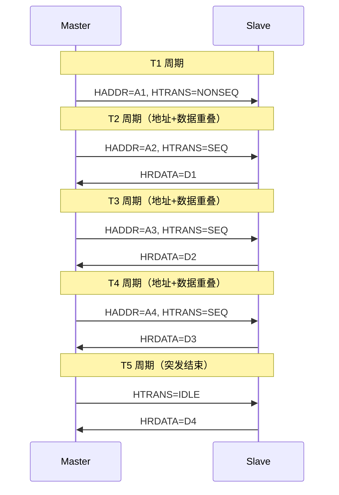
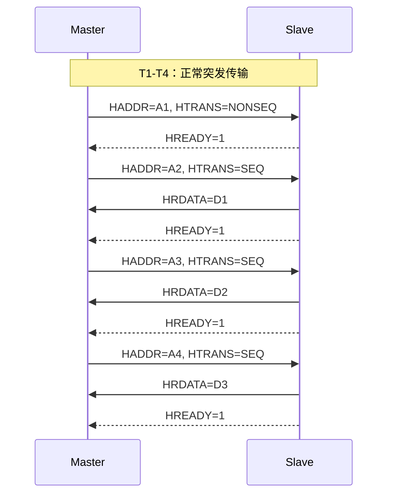
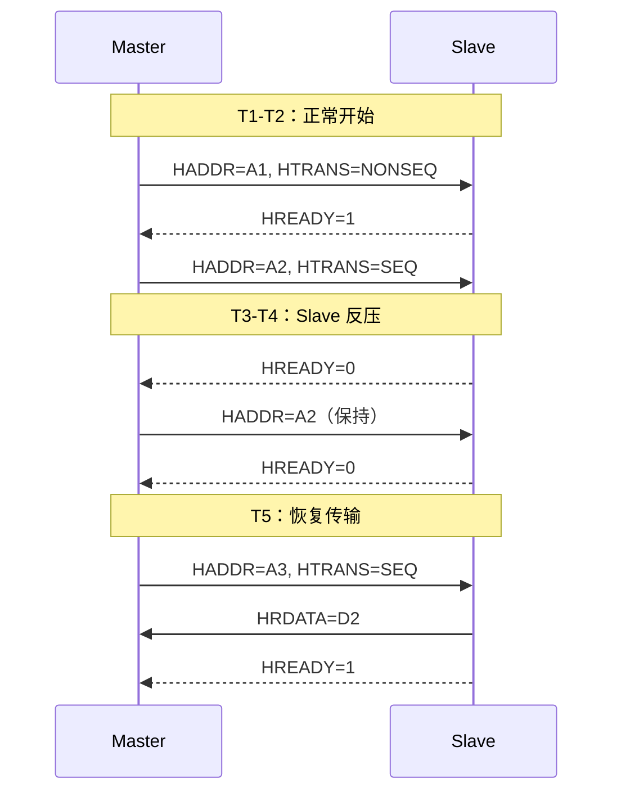

# AHB 传输时序与流水线 [B→I]

> **本章学习目标**：
> - 理解 <span class="red">AHB 两级流水线</span> 的地址-数据重叠机制
> - 掌握 <span class="red">HTRANS 状态机</span> 的时序细节
> - 学会用逻辑分析仪抓取 AHB 波形

---

<span class="blue">从何而来 → 为什么需要 → 哪里用：</span><br>
<span class="red">AHB 流水线</span>诞生于 <span class="green">AMBA 2</span> 规范（1999 年）。<br>
传统总线（如 <span class="green">APB</span>）的地址和数据串行传输，每个事务至少 3 个周期，<span class="blue">总线利用率不足 33%</span>。<br>
AHB 引入两级流水线，让地址周期和数据周期重叠，<span class="blue">理论利用率提升至 100%</span>。<br>
如今，流水线设计是 AHB、<span class="green">AXI</span>、<span class="green">TileLink</span> 等现代总线的通用优化手段。<br>

---

## AHB 的两级流水线架构

---

### <strong>地址周期与数据周期的重叠</strong>

<span class="red">AHB 的核心性能优化</span>在于<span class="blue">"地址周期和数据周期重叠"</span>。<br>

<span class="blue">类比理解：AHB 流水线如同"工厂流水线"</span><br>
传统总线 = 单工位（装完一个再装下一个）<br>
AHB 流水线 = 双工位（工位 A 装零件，工位 B 拧螺丝，同时进行）<br>
每个工人同时做自己那道工序，整体产出翻倍。<br>

传统总线（如 APB）的时序：<br>
* T1：发送地址<br>
* T2：Slave 解码地址<br>
* T3：传输数据<br>
* T4：Slave 响应<br>

AHB 的流水线时序：<br>
* T1：发送地址 A1<br>
* T2：发送地址 A2 + 接收数据 D1<br>
* T3：发送地址 A3 + 接收数据 D2<br>
* T4：发送地址 A4 + 接收数据 D3<br>

<span class="blue">每个周期同时做"发新地址"和"收旧数据"，理论带宽翻倍。</span><br>



<span class="blue">地址和数据始终相差 1 个周期（固定延迟），HREADY 控制每个周期的进度。</span><br>

---

### <strong>HTRANS 状态机：IDLE → NONSEQ → SEQ → IDLE</strong>

<span class="red">HTRANS</span> 的 4 种状态构成 AHB 传输的状态机。<br>

| 状态转换 | 条件 | 含义 |
| --- | --- | --- |
| IDLE → NONSEQ | Master 发起新突发 | 突发起始 |
| NONSEQ → SEQ | HREADY=1 | 突发继续 |
| SEQ → SEQ | HREADY=1，未到最后 beat | 突发中间 |
| SEQ → IDLE | HREADY=1，最后 beat | 突发结束 |
| SEQ → BUSY | Master 暂时无法继续 | 插入等待 |
| BUSY → SEQ | Master 恢复 | 继续突发 |

<span class="blue">BUSY 状态允许 Master 在突发中间插入等待，而不释放总线。</span><br>

```verilog
// AHB Master HTRANS 生成逻辑
always @(posedge HCLK) begin
  case (hstate)
    IDLE: if (burst_req) hstate <= NONSEQ;
    NONSEQ: hstate <= HREADY ? SEQ : NONSEQ;
    SEQ: begin
      if (HREADY && last_beat) hstate <= IDLE;
      else if (HREADY) hstate <= SEQ;
      else if (!HREADY && master_busy) hstate <= BUSY;
    end
    BUSY: hstate <= HREADY ? SEQ : BUSY;
  endcase
end

assign HTRANS = (hstate == IDLE) ? 2'b00 :
                (hstate == BUSY) ? 2'b01 :
                (hstate == NONSEQ) ? 2'b10 : 2'b11;
```

---

### <strong>突发传输的地址计算</strong>

<span class="red">AHB 突发</span>的地址递增规则：<br>

| 突发类型 | 地址增量 | 总传输量（32-bit 总线） |
| --- | --- | --- |
| SINGLE | 0（仅 1 beat） | 4 bytes |
| INCR | 按 HSIZE 递增 | 无限制 |
| INCR4 | 按 HSIZE 递增 × 4 beat | 16 bytes |
| INCR8 | 按 HSIZE 递增 × 8 beat | 32 bytes |
| INCR16 | 按 HSIZE 递增 × 16 beat | 64 bytes |
| WRAP4 | 按 HSIZE 递增，4-beat 环绕 | 16 bytes |

```verilog
// WRAP4 突发示例（HSIZE=2，word 传输）
// 起始地址：0x24
// Beat 0: 0x24
// Beat 1: 0x28
// Beat 2: 0x2C
// Beat 3: 0x20  ← 环绕到 4-word 边界（0x20）
```

<span class="blue">WRAP 突发要求起始地址对齐到突发长度 × HSIZE 的边界。</span><br>

---

## 等待周期与反压机制

---

### <strong>HREADY 反压：Slave 延长数据周期</strong>

<span class="orange"><strong>1. 正常传输：HREADY 始终为高</strong></span><br>



<span class="orange"><strong>2. Slave 反压：HREADY 拉低插入等待</strong></span><br>



<span class="blue">HREADY 为低时，Master 必须保持地址和数据不变，直到 HREADY 变高。</span><br>

---

### <strong>BUSY 状态：Master 主动插入等待</strong>

<span class="red">BUSY</span>状态与 HREADY 反压的区别：<br>

| 对比 | BUSY | HREADY=0 |
| --- | --- | --- |
| 发起方 | Master | Slave |
| 目的 | Master 暂时无法继续 | Slave 未就绪 |
| HTRANS | BUSY (01) | 保持原状态 |
| 地址 | 保持上一个地址 | 必须保持 |
| 数据 | 不传输 | 不传输 |

<span class="blue">BUSY 用于突发中间插入等待（如 FIFO 空），不释放总线。</span><br>

---

## AHB 波形抓取与解析

---

### <strong>逻辑分析仪抓取 AHB 波形</strong>

抓取 AHB 需要 16~20 个数字通道：<br>

| 通道 | 信号 | 说明 |
| --- | --- | --- |
| 0 | HCLK | 总线时钟 |
| 1 | HRESETn | 复位 |
| 2-33 | HADDR[31:0] | 地址 |
| 34-35 | HTRANS[1:0] | 传输类型 |
| 36 | HWRITE | 读写方向 |
| 37-39 | HSIZE[2:0] | 传输大小 |
| 40-42 | HBURST[2:0] | 突发类型 |
| 43-74 | HWDATA/HRDATA | 数据 |
| 75 | HREADY | 完成标志 |
| 76 | HRESP | 响应 |

<span class="blue">Saleae Logic 16 通道不足时，优先抓取 HCLK、HADDR[7:0]、HTRANS、HWRITE、HREADY。</span><br>

```python
# parse_ahb.py
import csv

def parse_ahb_burst(csv_file):
    with open(csv_file) as f:
        reader = csv.DictReader(f)
        bursts = []
        current = None
        for row in reader:
            trans = int(row['HTRANS'], 2)
            if trans == 2:  # NONSEQ
                current = {'addr': row['HADDR'], 'beats': 1}
            elif trans == 3 and current:  # SEQ
                current['beats'] += 1
            elif trans == 0 and current:  # IDLE
                bursts.append(current)
                current = None
        return bursts
```

---

## 本章小结

| 概念 | 一句话总结 |
| --- | --- |
| 两级流水线 | 地址和数据重叠，T2 发 A2 同时收 D1 |
| HTRANS 状态机 | IDLE→NONSEQ→SEQ→IDLE，BUSY 插入等待 |
| 突发地址 | INCR 递增，WRAP 环绕，起始地址需对齐 |
| HREADY 反压 | Slave 拉低 HREADY，插入等待周期 |
| BUSY | Master 主动等待，不释放总线 |
| 波形抓取 | 16~20 通道，HCLK+HADDR+HTRANS+HREADY 必备 |

---

## 练习

1. 画出 AHB INCR4 突发的完整时序图（含地址和数据重叠）。<br>
2. 如果 Slave 在 beat 2 时拉低 HREADY，Master 应该如何响应？<br>
3. 用逻辑分析仪抓取一次 AHB 突发读，验证 HRDATA 与 HADDR 的对应关系。
