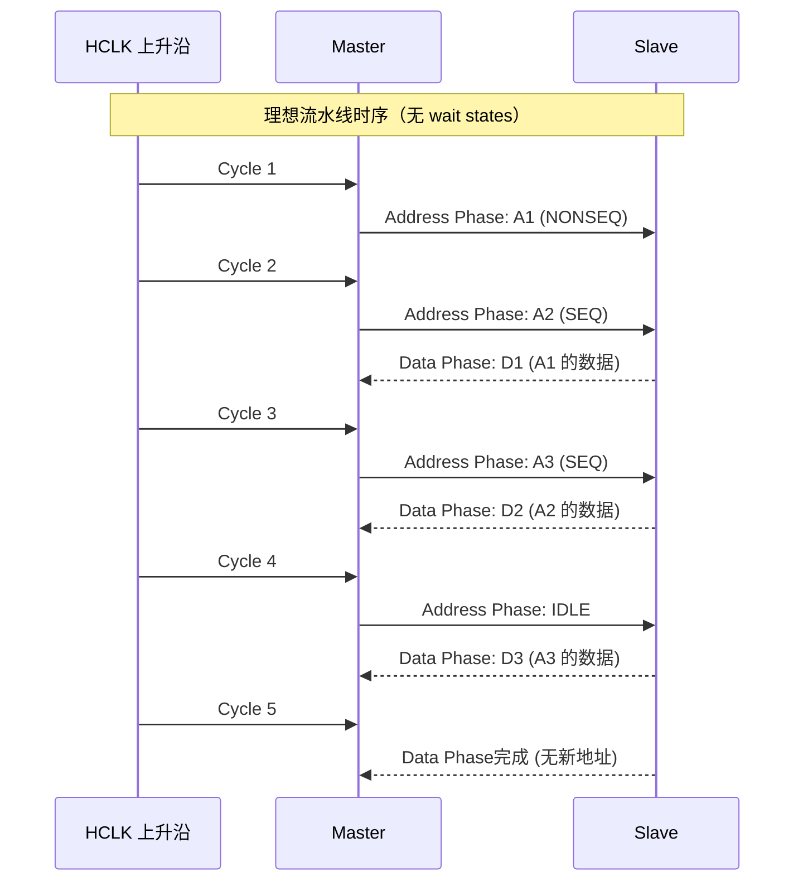
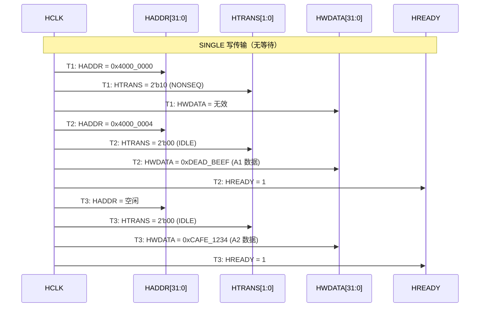
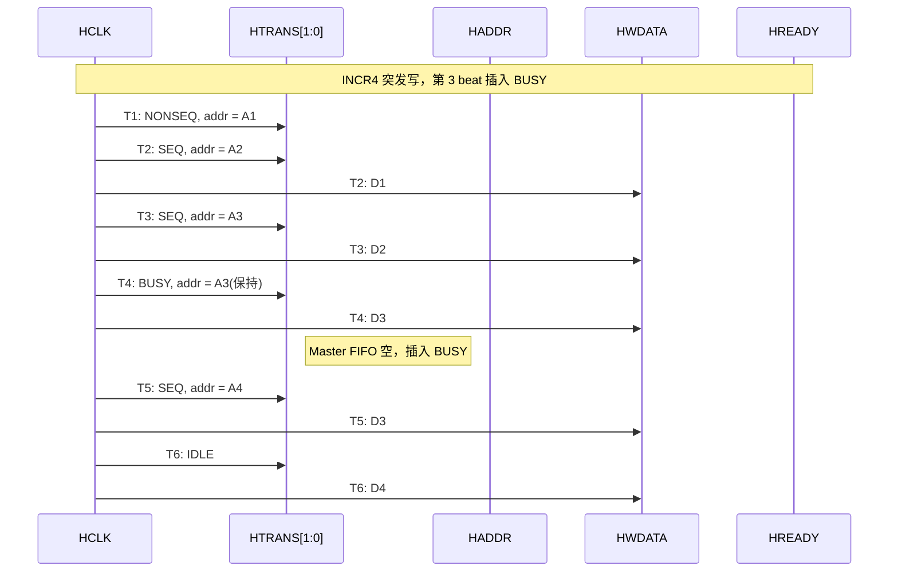
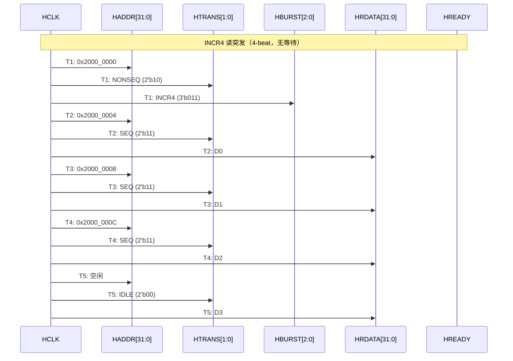
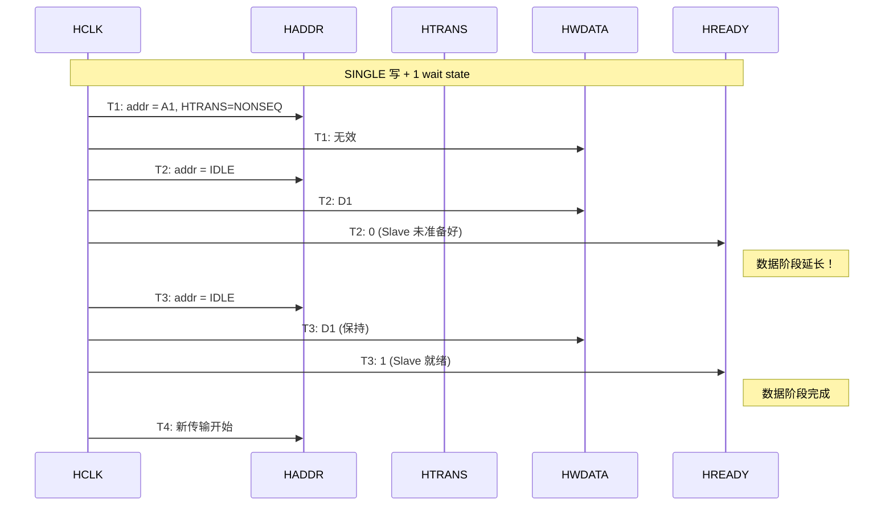

# AHB怎么做——传输时序与流水线机制

<span class="badge-b">[B]</span> <span class="badge-i">[I]</span> <span class="badge-e">[E]</span> <span class="badge-m">[M]</span>

<span class="red">AHB 的核心竞争力在于流水线（Pipeline）——通过地址阶段和数据阶段的时钟重叠，实现每周期 1 beat 的传输效率。理解时序，就是理解 AHB 的灵魂。</span>

---

## 核心定义与价值

### <strong>流水线时序模型</strong>

AHB 将每个传输拆分为两个非重叠的时钟阶段：

- <span class="green">地址阶段（Address Phase）</span>：Master 输出地址和控制信号
- <span class="green">数据阶段（Data Phase）</span>：Slave 返回读数据或接收写数据

<br>

关键洞察：<span class="blue">第 N 个 beat 的数据阶段，与第 N+1 个 beat 的地址阶段在同一时钟周期发生。</span> 这就是流水线——两个传输阶段重叠。

<br>



<br>

### <strong>类比：流水线 = 多工位装配线</strong>

想象一条汽车装配线——有 2 个工位：

- 工位 1（地址阶段）：给底盘喷漆（决定去哪里）
- 工位 2（数据阶段）：安装发动机（实际处理）

<br>

工位 1 在喷第 N 辆车的同时，工位 2 在安装第 N-1 辆车的发动机。<br>
两辆车同时处于不同阶段，装配线不停歇。<br>
AHB 流水线同理：一个时钟周期内，总线上既有新地址，又有老数据。

---

## 核心机制原理解析

### <strong>1. HTRANS[1:0] 字段级时序详解</strong>

<span class="red">HTRANS[1:0] 是区分传输类型的核心字段，其值在每个地址阶段由 Master 驱动。</span>

<br>

#### 编码真值表（bit 精确）

| HTRANS[1] | HTRANS[0] | 值 | 名称 | 场景 |
|-----------|-----------|-----|------|------|
| 0 | 0 | 2'b00 | IDLE | 总线空闲，无传输 |
| 0 | 1 | 2'b01 | BUSY | 突发中插入等待，数据未准备好 |
| 1 | 0 | 2'b10 | NONSEQ | 单次传输或突发首 beat |
| 1 | 1 | 2'b11 | SEQ | 突发的后续 beat，地址 = 前地址 + HSIZE |

<br>

#### 时序波形（Mermaid 时序图）



<br>

#### BUSY 插入的典型场景

当 Master 突发传输过程中，内部 FIFO 空或 DMA 引擎尚未准备好下一个数据时，Master 插入 BUSY 周期。



<br>

<span class="blue">BUSY 的关键特性：地址信号保持前一个值不变，但 Slave 必须忽略该地址（因为这不是一次有效传输）。Slave 在 BUSY 周期无需准备数据。</span>

### <strong>2. HBURST[2:0] 字段级时序详解</strong>

<span class="red">HBURST[2:0] 在突发传输的第一个 beat（NONSEQ）时由 Master 设置，并在整个突发期间保持不变。</span>

<br>

#### 突发传输时序：INCR4 读



<br>

#### WRAP4 vs INCR4 地址回绕

| 类型 | HBURST | 地址序列（HSIZE=Word） |
|------|--------|------------------------|
| INCR4 | 3'b011 | A, A+4, A+8, A+12 |
| WRAP4 | 3'b010 | 假设 A=0x24，则序列：0x24, 0x28, 0x2C, 0x20 |

<br>

WRAP4 地址回绕的数学：<span class="blue">当地址到达 (base + 4×4 = base + 16) 边界时，回绕到 base。</span><br>
例如 0x24 → 0x28 → 0x2C → 0x20（回绕），因为 0x20 + 0x10 = 0x30 是 16-byte 边界。<br>
回绕突发用于 cache line fill——当处理器读取 cache line 时，从触发地址开始，回绕完成整个 line。

### <strong>3. Wait States：HREADY 插入等待</strong>

<span class="red">HREADY 是 Slave 驱动的握手信号。当 HREADY=0 时，数据阶段被延长，地址阶段也被阻塞。</span>

<br>



<br>

#### Wait State 对流水线的影响

- HREADY=0 时，<span class="green">当前数据阶段延长</span>
- 同时，<span class="green">下一个地址阶段也被阻塞</span>（Master 不能推进到下一个地址）
- 整个流水线停滞，直到 HREADY=1

```verilog
// Slave 插入 wait state 的典型逻辑
always @(posedge HCLK or negedge HRESETn) begin
    if (!HRESETn) begin
        hready_reg <= 1'b1;
    end else begin
        if (hsel && hwrite && htrans != 2'b00) begin
            // 内部 FIFO 满时插入等待
            if (fifo_full)
                hready_reg <= 1'b0;
            else
                hready_reg <= 1'b1;
        end
    end
end
assign HREADY = hready_reg;
```

<br>

### <strong>4. HSIZE 与 对齐约束</strong>

<span class="red">HSIZE[2:0] 控制单次传输的数据宽度，同时决定了地址对齐要求。</span>

<br>

| HSIZE | 大小 | 对齐要求 | 地址低 bits |
|-------|------|----------|-------------|
| 3'b000 | Byte | 1-byte 对齐 | 任意 |
| 3'b001 | Halfword | 2-byte 对齐 | bit0 = 0 |
| 3'b010 | Word | 4-byte 对齐 | bit[1:0] = 00 |
| 3'b011 | Doubleword | 8-byte 对齐 | bit[2:0] = 000 |

<br>

<span class="blue">AHB 协议要求 Master 保证地址对齐。不对齐访问可能导致 Slave 返回 ERROR 响应，或者由 Slave 自行拆分为多次访问。</span>

### <strong>5. HRESP：传输响应</strong>

HRESP 指示传输结果：

- <span class="green">HRESP = 0 (OKAY)</span>：传输成功完成
- <span class="green">HRESP = 1 (ERROR)</span>：传输失败（地址无效、保护违规等）

<br>

ERROR 响应的处理：
- Slave 可以在任意 beat 的最后一个 cycle 拉高 HRESP
- Master 检测到 ERROR 后，通常需要终止当前突发（goto IDLE）
- 在 Cortex-M 处理器中，AHB ERROR 会触发 HardFault 异常

---

## 技术教学与实战

### <strong>Verilog 状态机：INCR8 突发读</strong>

```verilog
module ahb_incr8_reader (
    input  wire        HCLK,
    input  wire        HRESETn,
    output reg  [31:0] HADDR,
    output reg  [ 2:0] HBURST,
    output reg  [ 2:0] HSIZE,
    output reg  [ 1:0] HTRANS,
    output reg         HWRITE,
    input  wire [31:0] HRDATA,
    input  wire        HREADY,
    input  wire        HRESP,
    input  wire        start,       // 启动信号
    input  wire [31:0] base_addr,   // 起始地址
    output reg         done
);

    localparam IDLE   = 2'b00;
    localparam NONSEQ = 2'b10;
    localparam SEQ    = 2'b11;
    localparam INCR8  = 3'b101;

    reg [3:0] beat_cnt;
    reg [31:0] read_data [0:7];  // 8-word 缓冲区

    always @(posedge HCLK or negedge HRESETn) begin
        if (!HRESETn) begin
            HTRANS  <= IDLE;
            HWRITE  <= 1'b0;  // 读
            beat_cnt <= 0;
            done     <= 1'b0;
        end else begin
            done <= 1'b0;
            
            if (start && beat_cnt == 0) begin
                HADDR   <= base_addr;
                HTRANS  <= NONSEQ;
                HBURST  <= INCR8;
                HSIZE   <= 3'b010;  // Word
                beat_cnt <= 1;
            end else if (HREADY && beat_cnt > 0 && beat_cnt < 8) begin
                HTRANS  <= SEQ;
                HADDR   <= HADDR + 4;  // Word 递增
                read_data[beat_cnt-1] <= HRDATA;  // 锁存读数据
                beat_cnt <= beat_cnt + 1;
            end else if (HREADY && beat_cnt == 8) begin
                read_data[7] <= HRDATA;
                HTRANS  <= IDLE;
                beat_cnt <= 0;
                done     <= 1'b1;
            end
        end
    end
endmodule
```

<br>

### <strong>Wait State 的功耗影响分析</strong>

假设系统参数：

- HCLK = 100 MHz，电压 1.2V
- 动态功耗 ∝ f × V² × C × α（α = 翻转率）

<br>

每插入 1 个 wait state：

- 当前传输多消耗 1 个 HCLK 周期
- 后续所有传输延迟 1 周期
- 若 wait state 占比 20%，有效带宽下降 20%，但功耗不变（时钟仍在跑）

<span class="blue">结论：Wait states 对功耗效率的损害大于对带宽的损害——因为时钟在空转。</span>

---

## 嵌入式专属实战场景

### <strong>Cortex-M4 AHB 总线时序实测</strong>

在 STM32F4 上，通过 DWT（Data Watchpoint and Trace）单元测量 AHB 访问延迟：

```c
// 使用 DWT_CYCCNT 测量 AHB 访问周期
volatile uint32_t *ahb_reg = (uint32_t *)0x40021000;  // RCC 寄存器

DWT->CYCCNT = 0;
uint32_t start = DWT->CYCCNT;
uint32_t val = *ahb_reg;  // AHB 读
uint32_t end = DWT->CYCCNT;

// 实测结果（STM32F4 @ 168 MHz）：
// 读 SRAM（0x2000_0000）：1 周期（无 wait）
// 读 Flash（0x0800_0000）：5 周期（含 Flash 等待）
// 读 APB 外设（0x4002_xxxx）：2 周期（AHB-to-APB bridge 延迟）
```

<br>

### <strong>AHB 突发性能优化实战</strong>

DMA 配置中开启突发模式（FIFO 模式）：

```c
// STM32 HAL DMA 配置：启用突发传输
DMA_HandleTypeDef hdma;

hdma.Init.PeriphInc = DMA_PINC_DISABLE;
hdma.Init.MemInc    = DMA_MINC_ENABLE;
hdma.Init.PeriphDataAlignment = DMA_PDATAALIGN_WORD;
hdma.Init.MemDataAlignment    = DMA_MDATAALIGN_WORD;

// 关键：FIFO 阈值设置决定突发长度
hdma.Init.FIFOMode  = DMA_FIFOMODE_ENABLE;
hdma.Init.FIFOThreshold = DMA_FIFO_THRESHOLD_FULL;  // 4-word FIFO

// 启用后，DMA 控制器在 AHB 上发起 INCR4/INCR8 突发
// 对比单次传输，带宽提升约 30-40%（减少地址周期开销）
```

<br>

---

## 历史演进与前沿

### <strong>AHB 时序模型的版本差异</strong>

<br>

| 版本 | 突发最大长度 | 支持 Wait States | 新增特性 |
|------|-------------|------------------|----------|
| AMBA 2 AHB | 16 beat | 是 | 基础流水线 |
| AMBA 3 AHB-Lite | 16 beat | 是 | 单主简化 |
| AMBA 4 AHB4 | 16 beat | 是 | Exclusive access |
| AMBA 5 AHB5 | 16 beat | 是 | TrustZone、QoS |

<br>

### <strong>前沿：AHB 与 NoC（Network-on-Chip）的对比</strong>

现代多核 SoC 中，AHB 共享总线逐渐被片上网络（NoC）取代：

| 特性 | AHB 共享总线 | NoC |
|------|--------------|-----|
| 拓扑 | 总线/矩阵 | 网格/环/树 |
| 扩展性 | 主设备数受限（<8） | 理论上无限 |
| 并发度 | 1 传输/总线 | 多并发 |
| 延迟 | 低（直连） | 较高（路由跳数） |
| 面积 | 随主设备数平方增长 | 线性增长 |

<br>

<span class="blue">AHB 不会消失——在 Cortex-M、子系统内部互联、低功耗 MCU 中，它仍然是最佳选择。NoC 适用于大于 4 核的高性能场景。</span>

---

## 本章小结

<br>

| 知识点 | 核心结论 |
|--------|----------|
| 流水线 | 地址阶段和数据阶段重叠，理想每周期 1 beat |
| HTRANS | NONSEQ(首) → SEQ(续) → IDLE(结束) |
| HBURST | INCR/Wrap 控制地址递增模式，突发长度 1/4/8/16 |
| HREADY | 低电平插入 wait state，阻塞整个流水线 |
| 带宽公式 | 理论 = HCLK × width / 8；实际 = 理论 × (1 - wait_ratio) |
| 对齐 | HSIZE 决定地址对齐，不对齐可能 ERROR |

---

## 练习

1. <span class="purple">画出 INCR4 突发写的完整时序图，标注每个周期 HTRANS、HADDR、HWDATA、HREADY 的值。</span>

2. 计算以下场景的有效带宽：HCLK=80MHz，32-bit 总线，INCR8 突发，每突发平均 2 个 wait states。

3. <span class="purple">为什么 BUSY 周期中 Slave 不需要准备数据？从协议语义角度解释。</span>

4. 设计一个 WRAP8 突发读的状态机，要求地址在 8-word 边界回绕。

5. <span class="purple">在 Cortex-M4 中，Flash 的 wait states 是由什么因素决定的？AHB 协议层面如何处理？</span>
