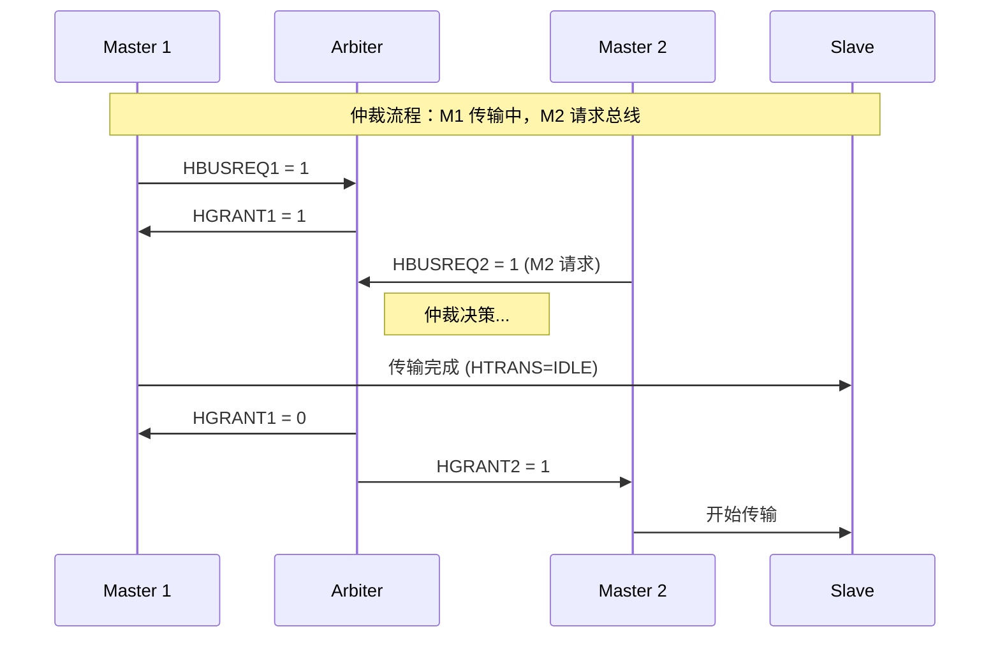
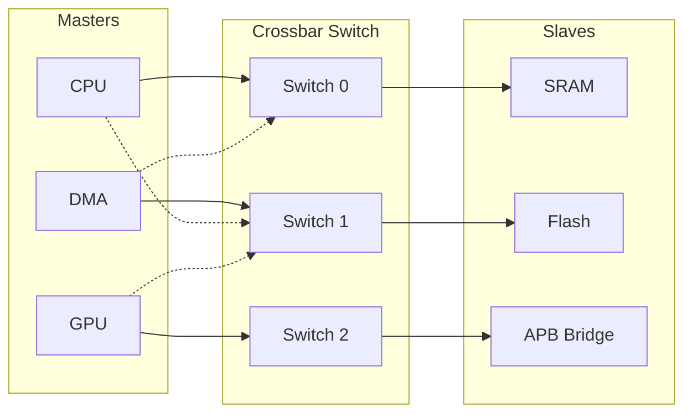
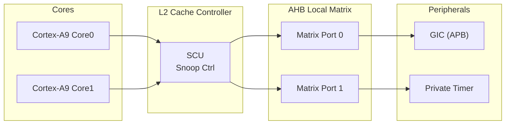

# AHB为什么能支持多主——仲裁器与总线矩阵

<span class="badge-b">[B]</span> <span class="badge-i">[I]</span> <span class="badge-e">[E]</span> <span class="badge-m">[M]</span>

<span class="red">AHB 的多主（Multi-Master）能力是它区别于 AHB-Lite 的核心特征。理解仲裁器与总线矩阵，就是理解 AHB 如何从"单车道"升级为"立交枢纽"。</span>

---

## 核心定义与价值

### <strong>为什么需要多主架构</strong>

现代 SoC 中，多个设备需要同时访问内存和外设：

- CPU 取指和数据访问
- DMA 引擎搬运数据（不占用 CPU）
- 图形加速器读写帧缓冲
- 网络控制器收发数据包

<span class="blue">如果所有访问都串行化（单主），DMA 传输期间 CPU 必须空等——这就是单主架构的性能瓶颈。</span>

### <strong>类比：多车道高速公路 + 收费站</strong>

想象一条多车道高速公路进入收费站：

- 每辆车来自不同入口（多个 Master）
- 收费站一次只能服务一辆车（总线物理层）
- 需要交通警察（仲裁器）决定下一辆放行哪辆车
- 如果有多条收费通道（总线矩阵），不同入口的车可以并行通过不同通道

<br>

<span class="blue">AHB 的仲裁器就是"交通警察"，总线矩阵就是"多通道收费站"。</span>

---

## 核心机制原理解析

### <strong>1. 仲裁信号：HBUSREQ / HGRANT / HMASTER</strong>

<span class="red">仲裁通过一组握手信号实现，每个 Master 都有独立的请求线和授权线。</span>

<br>

| 信号 | 方向 | 宽度 | 作用 |
|------|------|------|------|
| <span class="green">HBUSREQx</span> | M→Arbiter | 1/主 | Master x 请求总线 |
| <span class="green">HLOCKx</span> | M→Arbiter | 1/主 | Master x 锁定总线（原子操作） |
| <span class="green">HGRANTx</span> | Arbiter→M | 1/主 | 授权 Master x 使用总线 |
| <span class="green">HMASTER[3:0]</span> | Arbiter→S | 4 | 当前授权 Master 的编号 |
| <span class="green">HMASTLOCK</span> | Arbiter→S | 1 | 当前传输是否被锁定 |

<br>



<br>

#### 仲裁协议规则

1. Master 必须先拉高 HBUSREQx 请求总线
2. 仲裁器在地址阶段前至少 1 周期给出 HGRANTx
3. Master 只有在检测到 HGRANTx=1 且 HREADY=1 时，才可以在下一个周期驱动地址
4. 当前 Master 完成最后一个 beat（HTRANS=IDLE）后，HGRANT 才会切换
5. 若 Master 持有 HLOCKx，仲裁器不能收回授权（直到解锁）

### <strong>2. 仲裁算法：固定优先级 vs 轮询</strong>

<span class="red">仲裁算法决定多个请求同时到达时，哪个 Master 获得总线。</span>

<br>

#### 固定优先级仲裁

```verilog
// 固定优先级仲裁器示例（4 主）
module fixed_priority_arbiter (
    input  wire [3:0] hbusreq,   // 4 个请求
    output reg  [3:0] hgrant
);
    // 优先级：Master 0 > Master 1 > Master 2 > Master 3
    always @(*) begin
        if (hbusreq[0])      hgrant = 4'b0001;
        else if (hbusreq[1]) hgrant = 4'b0010;
        else if (hbusreq[2]) hgrant = 4'b0100;
        else if (hbusreq[3]) hgrant = 4'b1000;
        else                 hgrant = 4'b0000;
    end
endmodule
```

<br>

| 优点 | 缺点 |
|------|------|
| 实现简单（组合逻辑） | 低优先级 Master 可能饿死 |
| 延迟低（1 周期决策） | 不满足公平性要求 |
| 可预测（确定性） | 高优先级 Master 垄断带宽 |

<br>

#### 轮询仲裁（Round-Robin）

```verilog
// 轮询仲裁器
module round_robin_arbiter (
    input  wire        HCLK,
    input  wire        HRESETn,
    input  wire [3:0]  hbusreq,
    output reg  [3:0]  hgrant,
    output reg  [1:0]  last_grant  // 记录上次授权
);
    always @(posedge HCLK or negedge HRESETn) begin
        if (!HRESETn) begin
            last_grant <= 0;
        end else if (hgrant != 0) begin
            last_grant <= $clog2(hgrant);  // 更新轮询指针
        end
    end
    
    // 从 last_grant+1 开始扫描，找到第一个请求
    wire [3:0] req_shift = {hbusreq, hbusreq} >> (last_grant + 1);
    // ... 解码逻辑
endmodule
```

<br>

| 优点 | 缺点 |
|------|------|
| 公平性保证 | 逻辑更复杂（需要状态寄存器） |
| 带宽均分 | 决策延迟增加 |
| 无饿死风险 | 突发传输可能被中断 |

<br>

<span class="blue">实际 SoC 中通常采用混合策略：固定优先级用于实时 Master（如 DMA），轮询用于普通 Master（如 CPU）。</span>

### <strong>3. 总线矩阵（Crossbar）vs 共享总线</strong>

<span class="red">总线矩阵是多主多从架构的终极形态，允许多个 Master-Slave 对同时通信。</span>

<br>



<br>

#### 共享总线 vs 总线矩阵对比

| 维度 | 共享总线 | 总线矩阵（Crossbar） |
|------|----------|---------------------|
| 并发度 | 1 传输 | 多传输（不同 Slave） |
| 面积 | 小 | 大（N×M 开关） |
| 延迟 | 低 | 略高（仲裁 + 路由） |
| 功耗 | 低 | 较高（多开关同时激活） |
| 成本 | 低 | 高 |
| 典型应用 | Cortex-M | Cortex-A、多核 SoC |

<br>

### <strong>4. AHB 多主的固有限制</strong>

<span class="red">AHB 的多主能力有明确的天花板——协议设计年代决定了它的局限性。</span>

<br>

| 限制 | 说明 | 对比 AXI |
|------|------|----------|
| 无乱序（Out-of-Order） | 传输必须按地址顺序完成 | AXI 用 ID 实现乱序 |
| 无 QoS | 仲裁仅基于优先级，无带宽保证 | AXI 有 QoS 信号 |
| 无分离地址/数据 | 地址和数据绑定在同一通道 | AXI 分离为 5 通道 |
| 原子操作弱 | 仅 HLOCK 锁定，无 Exclusive | AXI 有 Exclusive/Locked |
| 突发不可中断 | 突发一旦开始不能被打断 | AXI 支持 Early termination |

<br>

<span class="blue">这些限制不是"缺陷"，而是设计取舍。AHB 诞生于 1999 年，面向的是单核 MCU 场景，乱序和 QoS 在当时是过度设计。</span>

---

## 技术教学与实战

### <strong>Verilog 仲裁器完整实现</strong>

```verilog
module ahb_arbiter (
    input  wire        HCLK,
    input  wire        HRESETn,
    // 来自 4 个 Master 的请求
    input  wire [3:0]  HBUSREQ,
    input  wire [3:0]  HLOCK,
    // 授权输出
    output reg  [3:0]  HGRANT,
    output reg  [3:0]  HMASTER,
    output reg         HMASTLOCK,
    // 当前传输状态
    input  wire        HREADY
);
    // 优先级编码：0 > 1 > 2 > 3（可配置）
    reg [1:0] priority [0:3];
    
    initial begin
        priority[0] = 2'd0;
        priority[1] = 2'd1;
        priority[2] = 2'd2;
        priority[3] = 2'd3;
    end
    
    // 组合逻辑：计算下一个授权
    wire [3:0] masked_req = HBUSREQ & ~HLOCK;  // 锁定中的 Master 不释放
    reg  [3:0] next_grant;
    
    always @(*) begin
        next_grant = 4'b0000;
        if (masked_req[0]) next_grant = 4'b0001;
        else if (masked_req[1]) next_grant = 4'b0010;
        else if (masked_req[2]) next_grant = 4'b0100;
        else if (masked_req[3]) next_grant = 4'b1000;
    end
    
    // 时序：在 HREADY=1 时更新授权
    always @(posedge HCLK or negedge HRESETn) begin
        if (!HRESETn) begin
            HGRANT   <= 4'b0000;
            HMASTER  <= 4'd0;
            HMASTLOCK <= 1'b0;
        end else if (HREADY) begin
            HGRANT   <= next_grant;
            HMASTER  <= next_grant;
            HMASTLOCK <= |(HLOCK & next_grant);
        end
    end
endmodule
```

<br>

### <strong>Linux 中的总线仲裁概念</strong>

虽然 Linux 不直接控制 AHB 仲裁，但设备驱动中涉及类似概念——DMA 通道申请：

```c
// Linux DMA Engine API：类似 AHB 总线请求
struct dma_chan *chan;

// 请求 DMA 通道（类似 HBUSREQ）
chan = dma_request_chan(dev, "rx");
if (IS_ERR(chan)) {
    dev_err(dev, "DMA channel request failed\n");
    return PTR_ERR(chan);
}

// 配置 DMA 传输（突发设置影响 AHB HBURST）
struct dma_slave_config cfg = {
    .direction = DMA_DEV_TO_MEM,
    .src_addr  = phys_addr,
    .src_addr_width = DMA_SLAVE_BUSWIDTH_4_BYTES,
    .dst_addr_width = DMA_SLAVE_BUSWIDTH_4_BYTES,
    // 突发长度 = 4 word → AHB HBURST = INCR4
    .src_maxburst = 4,
    .dst_maxburst = 4,
};
dmaengine_slave_config(chan, &cfg);

// 提交传输（类似获得 HGRANT 后开始传输）
struct dma_async_tx_descriptor *desc;
desc = dmaengine_prep_slave_single(chan, buf, len, DMA_DEV_TO_MEM, 0);
dmaengine_submit(desc);
dma_async_issue_pending(chan);  // 启动！
```

<br>

### <strong>工具：仿真中观察仲裁</strong>

Verilator 仿真脚本中抓取仲裁信号：

```tcl
# 仲裁信号监控脚本
wave add /tb/u_arbiter/HBUSREQ
wave add /tb/u_arbiter/HGRANT
wave add /tb/u_arbiter/HMASTER
wave add /tb/u_arbiter/HMASTLOCK
wave add /tb/u_arbiter/HREADY

# 统计每个 Master 的授权周期数
# GTKWave 命令行统计
gtkwave dump.vcd -S stats.tcl

# stats.tcl
set m0_cycles [gtkwave::signalStats /tb/u_arbiter/HGRANT[0]]
set m1_cycles [gtkwave::signalStats /tb/u_arbiter/HGRANT[1]]
puts "Master 0 grant cycles: $m0_cycles"
puts "Master 1 grant cycles: $m1_cycles"
```

<br>

---

## 嵌入式专属实战场景

### <strong>Cortex-A9 双核 AHB 矩阵</strong>

在 ARM Cortex-A9 MPCore 中，系统总线使用 AHB-Lite 作为本地互联，配合 AXI 全局互联：



<br>

<span class="blue">每个 A9 核心通过独立端口访问 AHB 矩阵，SCU 负责维护缓存一致性。当两个核心同时访问不同外设时，矩阵允许并行传输。</span>

### <strong>总线矩阵的带宽分配实测</strong>

在多主共享总线的 FPGA 原型上测试：

```c
// 测试代码：双 Master 并发访问
volatile uint32_t *sram0 = (uint32_t *)0x20000000;
volatile uint32_t *sram1 = (uint32_t *)0x20010000;

// CPU 从 SRAM0 读（Master 0）
for (int i = 0; i < 1000; i++) {
    val0 = sram0[i];
}

// DMA 从 SRAM1 读（Master 1，配置为最高优先级）
// 在 Crossbar 矩阵中，两路访问并行进行
// 实测总带宽 ≈ 2 × 单路带宽（矩阵优势）
```

<br>

---

## 历史演进与前沿

### <strong>从 AHB 仲裁到 AXI 互联</strong>

<br>

| 阶段 | 技术 | 仲裁方式 | 代表芯片 |
|------|------|----------|----------|
| 1999 | AHB 共享总线 | 固定优先级/轮询 | ARM7TDMI |
| 2003 | AHB 矩阵 | 矩阵开关 + 端口仲裁 | ARM926EJ-S |
| 2004 | AXI Crossbar | 虚拟通道 + QoS | ARM11 MPCore |
| 2011 | AXI4 Interconnect | QoS + 乱序 + 多 outstanding | Cortex-A15 |
| 2018 | CHI/NoC | 分布式路由 + 信用机制 | Cortex-A76 |

<br>

<span class="blue">趋势：仲裁从"中央集权"（单一仲裁器）走向"分布式自治"（NoC 路由节点各自决策）。AHB 的仲裁模型是理解这一演进的最佳起点。</span>

### <strong>前沿：Quality of Service（QoS）的缺失与补偿</strong>

AHB 原生不支持 QoS，但现代 SoC 通过外部方案补偿：

1. <span class="green">带宽预留</span>：在仲裁器中增加时间片机制
2. <span class="green">水印阈值</span>：监控 FIFO 深度，饥饿 Master 强制提升优先级
3. <span class="green">总线监控器</span>：运行时统计各 Master 带宽占比，动态调整优先级

---

## 本章小结

<br>

| 知识点 | 核心结论 |
|--------|----------|
| 仲裁信号 | HBUSREQ → 仲裁决策 → HGRANT |
| 固定优先级 | 简单但可能饿死低优先级 |
| 轮询 | 公平但延迟略高 |
| 总线矩阵 | 多并发，N×M 开关网络 |
| AHB 限制 | 无乱序、无 QoS、无分离通道 |
| 演进方向 | 共享总线 → Crossbar → NoC |

---

## 练习

1. <span class="purple">为什么 AHB 的 HGRANT 需要在地址阶段前至少 1 周期给出？从时序角度分析。</span>

2. 设计一个带"防饿死机制"的固定优先级仲裁器：若低优先级 Master 连续 16 周期未获得授权，强制提升其优先级。

3. <span class="purple">总线矩阵中，两个 Master 同时访问同一个 Slave 会怎样？仲裁器如何处理？</span>

4. 对比 AHB 仲裁与 AXI 的 QoS 机制，列出至少 3 个差异。

5. <span class="purple">在 Linux DMA Engine 中，如何配置才能实现 AHB 上的 INCR4 突发传输？</span>
