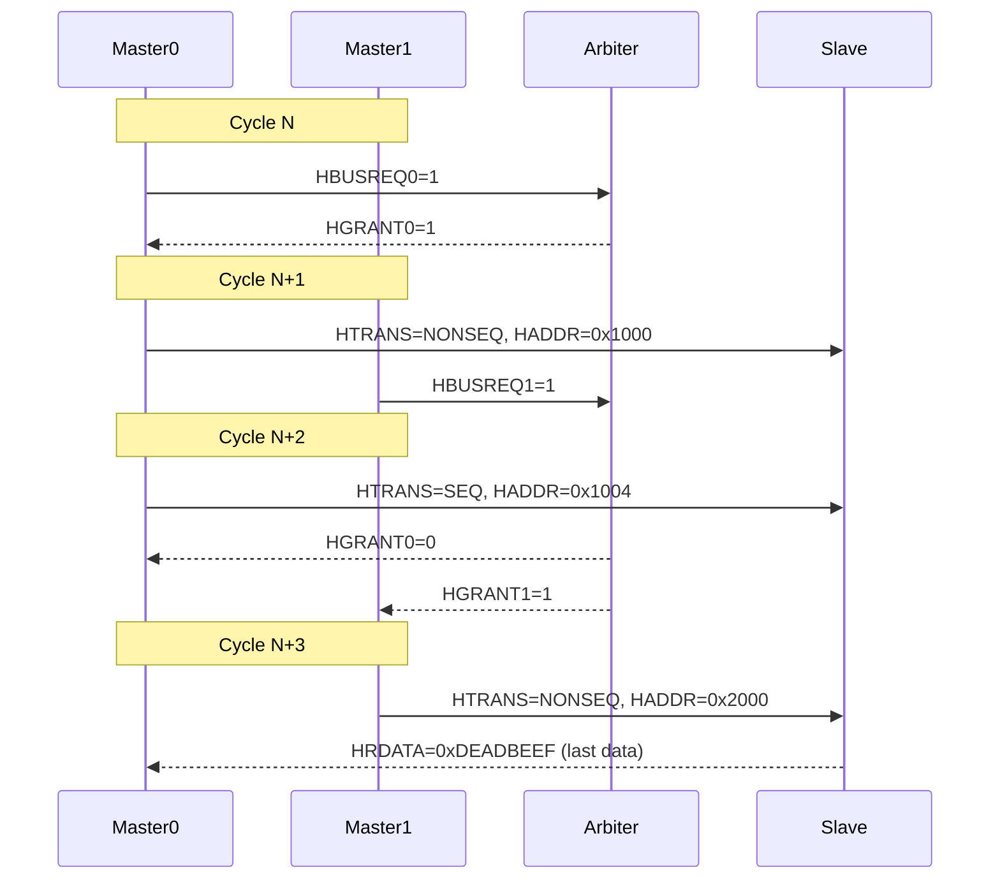
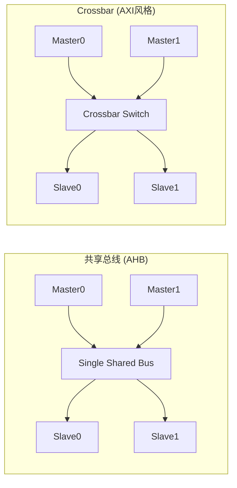
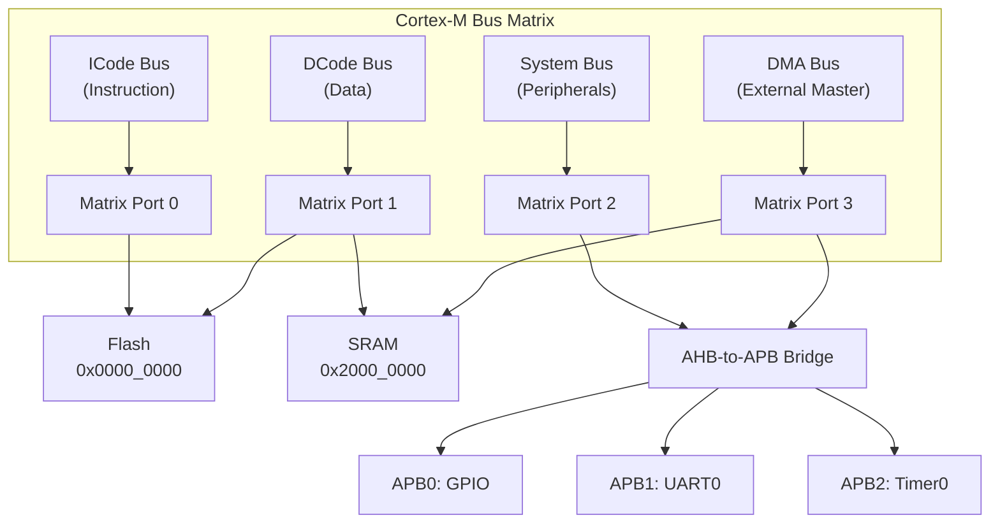

# AHB仲裁与多主控制

<span class="badge-i">[I]</span> <span class="badge-e">[E]</span>

---

### 仲裁信号：HBUSREQ/HGRANT/HMASTER

AHB 是多主共享总线，<span class="red">仲裁器（Arbiter）</span>决定当前谁占用总线。
<br>

| 信号 | 方向 | 作用 |
|------|------|------|
| HBUSREQ | Master→Arbiter | 请求总线 |
| HGRANT | Arbiter→Master | 授予总线 |
| HMASTER[3:0] | Arbiter→所有 | 标识当前授权的主机ID |
| HMASTLOCK | Master→Arbiter | 请求锁定总线（原子操作） |

#### 仲裁时序



<span class="blue">易错点：HGRANT生效后，Master不能立即使用总线——必须等当前传输的数据阶段完成。
</span>
<br>

---

### 固定优先级vs轮询仲裁

两种经典仲裁策略各有优劣：

| 维度 | 固定优先级 | 轮询仲裁 |
|------|------------|----------|
| 响应速度 | 高优先级立即响应 | 平均等待N/2个周期 |
| 公平性 | 低优先级可能饿死 | 所有Master均等 |
| 实现复杂度 | 简单（编码器） | 中等（循环计数器） |
| 适用场景 | CPU > DMA > 外设 | 同级Master（多DMA） |
| 可预测性 | 确定性 | 非确定性 |

类比：医院挂号——
<br>
固定优先级 = VIP通道（急诊永远优先，普通门诊可能排很久）；
<br>
轮询仲裁 = 叫号系统（按顺序叫，人人平等）。
<br>

#### 固定优先级实现

```verilog
// Fixed priority arbiter: M0 > M1 > M2 > M3
module fixed_priority_arbiter (
    input  wire [3:0] hbusreq,  // from 4 masters
    output reg  [3:0] hgrant
);
    always @(*) begin
        if (hbusreq[0])      hgrant = 4'b0001;  // M0 highest
        else if (hbusreq[1]) hgrant = 4'b0010;  // M1
        else if (hbusreq[2]) hgrant = 4'b0100;  // M2
        else if (hbusreq[3]) hgrant = 4'b1000;  // M3
        else                 hgrant = 4'b0000;  // No request
    end
endmodule
```

#### 轮询仲裁实现

```verilog
// Round-robin arbiter
module round_robin_arbiter (
    input  wire        hclk,
    input  wire        hreset_n,
    input  wire [3:0]  hbusreq,
    output reg  [3:0]  hgrant,
    input  wire        hready    // transfer complete signal
);
    reg [1:0] last_grant;
    reg [3:0] mask;

    always @(posedge hclk or negedge hreset_n) begin
        if (!hreset_n) begin
            last_grant <= 2'd0;
        end else if (hready && |hgrant) begin
            // Update last grant pointer after transfer completes
            case (hgrant)
                4'b0001: last_grant <= 2'd0;
                4'b0010: last_grant <= 2'd1;
                4'b0100: last_grant <= 2'd2;
                4'b1000: last_grant <= 2'd3;
            endcase
        end
    end

    always @(*) begin
        // Generate mask: rotate priority after last_grant
        case (last_grant)
            2'd0: mask = 4'b1110;  // M1/M2/M3
            2'd1: mask = 4'b1100;  // M2/M3
            2'd2: mask = 4'b1000;  // M3
            2'd3: mask = 4'b0000;  // none (wrap to M0)
        endcase
    end

    // Priority encode with wrap
    always @(*) begin
        if      (hbusreq[1] & mask[1]) hgrant = 4'b0010;
        else if (hbusreq[2] & mask[2]) hgrant = 4'b0100;
        else if (hbusreq[3] & mask[3]) hgrant = 4'b1000;
        else if (hbusreq[0])          hgrant = 4'b0001;
        else                           hgrant = 4'b0000;
    end
endmodule
```

---

### 总线矩阵：Crossbar vs 共享总线



| 特性 | 共享总线 (AHB) | Crossbar (AXI) |
|------|---------------|----------------|
| 并发能力 | 1 master at a time | 多对多并发 |
| 面积 | 小 | 大（O(N²)） |
| 功耗 | 低 | 高 |
| 延迟 | 需仲裁等待 | 直接路由，低延迟 |
| 复杂度 | 简单 | 复杂（路由+仲裁+CDC） |
| 适用 | MCU、低功耗SoC | 高性能手机/服务器SoC |

<span class="blue">关键认知：没有绝对优劣——低端MCU用AHB共享总线省面积，高端SoC用AXI Crossbar换带宽。</span>
<br>

---

### Cortex-M3/M4总线矩阵实例

ARM Cortex-M3/M4 的 Bus Matrix 是 AHB-Lite 的多主扩展：



| 总线 | 连接 | 仲裁优先级 |
|------|------|-----------|
| ICode | Flash只读 | 最高（指令不能等） |
| DCode | Flash/SRAM读写 | 次高（数据访问） |
| System | SRAM/APB/外设 | 中等 |
| DMA | SRAM/外设 | 可配置 |

<span class="blue">易错点：Cortex-M的Bus Matrix不是"完整AHB"，而是AHB-Lite的简化多主版本——没有SPLIT/RETRY，只有OKAY/ERROR。</span>
<br>

---

### 与AXI多主机制的对比

| 维度 | AHB多主 | AXI多主 |
|------|---------|---------|
| 仲裁位置 | 集中式Arbiter | 分布式（每通道独立） |
| 仲裁信号 | HBUSREQ/HGRANT | 无需（crossbar自动路由） |
| 并发 | 单master活跃 | 多master同时读写 |
| 切换开销 | 1-2 cycles | 无（通道独立） |
| 最大master数 | 通常≤16 | 通常≤64（取决于crossbar） |
| 典型应用 | Cortex-M、低成本SoC | Cortex-A、Zynq、服务器 |

<span class="red">核心差异</span>：
<br>
- AHB是"抢占式共享"——你用完我再用，有明确的总线切换。
<br>
- AXI是"并行分离"——读写通道各自独立，不需要"总线使用权"的概念。
<br>

---

**学习路径提示**：
<br>
- <span class="badge-i">[I]</span> 读者：理解仲裁是AHB的核心，固定优先级适合有明确重要性的系统，轮询适合同级竞争。
<br>
- <span class="badge-e">[E]</span> 读者：在SoC设计时，如果Master数≤4且速率不高，选AHB共享总线；如果Master数>8且要求并发，必须上AXI Crossbar。
<br>