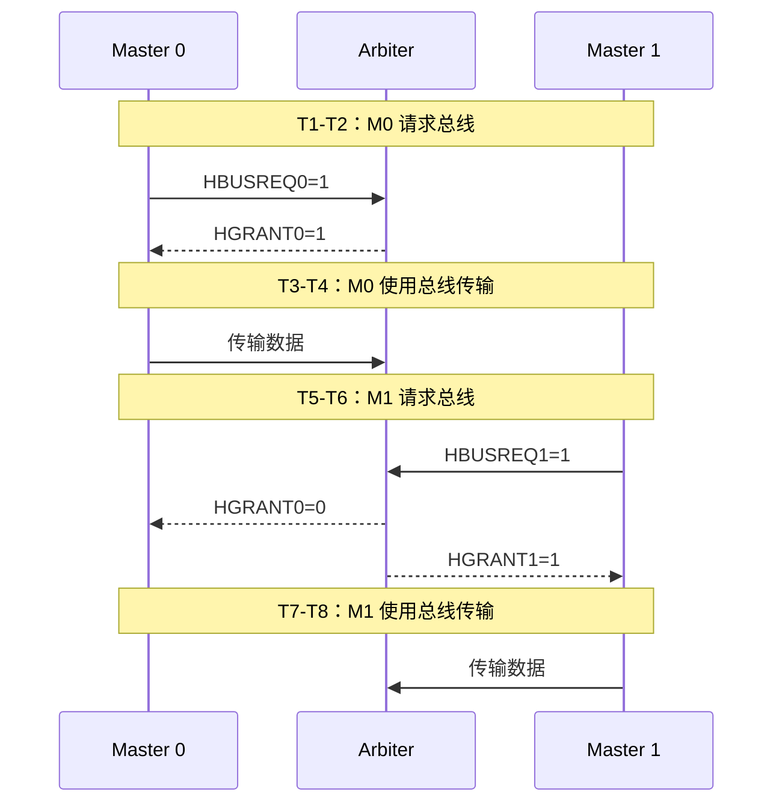
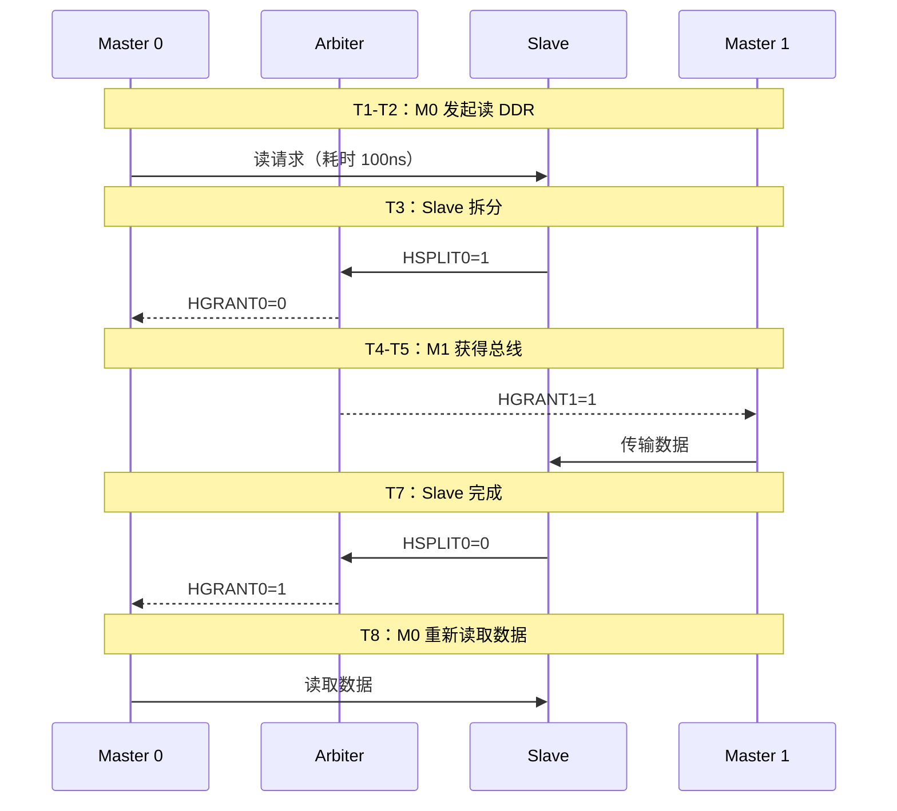

# AHB 仲裁与多主控制 [I]

> **本章学习目标**：
> - 理解 <span class="red">AHB 仲裁</span> 的请求-授权机制
> - 掌握 <span class="red">固定优先级 vs 轮询仲裁</span> 的优劣
> - 了解 AHB 总线 <span class="red">锁定与拆分传输</span>

---

<span class="blue">从何而来 → 为什么需要 → 哪里用：</span><br>
<span class="red">AHB 仲裁机制</span>诞生于 <span class="green">AMBA 2</span> 规范（1999 年）。<br>
早期 SoC 只有一个 CPU 核，总线只有单 Master。<br>
随着 <span class="green">DMA</span>、<span class="green">USB Host</span> 等模块也需要主动访问总线，<span class="blue">AHB-Full 引入 HBUSREQ/HGRANT 仲裁信号，让多个 Master 共享总线而不冲突。</span><br>
如今，仲裁设计不仅存在于 AHB，也存在于 <span class="green">AXI Interconnect</span>、<span class="green">Wishbone</span> 等多主总线中。<br>

---

## AHB 仲裁机制

---

### <strong>请求-授权：HBUSREQ 与 HGRANT</strong>

<span class="red">AHB-Full</span> 支持多主仲裁，核心信号只有 2 个：<br>

| 信号 | 方向 | 说明 |
| --- | --- | --- |
| HBUSREQx | Master→Arbiter | Master x 请求总线 |
| HGRANTx | Arbiter→Master | 授权 Master x 使用总线 |
| HMASTER | Arbiter→Slave | 指示当前哪个 Master 在传输 |
| HMASTLOCK | Arbiter→Slave | 当前传输是否锁定 |

<span class="blue">仲裁流程：Master 拉高 HBUSREQ → Arbiter 拉高 HGRANT → Master 在下一个周期获得总线。</span><br>



<span class="blue">Arbiter 在 T3 收到 M0 请求，T4 授权，M0 在 T5 开始传输；T7 M1 请求，T8 授权，M1 在 T9 开始传输。</span><br>

---

### <strong>固定优先级仲裁的实现</strong>

```verilog
// 固定优先级仲裁器（2 Master）
module ahb_arbiter (
  input         HCLK, HRESETn,
  input         HBUSREQ0, HBUSREQ1,
  output reg    HGRANT0, HGRANT1,
  output reg [1:0] HMASTER
);

  always @(posedge HCLK or negedge HRESETn) begin
    if (!HRESETn) begin
      HGRANT0 <= 1'b1;  // Master0 默认高优先级
      HGRANT1 <= 1'b0;
      HMASTER <= 2'b00;
    end else begin
      if (HBUSREQ0) begin
        HGRANT0 <= 1'b1;
        HGRANT1 <= 1'b0;
        HMASTER <= 2'b00;
      end else if (HBUSREQ1) begin
        HGRANT0 <= 1'b0;
        HGRANT1 <= 1'b1;
        HMASTER <= 2'b01;
      end
    end
  end
endmodule
```

<span class="blue">固定优先级实现简单，但低优先级 Master 可能长期得不到总线（饿死）。</span><br>

---

### <strong>轮询仲裁：公平但延迟不确定</strong>

```verilog
// 轮询仲裁器
always @(posedge HCLK) begin
  if (HBUSREQ0 && HBUSREQ1) begin
    // 两者同时请求，轮询切换
    HGRANT0 <= !last_grant0;
    HGRANT1 <= last_grant0;
    last_grant0 <= !last_grant0;
  end else if (HBUSREQ0) begin
    HGRANT0 <= 1'b1;
    HGRANT1 <= 1'b0;
  end else if (HBUSREQ1) begin
    HGRANT0 <= 1'b0;
    HGRANT1 <= 1'b1;
  end
end
```

| 仲裁策略 | 优点 | 缺点 | 适用 |
| --- | --- | --- | --- |
| 固定优先级 | 高优先级延迟确定 | 低优先级饿死 | CPU + DMA |
| 轮询 | 公平无饿死 | 所有 Master 延迟不确定 | 同级外设 |

<span class="blue">嵌入式 SoC 通常混合使用：CPU 固定最高优先级，外设轮询。</span><br>

---

## 锁定传输与拆分传输

---

### <strong>HMASTLOCK：原子操作的硬件保障</strong>

<span class="red">锁定传输</span>确保一组连续传输不被其他 Master 打断。<br>

```verilog
// 原子读-改-写操作
// T1: 读寄存器（锁定开始）
assign HMASTLOCK = (state == LOCKED_READ);
// T2-T3: 修改数据
// T4: 写回寄存器（锁定结束）
assign HMASTLOCK = (state != LOCKED_WRITE);
```

<span class="blue">锁定期间，Arbiter 不会授权其他 Master，直到 HMASTLOCK 变低。</span><br>

---

### <strong>拆分传输：Slave 释放总线</strong>

<span class="red">拆分传输（Split Transfer）</span>是 AHB-Full 的高级特性。<br>
当 Slave 需要长时间处理时，<br>
通过 <span class="green">HSPLITx</span> 信号通知 Arbiter 释放总线。<br>



<span class="blue">拆分传输让慢速 Slave 不阻塞总线，但实现复杂，AHB-Lite 不支持。</span><br>

---

## 本章小结

| 概念 | 一句话总结 |
| --- | --- |
| HBUSREQ | Master 请求总线 |
| HGRANT | Arbiter 授权总线 |
| 固定优先级 | 高优先级先服务，低优先级可能饿死 |
| 轮询 | 公平切换，但延迟不确定 |
| HMASTLOCK | 锁定传输，原子操作不被打断 |
| 拆分传输 | Slave 主动释放总线，处理完成后再授权 |

---

## 练习

1. 为什么 AHB-Lite 不支持多主仲裁？什么场景必须用 AHB-Full？<br>
2. 固定优先级仲裁中，如果 CPU（优先级 0）持续请求，DMA（优先级 1）何时能获得总线？<br>
3. 拆分传输与 HREADY 反压的区别是什么？各自适用什么场景？
