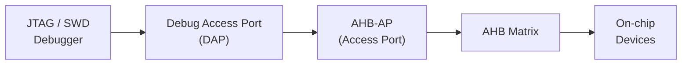
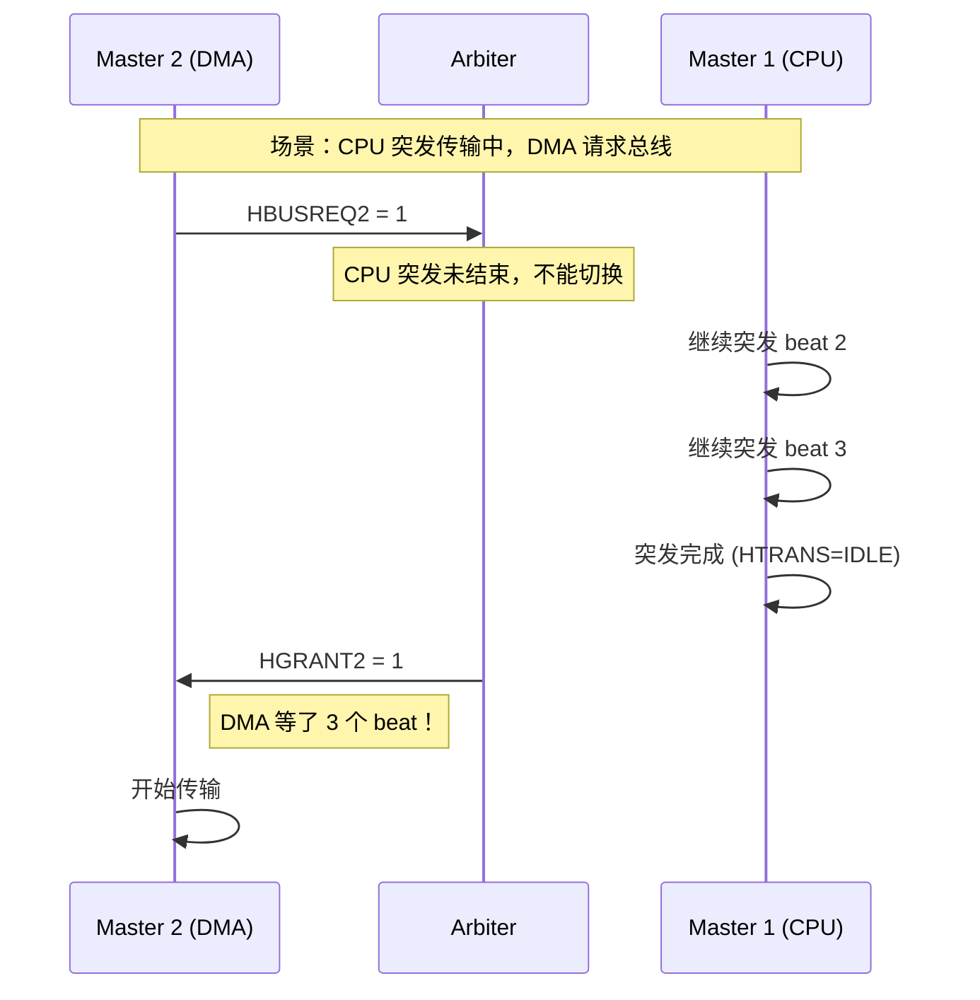

# AHB怎么调——调试与性能分析

<span class="badge-b">[B]</span> <span class="badge-i">[I]</span> <span class="badge-e">[E]</span> <span class="badge-m">[M]</span>

<span class="red">AHB 调试不只是"看波形"——从 CoreSight 调试端口到系统级性能分析，掌握这些工具才能在 SoC  bring-up 阶段快速定位总线瓶颈。</span>

---

## 核心定义与价值

### <strong>为什么 AHB 调试有其特殊性</strong>

AHB 总线问题通常表现为：

- 系统间歇性卡顿（Wait states 过多）
- DMA 传输失败（ERROR 响应）
- 内存访问异常对齐（HardFault）
- 功耗异常（总线空转）

<br>

<span class="blue">这些问题在传统单步调试中难以复现——因为总线时序依赖并发访问模式。需要专用硬件追踪工具。</span>

### <strong>类比：城市交通监控中心</strong>

想象城市交通指挥中心：

- 摄像头（Trace）记录每条道路的实时车流
- 红绿灯系统（Arbiter）决定哪个方向放行
- 数据大屏（Profiler）显示各路段拥堵指数
- 事故回放（Waveform）用于分析历史事件

<br>

<span class="blue">AHB 调试就是建立这样的"总线监控中心"——ARM CoreSight 提供了完整的工具链。</span>

---

## 核心机制原理解析

### <strong>1. ARM CoreSight AHB-AP 调试端口</strong>

<span class="red">AHB-AP（AHB Access Port）是 CoreSight 调试架构中连接调试器与 AHB 总线的桥梁。</span>

<br>



<br>

#### AHB-AP 寄存器映射（CSW 关键字段）

<span class="green">CSW（Control/Status Word）</span> 地址偏移 0x00，控制访问属性：

<br>

| 字段 | 位 | 含义 |
|------|-----|------|
| DbgStatus | [31] | 调试状态 |
| AddrInc | [5:4] | 地址自动递增模式 |
| Size | [2:0] | 访问大小（8/16/32-bit） |

<br>

```c
// 通过 AHB-AP 访问片上寄存器
// 使用 OpenOCD 命令
openocd -f interface/stlink.cfg -f target/stm32f4x.cfg

# 读取 AHB 地址 0x40021000（RCC 寄存器）
# AHB-AP 的 TAR（Transfer Address Register）设置目标地址
mww 0xE000_0020 0x40021000  # 写 TAR
mdw 0xE000_0024 1            # 读 DRW（Data Read/Write）
# 输出：0x40021000: 000000XX
```

<br>

### <strong>2. HPROT[3:0]：保护信号与 Cacheable/Bufferable</strong>

<span class="red">HPROT[3:0] 是 AHB 传输的保护属性字段，决定 Slave 如何处理本次访问。</span>

<br>

| HPROT bit | 名称 | 值=1 的含义 | 典型场景 |
|-----------|------|-------------|----------|
| [0] | <span class="green">HPROT[0]</span> | Data/Opcode | 1=数据访问，0=指令访问 |
| [1] | <span class="green">HPROT[1]</span> | User/Privileged | 1=特权模式，0=用户模式 |
| [2] | <span class="green">HPROT[2]</span> | Bufferable | 1=写可缓冲（无需等待完成） |
| [3] | <span class="green">HPROT[3]</span> | Cacheable | 1=可缓存（可存入 cache） |

<br>

#### Cacheable 与 Bufferable 的组合

| HPROT[3] | HPROT[2] | 行为 | 示例 |
|----------|----------|------|------|
| 0 | 0 | 非缓存非缓冲 | 设备寄存器访问 |
| 0 | 1 | 缓冲非缓存 | 写入 FIFO |
| 1 | 0 | 缓存非缓冲 | 强有序内存访问 |
| 1 | 1 | 缓存且缓冲 | 普通内存访问 |

<br>

<span class="blue">在 Cortex-M 中，HPROT 映射自 MPU 配置。错误的 HPROT 设置可能导致 cache 一致性问题——这是嵌入式调试中最隐蔽的 bug 之一。</span>

### <strong>3. AHB Tracer：总线传输抓取</strong>

AHB Tracer 是嵌入式在总线上插入的监控模块，记录所有传输信息。

<br>

```verilog
// 简化的 AHB Tracer 模块
module ahb_tracer (
    input  wire        HCLK,
    input  wire        HRESETn,
    // 监控的 AHB 信号
    input  wire [31:0] HADDR,
    input  wire [ 1:0] HTRANS,
    input  wire [ 2:0] HBURST,
    input  wire        HWRITE,
    input  wire        HREADY,
    input  wire        HRESP,
    // 追踪 FIFO 输出
    output reg  [71:0] trace_data,
    output reg         trace_valid,
    input  wire        trace_ready
);
    // 打包追踪数据：{timestamp[15:0], HRESP, HWRITE, HBURST[2:0], HTRANS[1:0], HADDR[31:0]}
    reg [15:0] timestamp;
    
    always @(posedge HCLK or negedge HRESETn) begin
        if (!HRESETn) begin
            timestamp <= 0;
            trace_valid <= 0;
        end else begin
            timestamp <= timestamp + 1;
            
            // 在 HREADY=1 的周期记录完成的传输
            if (HREADY && HTRANS != 2'b00) begin
                trace_data <= {timestamp, HRESP, HWRITE, HBURST, HTRANS, HADDR};
                trace_valid <= 1'b1;
            end else begin
                trace_valid <= 1'b0;
            end
        end
    end
endmodule
```

<br>

### <strong>4. 典型性能瓶颈分析</strong>

<span class="red">AHB 系统的性能瓶颈通常来自三类问题。</span>

<br>

#### 瓶颈 1：仲裁延迟



<br>

<span class="blue">解决方案：使用可中断突发（AHB 不支持，需升级到 AXI），或缩短突发长度。</span>

#### 瓶颈 2：Wait States 堆积

Slave 响应慢，HREADY 持续为 0：

```
Cycle:  1   2   3   4   5   6   7   8
HADDR:  A1  A2  A2  A2  A2  A3  A4  IDLE
HTRANS: N   S   S   S   S   S   S   I
HREADY: 1   0   0   0   0   1   1   1
HRDATA: -   -   -   -   -   D1  D2  D3
        ↑   ↑   ↑   ↑   ↑   ↑   ↑   ↑
        |   Slave 插入 4 个 wait states
        |   流水线完全停滞
```

<br>

<span class="blue">解决方案：增加 Slave 端 FIFO 深度、提高 Slave 时钟频率、或换用更快的外设。</span>

#### 瓶颈 3：窄突发（Narrow Bursts）

Master 使用小于总线宽度的 HSIZE 访问：

| HSIZE | 总线宽度 | 效率 | 浪费的周期 |
|-------|----------|------|------------|
| Byte | 32-bit | 25% | 75% |
| Halfword | 32-bit | 50% | 50% |
| Word | 32-bit | 100% | 0% |

<br>

<span class="blue">解决方案：软件层合并字节访问为字访问；硬件层支持 Sub-word 传输优化。</span>

---

## 技术教学与实战

### <strong>OpenOCD + CoreSight 调试 AHB 总线</strong>

```bash
# 1. 启动 OpenOCD
openocd -f interface/cmsis-dap.cfg -f target/stm32h7x.cfg

# 2. 连接 Telnet 接口
telnet localhost 4444

# 3. 扫描 AHB-AP 寄存器
> ahb_apcsw
# 输出：0x23000042  (Prot=User, Size=Word, AddrInc=Single)

# 4. 读取 AHB 矩阵的某个从设备
> ahb_ap_read 0x50000000 4
# 输出：
# 0x50000000: DEADBEEF
# 0x50000004: CAFE1234
# 0x50000008: 00000000
# 0x5000000C: 00000001

# 5. 追踪一段时间的总线访问（需要硬件 trace 支持）
> trace history
# 输出最近 256 个总线传输记录
```

<br>

### <strong>Linux ftrace + perf 分析总线行为</strong>

在运行 Linux 的 SoC 上（如 i.MX6）：

```bash
# 启用 ftrace 事件追踪
sudo mount -t debugfs none /sys/kernel/debug

echo 1 > /sys/kernel/debug/tracing/events/bus/enable

# 抓取 5 秒的 AHB 相关事件
echo 0 > /sys/kernel/debug/tracing/tracing_on
echo > /sys/kernel/debug/tracing/trace
echo 1 > /sys/kernel/debug/tracing/tracing_on
sleep 5
echo 0 > /sys/kernel/debug/tracing/tracing_on

cat /sys/kernel/debug/tracing/trace | head -50
# 输出示例：
#           <...>     0.001234: bus_master_request: master=0 addr=0x20000000
#           <...>     0.001235: bus_transfer_complete: master=0 latency=3
#           <...>     0.001240: bus_master_request: master=1 addr=0x40021000
#           <...>     0.001245: bus_transfer_complete: master=1 latency=1
```

<br>

### <strong>性能计数器读取</strong>

ARM PMU（Performance Monitor Unit）统计总线事件：

```c
// 启用 ARM PMU 计数总线访问
#include <asm/pmu.h>

// 配置计数器：统计总线周期
pmu_write_evt_sel(0, 0x19);  // Event 0x19 = Bus cycles
pmu_enable_counter(0);

// 运行测试代码
dma_transfer(...);

// 读取计数
uint32_t bus_cycles = pmu_read_counter(0);
printf("Bus cycles: %u\n", bus_cycles);
```

<br>

---

## 嵌入式专属实战场景

### <strong>HardFault 定位：AHB ERROR 响应溯源</strong>

Cortex-M 收到 AHB ERROR 后触发 HardFault：

```c
// HardFault 处理函数中读取总线错误地址
void HardFault_Handler(void) {
    uint32_t hfsr = SCB->HFSR;
    uint32_t cfsr = SCB->CFSR;
    
    if (cfsr & SCB_CFSR_BUSFAULTSR_Msk) {
        // 总线错误
        uint32_t fault_addr = SCB->BFAR;  // Bus Fault Address Register
        uint32_t fault_pc   = __get_PC();   // 出错的 PC
        
        printf("Bus Fault! Address: 0x%08X, PC: 0x%08X\n", fault_addr, fault_pc);
        printf("HPROT: %s, HSIZE: %s\n",
            (cfsr & 0x80) ? "Privileged" : "User",
            (cfsr & 0x100) ? "Undefined" : "Valid");
    }
}
```

<br>

<span class="blue">常见原因：访问未映射地址、访问禁用外设、在 User 模式下访问 Privileged 区域、地址不对齐。</span>

### <strong>AHB 功耗优化：空闲检测</strong>

```verilog
// AHB 总线空闲检测 + 时钟门控
module ahb_idle_detector (
    input  wire        HCLK,
    input  wire        HRESETn,
    input  wire [3:0]  HTRANS,      // 所有 Master 的 HTRANS
    input  wire        HREADY,
    output reg         clk_en       // 时钟使能
);
    reg [3:0] idle_cnt;
    
    always @(posedge HCLK or negedge HRESETn) begin
        if (!HRESETn) begin
            idle_cnt <= 0;
            clk_en   <= 1'b1;
        end else begin
            // 检测所有 HTRANS 是否都为 IDLE
            if (HTRANS == 4'b0000 && HREADY) begin
                if (idle_cnt < 15)
                    idle_cnt <= idle_cnt + 1;
            end else begin
                idle_cnt <= 0;
            end
            
            // 连续 16 周期空闲后关时钟
            clk_en <= (idle_cnt < 15);
        end
    end
endmodule
```

<br>

---

## 历史演进与前沿

### <strong>调试工具演进</strong>

<br>

| 年代 | 工具 | 能力 | 限制 |
|------|------|------|------|
| 2000 | JTAG + 示波器 | 单点读取 | 无法追踪流式传输 |
| 2005 | ETM（Embedded Trace Macrocell） | 指令追踪 | 仅指令，无总线详情 |
| 2010 | CoreSight AHB-AP + TPIU | 总线事件追踪 | 需要专用 trace 引脚 |
| 2015 | ARM DS-5 + Streamline | 可视化性能分析 | 依赖 ARM 工具链 |
| 2020 | QEMU + SystemC 联合仿真 | 全系统虚拟追踪 | 非实时 |

<br>

### <strong>前沿：片上逻辑分析仪（ILA）+ AHB</strong>

FPGA 原型阶段，使用 Xilinx ILA 或 Altera SignalTap 抓取 AHB 信号：

```tcl
# Xilinx ILA 配置 TCL
set ila_inst [create_ip -name ila -vendor xilinx.com -library ip -version 6.2]
set_property -dict {
    CONFIG.C_PROBE0_WIDTH {32}    ;# HADDR
    CONFIG.C_PROBE1_WIDTH {3}     ;# HTRANS + HREADY
    CONFIG.C_PROBE2_WIDTH {32}    ;# HRDATA
    CONFIG.C_PROBE3_WIDTH {32}    ;# HWDATA
    CONFIG.C_DATA_DEPTH {1024}    ;# 采样深度
} $ila_inst

# 触发条件：HTRANS=NONSEQ 且 HRESP=ERROR
set_property CONFIG.C_TRIGIN_EN {true} $ila_inst
```

<br>

<span class="blue">FPGA ILA 可以捕捉芯片运行时的真实 AHB 时序，是 ASIC  tape-out 前最重要的验证手段。</span>

---

## 本章小结

<br>

| 知识点 | 核心结论 |
|--------|----------|
| AHB-AP | CoreSight 调试端口，通过 JTAG/SWD 访问 AHB |
| HPROT | 4-bit 保护信号，控制 Cacheable/Bufferable |
| AHB Tracer | 硬件模块，记录所有传输的地址/类型/响应 |
| 瓶颈 1 | 仲裁延迟 → 缩短突发或升级 AXI |
| 瓶颈 2 | Wait states → 优化 Slave 响应速度 |
| 瓶颈 3 | 窄突发 → 软件合并访问或硬件扩展 |
| HardFault | AHB ERROR 映射为 BusFault，BFAR 记录地址 |

---

## 练习

1. <span class="purple">设计一个 AHB Tracer 模块，要求能区分读/写传输，并统计各 Master 的带宽占比。</span>

2. 使用 OpenOCD 读取 STM32 的 AHB 外设寄存器，写出完整命令序列。

3. <span class="purple">分析：为什么 HPROT 的 Cacheable 位设置错误会导致 cache 一致性问题？</span>

4. 假设某 AHB 系统 HCLK=72MHz，实测平均每传输 3 个 wait states，计算有效带宽利用率。

5. <span class="purple">对比 ETM 和 AHB Tracer 的追踪能力差异，列出各自适用场景。</span>
