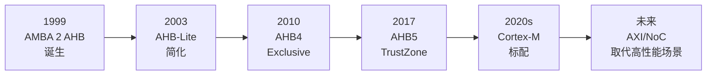
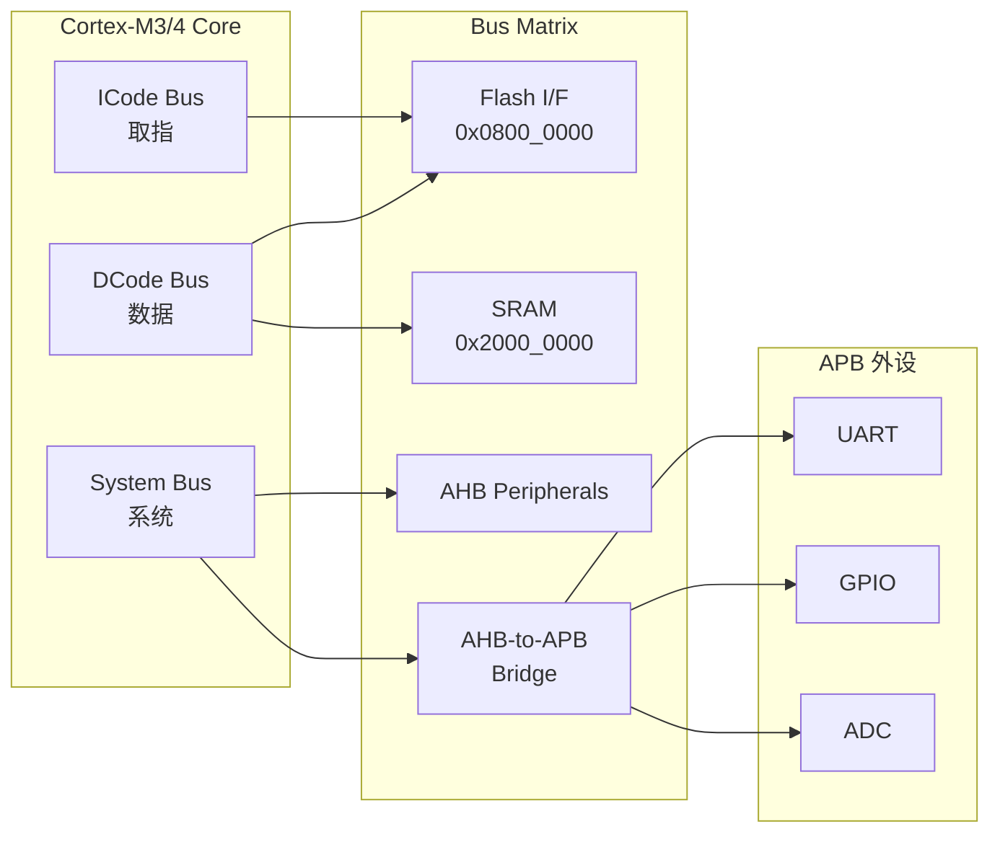
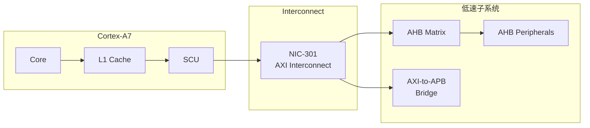
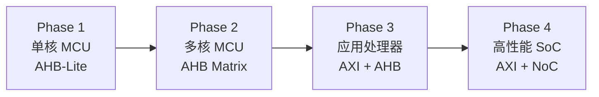
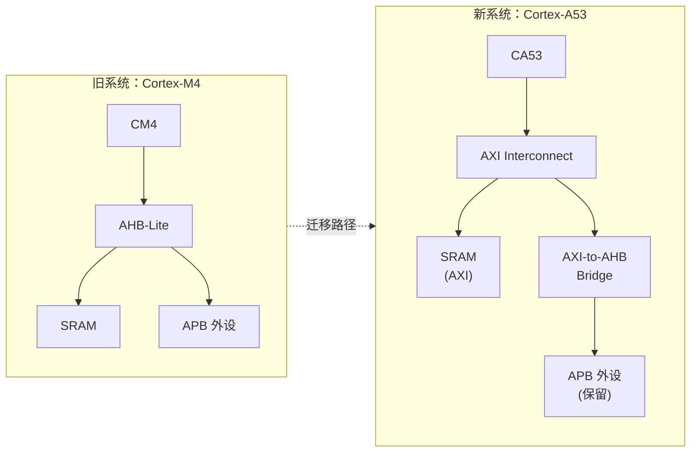
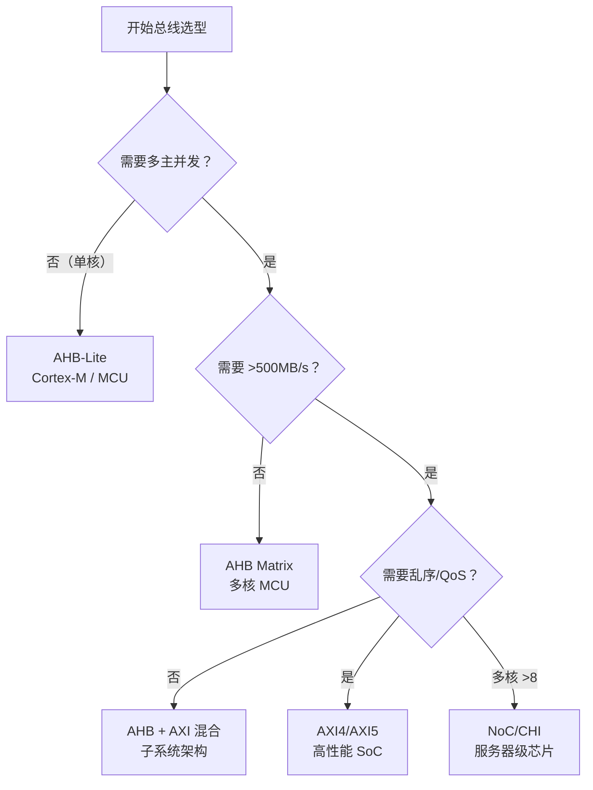

# AHB往哪去——实战应用与历史演进

<span class="badge-b">[B]</span> <span class="badge-i">[I]</span> <span class="badge-e">[E]</span> <span class="badge-m">[M]</span>

<span class="red">AHB 不是过时的协议——在 Cortex-M 生态、FPGA IP 核和特定 FPGA 场景中，它仍然是最务实的选择。理解 AHB 的"归宿"，就是理解嵌入式总线选型的底层逻辑。</span>

---

## 核心定义与价值

### <strong>AHB 的生命周期曲线</strong>

从 1999 年的 AMBA 2 到 2025 年的今天，AHB 经历了完整的生命周期：

<br>



<br>

<span class="blue">AHB 的"主战场"从未离开过 MCU 和中速 SoC。在高性能领域，AXI 和 NoC 是更优解——这不是淘汰，而是分工。</span>

---

## 核心机制原理解析

### <strong>1. Cortex-M3/M4 中的 AHB-Lite 总线架构</strong>

<span class="red">Cortex-M3/M4 采用三路 AHB-Lite 总线，构成 Harvard 架构的变体。</span>

<br>



<br>

#### 三路总线的时序特征

| 总线 | 用途 | 可访问区域 | AHB 类型 | 关键性能 |
|------|------|-----------|----------|----------|
| ICode | 指令取指 | Code 区域（Flash/SRAM） | AHB-Lite | 最高优先级取指 |
| DCode | 数据访问 | Code + SRAM | AHB-Lite | 调试时共享访问 |
| System | 外设/系统 | 所有区域 | AHB-Lite | 包含 NVIC、SysTick |

<br>

<span class="blue">ICode 和 DCode 分离的设计允许取指和数据访问并行——这是 AHB-Lite 单主架构通过多总线实现并行的经典案例。Flash 接口同时挂在 ICode 和 DCode 上，由 Bus Matrix 内部仲裁。</span>

### <strong>2. AHB 在 Cortex-A 中的角色：逐渐被 AXI 取代</strong>

在 Cortex-A 系列中，AHB 逐渐退居二线：

<br>



<br>

| 层级 | 总线 | 作用 |
|------|------|------|
| 核心层 | AXI/CHI | CPU ↔ L2/L3 Cache |
| 系统层 | AXI Interconnect | 多主多从全局互联 |
| 子系统层 | AHB | 低速外设簇（GPIO、Timer、WDT） |
| 寄存器层 | APB | 配置寄存器接口 |

<br>

<span class="blue">Cortex-A7 及以后的处理器，AHB 仅用于低速外设子系统——主数据通路完全由 AXI 承载。这是性能与面积的权衡。</span>

### <strong>3. AHB5 新特性深度解析</strong>

<span class="red">AHB5（AMBA 5，2017）是 AHB 协议的最新版本，引入了 TrustZone 安全和扩展内存类型。</span>

<br>

| 新特性 | 信号/机制 | 作用 |
|--------|-----------|------|
| TrustZone | HNONSEC | 区分 Secure/Non-secure 传输 |
| Exclusive | HEXCL / HMASTER | 支持原子操作（LDREX/STREX） |
| 扩展内存 | HMEMTYPE | 定义设备/普通/强有序内存 |
| 多拷贝原子 | 无新增信号 | 保证所有 observer 看到相同顺序 |

<br>

#### TrustZone 扩展：HNONSEC

```verilog
// AHB5 TrustZone 信号示例
module ahb5_trustzone_decoder (
    input  wire        HNONSEC,     // 0=Secure, 1=Non-secure
    input  wire [31:0] HADDR,
    input  wire        HSEL,
    output reg         secure_access,
    output reg         error_resp
);
    // Secure 区域：0x3000_0000 - 0x300F_FFFF
    wire in_secure_region = (HADDR >= 32'h3000_0000) && (HADDR <= 32'h300F_FFFF);
    
    always @(*) begin
        if (HSEL) begin
            if (in_secure_region && HNONSEC) begin
                // Non-secure 访问 Secure 区域 → ERROR
                secure_access = 1'b0;
                error_resp    = 1'b1;
            end else begin
                secure_access = ~HNONSEC;
                error_resp    = 1'b0;
            end
        end else begin
            secure_access = 1'b0;
            error_resp    = 1'b0;
        end
    end
endmodule
```

<br>

<span class="blue">在 Cortex-M23/M33 中，AHB5 的 TrustZone 扩展是安全启动和隔离运行的基础。HNONSEC 信号从 CPU 的 SAU（Security Attribution Unit）输出，贯穿整个总线系统。</span>

### <strong>4. AHB→AXI 迁移路径</strong>

当系统从 MCU 升级为应用处理器时，总线协议需要升级：

<br>



<br>

#### 迁移的关键决策点

| 指标 | 继续用 AHB | 升级到 AXI |
|------|-----------|-----------|
| Master 数 | ≤ 2 | ≥ 3 |
| 峰值带宽 | < 500 MB/s | > 1 GB/s |
| 乱序需求 | 无 | 有（多 outstanding） |
| QoS 需求 | 无 | 有（实时性要求） |
| 设计资源 | 紧张（小团队） | 充足 |
| 面积敏感度 | 极高 | 可接受 |

<br>

<span class="blue">迁移不是"全盘替换"——通常是 AXI 承载高速通路，AHB 保留在低速子系统中。ARM 的 AXI-to-AHB Bridge 使得这种混合架构无缝工作。</span>

---

## 技术教学与实战

### <strong>FPGA 中 AHB IP 核实现：ARM CMSDK</strong>

ARM Cortex-M System Design Kit（CMSDK）提供了完整的 AHB IP 核集合：

<br>

```verilog
// CMSDK AHB GPIO 模块（简化）
module cmsdk_ahb_gpio (
    input  wire        HCLK,
    input  wire        HRESETn,
    input  wire        HSEL,
    input  wire [31:0] HADDR,
    input  wire [ 1:0] HTRANS,
    input  wire        HWRITE,
    input  wire [ 2:0] HSIZE,
    input  wire [31:0] HWDATA,
    output reg  [31:0] HRDATA,
    output wire        HREADYOUT,
    input  wire        HREADY,
    output wire        HRESP,
    // GPIO 引脚
    input  wire [15:0] PORTIN,
    output wire [15:0] PORTOUT,
    output wire [15:0] PORTEN
);
    // 寄存器映射（APB 风格寄存器，AHB 接口）
    reg [15:0] data_reg;    // 0x00: Data
    reg [15:0] dir_reg;     // 0x04: Direction
    
    wire [7:0] reg_addr = HADDR[7:0];
    wire trans_valid = HSEL && HTRANS[1] && HREADY;
    
    // AHB Slave 响应逻辑
    assign HREADYOUT = 1'b1;  // 无 wait states
    assign HRESP = 1'b0;       // 永远 OKAY
    
    always @(posedge HCLK or negedge HRESETn) begin
        if (!HRESETn) begin
            data_reg <= 16'h0000;
            dir_reg  <= 16'h0000;
        end else if (trans_valid && HWRITE) begin
            case (reg_addr)
                8'h00: data_reg <= HWDATA[15:0];
                8'h04: dir_reg  <= HWDATA[15:0];
            endcase
        end
    end
    
    always @(*) begin
        case (reg_addr)
            8'h00: HRDATA = {16'h0, data_reg};
            8'h04: HRDATA = {16'h0, dir_reg};
            default: HRDATA = 32'h0;
        endcase
    end
    
    assign PORTOUT = data_reg;
    assign PORTEN  = dir_reg;
endmodule
```

<br>

### <strong>工具：Vivado AHB IP 集成</strong>

在 Xilinx Vivado 中使用 AHB IP：

```tcl
# Vivado TCL 脚本：添加 AHB GPIO IP
set proj_name "ahb_fpga_demo"
create_project $proj_name ./$proj_name -part xc7z020clg400-1

# 添加 CMSDK AHB GPIO（自定义 IP）
set_property ip_repo_paths ./cmsdk_ip [current_project]
update_ip_catalog

create_bd_design "ahb_system"

# 添加 Zynq PS（AXI 接口）
create_bd_cell -type ip -vlnv xilinx.com:ip:processing_system7:5.5 ps7

# 添加 AXI-to-AHB Bridge
create_bd_cell -type ip -vlnv arm.com:ip:axi_ahb_bridge:1.0 axi_ahb_bridge

# 添加 AHB GPIO
create_bd_cell -type ip -vlnv arm.com:ip:cmsdk_ahb_gpio:1.0 ahb_gpio

# 连接：PS → AXI → Bridge → AHB → GPIO
connect_bd_intf_net [get_bd_intf_pins ps7/M_AXI_GP0] \
                    [get_bd_intf_pins axi_ahb_bridge/S_AXI]
connect_bd_intf_net [get_bd_intf_pins axi_ahb_bridge/M_AHB] \
                    [get_bd_intf_pins ahb_gpio/AHB]

validate_bd_design
save_bd_design
```

<br>

---

## 嵌入式专属实战场景

### <strong>场景：从 AHB 子系统升级到 AXI</strong>

某项目从 Cortex-M4（AHB-Lite）升级到 Cortex-A53（AXI），总线迁移策略：

<br>



<br>

| 组件 | 迁移策略 | 工作量 |
|------|----------|--------|
| SRAM 控制器 | AHB → AXI 接口升级 | 2 周 |
| APB 外设 | 保留，通过 Bridge 连接 | 1 周 |
| GPIO/UART | 无需改动 | 0 |
| DMA 引擎 | 重写为 AXI DMA | 4 周 |
| 驱动代码 | 更换基地址 + 同步机制 | 2 周 |

<br>

<span class="blue">迁移的关键是"渐进式"——保留 APB 低速外设，只升级数据通路。AXI-to-AHB Bridge 使得这种策略可行。</span>

### <strong>AHB 在 RISC-V 生态中的位置</strong>

RISC-V 处理器常用的总线选择：

<br>

| 处理器 | 总线 | 说明 |
|--------|------|------|
| PicoRV32 | AHB-Lite / Wishbone | 极简实现 |
| SiFive E31 | TileLink | SiFive 原生 |
|蜂鸟 E203| AHB-Lite | 国产 MCU |
| 平头哥 C906 | AXI4 | 应用处理器 |

<br>

<span class="blue">在 RISC-V MCU 领域，AHB-Lite 因其简洁性和 ARM 生态的成熟 IP，仍然是热门选择。TileLink 在 RISC-V 高性能场景中更有优势。</span>

---

## 历史演进与前沿

### <strong>AHB 与 AXI 的选型决策树</strong>

<br>



<br>

### <strong>前沿：AHB 与 Chiplet 互联</strong>

在 Chiplet 架构中，die 间互联通常采用：

- UCIe（Universal Chiplet Interconnect Express）——高速 die 间接口
- AXI/CHI 作为 die 内总线
- <span class="blue">AHB 保留在 IO die 的低速外设子系统中</span>

<br>

| 层级 | 协议 | 带宽 | 用途 |
|------|------|------|------|
| Die 间 | UCIe | 10-100 GB/s | 内存/加速器互联 |
| Die 内（高速）| AXI5/CHI | 1-10 GB/s | CPU/GPU/NPU |
| Die 内（低速）| AHB5 | 100-500 MB/s | GPIO/UART/SPI |
| 寄存器 | APB4 | 10-50 MB/s | 配置接口 |

<br>

<span class="blue">AHB 在 Chiplet 时代的角色没有本质变化——它仍然是"够用就好"的低速总线，只是物理位置从单片 SoC 变成了 IO Die。</span>

---

## 本章小结

<br>

| 知识点 | 核心结论 |
|--------|----------|
| Cortex-M | 三路 AHB-Lite（ICode/DCode/System），Harvard 变体 |
| Cortex-A | AHB 退居低速子系统，主通路由 AXI 承载 |
| AHB5 | TrustZone（HNONSEC）、Exclusive 访问、扩展内存类型 |
| 迁移路径 | AHB-Lite → AHB Matrix → AXI + AHB → AXI + NoC |
| FPGA | CMSDK 提供完整 AHB IP，Vivado 支持 AXI-to-AHB Bridge |
| RISC-V | AHB-Lite 在 MCU 中仍有竞争力 |
| Chiplet | AHB 保留在 IO Die 的低速子系统中 |

---

## 练习

1. <span class="purple">对比 Cortex-M4 和 Cortex-A7 的总线架构，列出至少 3 个 AHB 使用方式的差异。</span>

2. 设计一个 AHB5 TrustZone 访问控制模块，要求支持 Secure/Non-secure 区域划分和非法访问检测。

3. <span class="purple">在 Vivado 中集成 CMSDK AHB GPIO IP，写出完整的 TCL 连接脚本（含 AXI-to-AHB Bridge）。</span>

4. 某系统从 AHB-Lite 升级到 AXI4，需要保留 5 个 APB 外设。估算最少需要多少额外逻辑资源（LUT/FF）？

5. <span class="purple">RISC-V 处理器选择 AHB 而非 TileLink 的 3 个理由是什么？</span>
