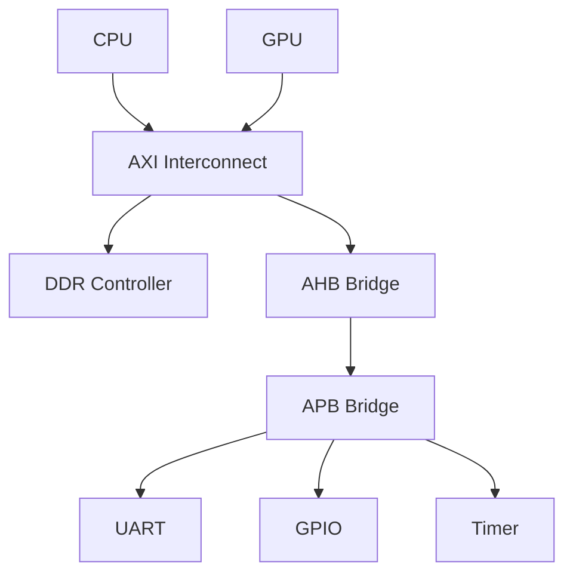

# AMBA总线协议族概述

[B] [I]

---

### 为什么需要片上总线

手机SoC里有CPU、GPU、NPU、ISP...  
这些模块要交换数据，总不能每两个之间都拉专线。 
片上总线（On-Chip Bus）就是SoC内部的"高速公路系统"， 
让所有IP核通过统一接口互联。 

类比：城市快速路—— 
没有快速路时，A区到B区要穿小巷（点对点连线）； 
有了快速路，所有区域统一上下匝道（总线主从接口）。 

---

### AMBA协议族分层

| 协议 | 定位 | 速率 | 典型场景 |
|------|------|------|----------|
| AXI | 高性能互连 | 数百MHz | CPU-DDR、GPU |
| AHB | 中速共享 | ~100MHz | DMA、LCD控制器 |
| APB | 低速外设 | ~33MHz | UART、GPIO、Timer |
| ACE | 缓存一致性扩展 | 同AXI | 多核CPU互联 |
| CHI | 一致性Hub接口 | ~500MHz+ | 高端服务器SoC |

关键认知：AXI是主干道，AHB是次干道，APB是支路。 

---

### SoC中的总线拓扑

AXI Interconnect（互连）负责高性能数据通路， 
AHB Bridge（桥接器）做速率降档和协议转换， 
APB Bridge 进一步把时钟降到外设能接受的频率。 

---

### AMBA与TileLink/CHI/Wishbone的对比

| 维度 | AMBA | TileLink | CHI | Wishbone |
|------|------|----------|-----|----------|
| 提出方 | ARM | SiFive | ARM | OpenCores |
| 开源 | 否 | 是 | 否 | 是 |
| 一致性 | ACE/CHI | TL-C | 原生 | 无 |
| 生态 | 商用SoC主流 | RISC-V专属 | 高端服务器 | FPGA/教育 |
| 复杂度 | 高 | 中 | 很高 | 低 |

扩展：TileLink 是 RISC-V 世界的"AMBA替代"， 
CHI 是 ARM 面向服务器的高端演进， 
Wishbone 则是教学/FPGA 中最轻量的选择。 

---

### 版本演进简史

| 版本 | 年份 | 核心变化 |
|------|------|----------|
| AMBA 1 | 1996 | AHB + APB 诞生 |
| AMBA 2 | 1999 | AHB-Lite、APB2 |
| AMBA 3 | 2003 | AXI3 引入，多通道分离 |
| AMBA 4 | 2010 | AXI4/AXI4-Lite、ACE |
| AMBA 5 | 2015+ | CHI、AXI5、扩展安全 |

易错点：AXI4 和 AXI4-Lite 不是同一个东西。 
AXI4-Lite 砍掉了突发传输和 ID 路由，只保留单拍读写， 
用于寄存器映射外设，类似"精简版快递——只送单件"。 

---

### 学习路径提示

[B] 读者：理解片上总线就是SoC的"道路系统"，AMBA是ARM体系的主流标准。 
[I] 读者：关注三种协议的分层逻辑和选型依据，记住何时用AXI何时用APB。 
