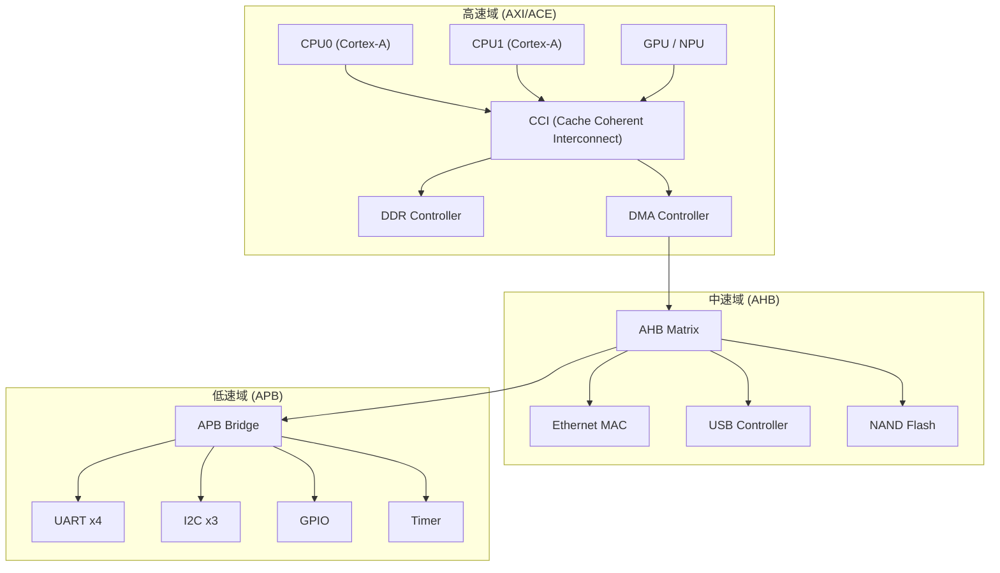
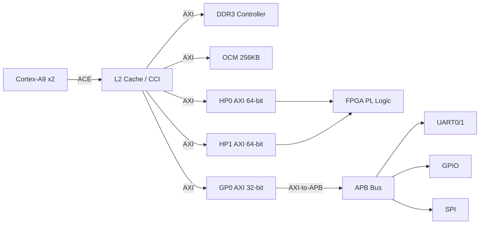
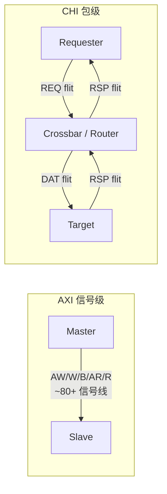

# AMBA是什么——ARM片上总线生态 Overview

<span class="badge-b">[B]</span> <span class="badge-i">[I]</span> <span class="badge-e">[E]</span> <span class="badge-m">[M]</span>

<span class="red">AMBA（Advanced Microcontroller Bus Architecture）</span> 是 ARM 于 <span class="green">1996 年</span> 推出的片上总线标准。<br>
它定义了 SoC 内部各 IP 核之间的连接方式，使不同厂商的 CPU、DMA、存储控制器、外设能够<br>
通过统一接口互连。截至 2024 年，AMBA 已迭代至第 5 代，覆盖从 MCU 到服务器级 SoC 的全场景。<br>

---

## 核心定义与价值

<span class="red">AMBA 的核心价值</span>在于将 SoC 内部的 "私有连线" 变为 "公共交通系统"。<br>
在 AMBA 出现前，每颗 SoC 的总线都是定制实现。IP 供应商需要为每个客户重新适配接口，<br>
导致一次 SoC 设计平均耗时 <span class="blue">18 个月</span>，其中总线集成占 <span class="blue">40% 以上</span> 的验证工作量。<br>

AMBA 标准化后，IP 核遵循统一信号定义与时序规则，实现 "即插即用"。<br>
ARM Cortex-A 系列、RISC-V 高性能核心、Xilinx Zynq、NVIDIA Orin 等芯片<br>
均采用 AMBA 或其兼容总线作为内部互联 backbone。<br>

### 城市快速路网类比

<span class="blue">把 AMBA 家族想象成一座城市的道路分级系统：</span>

- <span class="green">AXI</span> = 城市快速路（多车道、无红绿灯、支持并行）<br>
  连接 CPU、GPU、DDR 控制器等高带宽模块，最高支持 256-bit 数据宽度。<br>

- <span class="green">AHB</span> = 城市主干道（单车道、有红绿灯仲裁）<br>
  连接 DMA、以太网 MAC 等中等带宽模块，支持多主设备分时复用。<br>

- <span class="green">APB</span> = 社区支路（单行线、低速、无仲裁）<br>
  连接 UART、I2C、GPIO 寄存器等低速外设，时序简单，面积开销极小。<br>

- <span class="green">Bridge</span> = 立交桥与匝道<br>
  负责在不同等级道路之间转换协议与时钟域，如 AXI-to-AHB Bridge。<br>

---

## 核心机制原理解析

### <strong>1. AMBA 家族成员：定位与数据宽度</strong>

| 协议 | 诞生年份 | 典型数据宽度 | 主设备数 | 核心特征 | 典型应用场景 |
|------|---------|-----------|---------|---------|------------|
| APB | 1996 (AMBA 2) | 32-bit | 1 个 | 无仲裁、无流水线 | UART、Timer、GPIO |
| AHB | 1999 (AMBA 2) | 32/64-bit | 最多 16 个 | 单通道仲裁、支持突发 | DMA、以太网 MAC |
| AXI3 | 2003 (AMBA 3) | 32/64/128-bit | 多主 | 5 通道分离、乱序完成 | Cortex-A9、DDR 控制器 |
| AXI4 | 2010 (AMBA 4) | 最高 1024-bit | 多主 | QoS 信号、长突发 | Cortex-A15、AI 加速器 |
| ACE | 2011 (AMBA 4) | 同 AXI4 | 多主 | 3 个一致性通道 | big.LITTLE、多核缓存 |
| CHI | 2015 (AMBA 5) | 最高 1024-bit | 多主 | 包化传输、无地址通道 | Cortex-A76、服务器 SoC |

<br>

<span class="blue">关键演进规律：每代 AMBA 升级都围绕 "带宽↑、延迟↓、一致性↑" 三个维度展开。</span><br>
AMBA 3 解决 AHB 的读写串行瓶颈；AMBA 4 引入 QoS 与长突发优化吞吐量；<br>
AMBA 5 的 CHI 将总线彻底包化，为百亿晶体管级 SoC 提供可扩展互联。<br>

### <strong>2. ARM SoC 内部总线拓扑</strong>

典型的 ARM SoC 采用 <span class="green">"核心总线 + 外设总线"</span> 分层架构：<br>



<span class="blue">拓扑设计原则：将流量大的模块放在同一高速总线段，减少跨桥开销。</span><br>
CPU↔DDR 走 CCI（ACE），避免经过 AHB/APB 导致延迟剧增。<br>
APB 外设共享一条窄总线，因为它们的访问频率极低，带宽浪费可忽略。<br>

### <strong>3. Bridge 的协议转换与时钟域跨越</strong>

Bridge 是 AMBA 生态中最容易被低估的组件。它承担两类工作：<br>

<span class="green">协议转换</span>：将 AXI 的 5 通道分离读写映射为 AHB 的单通道分时复用。<br>
例如 AXI-to-AHB Bridge 需要缓冲写地址直到数据到达，再合并为 AHB 的流水线传输。<br>

<span class="green">时钟域跨越（CDC）</span>：当 APB 外设运行在 50 MHz，而 AXI 域运行在 1 GHz 时，<br>
Bridge 内部的异步 FIFO 负责安全地传递 VALID/READY 握手信号。<br>

---

## 嵌入式专属实战场景

### <strong>Zynq-7000 的 AMBA 总线实例</strong>

Xilinx Zynq-7000 是 ARM + FPGA 的典范 SoC，其内部总线完全基于 AMBA：<br>

- <span class="green">PS 端</span>：双核 Cortex-A9 通过 <span class="green">AXI3</span> 连接 DDR3 控制器与 OCM（片上存储）。<br>
- <span class="green">PS-PL 接口</span>：提供 <span class="green">HP（High-Performance）AXI</span> 端口，<br>
  数据宽度 64-bit，频率可达 150 MHz，供 FPGA 逻辑直接访问 PS DDR。<br>
- <span class="green">APB 外设</span>：UART、SPI、CAN、GPIO 全部挂在 APB 总线上，<br>
  通过 AXI-to-APB Bridge 与 PS AXI 互联矩阵相连。<br>



<br>

<span class="blue">实战要点：HP 端口用于 FPGA 加速引擎与 PS DDR 的高带宽数据搬运；</span><br>
GP 端口用于寄存器级控制与配置，带宽要求低但延迟敏感。<br>

---

## 技术教学与实战

### <strong>Linux 下查看 AXI 相关设备树节点</strong>

AMBA 总线在 Linux 设备树中以 <span class="green">"amba"</span> 兼容节点声明。<br>
以下片段来自 Zynq 的设备树源码（arch/arm/boot/dts/zynq-7000.dtsi）：<br>

```c
/* AXI Interconnect 节点 */
axi_interconnect_0: axi-interconnect@0 {
    compatible = "xlnx,axi-interconnect-2.1";
    #address-cells = <1>;
    #size-cells = <1>;
    ranges;  /* 1:1 映射 */

    /* UART 挂在 APB 上，通过 AXI-to-APB Bridge 访问 */
    uart0: serial@e0000000 {
        compatible = "xlnx,xuartps", "cdns,uart-r1p8";
        reg = <0xe0000000 0x1000>;
        interrupts = <0 27 4>;
        clock-names = "uart_clk", "pclk";
        clocks = <&clkc 23>, <&clkc 42>;
    };

    /* DMA 控制器挂在 AXI 上 */
    dmac_s: dma@f8003000 {
        compatible = "arm,pl330", "arm,primecell";
        reg = <0xf8003000 0x1000>;
        interrupts = <0 13 4>, <0 14 4>, <0 15 4>;
        #dma-cells = <1>;
        clocks = <&clkc 27>;
        clock-names = "apb_pclk";
    };
};
```

<span class="blue">关键观察：</span><br>
- `ranges` 属性表示 AXI Interconnect 对子节点地址做 1:1 透传。<br>
- UART 的 `reg = <0xe0000000 0x1000>` 对应 APB 总线段的物理地址。<br>
- DMA 的 `compatible = "arm,pl330"` 表示这是 ARM PrimeCell DMA-330，通过 AXI Master 端口发起突发传输。<br>

### <strong>devmem 工具访问 AXI 寄存器</strong>

在嵌入式 Linux 中，<span class="green">devmem</span> 是直接读写物理地址的最简工具：<br>

```bash
# 读取 UART 控制寄存器（APB 地址 0xe0000000）
$ devmem 0xe0000000
0x00000004

# 读取 DMA 配置寄存器（AXI 地址 0xf8003000）
$ devmem 0xf8003000
0x00000001

# 写入 GPIO 方向寄存器（APB 地址 0xe000a204）
$ devmem 0xe000a204 w 0xFFFFFFFF
```

<span class="blue">输出解读：</span><br>
- `0x00000004` 表示 UART 状态寄存器中 TX FIFO 非空位被置位。<br>
- `w` 后缀表示 32-bit 写入，适用于 AXI/APB 的 32-bit 寄存器访问。<br>
- devmem 直接操作 `/dev/mem`，绕过驱动，仅用于调试，生产环境应使用 sysfs 或字符设备接口。<br>

---

## 历史演进与前沿

### <strong>AMBA 版本演进时间线</strong>

| 年份 | AMBA 版本 | 标志性协议 | 核心变革 | 代表芯片 |
|------|----------|-----------|---------|---------|
| 1996 | AMBA 1 | ASB/APB | 首次定义片上总线分层 | ARM7TDMI |
| 1999 | AMBA 2 | AHB/APB2 | 引入单时钟 AHB，支持突发 | ARM9 |
| 2003 | AMBA 3 | AXI3/AHB-Lite | 读写通道分离、乱序完成 | Cortex-A8 |
| 2010 | AMBA 4 | AXI4/ACE/Lite | QoS、长突发、缓存一致性 | Cortex-A15 |
| 2015 | AMBA 5 | CHI/ACE5 | 包化传输、原子操作、信任域 | Cortex-A76 |
| 2022 | AMBA 5 update | CHI-E/ACE5-Lite | CXL 兼容、安全扩展 | Neoverse V2 |

<br>

### <strong>从 AXI 到 CHI：架构范式转移</strong>

<span class="red">AXI 与 CHI 的根本差异</span>在于传输粒度的抽象层级：<br>

- <span class="green">AXI</span> 是 "信号级" 协议：每个 beat 的地址、数据、响应通过独立信号线传递。<br>
  时序直观，RTL 实现简单，但连线数量随端口数平方增长。<br>

- <span class="green">CHI</span> 是 "包级" 协议：将请求/数据/响应封装为 flit 包，通过虚拟通道传输。<br>
  类似网络交换机的路由机制，适合上百个节点的巨型 SoC。<br>



<br>

<span class="blue">CHI 的优势在 7nm 以下工艺中尤为突出：</span><br>
传统 AXI Interconnect 的连线拥塞会导致后端布局布线（PnR）困难，<br>
CHI 的包化传输减少了物理连线数量，降低了芯片面积与功耗。<br>

---

## 本章小结

| 维度 | 要点 |
|------|------|
| 是什么 | AMBA 是 ARM 推出的片上总线标准家族，包含 APB/AHB/AXI/ACE/CHI 五级 |
| 核心价值 | IP 即插即用，将 SoC 集成周期从 18 个月压缩至 6 个月以内 |
| 类比 | 城市快速路网：AXI=高速、AHB=主干道、APB=支路、Bridge=立交桥 |
| Linux 关联 | 设备树以 "amba" 兼容节点声明，devmem 可直接调试 AXI/APB 寄存器 |
| 前沿趋势 | CHI 取代 AXI 成为高性能 SoC 首选，包化传输解决连线拥塞 |

---

## 练习

1. 为什么 AMBA 标准化后，SoC 集成验证工作量可以下降 40% 以上？<br>
   <span class="purple">提示：从 "IP 复用" 和 "统一验证环境" 两个角度思考。</span><br>

2. 在一个需要同时连接 Cortex-A78（高频）、AI NPU（高带宽）、UART/GPIO（低速）的 SoC 中，<br>
   你会如何分配 AXI/AHB/APB 总线？画出拓扑简图。<br>

3. 对比 AXI 与 CHI，为什么说 CHI 更适合 7nm 以下的先进工艺？<br>
   <span class="purple">提示：从 "连线拥塞" 与 "后端 PnR" 角度分析。</span><br>

4. 在 Zynq 设备树中，`ranges` 属性的作用是什么？如果去掉它，子节点地址将如何解析？<br>

5. 查阅 ARM AMBA 5 CHI 规范，列举 CHI 中 3 种 flit 类型（REQ/DAT/RSP）各自携带的关键字段。<br>
   <span class="purple">延伸阅读：ARM IHI 0050F《AMBA 5 CHI Architecture Specification》。</span><br>
