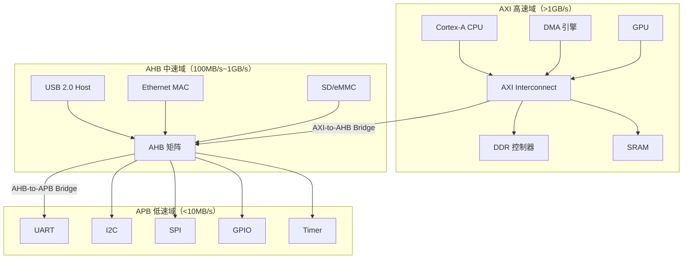

# AMBA 总线协议族（总览） [B→I]

> **本章学习目标**：
> - 理解 <span class="red">AMBA 总线协议族</span> 的设计哲学与层级结构
> - 掌握 AXI/AHB/APB 三级的 <span class="red">选型逻辑</span> 与适用场景
> - 建立片内 SoC 总线设计的整体认知框架

---

<span class="blue">从何而来 → 为什么需要 → 哪里用：</span><br>
<span class="red">AMBA</span> 诞生于 <span class="green">1996 年</span>，由 ARM 公司提出。<br>
在此之前，<span class="green">Digital Equipment Corporation</span> 的 <span class="green">VAX</span> 系统、<span class="green">IBM</span> 的 <span class="green">PC/AT</span> 总线都是封闭标准，<br>
SoC 设计者需为每个芯片定制总线，IP 核复用成本极高。<br>
<span class="blue">AMBA 通过开放标准化，使 ARM7、ARM9、Cortex-A 系列都能复用同一套总线 IP，SoC 开发周期从 18 个月缩短到 6 个月。</span><br>
如今，AMBA 已成为事实上的片内总线标准，不仅 ARM 芯片使用，<span class="green">RISC-V</span>、<span class="green">MIPS</span> 等架构也常通过 AXI 桥接 DDR 和 DMA。<br>

---

## AMBA 总线的设计哲学与层级结构

---

### <strong>为什么需要 AMBA：片上系统的"交通规划"</strong>

<span class="red">AMBA（Advanced Microcontroller Bus Architecture）</span> 是 ARM 公司提出的片内总线标准。<br>
其设计初衷是解决 SoC 芯片内部多模块互联的<span class="blue">"交通混乱"问题</span>。<br>

在 <span class="green">1996 年</span> 之前，SoC 设计者需为每个芯片定制总线。<br>
不同厂商的总线信号定义、时序协议互不兼容。<br>
IP 核复用成本极高，<span class="blue">一款 SoC 的开发周期通常超过 18 个月</span>。<br>

<span class="blue">类比理解：AMBA 三级总线如同"城市快速路系统"</span><br>
* <span class="green">AXI</span> 是城市快速路（多车道、无红绿灯、高速通行）<br>
* <span class="green">AHB</span> 是城市主干道（单车道但有绿波带、中等速度）<br>
* <span class="green">APB</span> 是社区小路（单行道、人行优先、低速）<br>
* <span class="green">Bridge</span> 是匝道（连接不同等级道路）<br>

AMBA 的核心设计哲学可归纳为三点：<br>

<span class="orange"><strong>1. 分层抽象：速度与功耗的权衡</strong></span><br>
* <span class="green">AXI（Advanced eXtensible Interface）</span>：高速数据通道，面向处理器、DMA、存储控制器<br>
* <span class="green">AHB（Advanced High-performance Bus）</span>：中等性能，面向高速外设<br>
* <span class="green">APB（Advanced Peripheral Bus）</span>：低速低功耗，面向寄存器型外设<br>

<span class="orange"><strong>2. 协议标准化：IP 核即插即用</strong></span><br>
所有符合 AMBA 的 IP 核遵循统一的信号定义和握手规则。<br>
设计者只需关注功能逻辑，无需重复设计总线接口。<br>

<span class="orange"><strong>3. 桥接互通：三级总线的无缝衔接</strong></span><br>
通过 <span class="green">AXI-to-AHB Bridge</span> 和 <span class="green">AHB-to-APB Bridge</span> 实现跨层级通信。<br>
不同速度的模块可在各自最优的总线上运行。<br>

---

### <strong>AMBA 协议族的演进脉络</strong>

<span class="red">AMBA 总线</span>诞生于 <span class="green">1996 年</span>，由 ARM 公司提出，<br>
初衷是解决 <span class="blue">"每个 SoC 都需定制总线"的重复造轮子问题</span>。<br>

在 AMBA 出现之前，<span class="green">Digital Equipment Corporation</span> 的 <span class="green">VAX</span> 系统、<br>
<span class="green">IBM</span> 的 <span class="green">PC/AT</span> 总线都是封闭标准，<br>
IP 核厂商无法跨平台复用。<br>

<span class="blue">AMBA 通过开放标准化，使 ARM7（1994）、ARM9（1998）、Cortex-A（2005）<br>
都能复用同一套总线 IP，SoC 开发周期从 18 个月缩短到 6 个月。</span><br>

AMBA 各版本的核心演进如下：<br>

| 版本 | 年份 | 核心新增 | 典型应用场景 |
| --- | --- | --- | --- |
| AMBA 1 | 1996 | ASB、APB | 早期 ARM7 SoC |
| AMBA 2 | 1999 | AHB、APB2 | ARM9 处理器（S3C2440） |
| AMBA 3 | 2003 | AXI3、AHB-Lite、APB3 | Cortex-A8/A9 时代 |
| AMBA 4 | 2010 | AXI4、AXI4-Stream、APB4 | Cortex-A15、big.LITTLE |
| AMBA 5 | 2015 | AXI5、CHI、ACE | Cortex-A73、服务器级 SoC |

<span class="blue">关键演进趋势：从单主单从到多主多从，从同步到异步，从简单握手到 QoS 与缓存一致性。</span><br>

---

### <strong>三级总线的层级关系与物理拓扑</strong>

<span class="red">AMBA 三级总线</span>的拓扑结构决定了 SoC 的整体性能。<br>
每个模块应挂在与其速度匹配的总线上，通过桥接器跨域通信。<br>



<span class="blue">拓扑核心原则：每个模块挂在与其速度匹配的总线上，通过桥接器跨域通信。</span><br>

---

## AXI/AHB/APB 的选型逻辑与性能对比

---

### <strong>选型逻辑：带宽、延迟、功耗的三维权衡</strong>

<span class="red">总线选型</span>的本质是 <span class="blue">"用合适的成本解决合适的问题"</span>。<br>
三个核心维度决定了总线选择：<br>

<span class="orange"><strong>1. 带宽需求</strong></span><br>
* 需要 >1GB/s 持续吞吐量 → <span class="green">AXI</span>（如 DDR 控制器、视频编解码器）<br>
* 需要 100MB/s~1GB/s → <span class="green">AHB</span>（如 USB 2.0 Host、GMAC）<br>
* 仅需寄存器访问（<10MB/s）→ <span class="green">APB</span>（如 UART、GPIO、I2C 控制器）<br>

<span class="orange"><strong>2. 延迟敏感度</strong></span><br>
* CPU 取指/访存要求 <span class="blue">确定性低延迟</span> → <span class="green">AXI</span>（支持乱序完成、QoS 优先级）<br>
* 外设 DMA 传输可容忍微秒级延迟 → <span class="green">AHB</span>（流水线设计）<br>
* 配置寄存器访问不在乎延迟 → <span class="green">APB</span>（无流水线，一拍完成）<br>

<span class="orange"><strong>3. 功耗预算</strong></span><br>
* <span class="green">APB</span> 支持 <span class="blue">"时钟门控"</span>：外设不活跃时关闭时钟，功耗趋近于零<br>
* <span class="green">AXI</span> 始终活跃（CPU/DDR 不能关），动态功耗高<br>
* <span class="green">AHB</span> 介于两者之间<br>

---

### <strong>核心性能指标对比</strong>

下表汇总了 AXI4、AHB-Lite 和 APB4 的关键性能差异：<br>

| 指标 | AXI4 | AHB-Lite | APB4 |
| --- | --- | --- | --- |
| 数据宽度 | 32/64/128/256/512 bit | 32/64/128 bit | 32 bit |
| 突发传输 | 支持（最大 256 beat） | 支持（最大 16 beat） | 不支持 |
| 流水线 | 5 通道独立流水线 | 2 级流水线 | 无流水线 |
| 时钟频率 | 可达 1GHz+ | 通常 100~500MHz | 通常 <100MHz |
| 多主支持 | 原生支持（互连矩阵） | 需仲裁器 | 仅单主 |
| 低功耗特性 | QoS + 时钟门控 | 部分支持 | 完整时钟门控 |
| 典型功耗 | 高（mW 级） | 中（数百 uW） | 极低（数十 uW） |

<span class="blue">选型结论：高速数据选 AXI，中等外设选 AHB，寄存器配置选 APB。</span><br>

---

### <strong>典型 SoC 的 AMBA 层级配置案例</strong>

以 <span class="green">STM32MP157</span>（双核 Cortex-A7 + Cortex-M4）为例：<br>

<span class="green">（1）高速域（AXI）</span><br>
* <span class="green">Cortex-A7</span> ×2（带 L1/L2 Cache）→ <span class="green">AXI</span> 总线<br>
* <span class="green">DMA 控制器</span>（MDMA）→ <span class="green">AXI</span> 总线<br>
* <span class="green">DDR3/DDR4 控制器</span> → <span class="green">AXI</span> 总线<br>
* 通过 <span class="green">AXI-to-AHB</span> 桥接入中速域<br>

<span class="green">（2）中速域（AHB）</span><br>
* <span class="green">USB OTG</span>、<span class="green">GMAC</span>、<span class="green">SDMMC</span><br>
* <span class="green">Cortex-M4</span> 通过 AHB 访问外设<br>
* 通过 <span class="green">AHB-to-APB</span> 桥接入低速域<br>

<span class="green">（3）低速域（APB）</span><br>
* <span class="green">UART</span>、<span class="green">I2C</span>、<span class="green">SPI</span>、<span class="green">TIM</span>、<span class="green">GPIO</span><br>
* 所有寄存器型外设<br>
* 支持 <span class="blue">独立时钟门控</span>：每个 APB 外设可单独开关<br>

```c
// STM32MP1 RCC 时钟门控示例（APB 外设）
// 开启 UART4 时钟
RCC->MP_APB1ENSETR = RCC_MP_APB1ENSETR_UART4EN;

// 关闭 UART4 时钟（APB 总线仍可运行，仅 UART4 断电）
RCC->MP_APB1ENCLRR = RCC_MP_APB1ENCLRR_UART4EN;
```

<span class="blue">APB 外设的独立时钟门控是嵌入式低功耗设计的关键手段。</span><br>

---

## AMBA 生态与工程实践

---

### <strong>ARM CoreLink 互连 IP 的选型</strong>

ARM 官方提供完整的 <span class="green">CoreLink</span> 互连 IP 组合：<br>

| IP 名称 | 功能 | 适用场景 |
| --- | --- | --- |
| CoreLink NIC-400 | AXI 互连矩阵 | 多主多从 SoC（如手机 SoC） |
| CoreLink NOC | 片上网络 | 超大规模 SoC（服务器级） |
| CoreLink GIC-400 | 通用中断控制器 | 多核系统中断分发 |
| CoreLink TZC-400 | TrustZone 地址空间控制器 | 安全隔离 |

<span class="blue">非 ARM 架构也可以使用 AMBA：RISC-V 芯片常通过 AXI 外设桥接 DDR 和 DMA。</span><br>

---

### <strong>总线协议分析的实战工具链</strong>

<span class="orange"><strong>1. 逻辑分析仪抓包</strong></span><br>

```bash
# Saleae Logic 抓取 AXI 波形后导出 CSV
# 用 Python 解析地址通道的传输事务
cat axi_trace.csv | python3 parse_axi_txn.py
```

<span class="orange"><strong>2. RTL 仿真验证</strong></span><br>

```verilog
// AXI 验证环境（SystemVerilog）
axi_master_bfm master (.aclk(clk), .aresetn(rst_n));
axi_slave_bfm  slave  (.aclk(clk), .aresetn(rst_n));

initial begin
  master.write_burst(0x8000_0000, 4, 256); // 地址、长度、数据
  master.read_burst (0x8000_0000, 4, 256);
end
```

<span class="orange"><strong>3. 内核调试：总线超时追踪</strong></span><br>

```bash
# 检查 AXI 总线是否出现 slave 无响应导致的超时
dmesg | grep -i "timeout"
# 输出：axi timeout: slave at 0x50000000 not responding
```

---

### <strong>历史演进：从 ASB 到 CHI 的 30 年</strong>

<span class="red">AMBA 总线</span>已演进 30 年，从简单的仲裁总线发展到复杂的片上网络：<br>

* <span class="green">1996 AMBA 1</span>：ASB + APB，单主单从<br>
* <span class="green">1999 AMBA 2</span>：AHB 替代 ASB，引入流水线<br>
* <span class="green">2003 AMBA 3</span>：AXI3 革命，5 通道分离<br>
* <span class="green">2010 AMBA 4</span>：AXI4-Stream（无地址，纯数据流）<br>
* <span class="green">2015 AMBA 5</span>：ACE（缓存一致性）、CHI（Coherent Hub Interface）<br>

<span class="blue">当前趋势：CHI 正在逐步替代 AXI 作为多核 SoC 的主干互连。</span><br>

---

## 本章小结

| 概念 | 一句话总结 |
| --- | --- |
| AMBA | ARM 片内总线标准，实现 IP 核即插即用 |
| AXI | 高速多通道总线，面向 CPU/DDR/DMA |
| AHB | 中等性能流水线总线，面向高速外设 |
| APB | 极简低功耗总线，面向寄存器外设 |
| 桥接器 | AXI-to-AHB、AHB-to-APB 实现跨层级通信 |
| 选型逻辑 | 带宽高选 AXI，延迟不敏感选 AHB，低功耗选 APB |

---

## 练习

1. 为什么 APB 外设可以独立时钟门控，而 AXI 主设备通常不能？<br>
2. 设计一个传感器 SoC：包含 Cortex-M4、ADC、UART、SPI Flash。应如何分配 AXI/AHB/APB？<br>
3. 对比 AXI4 和 AHB-Lite 的突发传输能力差异，说明为什么视频编解码器必须挂 AXI。
