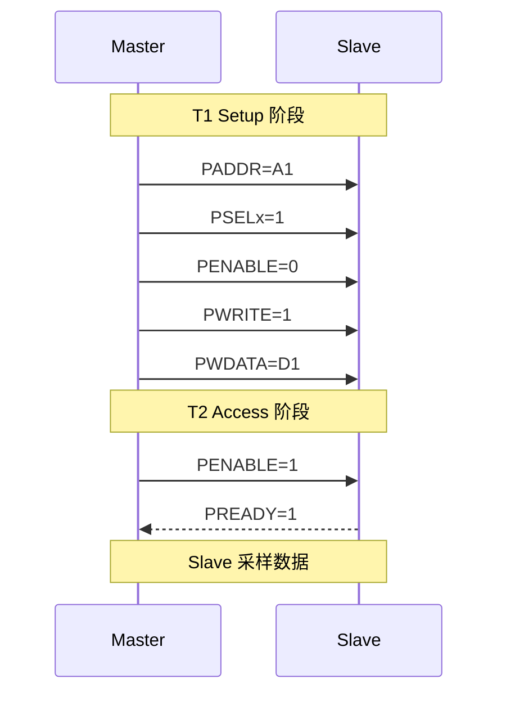
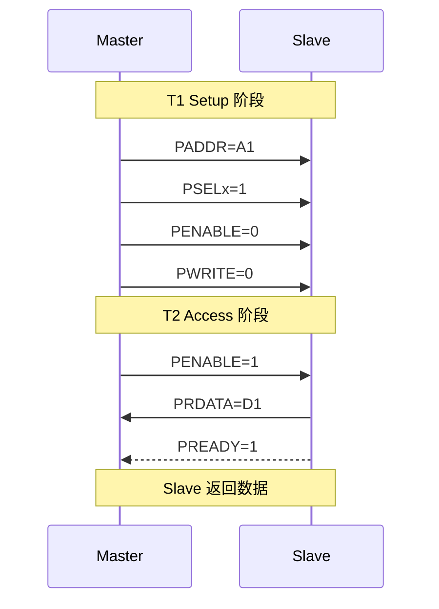
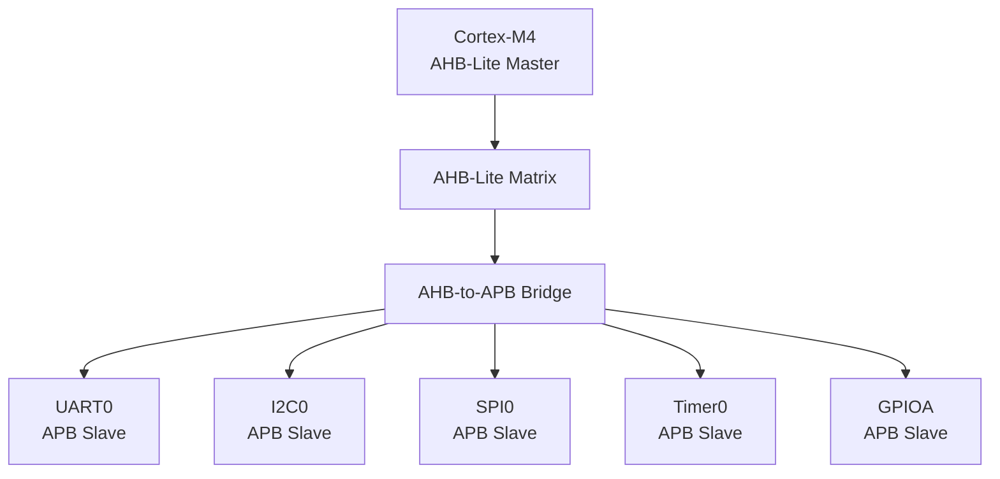

# APB 基础认知与架构 [B→I]

> **本章学习目标**：
> - 理解 <span class="red">APB（Advanced Peripheral Bus）</span> 的极简设计哲学
> - 掌握 APB 的 <span class="red">单周期读写</span> 与信号定义
> - 了解 APB 在 Cortex-M 系统中的定位

---

<span class="blue">从何而来 → 为什么需要 → 哪里用：</span><br>
<span class="red">APB</span> 诞生于 <span class="green">1996 年</span>（AMBA 1 规范），是 AMBA 协议族中最古老的成员。<br>
早期 SoC 中，CPU 通过总线访问 <span class="green">UART</span>、<span class="green">Timer</span> 等寄存器型外设，<br>
但这些外设只需单次寄存器读写，无需高速突发传输。<span class="blue">APB 用极简的 10 个信号实现单周期读写，面积和功耗均为 AXI 的 1/5。</span><br>
如今，APB 是所有 ARM SoC 的低速外设总线标准，<span class="green">STM32</span>、<span class="green">Raspberry Pi RP2040</span>、<span class="green">RISC-V</span> 芯片均使用 APB 挂接 GPIO/UART/I2C。<br>

---

## APB 的设计哲学：极简与低功耗

---

### <strong>为什么需要 APB：寄存器访问的专用总线</strong>

<span class="red">APB</span> 诞生于 <span class="green">1996 年</span>（AMBA 1 规范），<br>
是 AMBA 协议族中最简单的总线。<br>

APB 的设计目标只有一个：<br>
<span class="blue">"用最少的信号和最低的功耗，完成寄存器读写"</span>。<br>

<span class="blue">类比理解：APB 如同"社区便利店"</span><br>
AXI 是"大型物流中心"（处理大批量货物，设备昂贵）。<br>
AHB 是"中型超市"（处理中等批量货物）。<br>
APB 是"社区便利店"（只卖日用品，店面小、成本低）。<br>
寄存器访问就是"买一瓶水"，不需要动用物流中心。<br>

相比 AHB 和 AXI：<br>
* 无流水线（单周期完成）<br>
* 无突发传输（每次仅 1 beat）<br>
* 无仲裁（仅单 Master）<br>
* 无时钟门控外的功耗控制<br>

<span class="blue">APB 的典型场景：UART、I2C、SPI、Timer、GPIO 等寄存器型外设。</span><br>

---

### <strong>APB 的信号定义</strong>

APB 仅需 10 个信号（不含 PSELx 的重复），是 AXI 的 1/5。<br>

| 信号名 | 宽度 | 方向 | 说明 |
| --- | --- | --- | --- |
| PCLK | 1 | 全局 | 总线时钟 |
| PRESETn | 1 | 全局 | 低电平复位 |
| PADDR | 32 | Master→Slave | 目标地址 |
| PSELx | 1 | Master→Slave | Slave 选择（每个 Slave 一个） |
| PENABLE | 1 | Master→Slave | 使能信号，标志 Access 阶段 |
| PWRITE | 1 | Master→Slave | 1=写，0=读 |
| PWDATA | 32 | Master→Slave | 写数据 |
| PRDATA | 32 | Slave→Master | 读数据 |
| PREADY | 1 | Slave→Master | 1=传输完成，0=等待 |
| PSLVERR | 1 | Slave→Master | 1=传输错误 |

<span class="blue">APB 仅需 10 个信号（不含 PSELx 的重复），是 AXI 的 1/5。</span><br>

---

### <strong>APB 的读写时序</strong>

<span class="orange"><strong>1. 写时序（无等待）</strong></span><br>



Setup 阶段：Master 放置地址和数据<br>
Access 阶段：PENABLE 拉高，Slave 采样数据<br>

<span class="orange"><strong>2. 读时序（无等待）</strong></span><br>



<span class="blue">APB 的每个传输固定 2 个周期（Setup + Access），无法流水线重叠。</span><br>

---

## APB 在 SoC 中的定位

---

### <strong>APB Bridge：从 AHB 到 APB 的转换</strong>

在 Cortex-M 系统中，APB 总线通过 Bridge 挂在 AHB 之下：<br>



Bridge 的核心逻辑：<br>
* 将 AHB 的地址/数据周期映射为 APB 的 Setup/Access 周期<br>
* AHB 的 HREADY 映射为 APB 的 PREADY 同步<br>
* 每个 APB Slave 对应一个 PSELx 信号<br>

```verilog
// AHB-to-APB Bridge（简化）
module ahb_apb_bridge (
  input         HCLK, HRESETn,
  input  [31:0] HADDR,
  input         HWRITE,
  input  [31:0] HWDATA,
  output [31:0] HRDATA,
  input         HREADY,
  output        HREADYOUT,
  output        PCLK, PRESETn,
  output [31:0] PADDR,
  output        PWRITE,
  output [31:0] PWDATA,
  input  [31:0] PRDATA,
  output        PENABLE,
  output        PSELx,
  input         PREADY
);
  assign PCLK    = HCLK;
  assign PRESETn = HRESETn;
  assign PADDR   = HADDR;
  assign PWRITE  = HWRITE;
  assign PWDATA  = HWDATA;
  assign HRDATA  = PRDATA;
  assign PSELx   = (HADDR[31:16] == APB_BASE);  // 地址区间匹配

  reg penable_reg;
  always @(posedge HCLK) begin
    if (!HRESETn) penable_reg <= 1'b0;
    else if (HREADY) penable_reg <= PSELx;  // Setup 后进入 Access
  end
  assign PENABLE = penable_reg;
  assign HREADYOUT = PREADY;
endmodule
```

<span class="blue">Bridge 将 AHB 的流水线周期扩展为 APB 的 Setup/Access 两周期。</span><br>

---

## 本章小结

| 概念 | 一句话总结 |
| --- | --- |
| APB | 极简总线，2 周期完成读写，无流水线 |
| Setup/Access | T1 放地址，T2 传输数据 |
| PSELx | 每个 Slave 一个片选，地址解码生成 |
| APB Bridge | 将 AHB 周期映射为 APB 周期 |

---

## 练习

1. 计算 APB 总线在 100MHz 下的最大带宽（32-bit 数据宽度）。<br>
2. 为什么 APB 不支持突发传输？这对寄存器访问有什么影响？<br>
3. 设计一个 APB Slave：基地址 0x4001_0000，4 个 32-bit 寄存器。
