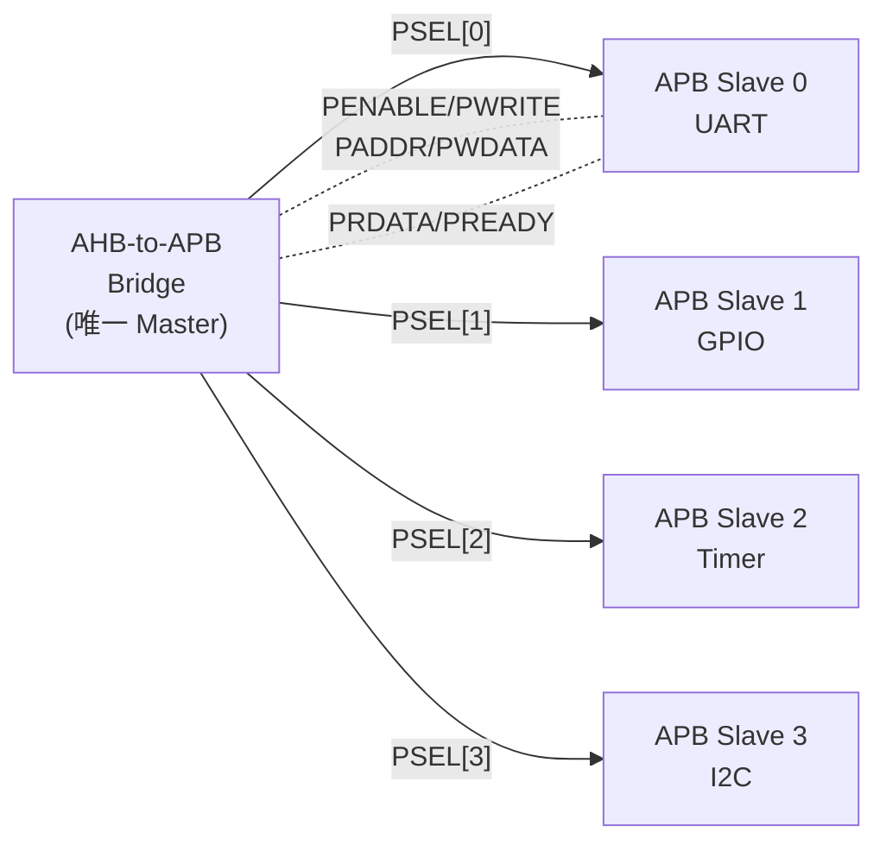
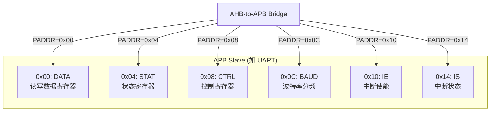
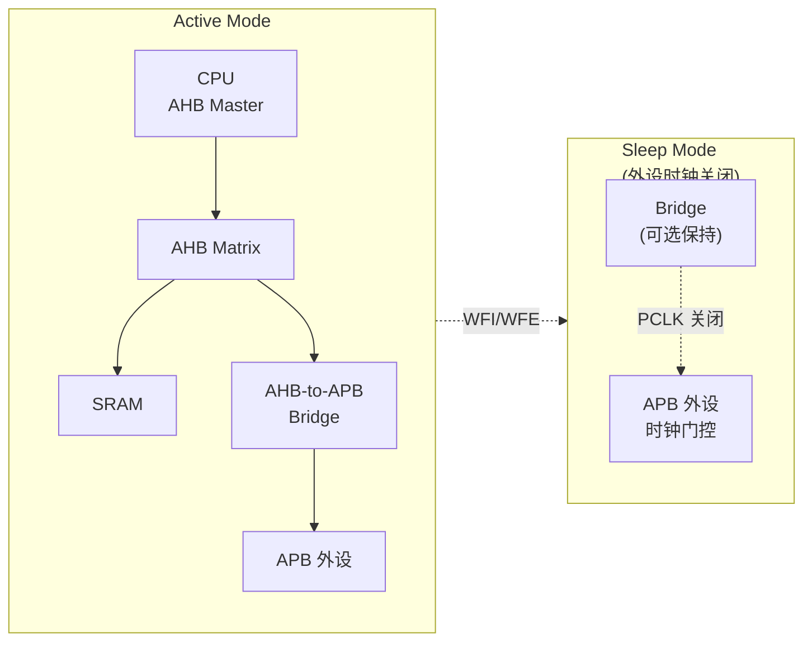

# APB是什么——极简低速总线与寄存器映射

<span class="badge-b">[B]</span> <span class="badge-i">[I]</span> <span class="badge-e">[E]</span> <span class="badge-m">[M]</span>

<span class="red">APB（Advanced Peripheral Bus）是 AMBA 家族中最简单的总线——无流水线、无突发、固定 2 周期。它的设计哲学是"够用就好"，用最小开销实现寄存器级外设访问。</span>

---

## 核心定义与价值

### <strong>APB 在 AMBA 家族中的定位</strong>

APB 是 AHB/AXI 的补充，专门用于低速外设的寄存器访问：

<br>

| 总线 | 速度 | 复杂度 | 面积 | 用途 |
|------|------|--------|------|------|
| AXI | 最高 | 高 | 大 | 处理器、DMA、内存 |
| AHB | 中高 | 中 | 中 | 子系统互联、SRAM |
| <span class="green">APB</span> | 低 | 最低 | 最小 | 外设寄存器、控制接口 |

<br>

<span class="blue">APB 的设计理念：外设寄存器访问不需要高速——UART 控制器、GPIO、看门狗定时器的寄存器，被访问频率远低于内存。用 AHB 连接它们是一种浪费。</span>

### <strong>APB 信号全景图</strong>

APB 信号集极其精简，只有 9 个核心信号：

<br>

| 信号 | 宽度 | 方向 | 作用 |
|------|------|------|------|
| <span class="green">PCLK</span> | 1 | 输入 | APB 时钟 |
| <span class="green">PRESETn</span> | 1 | 输入 | 低电平有效复位 |
| <span class="green">PSELx</span> | 1 | 桥→从 | 选择第 x 个从设备 |
| <span class="green">PENABLE</span> | 1 | 桥→从 | 使能信号（区分 Setup/Access） |
| <span class="green">PWRITE</span> | 1 | 桥→从 | 1=写，0=读 |
| <span class="green">PADDR[31:0]</span> | 32 | 桥→从 | 寄存器地址 |
| <span class="green">PWDATA[31:0]</span> | 32 | 桥→从 | 写数据 |
| <span class="green">PRDATA[31:0]</span> | 32 | 从→桥 | 读数据 |
| <span class="green">PREADY</span> | 1 | 从→桥 | 从设备就绪（APB4 引入） |

<br>



<br>

<span class="blue">关键观察：APB 只有一个 Master（通常是 AHB-to-APB Bridge），所有 Slave 通过独立的 PSELx 线选择。没有仲裁，没有多主竞争。</span>

### <strong>类比：小区信箱系统</strong>

想象一个老式小区的信箱系统：

- 每栋楼有一个信箱口（PSELx）
- 邮递员（Bridge）每天固定时间打开信箱
- 每次打开固定 2 分钟（2 周期）：1 分钟确认信箱编号（Setup），1 分钟投递/取件（Access）
- 邮递员不会同时打开两个信箱（无并发）
- 每个信箱独立编址（PADDR），互不相干

<br>

<span class="blue">APB 就像这个信箱系统：简单、低速、每周期只能处理一个"信件"（寄存器访问）。它不擅长大量数据传输（"包裹"），但对日常"信件"（寄存器读写）绰绰有余。</span>

---

## 核心机制原理解析

### <strong>1. APB vs AHB：关键差异</strong>

<span class="red">APB 和 AHB 的根本差异不是速度，而是架构哲学——简单 vs 复杂。</span>

<br>

| 维度 | APB | AHB |
|------|-----|-----|
| 流水线 | 无 | 有（地址/数据重叠） |
| 突发传输 | 无 | 有（INCR/WRAP） |
| 传输周期 | 固定 2 周期 | 最少 1 周期（突发） |
| 主设备数 | 1（通过 Bridge） | 多 |
| 仲裁 | 无 | 有 |
| 信号数 | 9 个核心 | 20+ 个 |
| 面积开销 | 极小 | 中等 |
| 功耗 | 极低 | 低 |

<br>

### <strong>2. APB4 新增信号</strong>

APB4（AMBA 4，2010）引入了等待状态和保护信号：

<br>

| 新增信号 | 宽度 | 作用 |
|----------|------|------|
| <span class="green">PREADY</span> | 1 | 从设备就绪（0=插入等待） |
| <span class="green">PSLVERR</span> | 1 | 传输错误 |
| <span class="green">PPROT[2:0]</span> | 3 | 保护类型（Normal/Privileged/Secure） |
| <span class="green">PSTRB[3:0]</span> | 4 | 写字节选通（每 bit 对应 1 byte） |

<br>

#### PSTRB[3:0] 字节选通

| PSTRB | 有效字节 | 场景 |
|-------|----------|------|
| 4'b0001 | PWDATA[7:0] | 字节写 |
| 4'b0010 | PWDATA[15:8] | 字节写 |
| 4'b0100 | PWDATA[23:16] | 字节写 |
| 4'b1000 | PWDATA[31:24] | 字节写 |
| 4'b0011 | PWDATA[15:0] | 半字写 |
| 4'b1100 | PWDATA[31:16] | 半字写 |
| 4'b1111 | PWDATA[31:0] | 字写 |

<br>

<span class="blue">PSTRB 让 APB4 支持非对齐的字节/半字写——这是 APB3 无法做到的。在 8-bit/16-bit 外设寄存器场景中至关重要。</span>

### <strong>3. APB5 新增信号</strong>

APB5（AMBA 5，2017）引入了用户信号和 Wake-up 支持：

<br>

| 新增信号 | 宽度 | 作用 |
|----------|------|------|
| <span class="green">PAUSER</span> | 可配置 | 地址阶段用户自定义 |
| <span class="green">PWUSER</span> | 可配置 | 写数据用户自定义 |
| <span class="green">PRUSER</span> | 可配置 | 读数据用户自定义 |
| <span class="green">PBUSER</span> | 可配置 | 响应阶段用户自定义 |
| <span class="green">PWAKEUP</span> | 1 | 唤醒请求（低功耗） |

<br>

<span class="blue">PAUSER/PRUSER 允许 SoC 设计者附加自定义信息（如虚拟地址扩展、时间戳），而不破坏标准 APB 协议兼容性。</span>

### <strong>4. 寄存器映射模型</strong>

APB 外设的典型寄存器组织：

<br>



<br>

<span class="blue">每个 APB 外设的寄存器通常按 4-byte（Word）对齐。PADDR 的低 2 bits 通常为 0。寄存器数量一般小于 32 个——超过这个规模，AHB 更高效。</span>

---

## 技术教学与实战

### <strong>APB Slave 的 Verilog 框架</strong>

```verilog
module apb_uart (
    input  wire        PCLK,
    input  wire        PRESETn,
    input  wire        PSEL,
    input  wire        PENABLE,
    input  wire        PWRITE,
    input  wire [31:0] PADDR,
    input  wire [31:0] PWDATA,
    input  wire [ 3:0] PSTRB,      // APB4
    output reg  [31:0] PRDATA,
    output reg         PREADY,
    output reg         PSLVERR,
    // UART 引脚
    output wire        TXD,
    input  wire        RXD
);
    // 寄存器定义
    reg [ 7:0] data_reg;    // 0x00
    reg [ 7:0] status_reg;  // 0x04
    reg [ 7:0] ctrl_reg;    // 0x08
    reg [15:0] baud_reg;    // 0x0C
    
    // APB 状态机
    localparam IDLE  = 2'b00;
    localparam SETUP = 2'b01;
    localparam ACCESS = 2'b10;
    
    reg [1:0] apb_state;
    
    // PREADY 默认 1（无等待）
    always @(posedge PCLK or negedge PRESETn) begin
        if (!PRESETn) begin
            apb_state  <= IDLE;
            PREADY    <= 1'b1;
            PSLVERR   <= 1'b0;
            data_reg  <= 8'h00;
            ctrl_reg  <= 8'h00;
        end else begin
            case (apb_state)
                IDLE: begin
                    if (PSEL && !PENABLE) begin
                        apb_state <= SETUP;
                    end
                end
                SETUP: begin
                    if (PSEL && PENABLE) begin
                        apb_state <= ACCESS;
                        // 执行读/写
                        if (PWRITE) begin
                            case (PADDR[7:0])
                                8'h00: begin
                                    if (PSTRB[0]) data_reg <= PWDATA[7:0];
                                end
                                8'h08: begin
                                    if (PSTRB[0]) ctrl_reg <= PWDATA[7:0];
                                end
                                default: PSLVERR <= 1'b1;
                            endcase
                        end else begin
                            case (PADDR[7:0])
                                8'h00: PRDATA <= {24'h0, data_reg};
                                8'h04: PRDATA <= {24'h0, status_reg};
                                8'h08: PRDATA <= {24'h0, ctrl_reg};
                                default: begin
                                    PRDATA <= 32'h0;
                                    PSLVERR <= 1'b1;
                                end
                            endcase
                        end
                    end
                end
                ACCESS: begin
                    apb_state <= IDLE;
                    PSLVERR <= 1'b0;
                end
            endcase
        end
    end
endmodule
```

<br>

### <strong>Linux 中的 APB 外设驱动</strong>

APB 外设在 Linux 中通过 platform_device + regmap 访问：

```c
// drivers/serial/apb_uart.c —— APB UART 驱动片段
static int apb_uart_probe(struct platform_device *pdev)
{
    struct resource *res;
    struct apb_uart_port *port;
    void __iomem *base;

    // 从 device tree 获取 APB 寄存器基地址
    res = platform_get_resource(pdev, IORESOURCE_MEM, 0);
    base = devm_ioremap_resource(&pdev->dev, res);
    if (IS_ERR(base))
        return PTR_ERR(base);

    // 使用 regmap 访问 APB 寄存器
    port->regmap = devm_regmap_init_mmio(&pdev->dev, base,
        &apb_uart_regmap_config);

    // 读取波特率分频寄存器（APB 地址 0x0C）
    unsigned int baud_div;
    regmap_read(port->regmap, APB_UART_BAUD_REG, &baud_div);
    dev_info(&pdev->dev, "APB UART baud divisor: %u\n", baud_div);

    // 配置中断使能（APB 地址 0x10）
    regmap_write(port->regmap, APB_UART_IE_REG, UART_IE_RX_READY);

    return uart_add_one_port(&apb_uart_driver, &port->port);
}

static const struct regmap_config apb_uart_regmap_config = {
    .reg_bits = 32,
    .reg_stride = 4,        // APB 寄存器 4-byte 对齐
    .val_bits = 32,
    .max_register = 0x14,   // 最大寄存器偏移
};
```

<br>

### <strong>Device Tree 中的 APB 外设描述</strong>

```dts
// arch/arm/boot/dts/xxx.dts
apb_uart0: serial@40004000 {
    compatible = "vendor,apb-uart";
    reg = <0x40004000 0x100>;    // APB 地址空间：4KB
    interrupts = <16>;            // 中断号
    clocks = <&apb_clk>;          // APB 时钟源
    clock-names = "apb_pclk";
    status = "okay";
};

apb_gpio: gpio@40005000 {
    compatible = "vendor,apb-gpio";
    reg = <0x40005000 0x100>;
    gpio-controller;
    #gpio-cells = <2>;
    status = "okay";
};
```

<br>

---

## 嵌入式专属实战场景

### <strong>场景：SoC 中的 APB 外设数量规划</strong>

某 MCU 需要集成以下外设，判断哪些适合 APB：

<br>

| 外设 | 寄存器数 | 访问频率 | 数据量 | 推荐总线 |
|------|----------|----------|--------|----------|
| GPIO | 4 | 低 | 无 | APB |
| UART | 6 | 低 | 字节级 | APB |
| SPI Ctrl | 8 | 中 | 字节级 | APB |
| Timer | 4 | 低 | 无 | APB |
| DMA Ctrl | 20+ | 高 | 连续数据 | AHB |
| USB OTG | 50+ | 极高 | 包级 | AHB/AXI |
| Ethernet MAC | 100+ | 极高 | 帧级 | AXI |

<br>

<span class="blue">判断标准：寄存器数 < 20、无大数据流、访问频率低 → APB。反之 → AHB/AXI。</span>

---

## 历史演进与前沿

### <strong>APB 版本演进</strong>

<br>

| 版本 | 年份 | 关键变化 | 新增信号 |
|------|------|----------|----------|
| APB2 | 1999 | 基础版 | PCLK, PSEL, PENABLE, PWRITE, PADDR, PWDATA, PRDATA |
| APB3 | 2004 | 等待状态支持 | PREADY, PSLVERR |
| APB4 | 2010 | 保护+选通 | PPROT[2:0], PSTRB[3:0] |
| APB5 | 2017 | 用户扩展+唤醒 | PAUSER, PWUSER, PRUSER, PBUSER, PWAKEUP |

<br>

<span class="blue">APB 的演进非常克制——每次只增加必要功能，保持协议极简。这与 AXI 的"大而全"形成鲜明对比。</span>

### <strong>前沿：APB 在低功耗 SoC 中的角色</strong>

现代低功耗 MCU（如 STM32U5、nRF5340）采用多总线架构：



<br>

<span class="blue">在睡眠模式下，APB 外设的 PCLK 被门控关闭，而 AHB 矩阵可能保持运行（供 DMA 使用）。APB 的极简设计使得时钟门控的粒度可以精确到单个外设。</span>

---

## 本章小结

<br>

| 知识点 | 核心结论 |
|--------|----------|
| APB 定位 | AMBA 最简层，外设寄存器专用 |
| 核心信号 | 9 个，无流水线/突发/仲裁 |
| APB4 | +PREADY/PSLVERR/PPROT/PSTRB |
| APB5 | +用户信号/PWAKEUP |
| 寄存器映射 | 通常 < 32 个 4-byte 寄存器 |
| 选型标准 | 寄存器少、无大数据、低频 → APB |

---

## 练习

1. <span class="purple">对比 APB2 和 APB4 的信号差异，列出 APB4 新增信号及其使用场景。</span>

2. 某 APB UART 外设需要支持字节写（只修改 DATA 寄存器的低 8 bit），PSTRB 应如何设置？写出 Verilog 中的判断逻辑。

3. <span class="purple">为什么 APB 不适合连接 DMA 引擎？从协议限制角度分析。</span>

4. 设计一个 APB GPIO Slave，要求支持 32 个 GPIO 引脚的方向控制（DIR）和数据寄存器（DATA）。

5. <span class="purple">在 Linux Device Tree 中，APB 外设的 reg 属性通常如何定义？为什么地址范围一般是 4KB 对齐？</span>
