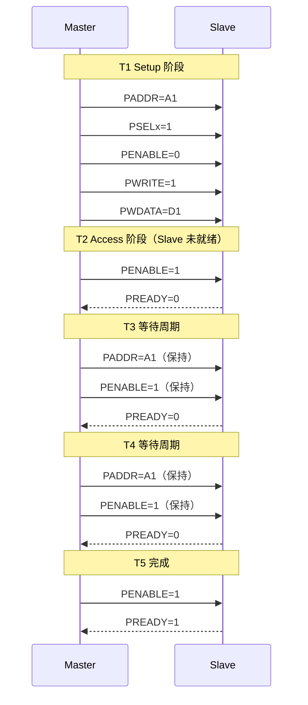

# APB 传输时序与低功耗 [B→I]

> **本章学习目标**：
> - 理解 <span class="red">APB 等待周期</span> 与 PREADY 反压机制
> - 掌握 <span class="red">APB 低功耗设计</span>：时钟门控与 PCLKEN
> - 了解 APB4 的 <span class="red">PWAKEUP</span> 与唤醒机制

---

<span class="blue">从何而来 → 为什么需要 → 哪里用：</span><br>
<span class="red">APB 低功耗机制</span>随着 <span class="green">移动设备</span> 的兴起而发展。<br>
早期 SoC 外设始终上电，待机功耗高达数百 mW。<br>
<span class="blue">APB4 引入 PCLKEN 时钟门控信号，允许系统动态关闭未使用外设的时钟，使待机功耗降至 uW 级。</span><br>
如今，APB 低功耗设计是 <span class="green">智能手机</span>、<span class="green">IoT 传感器</span>、<span class="green">可穿戴设备</span>的必备技术。<br>

---

## APB 等待周期与 PREADY 反压

---

### <strong>PREADY 反压：Slave 延长 Access 阶段</strong>

<span class="red">PREADY</span> 是 APB Slave 的流控信号。<br>

| PREADY | 含义 | 行为 |
| --- | --- | --- |
| 1 | Slave 就绪 | 当前周期完成传输 |
| 0 | Slave 未就绪 | Master 必须保持所有信号，插入等待周期 |



<span class="blue">PREADY=0 时，Master 必须保持 PADDR、PWDATA、PWRITE 不变，直到 PREADY=1。</span><br>

---

## APB 低功耗设计

---

### <strong>时钟门控：每个 APB Slave 独立开关</strong>

<span class="red">APB 的低功耗核心</span>在于 **独立时钟门控**。<br>

```verilog
// APB UART Slave 带时钟门控
module apb_uart (
  input         PCLK, PRESETn,
  input         PCLKEN,   // 时钟使能（门控信号）
  input  [31:0] PADDR,
  input         PSELx,
  input         PENABLE,
  input         PWRITE,
  input  [31:0] PWDATA,
  output [31:0] PRDATA,
  output        PREADY,
  output        txd,
  input         rxd
);

  // 仅在 PCLKEN=1 时更新内部状态
  wire clk_en = PCLKEN && PSELx;

  reg [7:0] tx_fifo;
  always @(posedge PCLK) begin
    if (clk_en && PWRITE && PADDR[3:0] == 4'h0)
      tx_fifo <= PWDATA[7:0];
  end
  // PCLKEN=0 时，寄存器保持，无动态功耗
endmodule
```

<span class="blue">PCLKEN 是 APB4 新增信号，允许系统关闭未使用外设的时钟，功耗趋近于零。</span><br>

---

### <strong>APB4 的新增信号</strong>

APB4 在 APB3 基础上新增 3 个信号：<br>

| 信号 | 方向 | 说明 |
| --- | --- | --- |
| PPROT | 3-bit | 保护类型（特权/安全/指令） |
| PSTRB | 4-bit | 字节使能（类似 AXI WSTRB） |
| PCLKEN | 1-bit | 时钟门控使能 |

<span class="blue">PSTRB 允许在 32-bit APB 总线上只写 1 个字节，避免读-改-写操作。</span><br>

---

## 本章小结

| 概念 | 一句话总结 |
| --- | --- |
| PREADY 反压 | Slave 未就绪时延长 Access，Master 保持信号 |
| 时钟门控 | PCLKEN 关闭未使用外设时钟，功耗趋近于零 |
| APB4 | 新增 PPROT/PSTRB/PCLKEN，支持安全与字节使能 |

---

## 练习

1. APB Slave 在什么场景下需要拉低 PREADY？<br>
2. 设计一个带 PCLKEN 门控的 APB Timer，计算门控后的功耗节省比例。<br>
3. APB4 的 PSTRB 如何支持字节写操作？给出 Verilog 实现片段。
