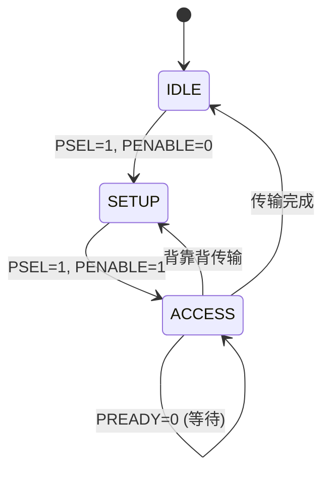
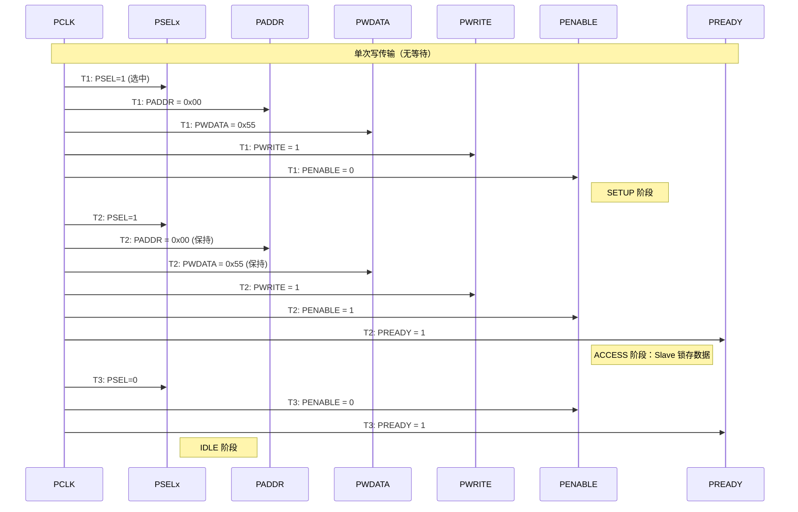
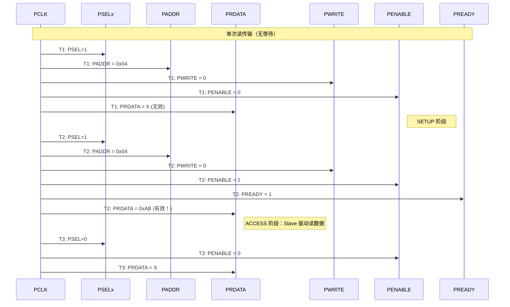
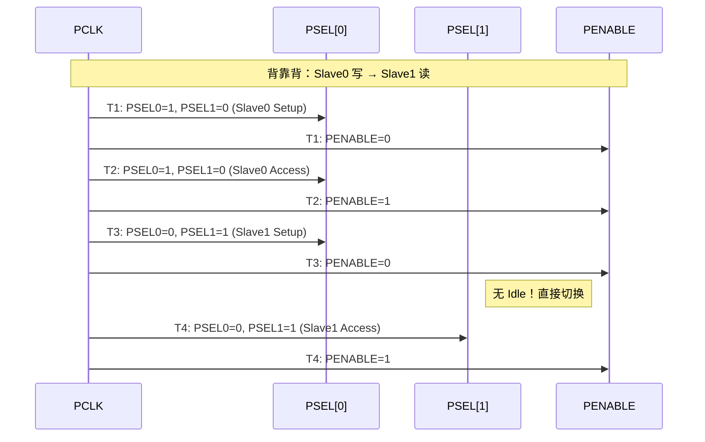
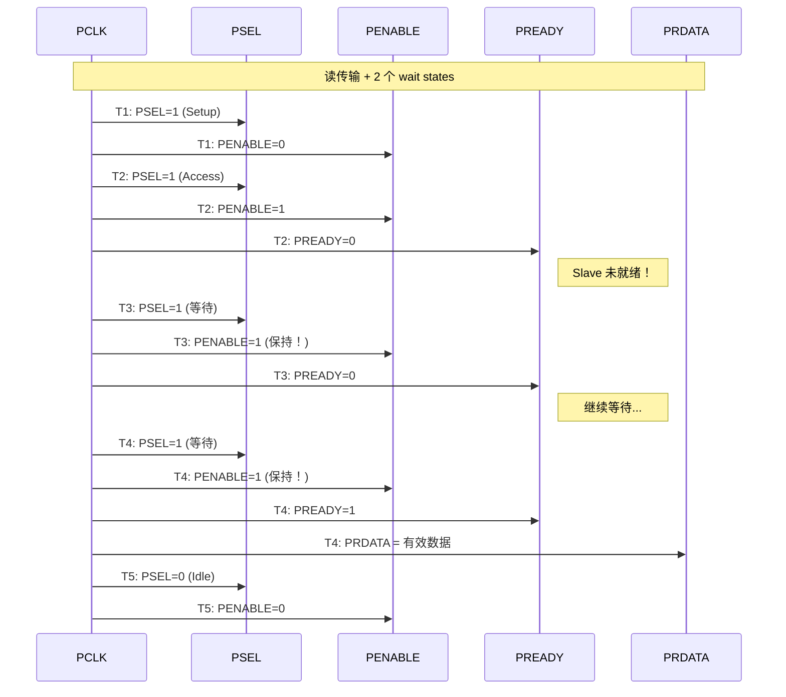
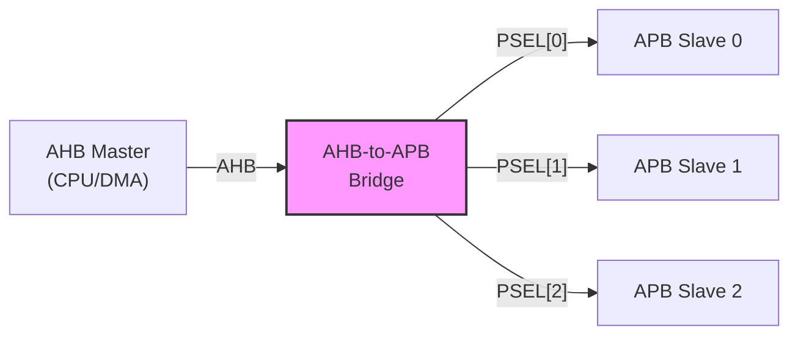

# APB怎么做——传输时序与低功耗设计

<span class="badge-b">[B]</span> <span class="badge-i">[I]</span> <span class="badge-e">[E]</span> <span class="badge-m">[M]</span>

<span class="red">APB 的传输时序固定为 2 周期——Setup + Access。这种确定性使得 APB 成为最易实现的总线，但也限制了其性能。理解这 2 个周期的精确行为，是 APB 设计的基础。</span>

---

## 核心定义与价值

### <strong>APB 传输的三个阶段</strong>

APB 状态机只有两个有效状态，但通常描述为三个阶段：

- <span class="green">Setup</span>：Master 输出地址、写数据、PWRITE、PSELx=1，PENABLE=0
- <span class="green">Access</span>：Master 保持所有信号，PENABLE=1，Slave 采样/驱动数据
- <span class="green">Idle</span>：PSELx=0，PENABLE=0，无传输

<br>



<br>

<span class="blue">注意：APB 状态机存在于 Bridge（Master）中，而非 APB Slave。Slave 只根据 PSEL 和 PENABLE 的组合做出响应。</span>

### <strong>类比：双节拍门铃</strong>

想象一种特殊的门铃系统：

- 第 1 拍（Setup）：按下门铃按钮（PSEL=1），但还没有响（PENABLE=0）——告诉屋里人"我要来了"
- 第 2 拍（Access）：门铃响起（PENABLE=1）——屋里人开门，完成交互
- 如果你连续按两次（背靠背传输），第 2 拍的响铃结束后立即进入下一次第 1 拍

<br>

<span class="blue">PENABLE 就像是"确认响铃"——它区分了"准备阶段"和"执行阶段"。没有 PENABLE，Slave 不知道何时真正执行操作。</span>

---

## 核心机制原理解析

### <strong>1. 写传输时序详解</strong>

<span class="red">APB 写传输固定 2 周期（无等待时）。Setup 阶段送地址+数据，Access 阶段 Slave 锁存。</span>

<br>



<br>

#### 写时序关键点

1. T1（Setup）：PSEL 从 0→1，PENABLE=0。Slave 看到 PSEL=1 后准备接收地址
2. T2（Access）：PENABLE 从 0→1，PREADY=1。Slave 在 PCLK 上升沿采样 PWDATA 和 PADDR
3. T3（Idle）：PSEL=0，PENABLE=0。传输完成
4. <span class="blue">PADDR 和 PWDATA 在 Setup 和 Access 阶段必须保持稳定</span>

### <strong>2. 读传输时序详解</strong>

APB 读传输同样是 2 周期，但 PRDATA 在 Access 阶段返回：

<br>



<br>

#### 读时序关键点

1. T1（Setup）：PWRITE=0 表示读操作，PADDR 指向目标寄存器
2. T2（Access）：Slave 在 PCLK 上升沿采样 PADDR，驱动 PRDATA
3. <span class="blue">Bridge（Master）在 T2 的 PCLK 上升沿采样 PRDATA</span>
4. T3（Idle）：PRDATA 回到无效状态

### <strong>3. PENABLE 的精确作用</strong>

<span class="red">PENABLE 是 APB 协议的核心——它区分了"准备"和"执行"两个状态。</span>

<br>

| PSEL | PENABLE | 状态 | Slave 行为 |
|------|---------|------|-----------|
| 0 | 0 | IDLE | 忽略所有输入 |
| 1 | 0 | SETUP | 锁存地址，准备响应 |
| 1 | 1 | ACCESS | 执行读/写操作 |
| 0 | 1 | 非法 | 协议未定义 |

<br>

```verilog
// Slave 中的 PENABLE 检测逻辑
always @(posedge PCLK or negedge PRESETn) begin
    if (!PRESETn) begin
        // 复位
    end else if (PSEL) begin
        if (!PENABLE) begin
            // SETUP 阶段：锁存地址
            latched_addr <= PADDR;
        end else begin
            // ACCESS 阶段：执行操作
            if (PWRITE)
                regs[latched_addr] <= PWDATA;
            else
                PRDATA <= regs[latched_addr];
        end
    end
end
```

<br>

<span class="blue">这种设计消除了 Slave 对时钟边沿的竞争冒险——Slave 在 PENABLE=0 时"准备"，在 PENABLE=1 时"执行"，两个动作发生在不同的时钟周期。</span>

### <strong>4. 背靠背传输（Back-to-Back）</strong>

当连续访问不同 APB Slave 时，可以省略 Idle 周期：

<br>



<br>

<span class="blue">背靠背传输的效率提升：4 周期完成 2 次传输（含切换），平均 2 周期/传输。如果中间插入 Idle，则需要 5 周期。</span>

### <strong>5. APB4 等待状态（PREADY=0）</strong>

当 Slave 无法在 1 个 Access 周期完成操作时，拉低 PREADY：

<br>



<br>

<span class="blue">关键规则：PENABLE 在 wait state 期间保持为 1！Slave 通过 PREADY 告知 Bridge"我还在忙"。Bridge 必须等待 PREADY=1 才能进入 Idle。</span>

### <strong>6. 低功耗时钟门控：PCLKEN</strong>

APB 外设经常工作在与 CPU 不同的低频时钟下。PCLKEN 控制 APB 时钟的有效边沿：

<br>

```verilog
// 带 PCLKEN 的 APB Slave 时钟门控
module apb_slave_gated (
    input  wire        PCLK,        // 高速时钟
    input  wire        PCLKEN,      // 门控使能（1/16 分频）
    input  wire        PRESETn,
    // ... APB 信号
);
    // 只在 PCLKEN=1 的周期执行 APB 操作
    wire clk_active = PCLKEN;
    
    always @(posedge PCLK or negedge PRESETn) begin
        if (!PRESETn) begin
            // 复位
        end else if (clk_active) begin
            // APB 状态机只在有效周期运转
            if (PSEL && PENABLE) begin
                // 执行读写
            end
        end
        // PCLKEN=0 时，所有寄存器保持
    end
endmodule
```

<br>

| 场景 | PCLK 频率 | PCLKEN 模式 | 功耗节省 |
|------|-----------|-------------|----------|
| 正常运行 | 100 MHz | 始终使能 | 0% |
| 低速外设 | 100 MHz | 1/16 分频 | ~94% |
| 睡眠模式 | 100 MHz | 仅唤醒时使能 | ~99% |

<br>

<span class="blue">PCLKEN 的优势：外设逻辑仍然使用高速时钟域（简化 CDC），但有效工作频率降低，动态功耗与频率成正比下降。</span>

### <strong>7. APB 桥接器：AHB-to-APB Bridge</strong>

Bridge 是 APB 系统中唯一的 Master，负责将 AHB/AXI 访问翻译为 APB 传输。

<br>



<br>

#### Bridge 的 AHB Slave 接口

| AHB 信号 | Bridge 行为 |
|----------|-------------|
| HADDR | 映射到 PADDR，高位译码选择 PSELx |
| HWRITE | 直通到 PWRITE |
| HWDATA | 直通到 PWDATA |
| HRDATA | 来自 PRDATA |
| HTRANS | 译码为 APB Setup/Access |
| HREADY | 等待 PREADY 后拉高 |

<br>

#### 地址译码示例

```verilog
// Bridge 中的地址译码
always @(*) begin
    psel = 8'b0;  // 8 个 APB Slave
    
    case (haddr[31:24])
        8'h40: psel[0] = 1'b1;  // UART0: 0x4000_0000
        8'h41: psel[1] = 1'b1;  // UART1: 0x4100_0000
        8'h42: psel[2] = 1'b1;  // GPIO:  0x4200_0000
        8'h43: psel[3] = 1'b1;  // Timer: 0x4300_0000
        // ...
        default: psel = 8'b0;
    endcase
end
```

<br>

---

## 技术教学与实战

### <strong>完整的 APB Bridge Verilog 实现</strong>

```verilog
module ahb_to_apb_bridge (
    // AHB Slave 接口
    input  wire        HCLK,
    input  wire        HRESETn,
    input  wire        HSEL,
    input  wire [31:0] HADDR,
    input  wire [ 1:0] HTRANS,
    input  wire        HWRITE,
    input  wire [ 2:0] HSIZE,
    input  wire [31:0] HWDATA,
    output reg  [31:0] HRDATA,
    output wire        HREADY,
    output wire        HRESP,
    // APB Master 接口
    output reg         PCLKEN,
    output reg  [ 7:0] PSEL,
    output reg         PENABLE,
    output reg         PWRITE,
    output reg  [31:0] PADDR,
    output reg  [31:0] PWDATA,
    input  wire [31:0] PRDATA,
    input  wire        PREADY,
    input  wire        PSLVERR
);
    // AHB 到 APB 的状态机
    localparam AHB_IDLE  = 2'b00;
    localparam AHB_SETUP = 2'b01;
    localparam AHB_WAIT  = 2'b10;
    localparam AHB_DONE  = 2'b11;
    
    reg [1:0] state;
    reg [31:0] latched_addr;
    reg latched_write;
    
    // 状态机
    always @(posedge HCLK or negedge HRESETn) begin
        if (!HRESETn) begin
            state <= AHB_IDLE;
            PSEL <= 8'b0;
            PENABLE <= 1'b0;
        end else begin
            case (state)
                AHB_IDLE: begin
                    if (HSEL && HTRANS[1]) begin  // NONSEQ or SEQ
                        latched_addr  <= HADDR;
                        latched_write <= HWRITE;
                        PADDR        <= HADDR;
                        PWRITE       <= HWRITE;
                        PWDATA       <= HWDATA;
                        
                        // 地址译码
                        PSEL <= decode_addr(HADDR);
                        PENABLE <= 1'b0;  // Setup
                        state <= AHB_WAIT;
                    end
                end
                AHB_WAIT: begin
                    PENABLE <= 1'b1;  // Access
                    if (PREADY) begin
                        HRDATA <= PRDATA;
                        state <= AHB_DONE;
                    end
                end
                AHB_DONE: begin
                    PSEL    <= 8'b0;
                    PENABLE <= 1'b0;
                    state   <= AHB_IDLE;
                end
            endcase
        end
    end
    
    assign HREADY = (state == AHB_DONE) || (state == AHB_IDLE);
    assign HRESP  = PSLVERR;
    
    function [7:0] decode_addr;
        input [31:0] addr;
        begin
            case (addr[31:24])
                8'h40: decode_addr = 8'b0000_0001;
                8'h41: decode_addr = 8'b0000_0010;
                8'h42: decode_addr = 8'b0000_0100;
                8'h43: decode_addr = 8'b0000_1000;
                default: decode_addr = 8'b0;
            endcase
        end
    endfunction
endmodule
```

<br>

### <strong>工具：APB 时序验证脚本</strong>

使用 SystemVerilog Assertion（SVA）验证 APB 协议：

```systemverilog
module apb_checker (
    input wire PCLK,
    input wire PRESETn,
    input wire PSEL,
    input wire PENABLE,
    input wire PREADY,
    input wire PWRITE,
    input wire [31:0] PADDR,
    input wire [31:0] PWDATA
);
    // 检查 1：PENABLE 不会在没有 PSEL 时变高
    property p_enable_requires_sel;
        @(posedge PCLK)
        PENABLE |-> PSEL;
    endproperty
    assert property (p_enable_requires_sel)
        else $error("PENABLE asserted without PSEL!");

    // 检查 2：Setup → Access 必须恰好 1 周期
    property p_setup_to_access;
        @(posedge PCLK)
        (PSEL && !PENABLE) |-> ##1 (PSEL && PENABLE);
    endproperty
    assert property (p_setup_to_access)
        else $error("Setup not followed by Access!");

    // 检查 3：PADDR 在 Setup+Access 阶段稳定
    property p_addr_stable;
        @(posedge PCLK)
        (PSEL && !PENABLE) |-> ($stable(PADDR) throughout (PSEL[*>1]));
    endproperty
    assert property (p_addr_stable)
        else $error("PADDR changed during transfer!");

    // 检查 4：PREADY=0 时 PENABLE 保持
    property p_ready_low;
        @(posedge PCLK)
        (PSEL && PENABLE && !PREADY) |-> ##1 (PENABLE);
    endproperty
    assert property (p_ready_low)
        else $error("PENABLE dropped while PREADY=0!");
endmodule
```

<br>

---

## 嵌入式专属实战场景

### <strong>场景：GPIO 寄存器 APB 访问延迟实测</strong>

在 STM32F407 上测量 APB 访问延迟：

```c
// 使用 DWT_CYCCNT 测量 APB GPIO 访问周期
#define GPIOA_ODR  (*(volatile uint32_t *)0x40020014)

DWT->CYCCNT = 0;
uint32_t t0 = DWT->CYCCNT;
GPIOA_ODR = 0xFF;   // APB 写（通过 AHB-to-APB Bridge）
__DSB();            // 数据同步屏障
uint32_t t1 = DWT->CYCCNT;

printf("APB write cycles: %u\n", t1 - t0);
// 实测输出（STM32F4 @ 168 MHz）：
// APB write cycles: 3-4
// = AHB 传输 1 周期 + Bridge 转换 1 周期 + APB 2 周期
```

<br>

### <strong>低功耗模式切换中的 APB</strong>

```c
// 进入 STOP 模式前关闭 APB 外设时钟
void enter_stop_mode(void) {
    // 关闭所有 APB1 外设时钟
    RCC->APB1ENR &= ~(RCC_APB1ENR_TIM2EN |
                       RCC_APB1ENR_TIM3EN |
                       RCC_APB1ENR_UART2EN);
    
    // 保留 APB2 上必要的 GPIO
    RCC->APB2ENR &= ~RCC_APB2ENR_ADC1EN;
    
    // 设置 PWR 控制寄存器
    PWR->CR &= ~PWR_CR_PDDS;   // STOP 模式（非 STANDBY）
    PWR->CR |= PWR_CR_LPMS_1;  // 低功耗模式选择
    
    // WFI 进入低功耗
    __WFI();
    
    // 唤醒后重新使能 APB 时钟
    RCC->APB1ENR |= RCC_APB1ENR_TIM2EN;
}
```

<br>

<span class="blue">APB 外设的独立时钟使能（RCC_APBxENR）是低功耗设计的关键——可以精确关闭不需要的外设，而不影响系统其他部分。</span>

---

## 历史演进与前沿

### <strong>APB Bridge 的演进</strong>

<br>

| Bridge 类型 | 源总线 | 目标总线 | 应用场景 |
|-------------|--------|----------|----------|
| AHB-to-APB | AHB | APB | Cortex-M 系统 |
| AXI-to-APB | AXI4 | APB | Cortex-A 低速子系统 |
| AHB-Lite-to-APB | AHB-Lite | APB | 极简 MCU |
| AXI4-Lite-to-APB | AXI4-Lite | APB | FPGA 软核 |

<br>

### <strong>前沿：异步 APB Bridge</strong>

当 APB 外设使用不同时钟域时，需要异步 Bridge：

```verilog
// 异步 AHB-to-APB Bridge（CDC 设计）
module async_ahb_to_apb_bridge (
    // AHB 域（高频）
    input  wire        HCLK,
    input  wire        HRESETn,
    // ... AHB 信号
    // APB 域（低频）
    input  wire        PCLK,
    input  wire        PRESETn,
    // ... APB 信号
);
    // 使用握手同步器跨时钟域
    // 请求从 HCLK 同步到 PCLK
    // 响应从 PCLK 同步到 HCLK
    
    // 典型延迟：3-5 个 PCLK 周期完成一次传输
    // 但 APB Slave 可以在低频下工作
endmodule
```

<br>

<span class="blue">异步 APB Bridge 在超低功耗 SoC 中至关重要——CPU 在 100MHz 运行，而 GPIO 在 32kHz 运行，两者通过异步 Bridge 通信，避免高频时钟域的功耗泄漏。</span>

---

## 本章小结

<br>

| 知识点 | 核心结论 |
|--------|----------|
| 传输阶段 | Setup（1 周期）+ Access（1 周期）= 固定 2 周期 |
| PENABLE | 区分 Setup（0）和 Access（1），协议核心 |
| 背靠背 | 切换 Slave 时可省略 Idle，提升效率 |
| Wait states | PREADY=0 时 PENABLE 保持，延长 Access |
| PCLKEN | 门控使能，降低动态功耗 |
| Bridge | 唯一的 APB Master，地址译码 + 协议翻译 |
| SVA 检查 | 4 条关键断言保障协议正确性 |

---

## 练习

1. <span class="purple">画出 APB 背靠背传输（Slave0 读 → Slave1 写）的完整时序图，标注每个周期的所有信号值。</span>

2. 设计一个带 2 个 wait states 的 APB Slave（如 EEPROM 接口），写出状态机逻辑。

3. <span class="purple">分析：为什么 PENABLE 必须在 Setup 阶段为 0，而不能和 PSEL 同时变高？</span>

4. 某 APB 系统 PCLK=50MHz，Bridge 完成 1 次 AHB 到 APB 的转换需要 3 个 HCLK 周期（HCLK=100MHz）。计算 APB 外设的有效访问延迟。

5. <span class="purple">写出一个 SystemVerilog Assertion，检查 PWDATA 在写传输的 Setup 和 Access 阶段是否稳定。</span>
