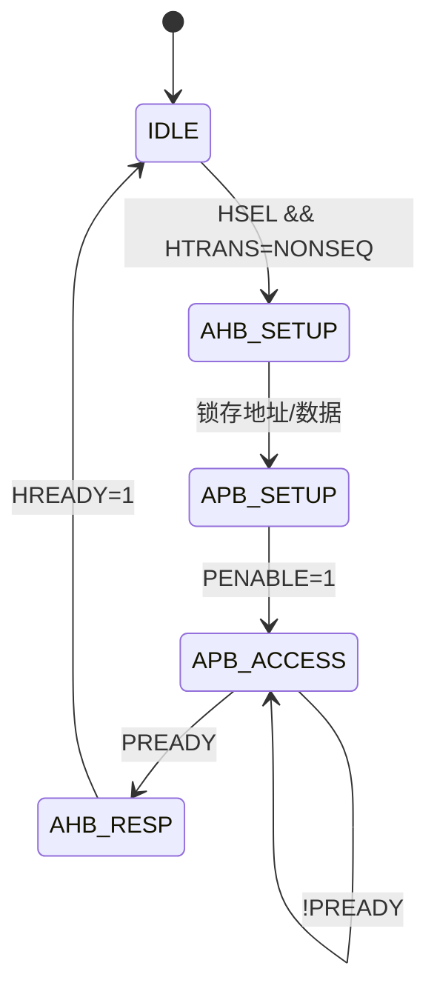
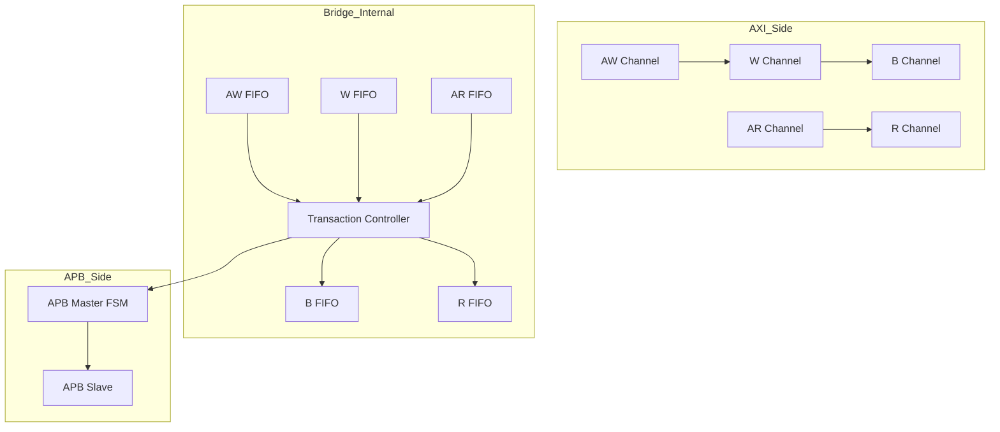

# APB桥接设计与实战

<span class="badge-i">[I]</span>

---

### 为什么需要桥接

现代SoC中，CPU/DDR控制器跑在数百MHz甚至GHz级别，<br>
而外设如UART、I2C、GPIO只需要几十MHz。<br>
<span class="red">桥接器（Bridge）</span>就是高速总线与低速总线之间的"收费站"——<br>
把高速的突发事务拆成慢速的单拍事务，同时隔离时钟域。<br>

类比：高铁站到乡村公交的换乘——<br>
乘客（数据）从高铁（AXI/AHB）下车，<br>
在候车室（FIFO/缓冲）等待，再登上乡村公交（APB）。<br>
没有桥接，高速总线被迫降速等待外设，性能浪费巨大。<br>

---

### AHB-to-APB Bridge结构

这是最常见的桥接场景：Cortex-M系列大量使用。<br>
桥接器本质是AHB从机 + APB主机，内部用状态机控制转换。<br>



信号转换逻辑：<br>
AHB侧的HADDR、HWRITE、HWDATA被锁存，映射到APB侧的PADDR、PWRITE、PWDATA。<br>
AHB的HREADYOUT由桥接器控制，在APB传输完成前拉低以插入等待状态。<br>

| AHB信号 | 方向 | APB信号 | 转换说明 |
|---------|------|---------|----------|
| HADDR | 输入 | PADDR | 直接透传（低位截断对齐） |
| HWRITE | 输入 | PWRITE | 直接透传 |
| HWDATA | 输入 | PWDATA | 直接透传 |
| HRDATA | 输出 | PRDATA | 直接透传 |
| HREADYOUT | 输出 | PREADY | 桥接器综合后驱动 |
| HRESP | 输出 | PSLVERR | 错误映射 |

---

### AXI-to-APB Bridge结构

AXI比AHB复杂得多：5个独立通道、突发传输、多拍数据。<br>
桥接器需要把AXI的突发写/读拆成多笔APB单拍事务。<br>



AXI突发写转APB流程：<br>
1. 接收AWADDR和AWLEN（突发长度N）<br>
2. 循环N次：每次发送一笔APB写（地址递增）<br>
3. 全部完成后返回BRESP=OKAY<br>

<span class="blue">易错点：AXI的W通道和AW通道是并行的，桥接器需用FIFO缓冲，等地址到来后再启动APB传输。</span><br>

---

### 寄存器映射设计

APB外设的寄存器空间通常按<span class="green">字节对齐（Byte-aligned）</span>分配：<br>

| 地址偏移 | 寄存器 | 位宽 | 访问 | 说明 |
|----------|--------|------|------|------|
| 0x00 | CTRL | 32 | R/W | 控制寄存器 |
| 0x04 | STATUS | 32 | R/W | 状态寄存器 |
| 0x08 | DATA | 32 | R/W | 数据缓冲 |
| 0x0C | INTMASK | 32 | R/W | 中断掩码 |
| 0x10 | INTSTAT | 32 | R/W1C | 中断状态（写1清零） |

位域设计示例（UART控制寄存器）：<br>

```c
// CTRL寄存器 @ 0x00
#define CTRL_TX_EN    (1 << 0)   // 发送使能
#define CTRL_RX_EN    (1 << 1)   // 接收使能
#define CTRL_PARITY   (1 << 2)   // 奇偶校验使能
#define CTRL_STOP_2   (1 << 3)   // 2位停止位
#define CTRL_BAUD_DIV (0xFFFF << 16)  // 波特率分频
```

<span class="blue">结论：寄存器按4字节对齐，控制/状态分离，中断用W1C（Write-1-to-Clear）避免读-修改-写竞争。</span><br>

---

### FPGA中的APB IP核

ARM CMSDK（Cortex-M System Design Kit）提供全套APB外设RTL：<br>

| IP核 | 功能 | 代码规模 |
|------|------|----------|
| CMSDK_APB_UART | 带FIFO的串口 | ~800行Verilog |
| CMSDK_APB_TIMER | 32位定时/计数 | ~400行Verilog |
| CMSDK_APB_GPIO | 可配置方向GPIO | ~300行Verilog |
| CMSDK_APB_WATCHDOG | 看门狗定时器 | ~350行Verilog |

CMSDK APB UART寄存器映射（典型实现）：<br>

```
Base + 0x00: DATA    (R/W)  发送/接收数据
Base + 0x04: STATE   (R)    TXFIFO/RXFIFO空满状态
Base + 0x08: CTRL    (R/W)  TX/RX使能、中断使能
Base + 0x0C: INTSTATUS/INTCLEAR (R/W1C)
Base + 0x10: BAUDDIV (R/W)  波特率分频值
```

<span class="purple">扩展：Xilinx Zynq的PS部分也大量使用APB连接低速外设，Vivado中可直接例化AXI-to-APB Bridge IP。</span><br>

---

### 代码：APB Slave RTL模板

以下是一个最小可综合的APB从机模板，实现4个32位寄存器：<br>

```verilog
module apb_slave_template (
    input         PCLK,
    input         PRESETn,
    input  [31:0] PADDR,
    input         PSEL,
    input         PENABLE,
    input         PWRITE,
    input  [31:0] PWDATA,
    input  [2:0]  PPROT,
    input  [3:0]  PSTRB,
    output reg    PREADY,
    output reg [31:0] PRDATA,
    output reg    PSLVERR
);

    // 4个寄存器，地址按4字节对齐
    reg [31:0] reg0, reg1, reg2, reg3;
    wire [3:0] addr_idx = PADDR[5:2];  // 取bit[5:2]作为寄存器索引

    // APB状态机：Idle -> Setup -> Access
    localparam ST_IDLE  = 2'b00;
    localparam ST_SETUP = 2'b01;
    localparam ST_ACC   = 2'b10;
    reg [1:0] state;

    always @(posedge PCLK or negedge PRESETn) begin
        if (!PRESETn) begin
            state  <= ST_IDLE;
            PREADY <= 1'b0;
            PSLVERR<= 1'b0;
            reg0 <= 32'h0; reg1 <= 32'h0;
            reg2 <= 32'h0; reg3 <= 32'h0;
        end else begin
            case (state)
                ST_IDLE: begin
                    PREADY <= 1'b0;
                    if (PSEL && !PENABLE)
                        state <= ST_SETUP;
                end
                ST_SETUP: begin
                    if (PSEL && PENABLE) begin
                        state  <= ST_ACC;
                        PREADY <= 1'b1;  // 无等待
                        if (PWRITE) begin
                            // 写字节掩码处理
                            if (PSTRB[0]) reg0[7:0]   <= PWDATA[7:0];
                            if (PSTRB[1]) reg0[15:8]  <= PWDATA[15:8];
                            if (PSTRB[2]) reg0[23:16] <= PWDATA[23:16];
                            if (PSTRB[3]) reg0[31:24] <= PWDATA[31:24];
                            case (addr_idx)
                                4'd0: reg0 <= PWDATA;
                                4'd1: reg1 <= PWDATA;
                                4'd2: reg2 <= PWDATA;
                                4'd3: reg3 <= PWDATA;
                                default: PSLVERR <= 1'b1;
                            endcase
                        end else begin
                            case (addr_idx)
                                4'd0: PRDATA <= reg0;
                                4'd1: PRDATA <= reg1;
                                4'd2: PRDATA <= reg2;
                                4'd3: PRDATA <= reg3;
                                default: begin
                                    PRDATA <= 32'h0;
                                    PSLVERR <= 1'b1;
                                end
                            endcase
                        end
                    end
                end
                ST_ACC: begin
                    PREADY <= 1'b0;
                    PSLVERR<= 1'b0;
                    state  <= ST_IDLE;
                end
            endcase
        end
    end

endmodule
```

<span class="blue">易错点：PSTRB仅在写操作时有效，读时应忽略；PSLVERR在无效地址访问时置位，下一拍自动清零。</span><br>

---

**学习路径提示**：<br>
- <span class="badge-i">[I]</span> 读者：掌握桥接器的核心职责——协议转换+时钟域隔离+突发拆分。<br>
- 重点练习：根据给定寄存器映射，补全APB从机的case语句和位域逻辑。
