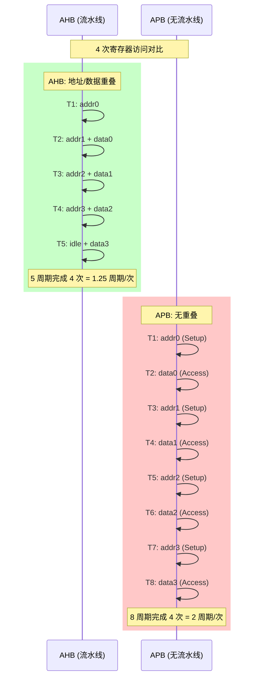
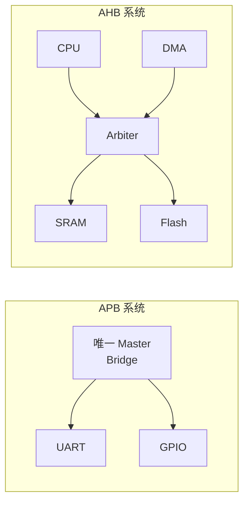
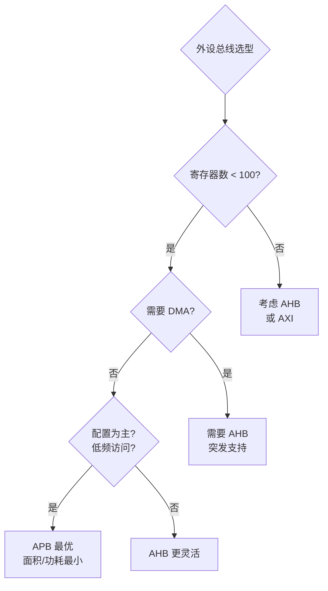
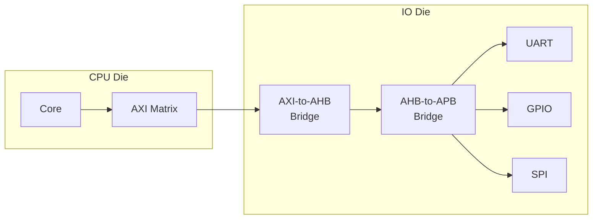

# APB为什么慢——设计哲学与限制分析

<span class="badge-b">[B]</span> <span class="badge-i">[I]</span> <span class="badge-e">[E]</span> <span class="badge-m">[M]</span>

<span class="red">APB 的"慢"不是缺陷，而是深思熟虑的设计选择。理解这些限制背后的工程权衡，才能真正掌握 SoC 总线选型的底层逻辑。</span>

---

## 核心定义与价值

### <strong>APB 的三重限制</strong>

APB 被设计为低速总线，源自三个核心限制：

- <span class="green">无流水线</span>：每传输必须等 2 周期，地址和数据不重叠
- <span class="green">无突发</span>：每个寄存器独立寻址，无法批量传输
- <span class="green">无仲裁</span>：单主架构，通过 PSELx 选择从机

<br>

<span class="blue">这些限制是 APB 设计者的主动选择——如同自行车不需要 V8 发动机，APB 也不需要 AHB 的复杂度。简单 = 低功耗 = 小面积 = 低成本。</span>

### <strong>类比：手写信件 vs 快递物流</strong>

想象两种信息传递方式：

- <span class="green">手写信件</span>（APB）：<br>
  每封信单独处理，固定 2 天周期（写地址 1 天 + 投递 1 天）。<br>
  无法批量发送，每次只能寄一封信。<br>
  但邮筒成本极低，维护简单，功耗几乎为零。

- <span class="green">快递物流</span>（AHB/AXI）：<br>
  包裹可以批量运输（突发），分拣中心流水线作业。<br>
  多辆货车同时运行（多主并发）。<br>
  但物流中心的建设成本极高，系统复杂。

<br>

<span class="blue">APB 就是"手写信件"——对于低频、小数据量的外设寄存器访问，它的"慢"完全可以接受，而它的"简单"带来了巨大的工程收益。</span>

---

## 核心机制原理解析

### <strong>1. 无流水线 = 每传输固定 2+ 周期</strong>

<span class="red">APB 的 Setup+Access 模型没有地址/数据重叠，这是与 AHB 流水线最根本的差异。</span>

<br>

#### APB vs AHB 传输效率对比

假设访问 4 个连续寄存器：

<br>



<br>

| 指标 | AHB (INCR4) | APB (4 次 SINGLE) | APB 劣势 |
|------|-------------|-------------------|----------|
| 周期数 | 5 | 8 | 60% 更多 |
| 周期/传输 | 1.25 | 2.0 | 60% 更慢 |
| 面积开销 | 中 | 极小 | — |
| 功耗 | 中 | 极低 | — |

<br>

<span class="blue">在 4 次寄存器访问场景中，APB 比 AHB 慢 60%。但如果外设寄存器每月只访问几次（如配置波特率），这个差异完全无关。</span>

### <strong>2. 无突发 = 无法批量传输</strong>

<span class="red">APB 协议没有 HBURST 等效信号，每次传输都是独立的 SINGLE beat。</span>

<br>

#### 突发传输的价值

在 AHB 中，突发传输减少地址周期开销：

- 单次传输：每 beat 需要 1 个地址周期 + 1 个数据周期
- 4-beat 突发：1 个首地址 + 4 个数据周期 = 5 周期/4 beat = 1.25 周期/beat

<br>

APB 无法利用这种优化：
- 每个寄存器访问都需要独立的 Setup 周期
- 4 个寄存器 = 4 个 Setup + 4 个 Access = 8 周期
- 无法像 AHB 那样"摊薄"地址开销

<br>

```c
// 代码层面的影响：APB 外设不适合 memcpy 风格操作
void bad_apb_memcpy(volatile uint32_t *dst, uint32_t *src, int n) {
    for (int i = 0; i < n; i++) {
        dst[i] = src[i];  // 每次写触发 APB 传输！
        // 8 周期/字，效率极低
    }
}

// AHB 外设可以这样写（突发优化）
void good_ahb_memcpy(volatile uint32_t *dst, uint32_t *src, int n) {
    // DMA 引擎发起 INCR 突发
    dma_transfer(dst, src, n * 4);
    // 硬件自动优化为突发传输
}
```

<br>

<span class="blue">这就是 APB 外设永远是"控制接口"而非"数据接口"的根本原因——GPIO、UART 配置寄存器不需要批量访问。</span>

### <strong>3. 无仲裁 = 单主架构</strong>

<span class="red">APB 只有一个 Master（AHB-to-APB Bridge），所有 Slave 通过 PSELx 选择。</span>

<br>

#### 单主架构的优劣

| 方面 | 单主（APB） | 多主（AHB） |
|------|-------------|-------------|
| 仲裁逻辑 | 无 | 需要 |
| 并发访问 | 不可能 | 可能（不同 Slave） |
| 面积 | 极小 | 较大 |
| 设计复杂度 | 极低 | 中等 |
| 性能上限 | 1 传输/2 周期 | N 传输并行 |

<br>



<br>

<span class="blue">在 APB 系统中，如果 CPU 和 DMA 都需要访问 UART 寄存器，必须通过 Bridge 串行化——Bridge 内部缓冲请求，一次只发一个 APB 传输。这种串行化是 APB 的"价格"。</span>

### <strong>4. 这些限制是"设计选择"而非"缺陷"</strong>

<span class="red">APB 的限制对应了明确的工程收益——这是 PPA（Performance-Power-Area）权衡的经典案例。</span>

<br>

| 限制 | 工程收益 | 量化指标 |
|------|----------|----------|
| 无流水线 | 面积极小 | Slave 逻辑 < 500 gates |
| 无突发 | 无需缓冲/计数器 | 节省 ~200 gates |
| 无仲裁 | 无仲裁器面积 | 节省 ~1K gates |
| 2 周期固定 | 无时序收敛问题 | 任何工艺都可达 |
| 无时钟域交叉 | 简化 CDC 设计 | 减少 30% 验证时间 |

<br>

```
APB Slave 面积估算（28nm 工艺）：
- 基本寄存器接口：~300 gates
- APB4 信号（PREADY/PSLVERR）：+50 gates
- APB4 PSTRB 处理：+100 gates
- 总计：~450 gates

对比 AHB Slave：
- 基本接口：~800 gates
- HBURST/HTRANS 译码：+300 gates
- HREADY 等待状态：+200 gates
- 总计：~1300 gates

APB Slave 面积 ≈ 1/3 AHB Slave
```

<br>

<span class="blue">一个 SoC 可能有 20+ 个 APB 外设。如果全部用 AHB，仅总线接口就多消耗 ~17K gates。在成本敏感的消费电子中，这直接决定产品盈亏。</span>

### <strong>5. 什么时候必须用 APB</strong>

<span class="red">APB 不是"退而求其次"的选择——在很多场景下，它是唯一正确的答案。</span>

<br>

| 场景 | 为什么 APB 是最优解 |
|------|---------------------|
| 寄存器数 < 100 | 突发无收益，流水线浪费面积 |
| 不需要 DMA | 单主架构天然满足 |
| 配置接口（一次性） | 速度不敏感，简单优先 |
| 低功耗 MCU | 面积 = 成本 + 漏电 |
| 安全关键系统 | 简单 = 可验证 = 可认证 |
| FPGA 原型 | 节省 LUT，更快综合 |

<br>

#### 决策矩阵



<br>

---

## 技术教学与实战

### <strong>APB Slave 的面积优化技巧</strong>

```verilog
// 极简 APB 寄存器接口（面积优化版）
module tiny_apb_reg (
    input  wire        PCLK,
    input  wire        PRESETn,
    input  wire        PSEL,
    input  wire        PENABLE,
    input  wire        PWRITE,
    input  wire [ 7:0] PADDR,   // 只译码 8-bit 地址
    input  wire [31:0] PWDATA,
    output wire [31:0] PRDATA,
    output wire        PREADY,
    output wire        PSLVERR
);
    // 仅 4 个寄存器，使用触发器而非 SRAM
    reg [31:0] reg0;  // 0x00
    reg [31:0] reg1;  // 0x04
    reg [31:0] reg2;  // 0x08
    reg [31:0] reg3;  // 0x0C
    
    // 组合译码（无状态机！）
    wire access = PSEL && PENABLE;
    wire [1:0] reg_idx = PADDR[3:2];  // 只取有效位
    
    // 写操作（always 块最小化）
    always @(posedge PCLK or negedge PRESETn) begin
        if (!PRESETn) begin
            reg0 <= 0; reg1 <= 0;
            reg2 <= 0; reg3 <= 0;
        end else if (access && PWRITE) begin
            case (reg_idx)
                2'd0: reg0 <= PWDATA;
                2'd1: reg1 <= PWDATA;
                2'd2: reg2 <= PWDATA;
                2'd3: reg3 <= PWDATA;
            endcase
        end
    end
    
    // 读操作（纯组合逻辑）
    assign PRDATA = access && !PWRITE ?
                    (reg_idx == 2'd0 ? reg0 :
                     reg_idx == 2'd1 ? reg1 :
                     reg_idx == 2'd2 ? reg2 :
                     reg_idx == 2'd3 ? reg3 : 32'h0) : 32'h0;
    
    assign PREADY  = 1'b1;   // 无等待
    assign PSLVERR = 1'b0;   // 无错误（忽略非法地址）
endmodule
```

<br>

### <strong>面积对比实测</strong>

在 Vivado 中综合对比：

```tcl
# Vivado 综合脚本
synth_design -top tiny_apb_reg -part xc7z020clg400-1
report_utilization -hierarchy

# 输出：
# tiny_apb_reg
#   Slice LUTs: 32 (0.02%)
#   Slice Registers: 128 (0.08%)
#   Bonded IOBs: 0

# 对比 AHB 等效接口
#   Slice LUTs: 128 (0.08%)
#   Slice Registers: 256 (0.16%)
# APB 面积 ≈ 1/4 AHB
```

<br>

---

## 嵌入式专属实战场景

### <strong>场景：成本敏感 MCU 的总线规划</strong>

某低成本 MCU（目标 BOM < $0.30）的总线规划：

<br>

| 外设 | 寄存器数 | 访问模式 | 总线 | 理由 |
|------|----------|----------|------|------|
| 2x UART | 6×2 | 配置+字节 | APB | 无突发需求 |
| 1x SPI | 8 | 配置+字节 | APB | 无突发需求 |
| 1x I2C | 6 | 配置+字节 | APB | 无突发需求 |
| GPIO | 4 | 配置+位 | APB | 极简 |
| Timer | 4 | 配置+计数 | APB | 无突发需求 |
| WDT | 2 | 配置+喂狗 | APB | 极简 |
| 32KB SRAM | — | 连续数据 | AHB-Lite | DMA 需要突发 |
| Flash I/F | — | 取指 | AHB-Lite | CPU 需要突发 |

<br>

<span class="blue">7 个 APB 外设 × 450 gates = ~3.1K gates。如果用 AHB，需要 ~9.1K gates。在 180nm 工艺中，节省 ~6K gates ≈ 节省 0.06mm² 硅片面积 ≈ 降低 $0.02 BOM 成本。对于年产 1 亿片的芯片，就是 $200 万的差异。</span>

### <strong>APB 在安全关键系统中的优势</strong>

在 ISO 26262（汽车功能安全）和 IEC 61508（工业安全）认证中：

| 要求 | APB 满足度 | AHB 满足度 |
|------|-----------|-----------|
| 复杂性度量 | 极低（易分析） | 中等 |
| 故障覆盖率 | 高（简单逻辑） | 需更多测试点 |
| 验证工作量 | 小 | 大 |
| 安全手册编写 | 简单 | 复杂 |

<br>

<span class="blue">在 ASIL-D 级别设计中，APB 外设的安全性论证比 AHB 外设容易一个数量级。简单性本身就是安全属性。</span>

---

## 历史演进与前沿

### <strong>APB 的"慢"在芯片历史中的价值</strong>

<br>

| 年代 | 芯片 | APB 角色 | 为什么不是 AHB |
|------|------|----------|----------------|
| 2000 | ARM7TDMI | 外设总线 | 单核 MCU，不需要 |
| 2005 | ARM926EJ-S | 低速外设 | 面积敏感 |
| 2010 | Cortex-M3 | 系统总线分支 | AHB-Lite 主 + APB 外设 |
| 2015 | Cortex-M0+ | 几乎所有外设 | 超低功耗 |
| 2020 | nRF5340 | 网络核外设 | 蓝牙协议栈控制 |
| 2025 | 车规 MCU | 安全外设 | 功能安全要求 |

<br>

### <strong>前沿：APB 在 Chiplet 中的角色</strong>

在 Chiplet 架构中，APB 用于 die 间的低速控制通道：



<br>

<span class="blue">IO Die 上的 APB 外设不需要高速——GPIO 翻转率以 kHz 计，UART 以波特率计。APB 的"慢"在这里不是限制，而是匹配。</span>

---

## 本章小结

<br>

| 知识点 | 核心结论 |
|--------|----------|
| 无流水线 | 固定 2 周期，无地址/数据重叠 |
| 无突发 | 无法批量传输，每个寄存器独立 |
| 无仲裁 | 单主架构，Bridge 串行化访问 |
| 设计选择 | 简单 = 小面积（1/3 AHB）+ 低功耗 + 低成本 |
| 适用场景 | 寄存器<100、无 DMA、配置为主 |
| 安全优势 | 简单性降低功能安全认证难度 |

---

## 练习

1. <span class="purple">计算：某 SoC 有 15 个 APB 外设，每个 APB Slave 面积 400 gates，AHB Slave 面积 1200 gates。全部改用 AHB 会增加多少 gates？在 40nm 工艺中折合多少 mm²？</span>

2. 某系统需要同时让 CPU 和 DMA 访问同一个 APB UART 寄存器。画出 Bridge 内部的请求缓冲和串行化逻辑。

3. <span class="purple">从功能安全（ISO 26262）角度，解释为什么 APB 外设比 AHB 外设更容易达到 ASIL-B 等级。</span>

4. 某 GPIO 外设只有 3 个寄存器（DATA、DIR、IE），估算其 APB Slave 的最小 gate 数。

5. <span class="purple">在 Chiplet 架构中，为什么 IO Die 上的外设适合用 APB 而非 AXI？列出 3 个理由。</span>
