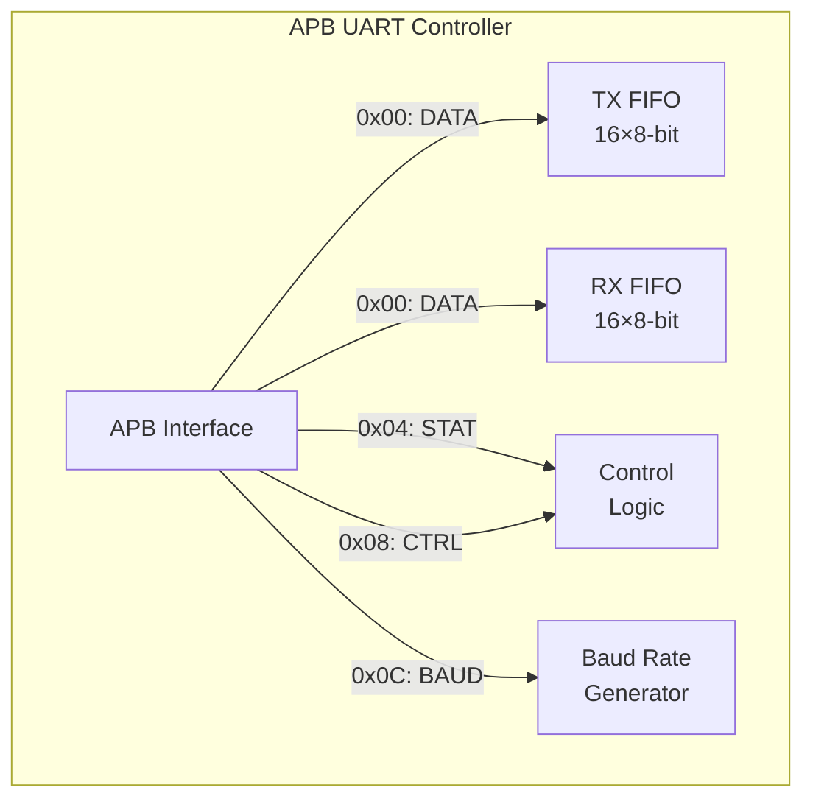
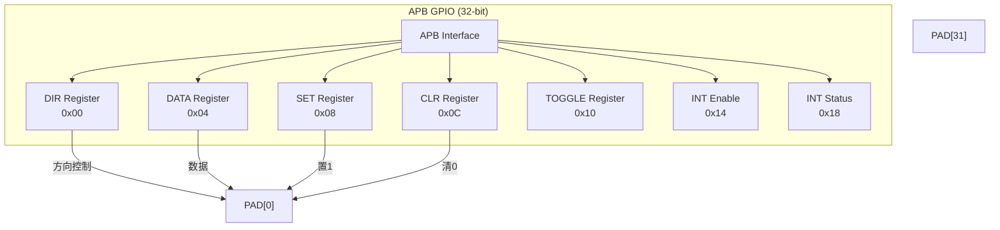
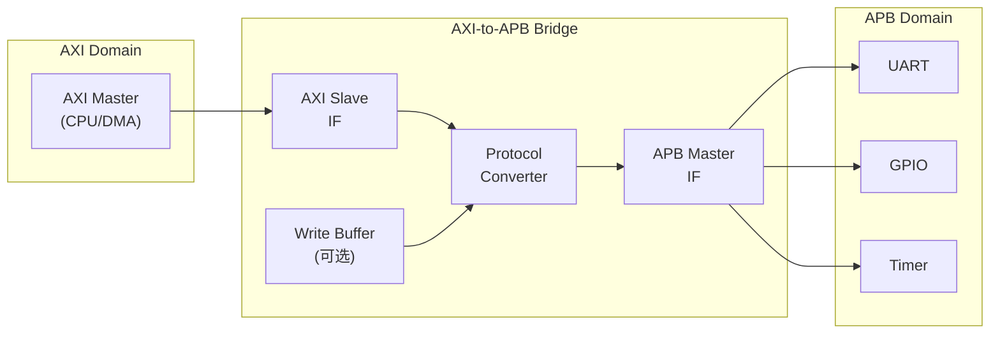
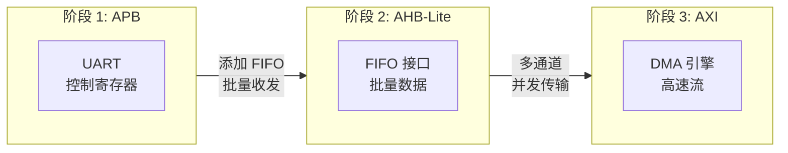
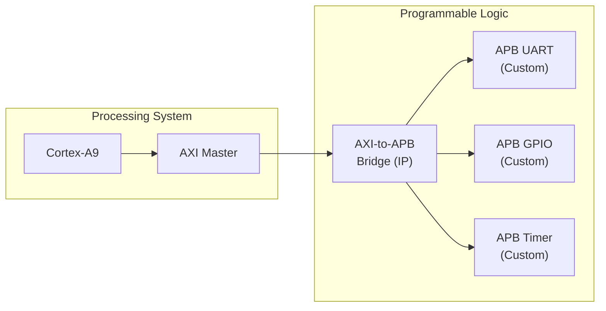
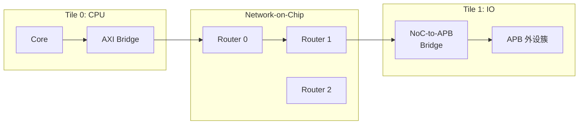

# APB往哪去——实战应用与桥接设计

<span class="badge-b">[B]</span> <span class="badge-i">[I]</span> <span class="badge-e">[E]</span> <span class="badge-m">[M]</span>

<span class="red">APB 的"往哪去"不是消失，而是持续作为 SoC 的"神经末梢"——控制外设、配置寄存器、低速接口。从 UART 到 GPIO，从 TrustZone 到 UVM 验证，APB 的实战场景远比想象中丰富。</span>

---

## 核心定义与价值

### <strong>APB 在 SoC 中的永恒角色</strong>

无论 SoC 性能如何演进，APB 永远有其位置：

<br>

| SoC 类型 | APB 用途 | 典型 APB 外设数 |
|----------|----------|----------------|
| 极简 MCU | 全部外设 | 5-10 |
| 通用 MCU | 低速外设 | 10-20 |
| 应用处理器 | IO 子系统 | 20-40 |
| 多核 SoC | 控制/监控 | 30-50 |
| FPGA SoC | 软核外设 | 10-30 |

<br>

<span class="blue">APB 是 SoC 的"最后一英里"——无论主总线多快，最终都需要 APB 连接到具体的外设寄存器。</span>

---

## 核心机制原理解析

### <strong>1. UART/SPI/I2C 控制器中的 APB 接口</strong>

<span class="red">串行通信外设天然适合 APB——它们的寄存器访问频率远低于数据传输频率。</span>

<br>

#### UART 寄存器映射（APB 接口）



<br>

| 寄存器 | 偏移 | 访问 | 作用 |
|--------|------|------|------|
| DATA | 0x00 | RW | 写=送入 TX FIFO，读=从 RX FIFO 取出 |
| STAT | 0x04 | R | TX 空/RX 满/错误标志 |
| CTRL | 0x08 | RW | 使能/中断/模式配置 |
| BAUD | 0x0C | RW | 波特率分频值 |

<br>

<span class="blue">UART 的数据寄存器每次读写只涉及 1 byte，APB 的 PSTRB[3:0] 字节选通正好支持这种访问。如果用 AHB，32-bit 数据总线的低效率（只使用 8-bit）会被放大。</span>

#### SPI 控制器的 APB 接口设计要点

```verilog
module apb_spi (
    input  wire        PCLK,
    input  wire        PRESETn,
    input  wire        PSEL,
    input  wire        PENABLE,
    input  wire        PWRITE,
    input  wire [ 7:0] PADDR,
    input  wire [31:0] PWDATA,
    input  wire [ 3:0] PSTRB,
    output reg  [31:0] PRDATA,
    output wire        PREADY,
    output wire        PSLVERR,
    // SPI 引脚
    output wire        SCK,
    output wire        MOSI,
    input  wire        MISO,
    output wire        SS_N
);
    // 寄存器
    reg [15:0] ctrl_reg;    // 0x00: 控制
    reg [ 7:0] status_reg;  // 0x04: 状态
    reg [ 7:0] txdata_reg;  // 0x08: TX 数据
    reg [ 7:0] rxdata_reg;  // 0x0C: RX 数据
    reg [15:0] clkdiv_reg;  // 0x10: 时钟分频
    
    // APB 访问逻辑
    wire access = PSEL && PENABLE;
    
    always @(posedge PCLK or negedge PRESETn) begin
        if (!PRESETn) begin
            ctrl_reg   <= 16'h0;
            clkdiv_reg <= 16'h0;
        end else if (access && PWRITE) begin
            case (PADDR)
                8'h00: if (PSTRB[1:0] == 2'b11) ctrl_reg   <= PWDATA[15:0];
                8'h08: if (PSTRB[0])           txdata_reg <= PWDATA[7:0];
                8'h10: if (PSTRB[1:0] == 2'b11) clkdiv_reg <= PWDATA[15:0];
                default: ;
            endcase
        end
    end
    
    // 读逻辑
    always @(*) begin
        case (PADDR)
            8'h00: PRDATA = {16'h0, ctrl_reg};
            8'h04: PRDATA = {24'h0, status_reg};
            8'h08: PRDATA = {24'h0, txdata_reg};
            8'h0C: PRDATA = {24'h0, rxdata_reg};
            8'h10: PRDATA = {16'h0, clkdiv_reg};
            default: PRDATA = 32'h0;
        endcase
    end
    
    assign PREADY  = 1'b1;
    assign PSLVERR = 1'b0;
    
    // SPI 引擎（独立于 APB 时钟）
    spi_engine u_engine (
        .clk(PCLK),
        .rst_n(PRESETn),
        .ctrl(ctrl_reg),
        .txdata(txdata_reg),
        .rxdata(rxdata_reg),
        .status(status_reg),
        .clkdiv(clkdiv_reg),
        .sck(SCK),
        .mosi(MOSI),
        .miso(MISO),
        .ss_n(SS_N)
    );
endmodule
```

<br>

### <strong>2. GPIO 寄存器组的 APB 映射</strong>

GPIO 是最典型的 APB 外设——寄存器少、访问简单、实时性要求低。

<br>



<br>

| 寄存器 | 偏移 | 写行为 | 读行为 |
|--------|------|--------|--------|
| DIR | 0x00 | 1=输出，0=输入 | 返回当前方向 |
| DATA | 0x04 | 写入输出值 | 返回引脚状态 |
| SET | 0x08 | 1 的位对应引脚置 1 | 忽略 |
| CLR | 0x0C | 1 的位对应引脚清 0 | 忽略 |
| TOG | 0x10 | 1 的位对应引脚翻转 | 忽略 |
| IE | 0x14 | 中断使能掩码 | 返回使能状态 |
| IS | 0x18 | 清中断标志 | 返回中断状态 |

<br>

<span class="blue">SET/CLR/TOG 寄存器是 GPIO 的设计精髓——允许软件用"写 1 修改"而非"读-改-写"原子操作，避免竞态条件。</span>

### <strong>3. AXI-to-APB Bridge 的 RTL 设计要点</strong>

<span class="red">AXI-to-APB Bridge 是 Cortex-A 系 SoC 的关键组件，负责将高速 AXI 域的信号翻译为低速 APB 协议。</span>

<br>



<br>

#### Bridge 的核心设计挑战

| 挑战 | AXI 特性 | APB 限制 | Bridge 解决方案 |
|------|----------|----------|-----------------|
| 写响应延迟 | AXI 要求 BRESP | APB 无响应通道 | Bridge 缓存并延迟响应 |
| 读数据返回 | AXI 支持乱序 | APB 顺序固定 | Bridge 串行化读请求 |
| 突发传输 | AXI 支持突发 | APB 无突发 | Bridge 拆分为多次 APB 传输 |
| 地址宽度 | AXI 64-bit | APB 32-bit | 高位截断或译码 |

<br>

```verilog
// AXI-to-APB Bridge 核心状态机
module axi_to_apb_bridge (
    // AXI Slave 接口
    input  wire        ACLK,
    input  wire        ARESETn,
    // ... AXI 信号
    // APB Master 接口
    output reg         PCLKEN,
    output reg  [ 7:0] PSEL,
    output reg         PENABLE,
    output reg         PWRITE,
    output reg  [31:0] PADDR,
    output reg  [31:0] PWDATA,
    input  wire [31:0] PRDATA,
    input  wire        PREADY,
    input  wire        PSLVERR
);
    // 状态机：将 AXI 写拆分为 APB 写序列
    localparam AXI_IDLE   = 3'b000;
    localparam AXI_WDATA  = 3'b001;  // 接收 AXI 写数据
    localparam APB_SETUP  = 3'b010;  // APB Setup
    localparam APB_ACCESS = 3'b011;  // APB Access
    localparam AXI_RESP   = 3'b100;  // 返回 AXI 响应
    
    reg [2:0] state;
    reg [31:0] latched_wdata;
    reg [31:0] latched_addr;
    reg latched_write;
    
    always @(posedge ACLK or negedge ARESETn) begin
        if (!ARESETn) begin
            state <= AXI_IDLE;
            PSEL <= 0;
            PENABLE <= 0;
        end else begin
            case (state)
                AXI_IDLE: begin
                    if (axi_awvalid && axi_awready) begin
                        latched_addr  <= axi_awaddr;
                        latched_write <= 1'b1;
                        state <= AXI_WDATA;
                    end else if (axi_arvalid && axi_arready) begin
                        latched_addr  <= axi_araddr;
                        latched_write <= 1'b0;
                        state <= APB_SETUP;
                    end
                end
                AXI_WDATA: begin
                    if (axi_wvalid) begin
                        latched_wdata <= axi_wdata;
                        state <= APB_SETUP;
                    end
                end
                APB_SETUP: begin
                    PADDR  <= latched_addr;
                    PWRITE <= latched_write;
                    PWDATA <= latched_wdata;
                    PSEL   <= decode_apb_sel(latched_addr);
                    PENABLE <= 1'b0;
                    state  <= APB_ACCESS;
                end
                APB_ACCESS: begin
                    PENABLE <= 1'b1;
                    if (PREADY) begin
                        if (!latched_write)
                            axi_rdata <= PRDATA;
                        axi_bresp <= PSLVERR ? 2'b10 : 2'b00;
                        PSEL    <= 0;
                        PENABLE <= 0;
                        state   <= AXI_RESP;
                    end
                end
                AXI_RESP: begin
                    if (latched_write) begin
                        axi_bvalid <= 1'b1;
                        if (axi_bready) begin
                            axi_bvalid <= 1'b0;
                            state <= AXI_IDLE;
                        end
                    end else begin
                        axi_rvalid <= 1'b1;
                        if (axi_rready) begin
                            axi_rvalid <= 1'b0;
                            state <= AXI_IDLE;
                        end
                    end
                end
            endcase
        end
    end
endmodule
```

<br>

### <strong>4. APB4 TrustZone 扩展（PPROT）</strong>

<span class="red">APB4 的 PPROT[2:0] 将 TrustZone 安全模型延伸到 APB 外设层级。</span>

<br>

| PPROT bit | 名称 | 值=0 | 值=1 |
|-----------|------|------|------|
| [0] | Normal/Privileged | Normal | Privileged |
| [1] | Secure/Non-secure | Secure | Non-secure |
| [2] | Instruction/Data | Data | Instruction |

<br>

```verilog
// APB4 TrustZone 访问控制
module apb4_tz_decoder (
    input  wire [ 2:0] PPROT,
    input  wire [31:0] PADDR,
    input  wire        PSEL,
    output reg         allow_access,
    output reg         force_error
);
    // 安全区域定义
    localparam SECURE_BASE   = 32'h5000_0000;
    localparam SECURE_LIMIT  = 32'h5000_FFFF;
    
    wire in_secure_region = (PADDR >= SECURE_BASE) &&
                            (PADDR <= SECURE_LIMIT);
    
    always @(*) begin
        if (!PSEL) begin
            allow_access = 1'b0;
            force_error  = 1'b0;
        end else begin
            // Non-secure 访问 Secure 区域 → ERROR
            if (in_secure_region && PPROT[1]) begin
                allow_access = 1'b0;
                force_error  = 1'b1;
            end else begin
                allow_access = 1'b1;
                force_error  = 1'b0;
            end
        end
    end
endmodule
```

<br>

<span class="blue">在 Cortex-M23/M33 中，APB4 的 PPROT[1]（Non-secure 位）由 CPU 的 SAU 输出。Trusted Firmware 通过配置 SAU，决定哪些 APB 外设可以被 Non-secure 世界访问。</span>

### <strong>5. APB 在 SoC 验证中的 UVM Testbench</strong>

<span class="red">UVM（Universal Verification Methodology）是 SoC 验证的行业标准，APB VIP（Verification IP）是验证 APB 外设的核心组件。</span>

<br>

```systemverilog
// APB UVM Agent 核心组件
class apb_agent extends uvm_agent;
    `uvm_component_utils(apb_agent)
    
    apb_sequencer sequencer;
    apb_driver    driver;
    apb_monitor   monitor;
    
    function void build_phase(uvm_phase phase);
        super.build_phase(phase);
        sequencer = apb_sequencer::type_id::create("sequencer", this);
        driver    = apb_driver::type_id::create("driver", this);
        monitor   = apb_monitor::type_id::create("monitor", this);
    endfunction
    
    function void connect_phase(uvm_phase phase);
        driver.seq_item_port.connect(sequencer.seq_item_export);
    endfunction
endclass

// APB 序列：随机寄存器访问
class apb_rand_seq extends uvm_sequence #(apb_transaction);
    `uvm_object_utils(apb_rand_seq)
    
    rand bit        write;
    rand bit [ 7:0] addr;
    rand bit [31:0] data;
    
    constraint addr_c { addr[1:0] == 2'b00; }  // 4-byte 对齐
    constraint data_c { data inside {[0:255]}; }
    
    task body();
        apb_transaction tr;
        repeat(100) begin
            `uvm_do_with(tr, {
                tr.pwrite == local::write;
                tr.paddr  == local::addr;
                tr.pwdata == local::data;
            })
        end
    endtask
endclass

// APB 覆盖率收集
class apb_coverage extends uvm_subscriber #(apb_transaction);
    covergroup apb_cg;
        addr_cp: coverpoint transaction.paddr {
            bins reg0 = {8'h00};
            bins reg1 = {8'h04};
            bins reg2 = {8'h08};
            bins reg3 = {8'h0C};
        }
        write_cp: coverpoint transaction.pwrite;
        cross addr_cp, write_cp;
    endgroup
endclass
```

<br>

---

## 技术教学与实战

### <strong>Linux 中 APB GPIO 驱动示例</strong>

```c
// drivers/gpio/gpio-apb.c
#include <linux/gpio/driver.h>
#include <linux/platform_device.h>
#include <linux/regmap.h>

struct apb_gpio_chip {
    struct gpio_chip gc;
    struct regmap *regmap;
};

// APB GPIO 寄存器偏移
#define APB_GPIO_DIR  0x00
#define APB_GPIO_DATA 0x04
#define APB_GPIO_SET  0x08
#define APB_GPIO_CLR  0x0C

static int apb_gpio_get(struct gpio_chip *gc, unsigned int offset)
{
    struct apb_gpio_chip *chip = gpiochip_get_data(gc);
    unsigned int val;
    
    // APB 读：2 周期完成
    regmap_read(chip->regmap, APB_GPIO_DATA, &val);
    return !!(val & BIT(offset));
}

static void apb_gpio_set(struct gpio_chip *gc, unsigned int offset, int value)
{
    struct apb_gpio_chip *chip = gpiochip_get_data(gc);
    unsigned int reg = value ? APB_GPIO_SET : APB_GPIO_CLR;
    
    // APB 写：2 周期完成
    regmap_write(chip->regmap, reg, BIT(offset));
}

static int apb_gpio_direction_output(struct gpio_chip *gc,
                                     unsigned int offset, int value)
{
    struct apb_gpio_chip *chip = gpiochip_get_data(gc);
    
    // 先设置方向（输出）
    regmap_update_bits(chip->regmap, APB_GPIO_DIR,
                       BIT(offset), BIT(offset));
    // 再设置初始值
    apb_gpio_set(gc, offset, value);
    return 0;
}

static int apb_gpio_probe(struct platform_device *pdev)
{
    struct apb_gpio_chip *chip;
    struct resource *res;
    void __iomem *base;
    
    chip = devm_kzalloc(&pdev->dev, sizeof(*chip), GFP_KERNEL);
    if (!chip)
        return -ENOMEM;
    
    res = platform_get_resource(pdev, IORESOURCE_MEM, 0);
    base = devm_ioremap_resource(&pdev->dev, res);
    if (IS_ERR(base))
        return PTR_ERR(base);
    
    chip->regmap = devm_regmap_init_mmio(&pdev->dev, base, NULL);
    
    chip->gc.label           = dev_name(&pdev->dev);
    chip->gc.ngpio          = 32;
    chip->gc.parent          = &pdev->dev;
    chip->gc.get             = apb_gpio_get;
    chip->gc.set             = apb_gpio_set;
    chip->gc.direction_output = apb_gpio_direction_output;
    
    return devm_gpiochip_add_data(&pdev->dev, &chip->gc, chip);
}

static const struct of_device_id apb_gpio_match[] = {
    { .compatible = "vendor,apb-gpio" },
    { }
};
MODULE_DEVICE_TABLE(of, apb_gpio_match);

static struct platform_driver apb_gpio_driver = {
    .probe = apb_gpio_probe,
    .driver = {
        .name = "apb-gpio",
        .of_match_table = apb_gpio_match,
    },
};
module_platform_driver(apb_gpio_driver);
```

<br>

### <strong>从 APB 到 AHB-Lite 再到 AXI 的升级路径</strong>

当外设从"控制型"升级为"数据型"时，总线协议需要升级：

<br>



<br>

| 升级触发条件 | 当前总线 | 目标总线 | 改动量 |
|-------------|----------|----------|--------|
| 增加 FIFO（>16 深度） | APB | AHB-Lite | Slave 接口重写 |
| 增加 DMA 支持 | AHB-Lite | AHB | +仲裁支持 |
| 多通道并发 | AHB | AXI | +通道分离 |
| 乱序需求 | AXI4-Lite | AXI4 | +ID 支持 |

<br>

<span class="blue">升级不是"全盘替换"——通常是保留 APB 控制接口，新增 AHB/AXI 数据接口。例如：保留 APB 配置寄存器，新增 AHB FIFO 数据端口。</span>

---

## 嵌入式专属实战场景

### <strong>场景：Zynq PS-PL APB 外设集成</strong>

在 Xilinx Zynq-7000 中，PL（可编程逻辑）的 APB 外设通过 AXI-to-APB Bridge 连接到 PS（处理系统）：

<br>



<br>

Vivado 配置步骤：

```tcl
# 1. 创建 AXI-to-APB Bridge
create_bd_cell -type ip -vlnv xilinx.com:ip:axi_apb_bridge:3.0 axi_apb_bridge_0

# 2. 连接 AXI 接口到 Zynq PS
connect_bd_intf_net [get_bd_intf_pins processing_system7_0/M_AXI_GP0] \
                    [get_bd_intf_pins axi_apb_bridge_0/AXI4_LITE]

# 3. 配置 APB 地址映射
set_property -dict [list \
    CONFIG.C_APB_NUM_SLAVES {3} \
    CONFIG.C_BASEADDR {0x40000000} \
    CONFIG.C_HIGHADDR {0x4000FFFF}] \
    [get_bd_cells axi_apb_bridge_0]

# 4. 连接自定义 APB 外设
connect_bd_intf_net [get_bd_intf_pins axi_apb_bridge_0/APB_M] \
                    [get_bd_intf_pins apb_uart_0/APB]
```

<br>

### <strong>场景：APB 在 RISC-V 蜂鸟 E203 中的使用</strong>

蜂鸟 E203（国产开源 RISC-V MCU）的总线架构：

<br>

| 总线 | 协议 | 连接对象 |
|------|------|----------|
| ICB（Internal Chip Bus） | 自定义 | CPU ↔ SRAM/ROM |
| AHB-Lite | 标准 | DMA、加速器 |
| APB | 标准 | UART、SPI、I2C、GPIO、Timer |

<br>

```c
// 蜂鸟 E203 的 APB 外设访问（裸机）
#define APB_UART_BASE  0x1001_0000
#define APB_GPIO_BASE  0x1002_0000

// APB 写 UART 数据寄存器
*(volatile uint32_t *)(APB_UART_BASE + 0x00) = 'A';
// APB 读 GPIO 数据
uint32_t gpio_val = *(volatile uint32_t *)(APB_GPIO_BASE + 0x04);
```

<br>

<span class="blue">蜂鸟 E203 的选择证明：即使在 RISC-V 生态中，APB 仍然是低速外设的标准选择。ICB 用于高速通路，APB 用于低速外设——分工明确。</span>

---

## 历史演进与前沿

### <strong>APB 在 SoC 架构演进中的位置</strong>

<br>

| 年代 | 架构范式 | APB 角色 | 代表 |
|------|----------|----------|------|
| 2000 | 单总线 | 外设总线 | ARM7TDMI |
| 2005 | 分层总线 | AHB 子分支 | ARM926 |
| 2010 | 总线矩阵 | 矩阵叶节点 | Cortex-A9 |
| 2015 | 多核互联 | 子系统叶节点 | Cortex-A53 |
| 2020 | Chiplet | IO Die 外设 | Apple M1 |
| 2025 | 异构集成 | 控制面总线 | 各类 AI SoC |

<br>

### <strong>前沿：APB 与片上网络（NoC）的共存</strong>

在 NoC 架构中，APB 作为"最后一公里"总线：



<br>

<span class="blue">APB 在 NoC 时代不会消失——它只是从"直接挂在总线矩阵上"变成"挂在 NoC 路由节点的叶子节点上"。协议不变，位置变了。</span>

---

## 本章小结

<br>

| 知识点 | 核心结论 |
|--------|----------|
| UART/SPI/I2C | APB 接口天然匹配字节级控制寄存器 |
| GPIO | SET/CLR/TOG 寄存器设计避免读-改-写竞态 |
| AXI-to-APB Bridge | 协议翻译 + 突发拆分 + 响应缓存 |
| APB4 TrustZone | PPROT[2:0] 实现 Secure/Non-secure 隔离 |
| UVM 验证 | APB VIP + 随机序列 + 覆盖率驱动验证 |
| 升级路径 | APB → AHB-Lite → AHB → AXI（按需升级） |
| Linux 驱动 | regmap + gpio_chip + platform_driver |

---

## 练习

1. <span class="purple">设计一个 APB I2C 控制器的寄存器映射，要求支持主模式、从模式、中断和 FIFO。</span>

2. 实现一个带 SET/CLR/TOG 功能的 APB GPIO Slave（32-bit），写出完整的 Verilog 代码。

3. <span class="purple">某 AXI-to-APB Bridge 需要将 AXI 的 8-beat INCR 突发转换为 APB 传输。计算完成这 8 次访问需要多少 APB 周期（假设无 wait states）。</span>

4. 在 UVM testbench 中，如何验证 APB4 的 PSTRB 字节选通功能？写出测试序列。

5. <span class="purple">对比蜂鸟 E203 和 Cortex-M3 的 APB 外设架构，列出至少 2 个设计差异。</span>
