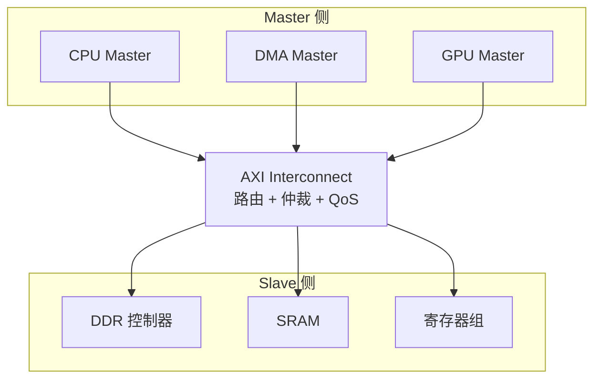

# AXI 协议基础与架构 [I→E]

> **本章学习目标**：
> - 理解 <span class="red">AXI（Advanced eXtensible Interface）</span> 的五通道分离架构
> - 掌握 AXI 的 <span class="red">主从角色定义</span> 与信号命名规范
> - 建立 AXI 与 SoC 高速互联的物理层认知

---

<span class="blue">从何而来 → 为什么需要 → 哪里用：</span><br>
<span class="red">AXI</span> 诞生于 <span class="green">2003 年</span>（AMBA 3 规范），<br>
前身是 <span class="green">AHB</span> 总线。AHB 的读写操作共享同一组地址/数据通道，<br>
当 CPU 发起读 DDR 时，DMA 引擎必须等待读完成才能发起写，<span class="blue">总线利用率不足 50%</span>。<br>
AXI 通过五通道分离架构，实现读写并行不阻塞，<span class="blue">总线利用率提升至 90% 以上</span>。<br>
如今，AXI 已成为高性能 SoC 的事实标准，广泛应用于 <span class="green">Cortex-A</span> 系列处理器、<span class="green">FPGA</span>（Xilinx Zynq）、<span class="green">AI 加速器</span>等场景。<br>

---

## AXI 协议的设计目标与核心特性

---

### <strong>为什么需要 AXI：突破 AHB 的带宽天花板</strong>

<span class="red">AXI</span> 诞生于 <span class="green">2003 年</span>（AMBA 3 规范），<br>
核心设计动机是解决 <span class="blue">AHB 的"单通道阻塞"问题</span>。<br>

在 AHB 总线上，<br>
读操作和写操作共享同一组地址/数据通道。<br>
当 CPU 发起读 DDR 时，<br>
DMA 引擎必须等待读完成才能发起写，<br>
<span class="blue">总线利用率不足 50%</span>。<br>

<span class="blue">类比理解：AXI 五通道如同"邮局分拣系统"</span><br>
* <span class="green">AW 通道</span> = 寄件人填写包裹单（写地址）<br>
* <span class="green">W 通道</span> = 传送带运送包裹（写数据）<br>
* <span class="green">B 通道</span> = 签收确认回执（写响应）<br>
* <span class="green">AR 通道</span> = 收件人填写取件单（读地址）<br>
* <span class="green">R 通道</span> = 传送带送回包裹（读数据）<br>
五个窗口独立运作，寄件和取件互不干扰。<br>

<span class="orange"><strong>1. 五通道分离：读写并行不阻塞</strong></span><br>
AXI 将读写事务拆分为 <span class="blue">5 个独立通道</span>：<br>
* <span class="green">AW（Address Write）</span>：写地址<br>
* <span class="green">W（Write Data）</span>：写数据<br>
* <span class="green">B（Write Response）</span>：写响应<br>
* <span class="green">AR（Address Read）</span>：读地址<br>
* <span class="green">R（Read Data）</span>：读数据<br>

<span class="blue">读和写的地址/数据通道完全独立，可同时满速运行。</span><br>

<span class="orange"><strong>2. 支持多主多从的互连矩阵</strong></span><br>
AXI 原生支持多个 Master 和多个 Slave 通过 <span class="green">Interconnect</span> 互联。<br>
Interconnect 内部实现仲裁、路由、QoS 调度。<br>
典型手机 SoC 中，<span class="blue">AXI Interconnect 可连接 8~16 个 Master</span>。<br>

<span class="orange"><strong>3. 面向高频率优化的流水线</strong></span><br>
AXI 支持 <span class="green">"发送地址后即可发送下一地址"</span> 的流水线模式。<br>
无需等待当前事务完成，<br>
地址通道可持续发送新请求，<br>
<span class="blue">理论带宽 = 数据宽度 × 时钟频率</span>。<br>

---

### <strong>AXI 的核心信号定义与电气特性</strong>

AXI 信号按通道分组，每组遵循统一的命名规则。<br>
通道信号命名规则为 `{通道名}_{信号名}`，例如 AWVALID、WDATA、RREADY。<br>

<span class="green">（1）全局信号</span><br>

| 信号名 | 方向 | 说明 |
| --- | --- | --- |
| ACLK | 输入 | 全局时钟，所有通道同步 |
| ARESETn | 输入 | 低电平复位，必须同步释放 |

<span class="blue">AXI 要求所有信号在 ACLK 上升沿采样，ARESETn 低电平期间所有输出信号必须拉低。</span><br>

<span class="green">（2）写地址通道（AW）</span><br>

| 信号名 | 宽度 | 说明 |
| --- | --- | --- |
| AWID | 4~8 bit | 写事务 ID，支持乱序完成 |
| AWADDR | 32/64 bit | 目标地址 |
| AWLEN | 8 bit | 突发长度（0~255，表示 1~256 beat） |
| AWSIZE | 3 bit | 每 beat 数据宽度（0=1B, 3=8B） |
| AWBURST | 2 bit | 突发类型（FIXED/INCR/WRAP） |
| AWVALID | 1 bit | Master 地址有效 |
| AWREADY | 1 bit | Slave 可接收地址 |

<span class="blue">AWVALID 和 AWREADY 的握手是 AXI 事务的起点。</span><br>

---

### <strong>AXI 的突发传输类型：INCR、FIXED、WRAP</strong>

<span class="red">突发传输（Burst）</span>是 AXI 提升带宽的核心机制。<br>
一次突发可在同一事务中连续传输多笔数据。<br>

| 突发类型 | 编码 | 行为 | 典型应用 |
| --- | --- | --- | --- |
| FIXED | 0b00 | 地址固定不变 | FIFO、寄存器批量写入 |
| INCR | 0b01 | 地址递增 | 内存连续读写 |
| WRAP | 0b10 | 地址环绕（对齐到边界） | Cache line 填充 |

<span class="blue">INCR 是最常用的突发类型，DDR 控制器必须支持 INCR 突发。</span><br>

```verilog
// AXI Master 发起 INCR 突发写（Verilog 伪代码）
assign AWADDR  = 32'h8000_0000;   // 起始地址
assign AWLEN   = 8'd15;             // 16 beat
assign AWSIZE  = 3'b010;            // 4 bytes per beat
assign AWBURST = 2'b01;             // INCR
assign AWVALID = 1'b1;
// 等待 AWREADY 握手成功后发送 WDATA[0]~WDATA[15]
```

---

## AXI 主从架构与 Interconnect 拓扑

---

### <strong>Master、Slave 与 Interconnect 的角色定义</strong>

<span class="red">AXI 互连</span>的本质是 <span class="blue">"智能路由器 + 仲裁器 + QoS 调度器"</span>。<br>

<span class="orange"><strong>1. Master（主设备）</strong></span><br>
* 发起读写请求的一方<br>
* 典型 Master：CPU、DMA、GPU、PCIe Root Complex<br>
* Master 输出 <span class="green">AR/AW + W</span> 通道，接收 <span class="green">R + B</span> 通道<br>

<span class="orange"><strong>2. Slave（从设备）</strong></span><br>
* 响应读写请求的一方<br>
* 典型 Slave：DDR 控制器、SRAM、寄存器组<br>
* Slave 接收 <span class="green">AR/AW + W</span> 通道，输出 <span class="green">R + B</span> 通道<br>

<span class="orange"><strong>3. Interconnect（互连矩阵）</strong></span><br>
* 负责 Master 到 Slave 的路由<br>
* 多主争用同一 Slave 时执行仲裁<br>
* 支持 QoS 优先级调度（保障 CPU 实时性）<br>



<span class="blue">Interconnect 是 AXI 系统的核心枢纽，决定多主系统的性能上限。</span><br>

---

### <strong>典型 SoC 中的 AXI 拓扑：以手机 SoC 为例</strong>

以 <span class="green">Cortex-A73 手机 SoC</span> 为例，AXI 拓扑如下：<br>

<span class="green">（1）系统总线（System Bus，AXI4）</span><br>
* Master：Cortex-A73 ×4、Cortex-A53 ×4、GPU Mali-G71<br>
* Slave：DDR4 控制器、L3 Cache、PCIe 控制器<br>
* Interconnect：ARM CoreLink CCI-550<br>

<span class="green">（2）外设总线（Peripheral Bus，AXI4/AXI-Lite）</span><br>
* 通过 AXI-to-AHB 桥接 USB、GMAC、SD/eMMC<br>
* 通过 AHB-to-APB 桥接 UART、I2C、SPI<br>

<span class="blue">CCI-550 的 QoS 调度确保 CPU 访存延迟 < 100ns，GPU 访存不阻塞显示刷新。</span><br>

---

### <strong>AXI-Lite：简化版 AXI 的适用场景</strong>

<span class="red">AXI-Lite</span> 是 AXI 的简化子集，<br>
面向 <span class="blue">"寄存器访问"而非"大数据传输"</span>。<br>

| 特性 | AXI4（完整版） | AXI-Lite（简化版） |
| --- | --- | --- |
| 突发传输 | 支持（最大 256 beat） | 不支持（仅单 beat） |
| 数据宽度 | 32/64/128/256/512 bit | 32/64 bit |
| 通道数量 | 5 通道 | 5 通道（但无突发控制信号） |
| 乱序完成 | 支持 | 不支持 |
| QoS | 支持 | 不支持 |
| 典型应用 | DDR、DMA、Cache | 寄存器配置、GPIO、UART 控制器 |

<span class="blue">AXI-Lite 去掉了 AWLEN、AWSIZE、AWBURST 等信号，面积减少约 40%。</span><br>

```verilog
// AXI-Lite 读事务（单 beat，无时序图）
// T1: ARVALID=1, ARADDR=0x5000_0000
// T2: ARREADY=1（握手成功）
// T3: RVALID=1, RDATA=0x1234_5678
// T4: RREADY=1（握手成功，事务结束）
```

---

## 本章小结

| 概念 | 一句话总结 |
| --- | --- |
| AXI 五通道 | AW/W/B/AR/R 独立并行，读写不阻塞 |
| 突发传输 | INCR/FIXED/WRAP 三种模式，INCR 最常用 |
| Master | 发起请求：CPU、DMA、GPU |
| Slave | 响应请求：DDR、SRAM、寄存器 |
| Interconnect | 路由 + 仲裁 + QoS 的智能互连矩阵 |
| AXI-Lite | 简化版，无突发，面向寄存器访问 |

---

## 练习

1. 为什么 AXI 要将读写地址通道分离为 AW 和 AR，而不是像 AHB 那样共用？<br>
2. 设计一个 DDR 控制器 Slave，需要支持哪些突发类型？为什么 WRAP 对 Cache 很重要？<br>
3. 对比 AXI4 和 AXI-Lite 的信号差异，说明为什么 GPIO 控制器通常用 AXI-Lite。
