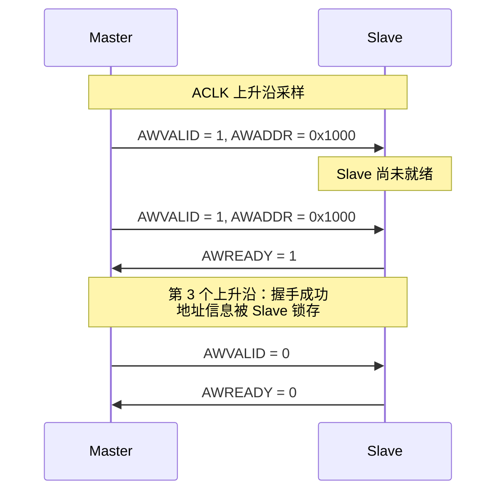

# AXI是什么——五通道架构与握手机制

<span class="badge-b">[B]</span> <span class="badge-i">[I]</span> <span class="badge-e">[E]</span> <span class="badge-m">[M]</span>

<span class="red">AXI（Advanced eXtensible Interface）</span> 是 AMBA 3 于 <span class="green">2003 年</span> 推出的高性能片上总线协议。<br>
它将读写操作彻底分离为 <span class="blue">5 个完全独立的通道</span>，每个通道拥有独立的 VALID/READY 握手信号。<br>
这种分离式设计让 CPU 读 DDR 的同时，DMA 可以写 DDR，理论上将总线利用率提升至 <span class="blue">90% 以上</span>。<br>

---

## 核心定义与价值

<span class="red">AXI 的设计初衷</span>是解决 AHB 的 "单通道瓶颈"。<br>
在 AHB 中，读写共用同一组地址/数据总线，CPU 读数据时 DMA 必须等待。<br>
实际测量显示，AHB 的 <span class="blue">有效带宽仅占理论峰值 40%～50%</span>。<br>

AXI 通过以下三招实现突破：<br>

- <span class="green">读写通道分离</span>：5 条独立流水线，地址与数据解耦。<br>
- <span class="green">VALID/READY 双握手</span>：双方均可控流，天然支持异步时钟域。<br>
- <span class="green">乱序完成（Out-of-Order）</span>：通过 AxID 标记事务，后发的读请求可先返回。<br>

### 邮局分拣系统类比

<span class="blue">把 AXI 想象成一个大型邮局的内部分拣系统：</span><br>

- <span class="green">AW 通道</span> = "寄件登记窗口"——客户填好包裹目的地信息（写地址）。<br>
- <span class="green">W 通道</span> = "包裹传送带"——包裹本体（写数据）在传送带上流动。<br>
- <span class="green">B 通道</span> = "签收确认台"——收件方签字后，回执单送回寄件方（写响应）。<br>
- <span class="green">AR 通道</span> = "查询窗口"——客户提交取件单（读地址）。<br>
- <span class="green">R 通道</span> = "取件柜台"——工作人员按单取出包裹并递给客户（读数据）。<br>

这 5 个窗口互不干扰。有人在登记窗口排队时，传送带不会停止；有人取件时，查询窗口照样接单。<br>
AHB 则像只有一个柜台的邮局，所有业务排队办理。<br>

---

## 核心机制原理解析

### <strong>1. 五通道定义与信号方向</strong>

| 通道名 | 全称 | 方向 | 核心信号 | 功能说明 |
|--------|------|------|---------|---------|
| AW | Address Write | Master → Slave | AWADDR, AWLEN, AWSIZE, AWBURST, AWVALID, AWREADY | 发送写目标地址与突发信息 |
| W | Write Data | Master → Slave | WDATA, WSTRB, WLAST, WVALID, WREADY | 发送写数据，带字节使能 |
| B | Write Response | Slave → Master | BRESP, BID, BVALID, BREADY | Slave 返回写操作完成状态 |
| AR | Address Read | Master → Slave | ARADDR, ARLEN, ARSIZE, ARBURST, ARVALID, ARREADY | 发送读目标地址与突发信息 |
| R | Read Data | Slave → Master | RDATA, RRESP, RLAST, RID, RVALID, RREADY | Slave 返回读数据与响应 |

<br>

<span class="blue">方向记忆口诀：</span><br>
地址永远从 Master 出发（AW/AR），数据永远流向接收方（W→Slave，R→Master），响应永远回 Master（B/R）。<br>

```mermaid
flowchart LR
    subgraph Master["Master"]
        M_AW["AW 通道<br/>地址→"]
        M_W["W 通道<br/>数据→"]
        M_B["B 通道<br/>←响应"]
        M_AR["AR 通道<br/>地址→"]
        M_R["R 通道<br/>←数据"]
    end
    subgraph Interconnect["Interconnect<br/>/ Switch"]
        I_AW[""]
        I_W[""]
        I_B[""]
        I_AR[""]
        I_R[""]
    end
    subgraph Slave["Slave"]
        S_AW["←地址"]
        S_W["←数据"]
        S_B["响应→"]
        S_AR["←地址"]
        S_R["数据→"]
    end
    M_AW --> I_AW --> S_AW
    M_W --> I_W --> S_W
    M_B <-- I_B <-- S_B
    M_AR --> I_AR --> S_AR
    M_R <-- I_R <-- S_R
```

<br>

### <strong>2. VALID/READY 双握手时序</strong>

<span class="red">AXI 握手的黄金法则：</span><span class="blue">信息在 ACLK 上升沿被传递，当且仅当 VALID 与 READY 同时为高。</span><br>



<br>

<span class="blue">VALID/READY 的三种时序场景：</span><br>

| 场景 | VALID 拉高时机 | READY 拉高时机 | 握手周期 | 说明 |
|------|---------------|---------------|---------|------|
| 场景 A | Master 先拉高 | Slave 后拉高 | 2+ cycle | 最常见，Slave 准备需要时间 |
| 场景 B | Slave 先拉高 | Master 后拉高 | 2+ cycle | Slave 空闲等待，Master 尚未就绪 |
| 场景 C | 同时拉高 | 同时拉高 | 1 cycle | 最佳情况，双方都已就绪 |

<br>

<span class="blue">AXI 规范对 VALID/READY 的硬性约束：</span><br>

- Master 的 <span class="green">VALID</span> 一旦拉高，<span class="blue">必须保持到握手完成</span>（不能中途撤下）。<br>
- Slave 的 <span class="green">READY</span> 可在 VALID 拉高前或拉高后拉高，<span class="blue">但不能依赖 VALID</span>（避免组合逻辑环）。<br>
- 握手完成后，双方可立即发送下一笔事务，实现 <span class="green">"背靠背（back-to-back）"</span> 传输。<br>

### <strong>3. 与 AHB/APB 的关键差异</strong>

| 特性 | AXI | AHB | APB |
|------|-----|-----|-----|
| 通道数 | 5 个独立 | 1 个共享 | 1 个共享 |
| 读写并发 | 支持 | 不支持 | 不支持 |
| 突发传输 | 支持，最多 256 beats | 支持，最多 16 beats | 不支持 |
| 乱序完成 | 支持（通过 ID） | 不支持 | 不支持 |
| 流控机制 | VALID/READY 双握手 | HREADY 单流控 | PENABLE 单脉冲 |
| 典型频率 | 200 MHz+ | 100 MHz | 50 MHz |
| 适用场景 | CPU↔DDR、AI 加速器 | DMA、以太网 MAC | UART、Timer、GPIO |

<br>

<span class="blue">一句话总结：</span><br>
APB 是 "单行道"，AHB 是 "双向单车道"，AXI 是 "双向五车道高速公路"。<br>

### <strong>4. ARM Cortex-A 系列中的 AXI 应用</strong>

| 处理器 | AXI 版本 | 数据宽度 | 典型总线拓扑 | 一致性支持 |
|--------|---------|---------|------------|-----------|
| Cortex-A8 | AXI3 | 64-bit | DMAC + NEON + L2 Cache | 无 |
| Cortex-A9 | AXI3 | 64-bit | SCU + ACP + DDR | SCU（Snoop Control Unit） |
| Cortex-A15 | AXI4 + ACE | 128-bit | CCI-400 + big.LITTLE | ACE 全一致性 |
| Cortex-A53 | AXI4 + ACE | 128-bit | CCI-400 + CCI-500 | ACE-Lite |
| Cortex-A76 | CHI | 128/256-bit | CMN-600 Mesh | CHI 原生一致性 |

<br>

<span class="blue">演进趋势：</span><br>
从 Cortex-A8 的纯 AXI3，到 A15 引入 ACE 实现多核缓存一致性，再到 A76 全面切换到 CHI，<br>
ARM 总线接口的演进始终跟随制程与核心数的增长。<br>

---

## 嵌入式专属实战场景

### <strong>AXI 握手的逻辑分析仪抓取</strong>

在 FPGA 调试中，使用 Xilinx ILA（Integrated Logic Analyzer）抓取 AXI 波形是常用手段。<br>
以下是一段典型的 ILA 触发条件配置：<br>

```tcl
# Vivado TCL：设置 ILA 触发条件为 AWVALID && AWREADY 握手
set_property TRIGGER_COMPARE_VALUE eq1'b1 [get_hw_probes awvalid]
set_property TRIGGER_COMPARE_VALUE eq1'b1 [get_hw_probes awready]
run_hw_ila [get_hw_ilas hw_ila_1] -trigger_now
wait_on_hw_ila [get_hw_ilas hw_ila_1]
display_hw_ila_data [get_hw_ilas hw_ila_1]
```

抓取到的典型波形解读：<br>

| 时间（ns） | ACLK | AWVALID | AWREADY | AWADDR | 事件 |
|-----------|------|---------|---------|--------|------|
| 0 | ↑ | 1 | 0 | 0x1000 | Master 发起写地址，Slave 未就绪 |
| 5 | ↑ | 1 | 0 | 0x1000 | 等待中 |
| 10 | ↑ | 1 | 1 | 0x1000 | <span class="blue">握手成功</span>，Slave 锁存地址 |
| 15 | ↑ | 0 | 0 | — | 通道空闲，准备下一笔 |

<span class="blue">调试技巧：</span><br>
- 如果 AWVALID 持续为高但 AWREADY 始终为低，说明 Slave 处于 <span class="green">"反压（Back-pressure）"</span> 状态。<br>
- 检查 Slave 的 FIFO 深度、DDR 刷新周期或 Interconnect 仲裁是否拥堵。<br>

---

## 技术教学与实战

### <strong>Linux 驱动中的 AXI 结构体映射</strong>

Linux 内核中，AXI 设备通常通过 Platform 设备或 AMBA 设备注册。<br>
以下结构体片段来自 `drivers/amba/bus.c`，展示 AMBA 总线如何匹配 AXI 外设：<br>

```c
/* AMBA 设备结构体 */
struct amba_device {
    struct device dev;
    struct resource res;
    struct clk *pclk;
    u32 periphid;       /* 外设 ID，从 PERIPHID0~3 寄存器读取 */
    u32 cid;            /* 组件 ID */
    struct amba_cs_uci_id uci;
    struct amba_cs_uci_id devarch;
};

/* AMBA 驱动匹配表 */
struct amba_id {
    u32 id;
    u32 mask;
    void *data;
};

/* 典型注册示例：ARM PL330 DMA */
static struct amba_id pl330_ids[] = {
    {
        .id = 0x00041330,   /* 外设 ID：设计商 ARM + 部件号 330 */
        .mask = 0x000fffff,
    },
    { 0, 0 },
};

static struct amba_driver pl330_driver = {
    .drv.name = "dma-pl330",
    .id_table = pl330_ids,
    .probe = pl330_probe,
    .remove = pl330_remove,
};
```

<span class="blue">关键字段解读：</span><br>
- `periphid` 的低 12 位是部件号（Part Number），高 8 位是设计商标识。<br>
- AMBA 总线在设备枚举时自动扫描 AXI/APB 地址空间，读取外设的 PERIPHID 寄存器完成匹配。<br>
- 这种机制无需手动指定设备地址，实现了真正的 "即插即用"。<br>

### <strong>devmem 直接观察 AXI 握手信号映射</strong>

虽然 AXI 握手信号是硬件内部信号，无法直接通过 devmem 读取，<br>
但 SoC 通常提供 <span class="green">AXI Performance Monitor（APM）</span> 寄存器映射到 APB/AXI 地址空间。<br>

```bash
# 读取 Xilinx Zynq AXI HPM 端口的性能计数器
$ devmem 0xF800A000    # AXI HPM0 总传输计数
0x0001A2F4

$ devmem 0xF800A004    # AXI HPM0 读传输计数
0x0000B180

$ devmem 0xF800A008    # AXI HPM0 写传输计数
0x00009174
```

<span class="blue">输出解读：</span><br>
- 总传输计数 = 0x1A2F4 = 107,252 次 AXI 事务。<br>
- 读事务占比 = 0xB180 / 0x1A2F4 ≈ 66%，写事务占比 ≈ 34%。<br>
- 如果读事务持续高于 80%，说明系统以数据加载为主（如视频解码、AI 推理）。<br>

---

## 历史演进与前沿

### <strong>AXI 从 3 到 5：关键特性演进</strong>

| 特性 | AXI3 | AXI4 | AXI4-Lite | AXI5 |
|------|------|------|-----------|------|
| 突发长度 | 1～16 beats | 1～256 beats | 仅单拍 | 同 AXI4 |
| QoS 信号 | 无 | 4-bit AxQOS | 无 | 扩展 QoS + Trace |
| 数据宽度 | 最高 128-bit | 最高 1024-bit | 32/64-bit | 最高 1024-bit |
| 原子操作 | 无 | 有限 | 无 | 全序原子操作 |
| 信任域 | 无 | AxPROT[1] | AxPROT[1] | 扩展安全属性 |
| 目标场景 | 移动 SoC | 通用高性能 | 寄存器访问 | 汽车/安全关键 |

<br>

<span class="blue">AXI4-Lite 是 AXI4 的简化子集：</span><br>
- 不支持突发传输，每笔事务只传输 1 个数据 beat。<br>
- 所有传输必须在 1 个时钟周期内完成地址阶段。<br>
- 常用于 GPIO、中断控制器、定时器等 "寄存器型" 外设。<br>

---

## 本章小结

| 维度 | 要点 |
|------|------|
| 是什么 | AXI 是 ARM AMBA 3 推出的 5 通道高性能片上总线 |
| 五通道 | AW/W/B（写侧）+ AR/R（读侧），完全分离 |
| 握手机制 | VALID/READY 双握手，双方均可控流，支持异步时钟域 |
| 与 AHB 差异 | 读写并发、乱序完成、更长的突发、QoS 支持 |
| 调试工具 | Vivado ILA 抓取波形 + AXI Performance Monitor 寄存器 |
| 前沿趋势 | AXI5 增强原子操作与安全属性，CHI 逐步取代 AXI |

---

## 练习

1. 画出 AXI 5 通道的信号方向图，标注每个通道的 VALID/READY 属于哪一方（Master 或 Slave）。<br>

2. 为什么 AXI 规范禁止 Slave 的 READY 信号依赖 VALID 信号的组合逻辑？<br>
   <span class="purple">提示：考虑 "组合逻辑环（combinational loop）" 与后端时序收敛。</span><br>

3. 在 ILA 抓取中，发现 AWVALID 持续为高超过 100 个时钟周期但 AWREADY 始终为低。<br>
   列举 3 种可能原因及排查方向。<br>

4. 对比 AXI4 与 AXI4-Lite，在什么场景下你会选择 Lite 而不是完整 AXI4？<br>
   <span class="purple">提示：从外设类型、面积开销、时序复杂度三个维度思考。</span><br>

5. 查阅 ARM IHI 0022F《AMBA AXI and ACE Protocol Specification》，找到 VALID/READY 握手的
   完整规范条文（Appendix A），摘录其中关于 "VALID must not wait for READY" 的原文。<br>
