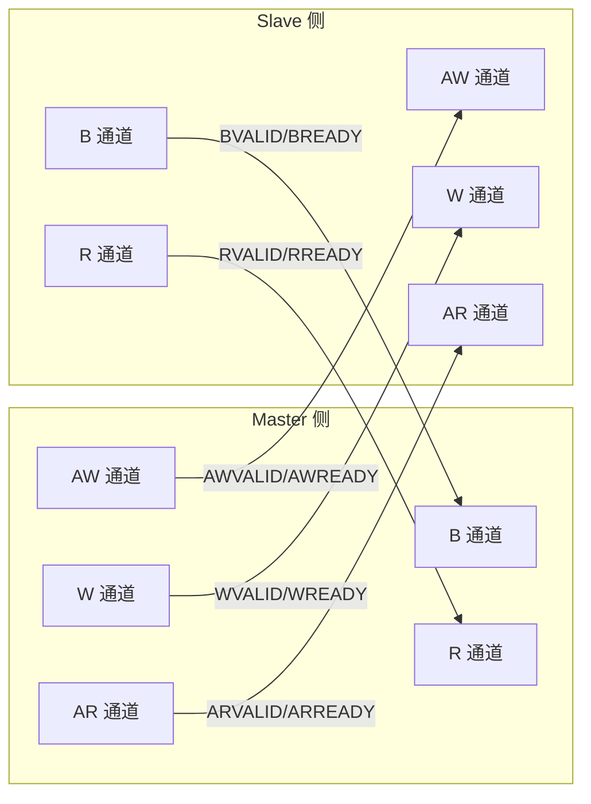
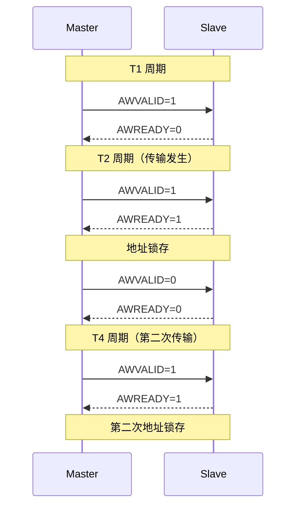
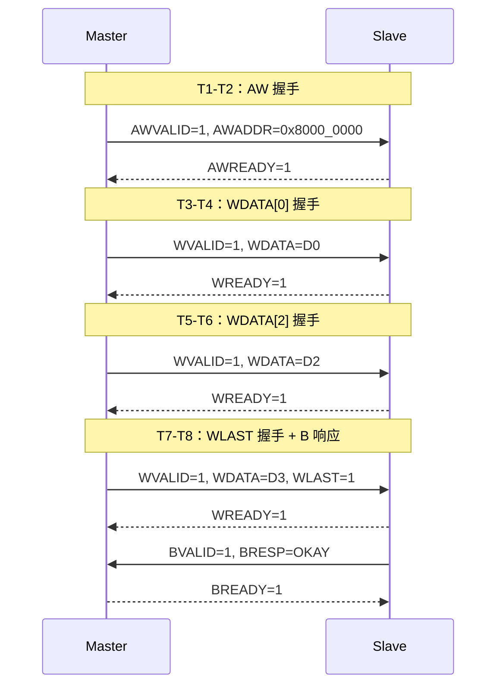
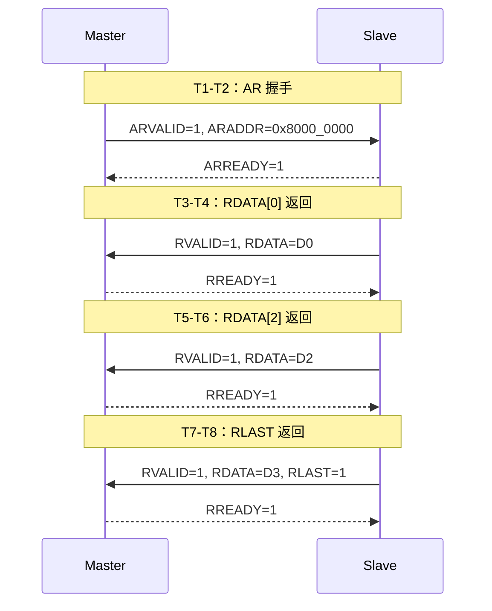

# AXI 五通道与握手机制 [I→E]

> **本章学习目标**：
> - 理解 <span class="red">AXI 五通道的独立握手</span> 机制
> - 掌握 <span class="red">VALID/READY</span> 双向握手的时序细节
> - 学会用逻辑分析仪抓取并解析 AXI 波形

---

<span class="blue">从何而来 → 为什么需要 → 哪里用：</span><br>
<span class="red">AXI 的握手机制</span>继承自 <span class="green">AMBA 3</span> 规范（2003 年）。<br>
传统总线（如 <span class="green">APB</span>）使用固定时序，Master 和 Slave 必须在同一拍完成传输，<br>
导致高速场景下时序紧张、设计困难。<span class="blue">AXI 引入 VALID/READY 双向握手，允许双方各自决定何时就绪，解决了跨时钟域和不同速度设备间的同步问题。</span><br>
如今，握手机制是 AXI、<span class="green">AHB</span>、<span class="green">TileLink</span> 等现代总线的通用设计模式。<br>

---

## AXI 五通道的独立流水线

---

### <strong>五通道架构：读写事务的物理分离</strong>

<span class="red">AXI 的核心创新</span>在于将读写事务拆分为 <span class="blue">5 个完全独立的通道</span>。<br>
每个通道有独立的 <span class="green">VALID/READY</span> 握手信号。<br>

<span class="blue">类比理解：AXI 五通道如同"五条独立传送带"</span><br>
每条传送带有自己的启动/停止按钮（VALID/READY），<br>
货物（数据/地址）在传送带上单向流动，<br>
五条传送带同时运行，互不干扰。<br>

<span class="orange"><strong>1. 写地址通道（AW）</strong></span><br>
传输写操作的目标地址和突发控制信息。<br>
Master 发送 <span class="green">AWVALID</span>，Slave 回应 <span class="green">AWREADY</span>。<br>
握手成功后，地址信息被 Slave 锁存。<br>

<span class="orange"><strong>2. 写数据通道（W）</strong></span><br>
传输实际写数据，可含字节使能（WSTRB）。<br>
支持 <span class="blue">"提前发送数据"</span>：W 通道可在 AW 握手前开始。<br>

<span class="orange"><strong>3. 写响应通道（B）</strong></span><br>
Slave 通知 Master 写事务完成状态。<br>
<span class="blue">每个写事务必须收到 BRESP 响应，Master 才能释放事务 ID。</span><br>

<span class="orange"><strong>4. 读地址通道（AR）</strong></span><br>
传输读操作的目标地址和突发控制信息。<br>
与 AW 通道完全对称，但方向相反。<br>

<span class="orange"><strong>5. 读数据通道（R）</strong></span><br>
Slave 返回读数据和响应状态。<br>
支持 <span class="blue">乱序完成</span>：先发起的读可能后完成。<br>



<span class="blue">5 个通道物理分离，可同时活跃，Master 和 Slave 各自管理 5 组握手信号。</span><br>

---

### <strong>VALID/READY 双向握手：AXI 的节拍控制</strong>

<span class="red">AXI 的握手</span>机制是 <span class="blue">"源端主动，目的端应答"</span>。<br>

| 信号 | 方向 | 含义 |
| --- | --- | --- |
| VALID | 源端 → 目的端 | 我准备好数据/控制了 |
| READY | 目的端 → 源端 | 我可以接收了 |
| 传输发生 | 两者同时为高 | 当前时钟上升沿采样 |

<span class="blue">握手规则：VALID 一旦拉高必须保持，直到 READY 也为高，两者同时高时完成传输。</span><br>



<span class="blue">T2 和 T4 是握手成功点，VALID 和 READY 同时为高时传输发生。</span><br>

---

### <strong>通道间的依赖关系与死锁避免</strong>

AXI 规范严格定义了 <span class="blue">"通道间的依赖规则"</span>，<br>
违反规则会导致 <span class="red">死锁</span>。<br>

| 依赖关系 | 规则 | 原因 |
| --- | --- | --- |
| AW → W | 允许 W 先于 AW | 数据可提前准备 |
| AW → B | B 必须在 AW 握手后 | 响应需要对应地址 |
| W → B | B 必须在最后一个 W 后 | 响应表示数据已接收 |
| AR → R | R 必须在 AR 握手后 | 必须先知道读什么 |
| B → 新 AW | 无强制依赖 | 可连续发多个写 |
| R → 新 AR | 无强制依赖 | 可连续发多个读 |

<span class="blue">关键死锁场景：如果 Slave 在收到 WLAST 之前不回应 BVALID，Master 不发送 WLAST，则死锁。</span><br>

```verilog
// Slave 写响应逻辑（安全实现）
always @(posedge ACLK) begin
  if (WVALID && WREADY && WLAST)
    bvalid_pending <= 1'b1;  // 收到最后数据后准备响应
end

assign BVALID = bvalid_pending;  // 确保 B 在 WLAST 后发出
```

---

## 写事务与读事务的完整时序

---

### <strong>写事务时序：AW → W → B 的流水示例</strong>

以 <span class="green">"向地址 0x8000_0000 写入 4 个 32-bit 数据"</span>为例：<br>



<span class="blue">注意：AW 和 W 通道可重叠，W 可在 AW 握手前开始，但 B 必须在 WLAST 之后。</span><br>

---

### <strong>读事务时序：AR → R 的流水示例</strong>

以 <span class="green">"从地址 0x8000_0000 读取 4 个 32-bit 数据"</span>为例：<br>



<span class="blue">读通道没有 B 通道，RRESP 随最后一个 RDATA 返回。</span><br>

---

### <strong>逻辑分析仪抓取 AXI 波形的实战技巧</strong>

<span class="orange"><strong>1. 信号连接与触发设置</strong></span><br>

使用 <span class="green">Saleae Logic Pro 16</span> 或 <span class="green">DSLogic</span>：<br>
* 必须抓取：ACLK、ARESETn、AWVALID/AWREADY、WVALID/WREADY/WLAST、BVALID/BREADY<br>
* 采样率：<span class="blue">≥4× ACLK 频率</span>（如 ACLK=100MHz，采样率≥400MHz）<br>
* 触发条件：<span class="green">AWVALID && AWREADY</span>（捕捉事务起点）<br>

<span class="orange"><strong>2. 波形解析脚本</strong></span><br>

```python
# parse_axi.py：从 CSV 解析 AXI 事务
import csv

def parse_axi_write(csv_file):
    with open(csv_file) as f:
        reader = csv.DictReader(f)
        txn = []
        for row in reader:
            if row['AWVALID'] == '1' and row['AWREADY'] == '1':
                txn.append({
                    'addr': row['AWADDR'],
                    'len': int(row['AWLEN']),
                    'burst': row['AWBURST']
                })
        return txn

# 输出： [{'addr': '0x80000000', 'len': 15, 'burst': 'INCR'}]
```

<span class="orange"><strong>3. 常见异常波形识别</strong></span><br>

| 异常现象 | 波形特征 | 根因 |
| --- | --- | --- |
| 写无响应 | AW/W 握手后 BVALID 永远为 0 | Slave 未实现 B 通道或死锁 |
| 读无数据 | AR 握手后 RVALID 永远为 0 | Slave 未实现 R 通道 |
| 握手卡死 | VALID=1 但 READY 持续为 0 | 目的端未就绪或复位异常 |
| 数据错位 | WDATA 与 AWADDR 不匹配 | 地址计算错误 |

---

## 本章小结

| 概念 | 一句话总结 |
| --- | --- |
| 五通道 | AW/W/B 写事务，AR/R 读事务，物理分离 |
| VALID/READY | 源端主动，目的端应答，同时高时传输 |
| 通道依赖 | W 可在 AW 前，B 必须在 WLAST 后 |
| 写时序 | AW → W（可重叠）→ B（收尾） |
| 读时序 | AR → R（RLAST 标志结束） |
| 死锁避免 | Slave 收到 WLAST 后必须发 BVALID |

---

## 练习

1. 为什么 AXI 允许 W 通道先于 AW 通道？这在什么场景下有用？<br>
2. 如果 Slave 在收到 WLAST 后才拉高 BVALID，Master 在收到 BVALID 后才发下一个 AW，这是否会死锁？为什么？<br>
3. 用逻辑分析仪抓取一次 AXI 突发写，验证 AWLEN 与实际传输的 beat 数是否一致。
