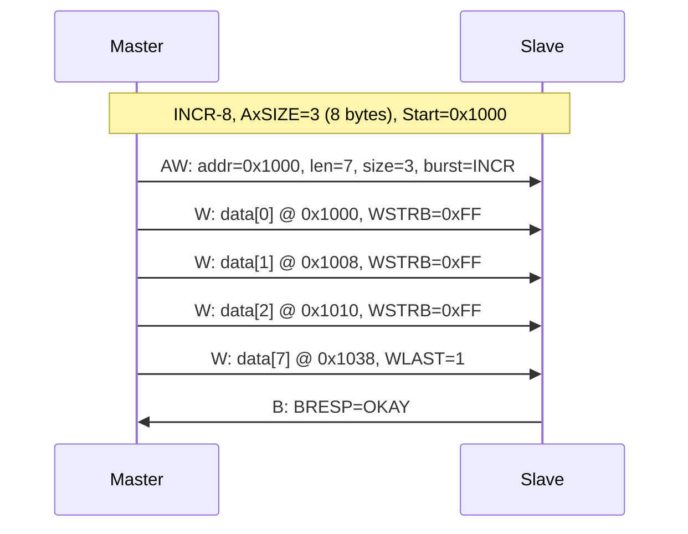
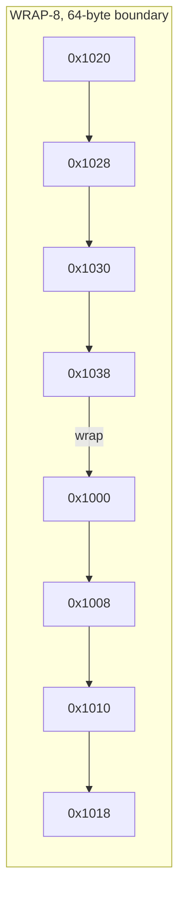

# AXI怎么做——突发传输与地址计算

<span class="badge-b">[B]</span> <span class="badge-i">[I]</span> <span class="badge-e">[E]</span> <span class="badge-m">[M]</span>

<span class="red">突发传输（Burst Transfer）</span>是 AXI 提升总线效率的核心手段。<br>
传统单拍传输中，地址阶段占 <span class="blue">50% 以上的总线周期</span>，数据阶段仅占另一半。<br>
突发传输将一次地址阶段的"成本"摊薄到多个数据 beat 上，地址开销降至 <span class="blue">5% 以下</span>。<br>

---

## 核心定义与价值

<span class="red">AXI 突发传输的本质</span>是：Master 在地址通道中一次性声明"本次要传输多少数据、怎么增长地址"，<br>
后续的数据通道只需连续推送 beat，无需重复发送地址。<br>

一次突发传输由 3 个关键字段定义：<br>

- <span class="green">AxLEN</span>：突发长度，表示本次突发包含多少个数据 beat。<br>
- <span class="green">AxSIZE</span>：每 beat 的数据宽度，以 2 的幂次表示字节数。<br>
- <span class="green">AxBURST</span>：突发类型，决定地址如何递增。<br>

### 快递批量发货类比

<span class="blue">把突发传输想象成快递公司的"批量发货"：</span><br>

- <span class="green">单拍传输</span> = 每件包裹单独填一张快递单，填单时间 = 发货时间。<br>
  发 16 件包裹要填 16 张单，效率极低。<br>

- <span class="green">突发传输</span> = 填一张"批量发货单"，写明"从 1 号楼开始，连续送 16 户"。<br>
  送货员只需要挨家挨户走一遍，不需要每送一户都回公司填单。<br>

- <span class="green">AxBURST = INCR</span> = "地址依次递增"，就像挨家挨户按门牌号送货。<br>
- <span class="green">AxBURST = WRAP</span> = "地址绕回边界"，就像环形走廊，走到尽头自动回到起点。<br>
- <span class="green">AxBURST = FIXED</span> = "地址固定不变"，就像往同一个信箱塞 16 封信。<br>

---

## 核心机制原理解析

### <strong>1. AxLEN / AxSIZE / AxBURST 字段级解析</strong>

这三个字段同时出现在 <span class="green">AW 通道</span>（写）和 <span class="green">AR 通道</span>（读）中。<br>

#### <span class="green">AxLEN[7:0]</span> — 突发长度

| AxLEN 值 | AXI3 实际 beats | AXI4 实际 beats | 说明 |
|---------|----------------|----------------|------|
| 0x00 | 1 | 1 | 单拍传输（AXI4-Lite 唯一模式） |
| 0x01 | 2 | 2 | 2-beat 突发 |
| 0x0F | 16 | 16 | AXI3 最大突发 |
| 0xFF | — | 256 | <span class="blue">AXI4 最大突发</span> |

<span class="blue">AXI3 的突发长度 = AxLEN + 1，范围 1～16。</span><br>
<span class="blue">AXI4 的突发长度 = AxLEN + 1，范围 1～256。</span><br>

#### <span class="green">AxSIZE[2:0]</span> — 每 beat 字节数

| AxSIZE | 字节数 | 典型应用场景 |
|--------|-------|------------|
| 0b000 | 1 byte | 字节访问（极少用） |
| 0b001 | 2 bytes | 16-bit 外设 |
| 0b010 | 4 bytes | 32-bit 寄存器访问 |
| 0b011 | 8 bytes | 64-bit 双字访问 |
| 0b100 | 16 bytes | 128-bit 向量操作 |
| 0b101 | 32 bytes | 256-bit AVX 宽度 |
| 0b110 | 64 bytes | 512-bit AVX-512 |
| 0b111 | 128 bytes | 1024-bit 极宽总线 |

<span class="blue">字节数 = 2^AxSIZE，因此 AxSIZE = 0b011 表示 8 bytes/beat。</span><br>

#### <span class="green">AxBURST[1:0]</span> — 突发类型

| 编码 | 类型 | 地址行为 | 典型应用 |
|------|------|---------|---------|
| 0b00 | FIXED | 地址不变 | GPIO 批量设置、FIFO 填充 |
| 0b01 | INCR | 地址递增 | DDR 读写、帧缓冲区访问 |
| 0b10 | WRAP | 地址递增并绕回边界 | Cache line 填充、环形缓冲区 |
| 0b11 | 保留 | — | 非法，Slave 应返回 DECERR |

<br>

### <strong>2. INCR / WRAP / FIXED 三种突发类型的地址计算</strong>

#### INCR 突发：线性地址增长

<span class="red">地址公式：</span><br>
Address_N = Start_Address + N × Number_Bytes<br>
其中 Number_Bytes = 2^AxSIZE，N 为 beat 序号（从 0 开始）。<br>



<br>

#### WRAP 突发：环形地址绕回

<span class="red">WRAP 的核心约束：</span>突发长度必须是 2、4、8 或 16 beats，且起始地址必须与突发长度对齐。<br>

<span class="blue">地址绕回边界 = Burst_Length × Number_Bytes</span><br>
当地址增长到边界时，自动绕回到对齐边界。<br>

例如：WRAP-8，AxSIZE=3（8 bytes），Start=0x1020：<br>
- 对齐边界 = 8 × 8 = 64 bytes，即 0x1000 对齐到 64-byte。<br>
- 0x1020 属于 0x1000～0x1040 这个 64-byte block。<br>
- 地址序列：0x1020 → 0x1028 → 0x1030 → 0x1038 → <span class="blue">绕回</span> → 0x1000 → 0x1008 → 0x1010 → 0x1018。<br>



<br>

#### FIXED 突发：地址恒定

所有 beat 的地址都等于 Start_Address。<br>
典型应用：向同一个 GPIO 输出寄存器写入多个值，或向 FIFO 端口连续推送数据。<br>

### <strong>3. 4KB Boundary 地址对齐规则</strong>

<span class="red">AXI 规范的硬性约束：</span><span class="blue">任何突发传输不得跨越 4KB 地址边界。</span><br>

原因：大多数 Slave（如 DDR 控制器、PCIe 桥接器）以 <span class="green">4KB 页</span> 为单位进行地址译码。<br>
如果一笔突发跨越 4KB 边界，后一半数据会被路由到错误的 Slave，导致数据混乱。<br>

<span class="blue">软件层面的应对：</span><br>
当传输长度可能跨越 4KB 时，Master 必须将突发拆分为两笔：<br>
第一笔在 4KB 边界前结束，第二笔从边界处重新开始。<br>

```c
/* Linux DMA 驱动中的 4KB boundary 拆分逻辑 */
static size_t axi_align_transfer(struct device *dev, dma_addr_t addr,
                                  size_t len, size_t burst_max)
{
    size_t page_offset = addr & (4096 - 1);
    size_t to_boundary = 4096 - page_offset;

    /* 如果本次传输跨越 4KB，限制第一笔长度 */
    if (to_boundary < len && to_boundary < burst_max)
        return to_boundary;

    return min(len, burst_max);
}
```

<span class="blue">函数解读：</span><br>
- `page_offset = addr & 0xFFF` 计算起始地址在 4KB 页内的偏移。<br>
- `to_boundary = 4096 - page_offset` 计算到 4KB 边界的剩余字节数。<br>
- 如果 `to_boundary < len`，说明本次传输会跨越边界，必须拆分。<br>

---

## 嵌入式专属实战场景

### <strong>DDR 控制器中的突发长度配置</strong>

在 ARM Cortex-A 系列中，L2 Cache 通过 AXI 向 DDR 控制器发起突发读请求。<br>
DDR3/DDR4 内存本身也支持突发（BL=4/8），因此 AXI 突发长度应与 DDR 突发长度匹配。<br>

| 场景 | AXI AxLEN | DDR BL | 匹配说明 |
|------|----------|--------|---------|
| 32-bit 数据总线，DDR BL=8 | 7（8 beats） | 8 | 1:1 匹配，无浪费 |
| 64-bit 数据总线，DDR BL=8 | 3（4 beats） | 8 | AXI 4 beats × 64-bit = DDR 8 beats × 32-bit |
| 128-bit 数据总线，DDR BL=8 | 1（2 beats） | 8 | 需数据总线位宽匹配 |

<span class="blue">不匹配的后果：</span><br>
如果 AXI 突发长度远小于 DDR BL，DDR 控制器需要缓存多次 AXI 事务才能凑满一次 DDR 突发，<br>
导致额外的排队延迟与行激活开销。<br>

---

## 技术教学与实战

### <strong>Verilog 地址生成器：INCR 突发</strong>

以下是一个可综合的 AXI INCR 突发地址生成模块：<br>

```verilog
module axi_incr_addr_gen (
    input        ACLK,
    input        ARESETn,
    input        start,           // 突发开始
    input  [31:0] start_addr,     // 起始地址
    input  [7:0]  axlen,          // 突发长度 - 1
    input  [2:0]  axsize,         // 2^axsize bytes/beat
    output [31:0] addr_out,       // 当前 beat 地址
    output        addr_valid,
    input         addr_ready,
    output        last_beat       // 最后一拍
);

    reg [7:0]  beat_cnt;
    reg [31:0] current_addr;
    reg        busy;

    wire [31:0] num_bytes = 32'd1 << axsize;
    wire [31:0] next_addr = current_addr + num_bytes;

    assign addr_out  = current_addr;
    assign addr_valid = busy;
    assign last_beat  = busy && (beat_cnt == axlen);

    always @(posedge ACLK) begin
        if (!ARESETn) begin
            busy        <= 1'b0;
            beat_cnt    <= 8'd0;
            current_addr <= 32'd0;
        end else if (start && !busy) begin
            busy        <= 1'b1;
            beat_cnt    <= 8'd0;
            current_addr <= start_addr;
        end else if (busy && addr_valid && addr_ready) begin
            if (beat_cnt == axlen) begin
                busy <= 1'b0;
            end else begin
                beat_cnt     <= beat_cnt + 1'b1;
                current_addr <= next_addr;
            end
        end
    end
endmodule
```

<span class="blue">代码解读：</span><br>
- `num_bytes = 1 << axsize` 将 AxSIZE 转换为实际字节数。<br>
- 每 beat 握手成功后（`addr_valid && addr_ready`），地址自动递增 `num_bytes`。<br>
- `last_beat` 信号在 `beat_cnt == axlen` 时拉高，与 AXI WLAST/RLAST 对齐。<br>

### <strong>Linux 内核中的突发长度解析</strong>

Linux DMA 引擎框架在准备 AXI 传输时，需要将软件请求转换为硬件 AxLEN/AxSIZE。<br>
以下片段来自 `drivers/dma/dmaengine.c`：<br>

```c
/* 将软件描述的传输转换为 AXI 突发参数 */
static void dma_config_to_axi(struct dma_slave_config *cfg,
                               u32 *axsize, u32 *axlen,
                               size_t max_burst)
{
    size_t bus_width = cfg->src_addr_width;

    /* 计算 AxSIZE：取不大于总线宽度的 2 的幂 */
    *axsize = ilog2(bus_width);

    /* 计算 AxLEN：突发长度不超过硬件限制，且不跨 4KB */
    size_t beat_bytes = 1U << *axsize;
    size_t max_beats = max_burst / beat_bytes;
    if (max_beats > 256)
        max_beats = 256;        /* AXI4 上限 */
    *axlen = max_beats - 1;     /* AxLEN = beats - 1 */
}
```

<span class="blue">关键逻辑：</span><br>
- `ilog2(bus_width)` 将字节宽度映射为 AxSIZE 编码。<br>
- 突发长度受两个限制：硬件 FIFO 深度（`max_burst`）和 AXI4 的 256 beat 上限。<br>
- 实际驱动中还需加入 4KB boundary 检查，上文已展示。<br>

---

## 历史演进与前沿

### <strong>突发长度演进：从 AHB 到 CHI</strong>

| 协议 | 最大突发 beats | 最大传输字节 | 4KB 限制 | 备注 |
|------|--------------|------------|---------|------|
| AHB | 16 | 64 × 16 = 1KB | 无 | 单通道共享 |
| AXI3 | 16 | 128 × 16 = 2KB | 有 | 读写分离 |
| AXI4 | 256 | 1024 × 256 = 256KB | 有 | 长突发优化 DDR 效率 |
| AXI5 | 256 | 1024 × 256 = 256KB | 有 | 增强原子操作 |
| CHI | 无固定 | 包化，无突发概念 | 无 | 请求-数据解耦 |

<br>

<span class="blue">CHI 的范式转移：</span><br>
CHI 不再使用 "突发传输" 这一概念，而是将大数据量拆分为多个独立的请求-响应对。<br>
每个请求携带一个唯一的 Transaction ID，数据通过 DAT 包按需返回。<br>
这种设计天然支持乱序和交织，无需像 AXI 那样预定义突发长度。<br>

---

## 本章小结

| 维度 | 要点 |
|------|------|
| 是什么 | 突发传输用一次地址阶段摊薄多 beat 数据，降低地址开销至 5% 以下 |
| AxLEN | 8-bit，AXI4 范围 0～255（实际 beats = AxLEN+1，最大 256） |
| AxSIZE | 3-bit，字节数 = 2^AxSIZE，范围 1～128 bytes |
| AxBURST | 2-bit：FIXED/INCR/WRAP，WRAP 必须对齐到 burst_length × bytes |
| 4KB 规则 | 任何突发不得跨越 4KB 边界，软件需拆分传输 |
| 前沿趋势 | CHI 弃用突发概念，改用包化请求-响应 |

---

## 练习

1. 计算一次 INCR 突发的总传输字节数：AxLEN=15，AxSIZE=3，AxBURST=INCR。<br>
   这次传输是否会跨越 4KB 边界？起始地址 0x1000 时，最后一 beat 的地址是多少？<br>

2. 为什么 WRAP 突发的长度只能是 2、4、8 或 16 beats？<br>
   <span class="purple">提示：从地址对齐与二进制掩码的角度推导。</span><br>

3. 在 64-bit 数据宽度（AxSIZE=3）的系统中，DDR 控制器的 BL=8。<br>
   为了使 AXI 突发与 DDR burst 完美匹配，AxLEN 应配置为多少？<br>

4. 给定起始地址 0x1024，AxSIZE=2（4 bytes/beat），AxLEN=7，AxBURST=WRAP。<br>
   列出所有 8 个 beat 的地址序列，并标注绕回点。<br>

5. 查阅 ARM IHI 0022F 规范第 A3-50 页，找到关于 4KB boundary 的完整条文。<br>
   摘录规范对 Master 和 Slave 的各自要求。<br>
   <span class="purple">延伸阅读：ARM《AMBA AXI Protocol Specification》Issue F。</span><br>
