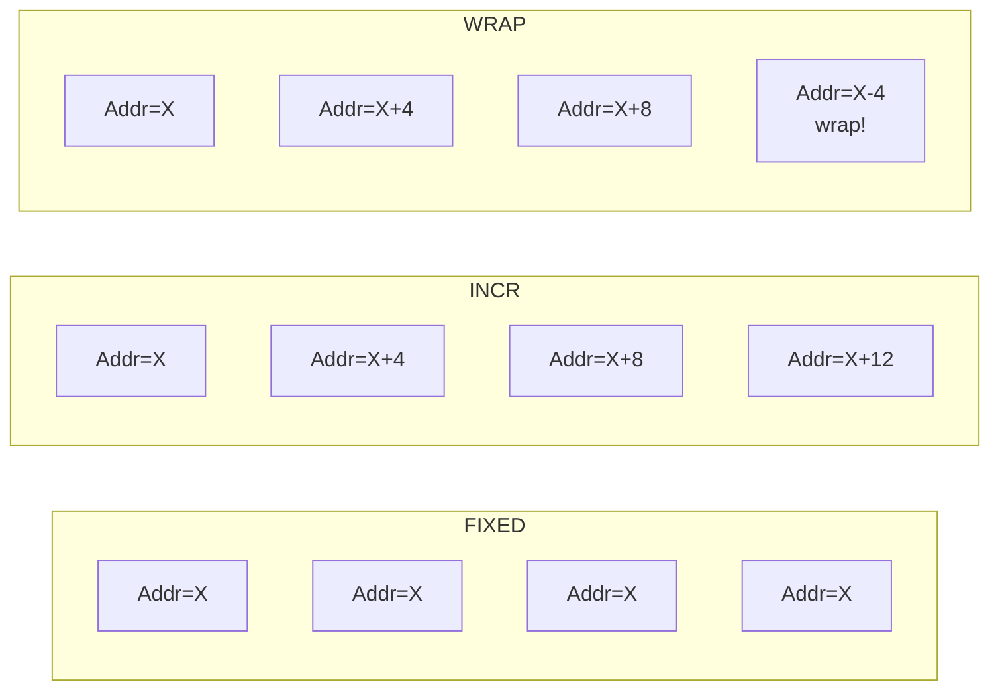

# AXI突发传输与地址计算

<span class="badge-i">[I]</span> <span class="badge-e">[E]</span>

---

### 为什么需要突发传输

如果每次访问内存都只传1个字节，CPU要花多少周期？<br>
地址周期 + 数据周期 × N，地址开销占了总时间的一半。<br>
<span class="red">突发传输（Burst Transfer）</span>就是"一次报地址，连续送多包数据"，<br>
把地址开销摊薄到多拍数据上。

类比：快递送货——<br>
不突发 = 每送一件货都先打电话确认地址（低效）；<br>
突发 = 一次确认地址，连续送一整箱（高效）。<br>

---

### 突发类型：FIXED/INCR/WRAP



#### FIXED（固定地址）

每笔数据传输的地址都相同。<br>
适用场景：FIFO队列、外设寄存器（如DMA的状态寄存器轮询）。<br>
代码示例：

```verilog
// FIXED burst, 4 beats, address = 0x1000
awaddr  = 32'h1000;
awlen   = 4'd3;       // 4 beats = awlen + 1
awsize  = 3'b010;     // 4 bytes per beat
awburst = 2'b00;      // FIXED
```

#### INCR（递增地址）

每笔数据地址 = 上一拍地址 + (2^AxSIZE)。<br>
适用场景：常规内存访问、DMA搬数、帧缓冲填充。<br>
这是最常见的突发类型。<br>

```verilog
// INCR burst, 16 beats, 64-bit data bus
awaddr  = 32'h2000;
awlen   = 8'd15;      // 16 beats
awsize  = 3'b011;     // 8 bytes per beat (64-bit bus)
awburst = 2'b01;      // INCR
// Total = 16 × 8 = 128 bytes
```

#### WRAP（回环地址）

地址在边界处回环，长度固定为2、4、8、16拍。<br>
适用场景：cache line填充（恰好是固定长度的对齐块）。<br>

```verilog
// WRAP burst, 4 beats, cache line fill
araddr  = 32'h3000;
arlen   = 4'd3;       // 4 beats
arsize  = 3'b010;     // 4 bytes per beat
arburst = 2'b10;      // WRAP
// Addresses: 0x3000, 0x3004, 0x3008, 0x300C
// If starting at 0x300C: 0x300C, 0x3000, 0x3004, 0x3008
```

---

### 地址计算公式

<span class="red">突发传输的第N拍地址计算</span>：

```
Address_N = Start_Addr + N × (2^AxSIZE)
```

其中 N = 0, 1, 2, ..., AxLEN

#### 地址对齐规则

| AxSIZE | 对齐边界 | Start_Addr 约束 |
|--------|----------|-----------------|
| 0b000 (1B) | 任意 | 无 |
| 0b001 (2B) | 2字节 | Addr[0] = 0 |
| 0b010 (4B) | 4字节 | Addr[1:0] = 0 |
| 0b011 (8B) | 8字节 | Addr[2:0] = 0 |
| 0b100 (16B) | 16字节 | Addr[3:0] = 0 |

<span class="blue">易错点：AXI协议要求起始地址必须与AxSIZE对齐，但INCR突发后续的地址自动递增，不需要每拍都对齐。</span><br>

---

### 窄传输与不对齐访问

#### WSTRB — 字节选通

WSTRB 每bit对应 WDATA 的一个字节，为1表示该字节有效。<br>

```verilog
// 64-bit data bus, only lower 32 bits valid
wdata  = 64'h0000_0000_1234_5678;
wstrb  = 8'b0000_1111;  // only bytes [3:0] valid
```

| WSTRB | 有效字节 | 说明 |
|-------|----------|------|
| 8'b1111_1111 | [7:0] | 全64-bit有效 |
| 8'b0000_1111 | [3:0] | 仅低32-bit有效 |
| 8'b1111_0000 | [7:4] | 仅高32-bit有效 |
| 8'b0000_0001 | [0] | 仅byte0有效 |

#### 不对齐访问的处理

AXI 协议本身允许起始地址不对齐（unaligned），<br>
但多数 slave 实现会拒绝或拆分为两次对齐访问。<br>

```verilog
// Unaligned request on 32-bit bus
awaddr  = 32'h1001;   // not aligned to 4-byte boundary
awsize  = 3'b010;     // 4 bytes per beat
// Slave may: (a) error, (b) split into 0x1001-0x1003 + 0x1004-0x1004
```

<span class="blue">结论：实际工程中尽量保证地址对齐，减少slave侧异常处理。</span><br>

---

### AXI性能公式

<span class="red">理论峰值带宽计算</span>：

```
Bandwidth = Freq × DataWidth × BurstLen / (BurstLen + AddrCycles)
```

对于AXI，地址周期通常为1拍（addr handshake），<br>
所以理想情况下（长突发、无等待）：

```
Bandwidth ≈ Freq × DataWidth
```

| 场景 | 频率 | 数据宽度 | 突发长度 | 有效带宽 |
|------|------|----------|----------|----------|
| DDR4 via AXI | 200MHz | 128-bit | 16 | ~3.2GB/s |
| Zynq HP port | 150MHz | 64-bit | 16 | ~1.2GB/s |
| Cortex-A53 | 400MHz | 128-bit | 256 | ~6.4GB/s |

<span class="blue">易错点：实际带宽永远低于理论值，因为要考虑：interconnect仲裁延迟、slave响应延迟、DDR刷新周期、总线竞争。</span><br>

---

### 代码：AXI Master RTL片段

```verilog
module axi_master (
    input  wire        clk,
    input  wire        rst_n,
    // AW channel
    output reg  [31:0] awaddr,
    output reg  [3:0]  awid,
    output reg  [7:0]  awlen,
    output reg  [2:0]  awsize,
    output reg  [1:0]  awburst,
    output reg         awvalid,
    input  wire        awready,
    // W channel
    output reg  [63:0] wdata,
    output reg  [7:0]  wstrb,
    output reg         wlast,
    output reg         wvalid,
    input  wire        wready,
    // B channel
    input  wire [3:0]  bid,
    input  wire [1:0]  bresp,
    input  wire        bvalid,
    output reg         bready
);

    // State machine
    localparam IDLE = 2'b00;
    localparam ADDR = 2'b01;
    localparam DATA = 2'b10;
    localparam RESP = 2'b11;

    reg [1:0] state;
    reg [7:0] beat_cnt;

    always @(posedge clk or negedge rst_n) begin
        if (!rst_n) begin
            state <= IDLE;
            awvalid <= 1'b0;
            wvalid  <= 1'b0;
            bready  <= 1'b0;
        end else begin
            case (state)
                IDLE: begin
                    awaddr  <= 32'h2000;
                    awid    <= 4'h1;
                    awlen   <= 8'd7;      // 8 beats
                    awsize  <= 3'b011;    // 8 bytes
                    awburst <= 2'b01;     // INCR
                    awvalid <= 1'b1;
                    state   <= ADDR;
                end
                ADDR: begin
                    if (awvalid && awready) begin
                        awvalid <= 1'b0;
                        wdata   <= 64'hAABBCCDD00112233;
                        wstrb   <= 8'hFF;
                        wvalid  <= 1'b1;
                        beat_cnt <= 8'd0;
                        state   <= DATA;
                    end
                end
                DATA: begin
                    if (wvalid && wready) begin
                        beat_cnt <= beat_cnt + 1;
                        wdata <= wdata + 64'h1;
                        if (beat_cnt == awlen) begin
                            wlast  <= 1'b1;
                        end
                        if (beat_cnt == awlen && wready) begin
                            wvalid <= 1'b0;
                            wlast  <= 1'b0;
                            bready <= 1'b1;
                            state  <= RESP;
                        end
                    end
                end
                RESP: begin
                    if (bvalid && bready) begin
                        bready <= 1'b0;
                        state  <= IDLE;
                    end
                end
            endcase
        end
    end
endmodule
```

<span class="green">AXI Master</span>：状态机依次走 IDLE→ADDR→DATA→RESP，<br>
ADDR阶段握手后进入DATA阶段，发完awlen+1拍数据后等BRESP。<br>

---

**学习路径提示**：<br>
- <span class="badge-i">[I]</span> 读者：掌握三种突发类型的区别和适用场景，熟记地址计算公式。<br>
- <span class="badge-e">[E]</span> 读者：重点看RTL代码和WSTRB用法，能在实际工程中判断突发参数配置是否合理。<br>
