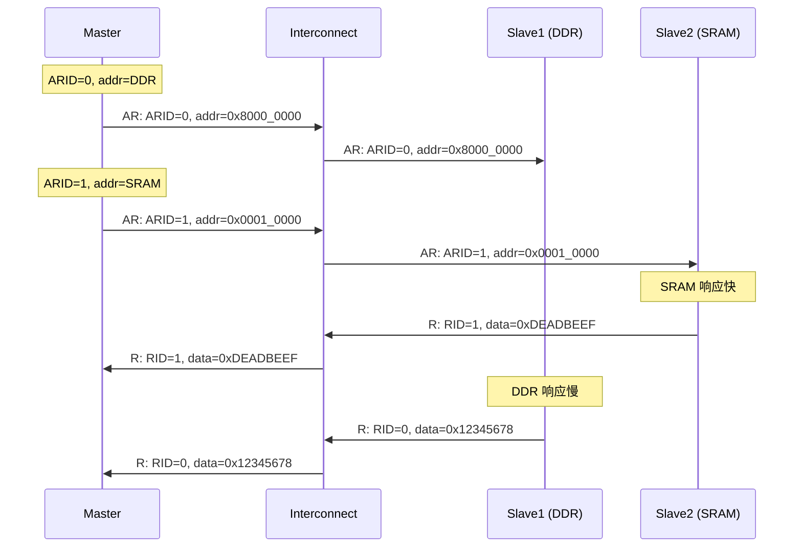
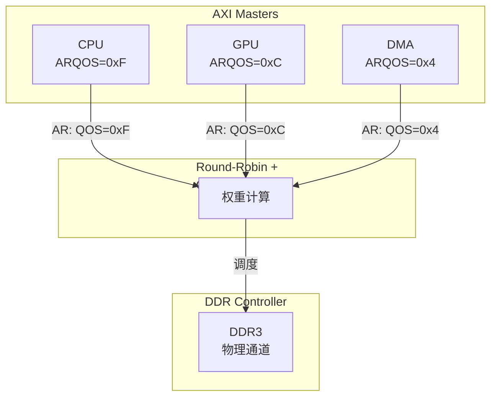
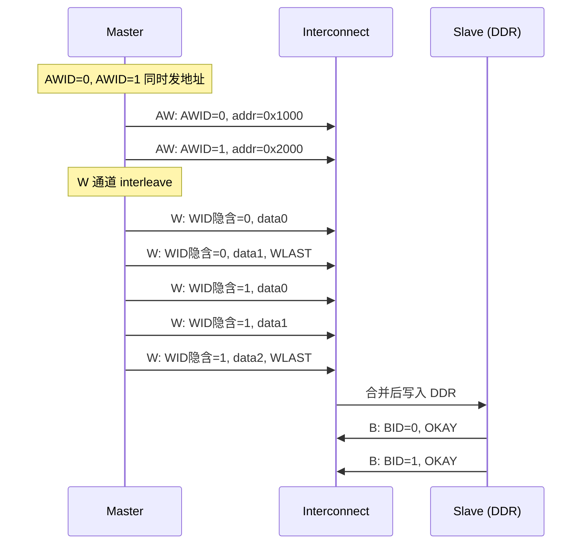

# AXI为什么能乱序完成——ID路由与QoS机制

<span class="badge-b">[B]</span> <span class="badge-i">[I]</span> <span class="badge-e">[E]</span> <span class="badge-m">[M]</span>

<span class="red">AXI 的乱序完成（Out-of-Order Completion）</span>是其区别于 AHB/APB 的核心能力之一。<br>
在 AHB 中，先发的读请求必须先返回数据；而在 AXI 中，<br>
后发的读请求如果命中 Cache 或访问更快的 Slave，可以先于旧请求完成。<br>
这一能力通过 <span class="blue">AxID 路由</span> 与 <span class="blue">Interconnect 仲裁</span> 共同实现。<br>

---

## 核心定义与价值

<span class="red">乱序完成的本质</span>是：打破 "先发先回" 的严格顺序，允许 Interconnect 根据 Slave 的实际响应速度重新排序。<br>

典型收益场景：<br>

- CPU 先发一个读 DDR 的请求（延迟 100 ns），再发一个读 L2 Cache 的请求（延迟 10 ns）。<br>
  在 AHB 中，Cache 读必须等 DDR 读完成后才能返回，总延迟 = 110 ns。<br>
  在 AXI 中，Cache 读可以先返回，总延迟 = max(100, 10) = 100 ns。<br>

- 在 <span class="green">big.LITTLE</span> 架构中，小核的 DMA 读 DDR 的同时，大核的 L1 预取读可以乱序插队。<br>

### 多窗口银行类比

<span class="blue">把 AXI 的乱序完成想象成银行的 "多窗口叫号系统"：</span><br>

- 客户 A 取号 001，到窗口 3 办理复杂贷款（预计 30 分钟）。<br>
- 客户 B 取号 002，到窗口 1 办理简单取款（预计 2 分钟）。<br>
- 银行不按 "001 先 002 后" 叫号，而是哪个窗口办完就叫哪个号。<br>
- 客户 B（002）先于客户 A（001）办完业务，这就是 "乱序完成"。<br>
- 但每位客户的票据（AxID）始终绑定到对应窗口（Slave），不会搞混。<br>

AHB 则像只有一个柜台的银行，所有客户排队，001 没办完 002 永远不能开始。<br>

---

## 核心机制原理解析

### <strong>1. AxID 的位宽与路由规则</strong>

<span class="red">AxID（Address ID）</span>是每个 AXI 事务的唯一标识符，出现在 AWID（写）和 ARID（读）中。<br>

| 信号 | 方向 | 位宽 | 功能 |
|------|------|------|------|
| AWID | Master → Slave | 由实现定义（通常 4～16 bit） | 标识写事务，回写时通过 BID 返回 |
| ARID | Master → Slave | 同上 | 标识读事务，回读时通过 RID 返回 |
| BID | Slave → Master | 同上 | 写响应携带的 ID，与 AWID 对应 |
| RID | Slave → Master | 同上 | 读数据携带的 ID，与 ARID 对应 |
| WID | Master → Slave | AXI3 有，AXI4 已移除 | AXI4 通过顺序推断 WID |

<br>

<span class="blue">AXI 规范对 ID 的路由规则：</span><br>

- 同一个 <span class="green">AWID</span> 的所有写数据必须在 <span class="blue">W 通道中保持顺序</span>，不能 interleave。<br>
- 同一个 <span class="green">ARID</span> 的所有读数据必须在 <span class="blue">R 通道中保持顺序</span>，不能乱序。<br>
- <span class="blue">不同 AWID 的写数据可以 interleave</span>，不同 ARID 的读数据可以乱序。<br>



<br>

### <strong>2. 读/写乱序完成的条件与限制</strong>

<span class="red">乱序完成的充分条件：</span><br>

| 条件 | 允许乱序 | 必须保序 | 说明 |
|------|---------|---------|------|
| 不同 ARID | ✅ 允许 | — | RID 区分不同事务 |
| 相同 ARID | ❌ 禁止 | ✅ 必须 | 同 ID 的读数据必须按请求顺序到达 |
| 不同 AWID | ✅ 允许 | — | BID 区分不同事务 |
| 相同 AWID | ❌ 禁止 | ✅ 必须 | 同 ID 的写响应必须按请求顺序到达 |

<br>

<span class="blue">Master 侧的 ID 分配策略：</span><br>

- 为每个 "逻辑数据流" 分配独立的 ID。<br>
  例如：CPU 的指令预取用 ARID=0，数据加载用 ARID=1，DMA 用 ARID=2～7。<br>
- 当所有 ID 耗尽时，Master 必须等待旧事务完成，才能复用该 ID。<br>

### <strong>3. QoS 信号（AxQOS）与优先级仲裁</strong>

<span class="red">QoS（Quality of Service）</span>是 AXI4 引入的 4-bit 信号，用于标记事务的优先级。<br>

| 信号 | 位宽 | 方向 | 含义 |
|------|------|------|------|
| AWQOS | 4-bit | Master → Slave | 写事务优先级，0x0=最低，0xF=最高 |
| ARQOS | 4-bit | Master → Slave | 读事务优先级，同上 |

<br>

Interconnect 中的仲裁器根据 AxQOS 决定谁先获得总线使用权：<br>



<br>

<span class="blue">典型仲裁策略：</span><br>

- <span class="green">严格优先级</span>：QOS 高的永远优先，可能导致低优先级饿死。<br>
- <span class="green">加权轮询（Weighted Round-Robin）</span>：QOS 决定每轮可连续发多少个 beat，兼顾公平与优先级。<br>
- <span class="green">老化（Aging）</span>：低优先级事务等待太久后临时提升 QOS，防止饿死。<br>

### <strong>4. WDATA 的 Interleaving 规则</strong>

<span class="red">Interleaving</span>是指不同 AWID 的写数据在 W 通道中交替传输。<br>

AXI4 规范对此有严格限制：<br>

- <span class="blue">同一个 AWID 的所有 W beat 必须连续传输</span>，不能与其他 AWID 的数据穿插。<br>
- <span class="blue">不同 AWID 的数据可以任意交错</span>，只要每个 AWID 内部连续即可。<br>
- 只有 <span class="green">AXI4 定义的 "Write Interleaving Depth"</span> 大于 1 的 Interconnect 才支持此功能。<br>



<br>

<span class="blue">注意：AXI4 已移除显式 WID 信号，Interconnect 通过 AW 与 W 的到达顺序推断 W 数据属于哪个 AWID。</span><br>
这意味着 Master 必须保证：AW 通道发送地址后，对应的 W 数据必须连续发送，不能在未发完 WLAST 前发送其他 AWID 的 W 数据。<br>

---

## 嵌入式专属实战场景

### <strong>Zynq AXI Interconnect 的 QoS 配置</strong>

在 Xilinx Vivado 中，AXI Interconnect 的 QoS 配置通过 GUI 完成，但底层映射到 AXI 的 ARQOS/AWQOS 信号：<br>

```tcl
# Vivado TCL：设置 HP 端口的 QoS 值
set_property CONFIG.AR_QOS {0xF} [get_bd_intf_ports /processing_system7_0/M_AXI_HP0]
set_property CONFIG.AW_QOS {0xC} [get_bd_intf_ports /processing_system7_0/M_AXI_HP1]
```

配置后，Zynq PS 的 HP0 端口发起读请求时自动携带 ARQOS=0xF，<br>
HP1 端口写请求携带 AWQOS=0xC。<br>

在 DDR 控制器侧，可读取 QoS 配置寄存器验证：<br>

```bash
# 读取 Zynq DDRC QoS 寄存器（0xF8006000 为 DDRC 基址）
$ devmem 0xF80060A0    # QOS_MAX寄存器
0x0000000F

$ devmem 0xF80060A4    # QOS_MIN寄存器
0x00000000
```

<span class="blue">输出解读：</span><br>
- DDRC 的 QoS 裁剪范围是 0x00～0x0F，与 AXI4 的 4-bit QOS 兼容。<br>
- 当系统流量激增时，QOS 低于 QOS_MIN 的事务会被 DDRC 拒绝或延迟排队。<br>

---

## 技术教学与实战

### <strong>Linux 内核中 QoS 相关的 AXI 结构体</strong>

某些 SoC 的 DMA 驱动允许在 `dma_slave_config` 中传递 QoS 参数：<br>

```c
#include <linux/dmaengine.h>

struct dma_slave_config axi_dma_cfg = {
    .direction = DMA_DEV_TO_MEM,
    .src_addr_width = DMA_SLAVE_BUSWIDTH_8_BYTES,
    .src_maxburst = 16,
    /* 部分驱动支持 device_fc（flow control）扩展 */
    .device_fc = true,
};

/* 某些 ARM SoC 的 DMA 控制器允许在 platform data 中配置 QoS */
struct axi_dma_plat_data {
    u8 awqos;       /* 写 QoS，4-bit */
    u8 arqos;       /* 读 QoS，4-bit */
    u8 awqos_high;  /* 高优先级写 QoS */
    u8 arqos_high;  /* 高优先级读 QoS */
};
```

<span class="blue">实际限制：</span><br>
- Linux 的 dmaengine 框架本身没有标准 QoS 字段，QoS 配置通常是 SoC 特定驱动的扩展。<br>
- 在实时性要求高的场景（如汽车 ECU 的摄像头数据流），<br>
  驱动通常在初始化时固定 QOS=0xF，确保 DMA 读不被 CPU 流量反压。<br>

### <strong>Verilog：带 QoS 的仲裁器核心逻辑</strong>

以下是一个简化版的 QoS 加权仲裁器：<br>

```verilog
module qos_arbiter (
    input        ACLK,
    input        ARESETn,
    input  [3:0] qos [0:3],      /* 4 个 Master 的 QoS */
    input  [3:0] req,             /* 请求有效 */
    output [1:0] grant,           /*  granted Master ID */
    output       grant_valid
);
    reg [3:0] weight [0:3];
    reg [1:0] last_grant;
    integer i;

    /* 加权轮转：QoS 越高，初始权重越大 */
    always @(posedge ACLK) begin
        if (!ARESETn) begin
            for (i = 0; i < 4; i = i + 1)
                weight[i] <= 4'd0;
            last_grant <= 2'd0;
        end else begin
            if (grant_valid) begin
                /* 选中的 Master 权重清零，其余累加 QoS */
                for (i = 0; i < 4; i = i + 1) begin
                    if (i == grant)
                        weight[i] <= 4'd0;
                    else if (req[i])
                        weight[i] <= weight[i] + qos[i];
                end
                last_grant <= grant;
            end
        end
    end

    /* 组合逻辑：选择权重最大的请求者 */
    wire [3:0] max_sel;
    assign max_sel[0] = req[0] && (!req[1] || weight[0] >= weight[1])
                     && (!req[2] || weight[0] >= weight[2])
                     && (!req[3] || weight[0] >= weight[3]);
    /* 简化示意，实际应展开所有组合 */

    assign grant = max_sel[0] ? 2'd0 :
                   max_sel[1] ? 2'd1 :
                   max_sel[2] ? 2'd2 : 2'd3;
    assign grant_valid = |req;
endmodule
```

<span class="blue">设计要点：</span><br>
- 权重累加机制确保高 QoS 的 Master 在竞争中持续占优，但低 QoS 的请求也不会永久饿死（权重会缓慢增长）。<br>
- 实际工业级仲裁器还需考虑 "老化" 逻辑与 "紧急抢占" 通道。<br>

---

## 历史演进与前沿

### <strong>从 AXI QoS 到 CHI QoS 与 CXL</strong>

| 协议 | QoS 位宽 | 扩展机制 | 应用场景 |
|------|---------|---------|---------|
| AXI4 | 4-bit | 无 | 通用 SoC |
| ACE | 4-bit | ACQOS（一致性请求） | 多核缓存 |
| CHI | 扩展字段 | 优先级类（Priority Class）+ 流量类（Traffic Class） | 服务器级 SoC |
| CXL | 基于 PCIe QoS | 使用 PCIe TC（Traffic Class） | 异构计算互联 |

<br>

<span class="blue">CHI 的 QoS 增强：</span><br>
- CHI 不再仅用 4-bit 数值，而是引入 <span class="green">Priority Class（3-bit）</span> 和 <span class="green">Traffic Class（3-bit）</span>。<br>
- Priority Class 区分实时（如汽车 ADAS）与非实时（如后台日志）流量。<br>
- Traffic Class 区分一致性流量（Cache 行填充）与 I/O 流量（DMA）。<br>
- 这种分层设计使 CHI 的 QoS 仲裁比 AXI4 更加精细。<br>

---

## 本章小结

| 维度 | 要点 |
|------|------|
| 为什么 | 乱序完成打破 "先发先回" 限制，让快速 Slave 的请求不等待慢速 Slave |
| AxID | 同一 ID 必须保序，不同 ID 可乱序；W 数据 interleaving 仅限不同 AWID |
| QoS | 4-bit AxQOS，0x0～0xF，Interconnect 仲裁器据此分配带宽 |
| Interleaving | AXI4 已移除 WID，通过 AW 与 W 的顺序绑定推断 |
| 实战 | Zynq HP 端口可配置 QoS，DDRC 寄存器裁剪低优先级事务 |
| 前沿 | CHI 扩展为 Priority Class + Traffic Class，支持 CXL 互联 |

---

## 练习

1. 在一个系统中，Master 发出两个读请求：ARID=0 访问 DDR（慢），ARID=1 访问 SRAM（快）。<br>
   为什么 RID=1 的数据可以先返回？如果 ARID 相同，RID=1 还能先返回吗？<br>

2. 某 SoC 的 Interconnect 支持 Write Interleaving Depth = 2。<br>
   解释为什么 AWID=0 的 W 数据不能与 AWID=1 的 W 数据随意穿插，而是有约束地交错。<br>
   <span class="purple">提示：参考 AXI4 规范对 "同一 AWID 的 W beat 必须连续" 的条文。</span><br>

3. 设计一个 QoS 仲裁策略，要求满足：CPU（QOS=0xF）优先，但 DMA（QOS=0x2）不能被饿死。<br>
   写出仲裁伪代码或 Verilog 核心逻辑。<br>

4. 在 AXI4 中，为什么 WID 信号被移除？这对 Master 的设计提出了什么新要求？<br>
   <span class="purple">提示：从信号线数量与 Interconnect 实现复杂度两个角度分析。</span><br>

5. 查阅 ARM IHI 0022F 规范第 A4-62 页，找到关于 "Ordering rules for read transactions" 的完整条文。<br>
   摘录同 ARID 保序与不同 ARID 乱序的原文描述。<br>
   <span class="purple">延伸阅读：ARM《AMBA AXI and ACE Protocol Specification》Issue F。</span><br>
