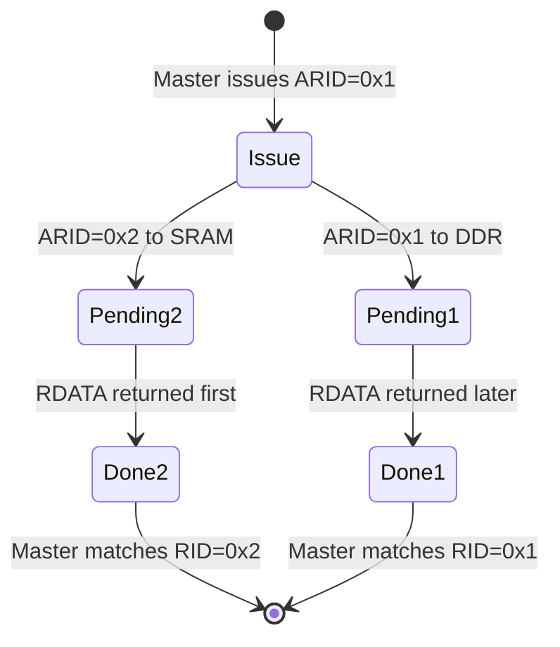
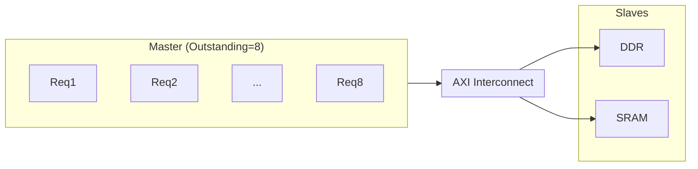

# AXI乱序完成与QoS机制

<span class="badge-e">[E]</span>

---

### 为什么需要乱序

假设CPU同时发了两笔读交易：<br>
- 交易A：读DDR，latency = 100 cycles<br>
- 交易B：读SRAM，latency = 5 cycles<br>

如果按顺序完成，CPU要等100拍才能拿到B的数据。<br>
<span class="red">乱序完成（Out-of-Order Completion）</span>让B先返回，CPU隐藏了DDR的长延迟。<br>

类比：餐厅叫号系统——<br>
顾客1点了一份慢炖牛排（等30分钟），顾客2点了一杯可乐（等1分钟）。<br>
如果按点单顺序上菜，顾客2要干等30分钟。<br>
乱序 = 可乐先上，牛排慢炖着，互不耽误。<br>

---

### ID路由机制

AXI 用 <span class="red">AxID 标识每笔独立交易</span>，<br>
同一ID的交易必须按顺序完成（保序），不同ID的交易可以乱序。<br>



| 规则 | 说明 |
|------|------|
| 同ID保序 | AWID相同，B通道必须按写顺序返回 |
| 同ID保序 | ARID相同，R通道必须按读顺序返回 |
| 不同ID可乱序 | AWID=1和AWID=2，谁先完成都行 |
| ID宽度 | AXI3/4通常4~8bit，由系统配置决定 |

#### 读乱序示例

```verilog
// Master issues two reads simultaneously
// Transaction 1: ARID=0x1, ARADDR=0x1000 (to slow DDR)
// Transaction 2: ARID=0x2, ARADDR=0x2000 (to fast SRAM)

// Slave responses (can arrive in any order):
// RID=0x2, RDATA=..., RLAST=1  ← SRAM comes first
// RID=0x1, RDATA=..., RLAST=1  ← DDR comes second

// Master uses RID to match responses to original requests
```

<span class="blue">易错点：AXI协议不限制slave返回响应的顺序，但要求slave必须记住ID。</span><br>
如果slave不支ite持乱序，通常会按FIFO顺序返回。<br>

---

### QoS信号：AxQOS与AxREGION

#### AxQOS[3:0] — 服务质量优先级

<span class="red">AxQOS是AXI4引入的优先级标记</span>，0~15共16级。<br>
Interconnect 根据 QoS 做仲裁：高QoS的交易优先拿到总线带宽。<br>

| QoS值 | 典型用途 |
|-------|----------|
| 0xF (15) | CPU实时中断、DMA紧急传输 |
| 0x8 (8)  | GPU帧缓冲、视频编解码 |
| 0x4 (4)  | 普通DMA、网络包 |
| 0x0 (0)  | 后台拷贝、日志写入 |

```verilog
// High-priority read from display controller
arqos = 4'hF;   // maximum priority for frame refresh
// Background memcpy
arqos = 4'h0;   // lowest priority, yield when congested
```

#### AxREGION[3:0] — 地址区域映射

AxREGION 配合 AxADDR 做物理地址到 slave 的路由。<br>
Interconnect 可以用 {AxREGION, AxADDR} 的某种组合查找目标slave。<br>

| AxREGION | 常见映射 |
|----------|----------|
| 0x0 | DDR 低区 |
| 0x1 | DDR 高区 |
| 0x2 | SRAM/TCM |
| 0x3 | 外设寄存器 |
| 0x4~0xF | 保留/扩展 |

<span class="blue">关键认知：QoS和Region只在Interconnect层起作用，slave本身不需要解析它们。</span><br>

---

### Outstanding深度限制

<span class="red">Outstanding</span>（未完成的交易中）是衡量AXI系统吞吐量的核心指标。<br>
深度越大，能隐藏的latency越长，带宽利用率越高。<br>



| 系统组件 | 典型Outstanding限制 |
|----------|--------------------|
| Cortex-A53 | 读16 / 写16 |
| Cortex-A72 | 读32 / 写16 |
| Zynq HP port | 读8 / 写8 |
| 普通DMA | 读4 / 写4 |

<span class="blue">性能瓶颈：如果Master的Outstanding深度为1，即使挂在高速DDR上，也只能每拍传一次地址，完全无法隐藏latency。</span><br>

#### 性能公式（考虑Outstanding）

```
Effective_BW = (Outstanding_Depth × DataWidth × BurstLen) / Latency
```

当 Outstanding × BurstLen ≥ Latency 时，总线可以持续满载传输。<br>

---

### 调试：AXI Protocol Checker + VIP

#### AXI Protocol Checker

<span class="red">Protocol Checker</span>是验证AXI接口合规性的必备工具，<br>
检查所有握手规则、保序规则、突发对齐等。<br>

常见开源/商用Checker：

| 工具 | 来源 | 类型 |
|------|------|------|
| ARM AXI Protocol Checker | ARM | 商用IP |
| Verilator + SVA | 社区 | 开源 |
| Synopsys VIP | Synopsys | 商用 |
| Cadence AXI VIP | Cadence | 商用 |

#### 典型违规检查项

```verilog
// Assertion example: VALID must not depend on READY
assert property (@(posedge clk)
    awvalid |=> ##[0:$] awready || awvalid
) else $error("AWVALID dropped before AWREADY");

// Assertion: WLAST must align with beat count
assert property (@(posedge clk)
    (wvalid && wready && wlast) |->
    (beat_cnt == expected_len)
) else $error("WLAST beat count mismatch");
```

| 违规类型 | 现象 | 根因 |
|----------|------|------|
| VALID提前拉低 | 数据丢失 | 发送方没等READY |
| 同ID乱序 | 数据错位 | Slave实现bug |
| WLAST错位 | 突发截断 | 计数器溢出 |
| 地址不对齐 | Slave报错 | Master配置错误 |

---

**学习路径提示**：<br>
- <span class="badge-e">[E]</span> 读者：理解Outstanding深度的概念，能在系统设计中选择合适的深度参数。<br>
- 掌握QoS的用法，在多master系统中做优先级分配。<br>
- 会用Protocol Checker定位总线违规问题。<br>
