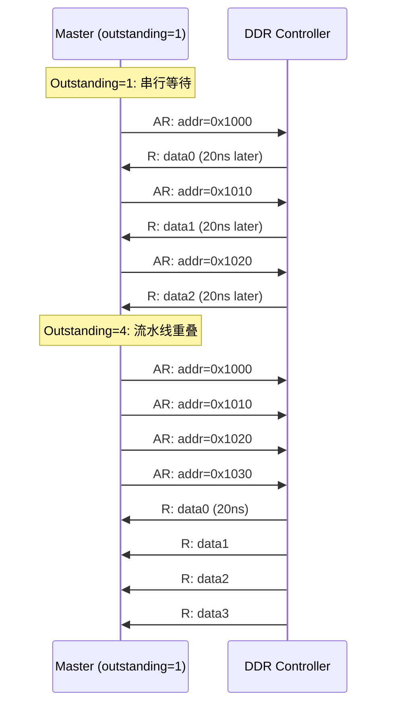

# AXI怎么调——性能瓶颈分析与优化

<span class="badge-b">[B]</span> <span class="badge-i">[I]</span> <span class="badge-e">[E]</span> <span class="badge-m">[M]</span>

<span class="red">AXI 性能调优</span>的核心公式是：吞吐量 = f(突发长度 × 数据宽度 × 频率)。<br>
理论峰值容易计算，但 <span class="blue">实际带宽往往只有峰值的 30%～60%</span>。<br>
瓶颈可能隐藏在突发长度、outstanding 数量、总线仲裁、Slave 延迟等任一环节。<br>
本章提供一套可落地的 AXI 性能诊断方法论。<br>

---

## 核心定义与价值

<span class="red">AXI 性能调优的本质</span>是：在硬件约束（时钟频率、总线位宽、FIFO 深度）内，<br>
通过配置突发参数与 outstanding 数量，使总线利用率逼近理论峰值。<br>

典型优化收益：<br>

- 将突发长度从 4 提升到 16，DDR 控制器效率提升 <span class="blue">20%～30%</span>。<br>
- 将 outstanding 从 2 提升到 8，CPU 读延迟波动降低 <span class="blue">40%</span>。<br>
- 通过 QoS 仲裁让实时流量优先，视频帧丢失率从 5% 降至 <span class="blue">0.1%</span>。<br>

### 高速公路收费站类比

<span class="blue">把 AXI 总线想象成一条高速公路：</span><br>

- <span class="green">数据宽度</span> = 车道数（32-bit = 1 车道，256-bit = 8 车道）。<br>
- <span class="green">时钟频率</span> = 车速限制（100 MHz = 限速 100 km/h）。<br>
- <span class="green">突发长度</span> = 每辆卡车的车厢数（4 beat = 4 节车厢）。<br>
- <span class="green">outstanding</span> = 收费站允许排队的车辆数（2 = 最多 2 辆车在收费）。<br>

<span class="blue">瓶颈分析：</span><br>

- 车道少（窄总线）→ 升级数据宽度。<br>
- 车速慢（低频率）→ 优化时序或升级 PLL。<br>
- 车厢短（短突发）→ 增加 AxLEN。<br>
- 排队少（低 outstanding）→ 增大 Master FIFO 深度。<br>
- 收费站拥堵（Interconnect 仲裁差）→ 调整 QoS 权重。<br>

---

## 核心机制原理解析

### <strong>1. 吞吐量公式与理论峰值计算</strong>

<span class="red">AXI 理论峰值带宽：</span><br>

```
Bandwidth = (Data_Width × Clock_Frequency) / 8    [单位：MB/s]
```

例如：64-bit 总线 @ 200 MHz：<br>

```
Peak = 64 × 200 / 8 = 1600 MB/s = 1.6 GB/s
```

但实际带宽需要考虑地址开销与等待周期：<br>

```
Effective = Peak × (AxLEN / (AxLEN + Address_OH))
```

其中 Address_OH 是地址阶段占用的周期数（通常为 1～2 cycle）。<br>

| AxLEN | Address_OH | 效率 = AxLEN/(AxLEN+2) | 实际带宽（1.6GB/s 峰值） |
|-------|-----------|----------------------|------------------------|
| 1 | 2 | 33% | 533 MB/s |
| 4 | 2 | 67% | 1.07 GB/s |
| 16 | 2 | 89% | 1.42 GB/s |
| 256 | 2 | 99% | 1.58 GB/s |

<span class="blue">结论：突发长度越长，地址开销占比越低，效率越接近峰值。</span><br>

### <strong>2. Outstanding Transactions 限制</strong>

<span class="red">Outstanding（未完成事务数）</span>是指 Master 已发出地址但尚未收到响应的事务数量。<br>

为什么 outstanding 重要？<br>

- DDR 控制器有 <span class="green">"行激活 → 列读取 → 预充电"</span> 的流水线延迟，约 20～30 ns。<br>
- 如果 outstanding = 1，Master 必须等上一个读完成才能发下一个地址，总线在这 20 ns 中空闲。<br>
- 如果 outstanding = 8，Master 可以连续发出 8 个地址，DDR 控制器内部流水线重叠处理，总线几乎不空闲。<br>



<br>

| 典型 SoC | 读 outstanding | 写 outstanding | 瓶颈来源 |
|---------|---------------|--------------|---------|
| Cortex-A8 | 4 | 4 | L2 Cache 队列深度 |
| Cortex-A9 | 6 | 4 | SCU + ACP 端口限制 |
| Cortex-A53 | 8 | 8 | CCI-400 端口配置 |
| Cortex-A76 | 16+ | 16+ | CMN-600 高带宽需求 |

<span class="blue">调优方向：如果 DDR 控制器支持高 outstanding，但 Master 只发 2 个，请检查 Master 的 FIFO 深度配置。</span><br>

### <strong>3. AXI Performance Monitor（ARM PMU）</strong>

ARM CoreLink 提供 <span class="green">NIC-400 / CCI / CMN</span> 等 Interconnect 的性能监控寄存器。<br>

| 寄存器名 | 偏移 | 含义 |
|---------|------|------|
| PMEVCNT0 | 0x000 | 总读事务计数 |
| PMEVCNT1 | 0x004 | 总写事务计数 |
| PMEVCNT2 | 0x008 | 读延迟累计（cycle） |
| PMEVCNT3 | 0x00C | 写延迟累计（cycle） |
| PMCR | 0x100 | 监控控制：使能/清零 |

```bash
# 读取 CCI-400 性能计数器（基址 0xF8800000）
$ devmem 0xF8800000    # PMEVCNT0: 读事务数
0x0004A2F1

$ devmem 0xF8800004    # PMEVCNT1: 写事务数
0x0002B180

$ devmem 0xF8800008    # PMEVCNT2: 读延迟累计
0x003A8C20
```

<span class="blue">计算平均读延迟：</span><br>
- 读事务数 = 0x4A2F1 = 303,857。<br>
- 读延迟累计 = 0x3A8C20 = 3,836,960 cycles。<br>
- 平均延迟 = 3,836,960 / 303,857 ≈ <span class="blue">12.6 cycles</span>。<br>
- 如果目标延迟是 8 cycles，说明总线存在 4.6 cycle 的额外排队延迟。<br>

### <strong>4. 典型 AXI 瓶颈诊断清单</strong>

| 症状 | 根因 | 诊断方法 | 优化措施 |
|------|------|---------|---------|
| 带宽远低于峰值 | 突发长度太短 | 抓取 AxLEN 分布 | 增大 AxLEN 至 16+ |
| 读延迟波动大 | Outstanding 太低 | PMU 读取平均延迟 | 增大读 outstanding |
| 写响应延迟高 | Slave FIFO 满 | 监控 BVALID 延迟 | 减小写突发频率或增大数据宽度 |
| 总线利用率低 | 频繁读写切换 | PMU 统计读写比例 | 读写分离到不同通道（AXI 天然支持） |
| 实时流量丢帧 | QoS 仲裁不公平 | 抓取各 Master 的 QOS 值 | 提高实时 Master 的 QOS，启用 aging |
| DDR 效率低 | 未对齐到行边界 | 检查地址是否落在同一 row | 地址对齐到 DDR row size（通常 1KB/2KB） |

---

## 嵌入式专属实战场景

### <strong>Zynq 的 AXI HPM 性能调优实例</strong>

Xilinx Zynq-7000 的 HP（High-Performance）端口直连 DDR 控制器，是 FPGA 逻辑访问 PS DDR 的主通道。<br>

典型调优步骤：<br>

1. <span class="green">确认 HPM 数据宽度</span>：HP0/HP1 为 64-bit，HP2/HP3 为 64-bit。<br>
   如果 FPGA 侧只用了 32-bit，立即升级到 64-bit，带宽翻倍。<br>

2. <span class="green">配置 AXI Interconnect 突发参数</span>：在 Vivado 中设置 `Max Burst Length = 16`。<br>
   如果 FPGA DMA 引擎的突发太短，Interconnect 会合并或拆分，增加延迟。<br>

3. <span class="green">开启 HPM 端口的 outstanding</span>：Zynq TRM 指出 HPM 支持 6 个读 outstanding 和 4 个写 outstanding。<br>
   如果 FPGA DMA 只发 1 个 outstanding，DDR 控制器无法隐藏行激活延迟。<br>

```tcl
# Vivado TCL：优化 AXI Interconnect 性能
set_property CONFIG.S00_HAS_REGSLICE {1} [get_bd_cells axi_interconnect_0]
set_property CONFIG.S00_IS_CASCADED {0} [get_bd_cells axi_interconnect_0]
set_property CONFIG.STRATEGY {2} [get_bd_cells axi_interconnect_0]  ;# 策略2 = 性能优先
```

<span class="blue">Vivado AXI Interconnect 策略说明：</span><br>

| 策略值 | 名称 | 特点 | 适用场景 |
|-------|------|------|---------|
| 0 | 最小面积 | 无 FIFO，无寄存器切片 | 低频率、低带宽 |
| 1 | 平衡 | 适度 FIFO 深度 | 通用场景 |
| 2 | 性能优先 | 深 FIFO、寄存器切片、支持高 outstanding | 高频 DDR 访问 |

---

## 技术教学与实战

### <strong>Linux 内核中的 AXI 性能计数器接口</strong>

某些 SoC 将 AXI PMU 寄存器映射到 sysfs，便于用户空间读取：<br>

```bash
# 读取 ARM CCI PMU 计数器（通过 perf 工具）
$ perf stat -e arm_cci/clock/ sleep 1

# 或者读取 sysfs 节点（部分 BSP 实现）
$ cat /sys/bus/event_source/devices/arm_cci/cpumask
0f

$ cat /sys/bus/event_source/devices/arm_cci/events/read_transaction
config=0x01

$ perf stat -e arm_cci/read_transaction/ sleep 5
 Performance counter stats for 'sleep 5':
         1,523,456      arm_cci/read_transaction/
```

<span class="blue">输出解读：</span><br>
- 5 秒内 CCI 处理了 1,523,456 个读事务，平均每秒 304,691 个。<br>
- 如果总线频率 200 MHz，每个事务平均占用 200M / 304K ≈ 657 cycles，说明突发较长。<br>

### <strong>C 语言：计算 AXI 理论带宽与实际利用率</strong>

```c
#include <stdio.h>
#include <stdint.h>

struct axi_perf {
    uint32_t data_width;      /* bits */
    uint32_t clk_mhz;
    uint32_t total_cycles;
    uint32_t valid_cycles;    /* VALID && READY 同时高的 cycle 数 */
    uint32_t total_bytes;
};

static void axi_report(const struct axi_perf *p)
{
    double peak_bw  = (double)p->data_width * p->clk_mhz / 8.0;   /* MB/s */
    double util     = 100.0 * p->valid_cycles / p->total_cycles;
    double real_bw  = peak_bw * util / 100.0;
    double byte_eff = (double)p->total_bytes /
                      (p->valid_cycles * (p->data_width / 8));

    printf("=== AXI Performance Report ===\n");
    printf("Data Width : %u-bit\n", p->data_width);
    printf("Clock      : %u MHz\n", p->clk_mhz);
    printf("Peak BW    : %.1f MB/s\n", peak_bw);
    printf("Bus Util   : %.1f%%\n", util);
    printf("Real BW    : %.1f MB/s\n", real_bw);
    printf("Byte Eff   : %.1f%% (WSTRB/strobe impact)\n", byte_eff * 100);
}

int main(void)
{
    struct axi_perf p = {
        .data_width  = 64,
        .clk_mhz     = 200,
        .total_cycles = 10000,
        .valid_cycles = 6500,    /* 65% 时间有数据传输 */
        .total_bytes  = 6500 * 4, /* 但只启用了 32-bit WSTRB，浪费一半 */
    };
    axi_report(&p);
    return 0;
}
```

<span class="blue">运行输出：</span><br>

```
=== AXI Performance Report ===
Data Width : 64-bit
Clock      : 200 MHz
Peak BW    : 1600.0 MB/s
Bus Util   : 65.0%
Real BW    : 1040.0 MB/s
Byte Eff   : 50.0% (WSTRB/strobe impact)
```

<span class="blue">诊断结论：</span><br>
- 总线利用率 65% 尚可，但字节效率只有 50%，说明 WSTRB 只启用了 32-bit（4 bytes）。<br>
- 优化方向：将 DMA 引擎的数据宽度升级到 64-bit，或确保 WSTRB = 0xFF。<br>

---

## 历史演进与前沿

### <strong>从 ARM PMU 到系统级性能分析</strong>

| 时代 | 工具/技术 | 覆盖范围 | 精度 | 典型应用 |
|------|----------|---------|------|---------|
| 2010 | AXI VIP 仿真 | RTL 仿真 | Cycle-accurate | IP 验证 |
| 2015 | ARM DS-5 Streamline | SoC 级 | 1 ms 采样 | Android 性能分析 |
| 2018 | CoreSight STM/ETM | Core + Bus | ns 级 | 实时调试 |
| 2022 | ARM Telemetry | Cloud/Edge | 连续监控 | AWS Graviton 运维 |
| 2024 | AI-driven PPA | 全芯片预测 | 机器学习 | 设计早期阶段瓶颈预测 |

<br>

<span class="blue">前沿趋势：</span><br>
- ARM 正在将 <span class="green">Telemetry</span> 技术引入服务器 SoC，使云端运维人员可以实时监控 AXI 总线健康状况。<br>
- <span class="green">AI-driven PPA（Power-Performance-Area）</span> 工具可以在 RTL 编写前预测 AXI 拓扑的瓶颈，指导架构师优化 Interconnect 连接关系。<br>

---

## 本章小结

| 维度 | 要点 |
|------|------|
| 怎么调 | 从理论峰值出发，逐步诊断实际瓶颈 |
| 吞吐量公式 | BW = (Width × Freq × AxLEN) / (AxLEN + OH) |
| Outstanding | 越高越好，但受 Master FIFO 与 Slave 能力限制 |
| 工具 | ARM PMU + perf + devmem + Vivado ILA |
| 典型瓶颈 | 窄突发、低 outstanding、频繁切换、WSTRB 未全开 |
| 前沿趋势 | AI-driven PPA 预测、Telemetry 实时监控 |

---

## 练习

1. 计算 128-bit 总线 @ 300 MHz 的理论峰值带宽。如果 AxLEN=8，地址开销 2 cycles，实际带宽是多少？<br>

2. 某 DDR 控制器支持 16 个读 outstanding，但 CPU 的 L2 Cache 只发 4 个。平均读延迟为 24 cycles。<br>
   如果将 outstanding 提升到 12，预测平均延迟会下降多少？为什么？<br>
   <span class="purple">提示：考虑 DDR 行激活延迟的隐藏效应。</span><br>

3. 在 Zynq 中，perf 工具读取的 `arm_cci/read_transaction` 计数为 1,523,456（5 秒）。<br>
   结合 HPM0 的数据宽度（64-bit）和时钟（150 MHz），计算总线利用率。<br>

4. 某 AXI Master 的 WSTRB 始终为 0x0F（仅低 4 byte 有效），数据宽度为 64-bit。<br>
   这导致什么性能损失？在驱动层面如何修复？<br>

5. 查阅 Xilinx UG585《Zynq-7000 TRM》第 10.7 节，找到 HPM 端口的 outstanding 数量限制。<br>
   摘录 HP0/HP1/HP2/HP3 各自的读/写 outstanding 能力。<br>
   <span class="purple">延伸阅读：Xilinx UG585 (v1.13) Chapter 10: DDR Memory Controller。</span><br>
