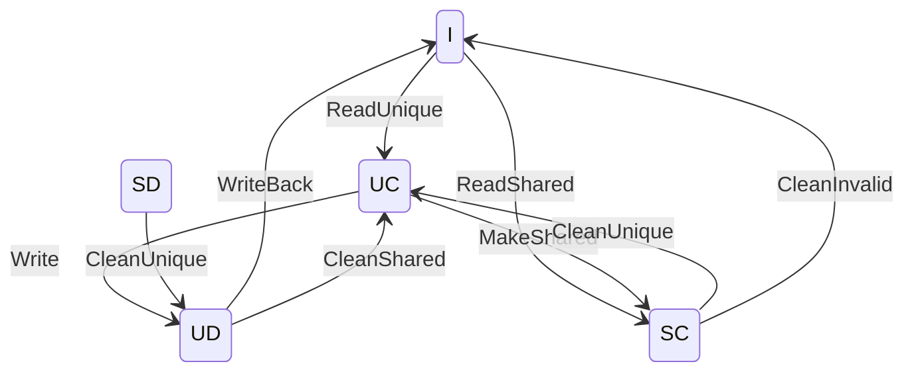
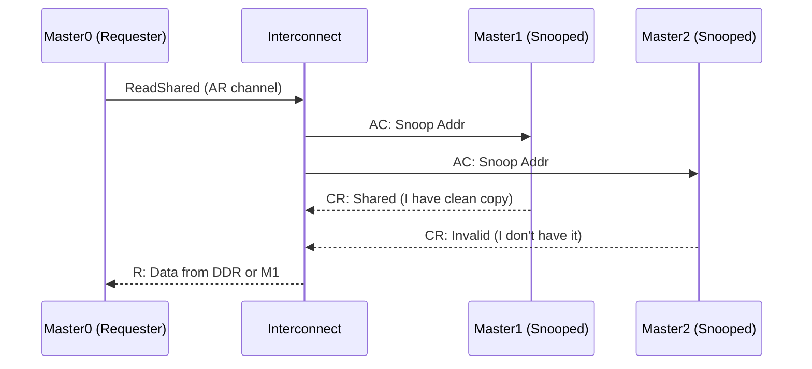
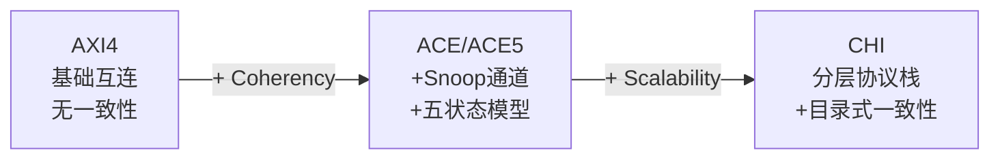
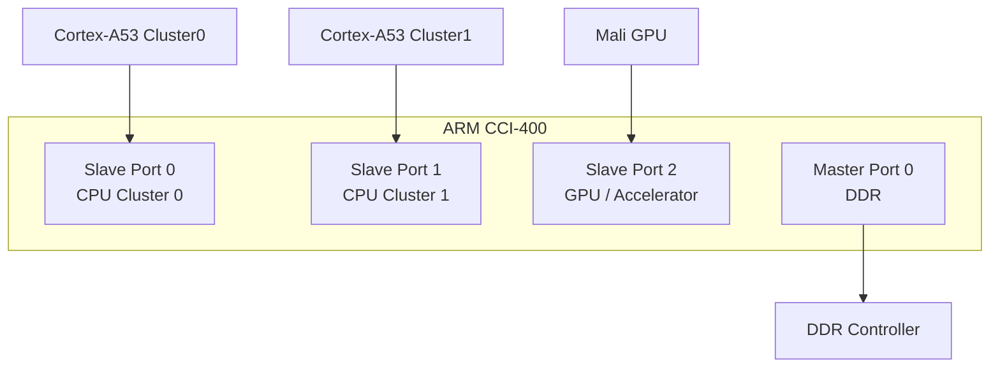

# AXI5与ACE缓存一致性

<span class="badge-m">[M]</span>

---

### 为什么需要缓存一致性

多核CPU共享同一块DDR内存，每个核都有自己的L1/L2 cache。
<br>
核0写了一个变量到cache（还没写回DDR），核1读这个变量——
<br>
<span class="red">核1读到的可能是DDR里的旧数据，而不是核0 cache里的新数据。</span>
<br>
这就是缓存一致性（Cache Coherency）要解决的问题。

类比：两个人共用一本笔记本——
<br>
A把修改写在了自己的草稿纸上（cache），还没抄到笔记本（DDR）。
<br>
B来翻笔记本，看到的是旧内容。
<br>
一致性协议 = 草稿纸和笔记本之间的自动同步规则。
<br>

---

### ACE五状态模型

ACE（AXI Coherency Extensions）在AXI4基础上扩展了缓存状态，
<br>
<span class="red">每个cache line有五种状态</span>：

| 状态 | 缩写 | 含义 | 可读写？ |
|------|------|------|----------|
| Invalid | I | 数据无效 | 否 |
| UniqueClean | UC | 独有一份，与内存一致 | 可读写 |
| UniqueDirty | UD | 独有一份，比内存新 | 可读写 |
| SharedClean | SC | 多份共享，与内存一致 | 只读 |
| SharedDirty | SD | 多份共享，至少一份比内存新 | 可读，写需升级 |



<span class="blue">关键认知：ACE状态描述的是"cache line相对于内存和其他cache的一致性状态"，不是CPU内部状态。</span>
<br>

---

### Snoop通道与嗅探事务

ACE 新增了四个 <span class="red">Snoop 通道</span>，用于在master之间互相查询cache状态：

| 通道 | 方向 | 作用 |
|------|------|------|
| AC（Snoop Address） | Interconnect→Master | 广播嗅探地址，问"谁有这行？" |
| CR（Snoop Response） | Master→Interconnect | 回复"我有/我没有/状态是X" |
| CD（Snoop Data） | Master→Interconnect | 如果有脏数据，把数据发回来 |



<span class="green">Snoop 事务</span>是ACE的核心开销：
<br>
每次一致性访问都要广播到所有可能持有该cache line的master，
<br>
所以Snoop带宽消耗随master数量线性增长。
<br>

#### 典型嗅探事务类型

| 事务名 | 目的 | 效果 |
|--------|------|------|
| ReadShared | 读数据，允许共享 | 获取SC或SD状态 |
| ReadUnique | 读数据，要求独占 | 获取UC状态，其他cache失效 |
| CleanShared | 把脏数据写回内存 | SD→SC，UD→UC |
| CleanInvalid | 写回并失效所有副本 | 任何状态→I |
| MakeInvalid | 直接失效所有副本 | 任何状态→I（不写回） |

---

### CHI演进：AXI→ACE→CHI

AMBA协议从简单互连到完整一致性，经历了三代演进：



| 维度 | AXI4 | ACE | CHI |
|------|------|-----|-----|
| 一致性 | 无 | Snoop-based | Directory-based |
| 通道 | 5个 | 5+3个Snoop | Request/Snoop/Response/Data |
| 拓扑 | Crossbar | Crossbar | Mesh/Ring/Torus |
| 扩展性 | <8 masters | <16 masters | 64+ sockets |
| 典型应用 | 嵌入式SoC | 多核手机SoC | 服务器/数据中心 |
| 代表芯片 | Cortex-A9 | Cortex-A53/A57 | Neoverse N1/V1 |

<span class="blue">关键差异：ACE用广播嗅探，CHI用目录式跟踪（Directory-based），后者扩展性更好。</span>
<br>

#### 演进表：协议能力对比

| 能力 | AXI4 | ACE | ACE5 | CHI |
|------|------|-----|------|-----|
| 基础读写 | ✓ | ✓ | ✓ | ✓ |
| 缓存一致性 | ✗ | ✓ | ✓ | ✓ |
| DVM（虚拟内存同步） | ✗ | ✓ | ✓ | ✓ |
| 原子操作 | ✗ | 部分 | ✓ | ✓ |
| 内存标签（MTE） | ✗ | ✗ | ✓ | ✓ |
| PMW（原子性保证） | ✗ | ✗ | ✓ | ✓ |

<span class="purple">扩展</span>：ACE5是ACE的最新版本，增加了原子操作、内存标签扩展（MTE）等特性，
<br>
与ARMv8.5-A架构对齐。
<br>

---

### 与MESI/MOESI的映射关系

学术界最常用的缓存一致性模型是MESI/MOESI，
<br>
ACE的五状态可以映射过去：

| ACE状态 | MESI等价 | MOESI等价 | 说明 |
|---------|----------|-----------|------|
| Invalid | I | I | 无效 |
| UniqueClean | E (Exclusive) | E | 独占且干净 |
| UniqueDirty | M (Modified) | M | 独占且脏 |
| SharedClean | S (Shared) | S | 共享且干净 |
| SharedDirty | — | O (Owned) | 共享但脏，ACE特有 |

<span class="red">ACE的SharedDirty</span>是MESI没有的：
<br>
表示多个cache都有这行，且至少一个比内存新。
<br>
写操作需要先upgrade到Unique状态。
<br>

---

### 实战：ARM CCI配置

ARM CCI（Cache Coherent Interconnect）是实现ACE一致性的标准IP。



#### CCI端口与ACE连接

| CCI端口 | 连接对象 | ACE信号 | 作用 |
|---------|----------|---------|------|
| Slave Port 0 | CPU Cluster 0 | ACE-full | 管理cluster内一致性 |
| Slave Port 1 | CPU Cluster 1 | ACE-full | 管理cluster间一致性 |
| Slave Port 2 | GPU/Accelerator | ACE-lite | 只监听，不发snoop |
| Master Port 0 | DDR | AXI4 | 回写脏数据 |

<span class="blue">易错点：GPU通常挂ACE-lite端口，因为它只读共享buffer，不参与snoop广播。</span>
<br>

#### CCI编程接口（Linux）

```c
// CCI driver: enable snoop filter
// arch/arm64/kernel/cci.c (simplified)

void cci_enable_snoop_filter(void) {
    u32 val = readl(cci_base + CCI_CTRL_OFFSET);
    val |= CCI_CTRL_SNOOP_ENABLE;
    writel(val, cci_base + CCI_CTRL_OFFSET);
}

// Check snoop filter status
u32 status = readl(cci_base + CCI_STATUS_OFFSET);
if (status & CCI_STATUS_SNOOP_ENABLED)
    pr_info("CCI snoop filter active\n");
```

| CCI寄存器 | 偏移 | 功能 |
|-----------|------|------|
| CCI Control | 0x000 | 全局使能、snoop开关 |
| Status | 0x004 | 运行状态 |
| Snoop Control | 0x100+ | 各slave port snoop使能 |
| Error | 0x200+ | 一致性错误上报 |

---

**学习路径提示**：
<br>
- <span class="badge-m">[M]</span> 读者：理解一致性不是"自动"的，它需要硬件（CCI）+软件（flush API）+协议（ACE）三层配合。
<br>
- 关注ACE与CHI的演进逻辑：广播→目录，Crossbar→Mesh，这是高端SoC的设计趋势。
<br>
