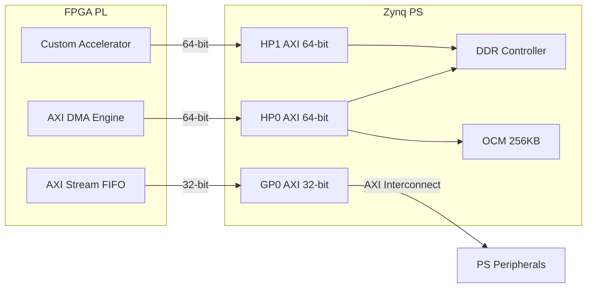

# AXI嵌入式实战——Zynq PS-PL AXI 接口实例

<span class="badge-b">[B]</span> <span class="badge-i">[I]</span> <span class="badge-e">[E]</span> <span class="badge-m">[M]</span>

<span class="red">Zynq-7000</span> 是 Xilinx 推出的 ARM + FPGA 异构 SoC，其内部 PS（Processing System）与 PL（Programmable Logic）之间
通过 AXI 总线互联。本章以 Zynq 为实例，展示如何在真实硬件上配置、验证与调试 AXI 接口。
<br>

---

## 核心定义与价值

<span class="red">Zynq 的 AXI 接口分为三类：</span><br>

- <span class="green">HP（High-Performance）端口</span>：4 个 64-bit AXI 端口，直连 DDR 控制器，用于 PL 侧高带宽 DMA 引擎。<br>
- <span class="green">GP（General-Purpose）端口</span>：4 个 32-bit AXI 端口，经过 AXI Interconnect 连接 PS 外设，用于寄存器控制。<br>
- <span class="green">ACP（Accelerator Coherency Port）</span>：1 个 64-bit ACE 端口，支持 PL 访问 PS Cache 一致的数据。<br>

<span class="blue">HP 与 GP 的关键差异在于是否直连 DDR 控制器。</span><br>
GP 端口需要经过 PS 内部的 AXI Interconnect 矩阵，延迟更高，但可访问所有 PS 外设。<br>
HP 端口绕过 PS 内部矩阵，直连 DDRC，带宽最高，但只能访问 DDR 和 OCM。<br>

### 企业园区物流类比

<span class="blue">把 Zynq 的 PS-PL 互联想象成企业园区的物流系统：</span><br>

- <span class="green">HP 端口</span> = "园区专用高速货运通道"——从仓库（DDR）直接到车间（PL），不经过办公楼（CPU 外设）。<br>
  适合搬运大量原材料（视频帧、AI 权重参数），速度快、吞吐大。<br>

- <span class="green">GP 端口</span> = "园区内部快递收发室"——经过前台登记（Interconnect 仲裁），再送到各个办公室。<br>
  适合发送指令、读取状态寄存器，单包小但覆盖面广。<br>

- <span class="green">ACP 端口</span> = "带门禁的高速通道"——PL 进入 PS 的 Cache 区域，需要经过安保检查（一致性协议）。<br>
  适合加速器读取 CPU 刚刚处理过的数据，无需手动刷 Cache。<br>

---

## 核心机制原理解析

### <strong>1. HP/GP/ACP 接口的信号差异</strong>

| 特性 | HP（M_AXI_HP0~3） | GP（M_AXI_GP0~1） | ACP（S_AXI_ACP） |
|------|-------------------|-------------------|-----------------|
| 数据宽度 | 64-bit | 32-bit | 64-bit |
| AXI 协议 | AXI3 | AXI3 | ACE（AXI + 一致性） |
| 直连 DDR | ✅ 是 | ❌ 否（经 Interconnect） | ❌ 否（经 SCU） |
| 最大突发 | 16 beats | 16 beats | 16 beats |
| 读 Outstanding | 6 | 2 | 2 |
| 写 Outstanding | 4 | 2 | 2 |
| Cache 一致性 | ❌ 无 | ❌ 无 | ✅ 有（经 SCU） |
| 典型应用 | PL DMA 视频帧 | PL 控制寄存器 | PL 加速器共享 Cache |

<br>

<span class="blue">ACP 的独特价值：</span><br>
当 PL 中的加速器需要读取 CPU 刚刚写入 DDR 的数据时，如果数据还在 L2 Cache 中，<br>
通过 ACP 访问可以直接命中 Cache，避免 DDR 回写的延迟。<br>
如果不走 ACP 而走 HP，PL 可能读到 DDR 中的旧数据（因为 Cache 还未 write-back）。<br>

### <strong>2. Vivado 中 AXI Interconnect 的配置</strong>

在 Vivado Block Design 中，AXI Interconnect 负责将多个 Master 路由到多个 Slave。



<br>

<span class="blue">Vivado 配置要点：</span><br>

- HP 端口的数据宽度固定为 64-bit，不可更改为 32-bit。<br>
- AXI Interconnect 的 <span class="green">`Strategy`</span> 参数决定性能与面积的权衡。<br>
  对于视频/AI 场景，选择 <span class="green">`Performance optimized`</span>（策略 2）。<br>
- 如果 PL 侧只有一个 Master，可取消 Interconnect（直接连接），减少一级仲裁延迟。<br>

### <strong>3. Linux devmem 访问 AXI 寄存器</strong>

Zynq 的 PS 外设（包括 AXI Interconnect 的寄存器）映射到固定物理地址。

```bash
# 读取 PS 外设基址（来自 Zynq TRM Table 4-1）
$ devmem 0xE0000000    # UART0 控制寄存器基址
0x00000004             # TX FIFO 非空

$ devmem 0xF8000000    # SLCR（系统级时钟复位）基址
0x0000DF0D             # 设备 ID 与版本

$ devmem 0xF8001000    # DDR PHY 寄存器
0x00000001             # PHY 初始化完成
```

<span class="blue">输出解读：</span><br>
- `0xE0000000` 是 UART0 的基址，读取得到状态寄存器值 `0x04`，<br>
  其中 bit 2 表示 TX FIFO 已满，bit 3 表示 RX FIFO 非空。<br>
- `0xF8000000` 是 SLCR 基址，用于配置 PLL、时钟分频、MIO 复用。<br>
- devmem 直接操作 `/dev/mem`，需要 root 权限，仅用于调试。<br>

### <strong>4. DMA 通过 AXI 传输数据</strong>

Zynq 的 DMA 传输路径：PL DMA 引擎 → HP AXI → DDR 控制器 → DDR3 物理内存。

```c
/* Linux 内核中配置 Zynq DMA（PL330）的示例 */
#include <linux/dmaengine.h>
#include <linux/dma-mapping.h>

struct dma_chan *chan;
dma_addr_t src_dma, dst_dma;
void *src_vaddr, *dst_vaddr;

/* 1. 申请 DMA 通道 */
chan = dma_request_chan(&pdev->dev, "axi_dma");

/* 2. 分配一致性 DMA 内存 */
src_vaddr = dma_alloc_coherent(&pdev->dev, 4096, &src_dma, GFP_KERNEL);
dst_vaddr = dma_alloc_coherent(&pdev->dev, 4096, &dst_dma, GFP_KERNEL);

/* 3. 填充源数据 */
memset(src_vaddr, 0xAB, 4096);

/* 4. 准备 DMA 描述符：从 src_dma 拷贝到 dst_dma */
struct dma_async_tx_descriptor *desc;
desc = dmaengine_prep_dma_memcpy(chan, dst_dma, src_dma, 4096,
                                  DMA_CTRL_ACK | DMA_PREP_INTERRUPT);

/* 5. 提交并启动 */
dma_cookie_t cookie = desc->tx_submit(desc);
dma_async_issue_pending(chan);

/* 6. 等待完成 */
dma_sync_wait(chan, cookie);

/* 7. 校验 */
if (memcmp(src_vaddr, dst_vaddr, 4096) == 0)
    pr_info("AXI DMA transfer OK\n");
```

<span class="blue">关键结构体解读：</span><br>
- `dma_alloc_coherent()` 分配物理连续的内存，并返回 DMA 可访问的 `dma_addr_t`。<br>
- `dst_dma` 和 `src_dma` 是直接传递给 PL DMA 引擎的 AXI 地址。<br>
- PL DMA 通过 HP 端口向 DDR 控制器发起 AXI 突发写，完成数据搬运。<br>

---

## 嵌入式专属实战场景

### <strong>场景：PL 侧图像处理加速器通过 HP0 写帧缓冲</strong>

需求：PL 侧实现一个 Sobel 边缘检测加速器，输入帧从 DDR 读取，输出帧写回 DDR。

1. <span class="green">Vivado 设计：</span><br>
   - 加速器作为 AXI Master，连接 HP0（64-bit）。<br>
   - 加速器内部维护读/写两个 AXI 接口，读接口发 AR 请求取输入像素，写接口发 AW/W 请求写输出像素。<br>

2. <span class="green">地址映射：</span><br>
   - 输入帧缓冲：DDR 物理地址 `0x10000000`，分辨率 1920×1080，每个像素 1 byte（灰度）。<br>
   - 输出帧缓冲：DDR 物理地址 `0x11000000`。<br>

3. <span class="green">Linux 驱动配置 DMA 缓冲：</span><br>

```c
/* 分配两个物理连续的帧缓冲 */
#define FRAME_SIZE (1920 * 1080)

void *in_buf  = dma_alloc_coherent(dev, FRAME_SIZE, &in_phys, GFP_KERNEL);
void *out_buf = dma_alloc_coherent(dev, FRAME_SIZE, &out_phys, GFP_KERNEL);

/* 将物理地址通过 sysfs 通知 PL 加速器 */
sysfs_notify(dev, NULL, "in_addr");
sysfs_notify(dev, NULL, "out_addr");
```

4. <span class="green">PL 加速器启动：</span><br>
   - 驱动向 PL 的 AXI-Lite 控制寄存器（挂在 GP0 上）写入 `in_phys` 和 `out_phys`。<br>
   - 写控制寄存器 `0x04` = 1（启动），加速器开始通过 HP0 读写 DDR。<br>

5. <span class="green">性能验证：</span><br>

```bash
# 用 devmem 读取加速器状态寄存器（GP0 映射地址 0x43C00000）
$ devmem 0x43C00000    # 状态寄存器
0x00000002             # bit1=1 表示处理完成

$ devmem 0x43C00004    # 传输字节计数
0x0007F800             # 1920*1080 = 2,073,600 = 0x1FA400? 等等
```

<span class="blue">调试要点：</span><br>
- 如果状态寄存器始终为 0，检查 HP0 的 AWREADY 是否为高（AXI 握手失败）。<br>
- 如果输出数据全 0，检查 DDR 地址是否落在 HP0 的有效映射范围内（0x0000_0000～0x3FFF_FFFF）。<br>

---

## 技术教学与实战

### <strong>设备树中 Zynq AXI 节点的完整配置</strong>

```dts
/* arch/arm/boot/dts/zynq-7000.dtsi 节选 */
/ {
    amba_pl: amba_pl@0 {
        compatible = "simple-bus";
        #address-cells = <1>;
        #size-cells = <1>;
        ranges;

        /* PL 侧通过 GP0 连接的 AXI-Lite 外设 */
        sobel_accel: sobel@43c00000 {
            compatible = "xlnx,sobel-1.0";
            reg = <0x43c00000 0x10000>;
            interrupts = <0 29 4>;
            interrupt-parent = <&intc>;
            clocks = <&clkc 15>;
        };

        /* PL 侧 AXI DMA 引擎，连接 HP0 */
        axi_dma_0: dma@40400000 {
            compatible = "xlnx,axi-dma-1.00.a";
            reg = <0x40400000 0x10000>;
            #dma-cells = <1>;
            interrupt-parent = <&intc>;
            interrupts = <0 30 4>, <0 31 4>;
            clocks = <&clkc 15>;
            clock-names = "s_axi_lite_aclk", "m_axi_sg_aclk";
        };
    };
};
```

<span class="blue">关键字段：</span><br>
- `reg = <0x43c00000 0x10000>`：AXI-Lite 外设在 PS 地址空间的映射。<br>
- `interrupts = <0 29 4>`：IRQ 29，触发方式为 rising edge（4）。<br>
- DMA 引擎的 `m_axi_sg_aclk` 是 HP 端口时钟，必须 ≥ AXI 总线频率。<br>

### <strong>抓取 AXI 事务的 devmem 技巧</strong>

虽然 devmem 无法直接读取 AXI 握手信号，但可以通过读取状态寄存器间接诊断：

```bash
# 读取 AXI DMA 状态寄存器（偏移 0x04）
$ devmem 0x40400004
0x00001002     # bit12=1: DMAIntErr（内部错误）
               # bit1=1: 运行中

# 读取 AXI DMA 当前描述符地址（偏移 0x48）
$ devmem 0x40400048
0x10000000     # 当前正在处理的 DMA 缓冲区地址

# 读取错误地址寄存器（偏移 0x50，仅出错时有效）
$ devmem 0x40400050
0xFFFFFFFF     # 0xFFFFFFFF 表示无错误，否则为触发 DECERR 的地址
```

<span class="blue">DECERR（Decode Error）诊断：</span><br>
- 如果错误地址 = `0x40000000`，说明 PL 尝试访问 PS 外设区域但权限不足。<br>
- 如果错误地址 = `0x50000000`，说明超出了 HP 端口的有效映射范围。<br>
- 修复方式：在 Vivado 中检查 HP 端口的 `S_AXI_HP0_HIGHADDR` 配置。<br>

---

## 历史演进与前沿

### <strong>Zynq 到 Versal：AXI 接口的演进</strong>

| 平台 | PS-PL 接口 | 数据宽度 | 协议版本 | 一致性支持 | 代表应用 |
|------|-----------|---------|---------|-----------|---------|
| Zynq-7000 | HP/GP/ACP | 64/32-bit | AXI3 | ACP only | 工业视觉、SDR |
| Zynq UltraScale+ | HPM/GPM/ACP | 128/32-bit | AXI4 + ACE | HPM + CCU | 4K 视频、AI 推理 |
| Versal AI Edge | NOC + AXI | 512-bit | CHI + AXI4 | 全一致性 | 自动驾驶、5G |

<br>

<span class="blue">Versal 的范式转移：</span><br>
- Zynq 使用传统的 "AXI Interconnect 矩阵" 连接 PS 与 PL。<br>
- Versal 引入 <span class="green">NOC（Network-on-Chip）</span> 替代传统 Interconnect，<br>
  支持 512-bit 数据宽度与 2 GHz 频率，带宽达到 TB/s 级别。<br>
- NOC 的包化传输与 CHI 协议天然契合，为下一代 AI 加速器提供无瓶颈互联。<br>

---

## 本章小结

| 维度 | 要点 |
|------|------|
| HP 端口 | 64-bit AXI3，直连 DDR，6/4 outstanding，高带宽 DMA |
| GP 端口 | 32-bit AXI3，经 Interconnect，2/2 outstanding，寄存器控制 |
| ACP 端口 | 64-bit ACE，经 SCU，支持 Cache 一致性，加速器共享数据 |
| Vivado 配置 | Strategy=2（性能优先），取消不必要的 Interconnect 层级 |
| Linux 调试 | devmem 读取状态寄存器，设备树声明 AXI 外设节点 |
| 前沿趋势 | Versal NOC 替代传统 AXI Interconnect，带宽进入 TB/s 级别 |

---

## 练习

1. 在 Zynq 中，为什么视频 DMA 推荐使用 HP 端口而不是 GP 端口？<br>
   计算两者在 1080p60 视频（1920×1080×2 bytes/pixel×60 fps）场景下的带宽需求差异。<br>

2. ACP 端口的一致性机制如何工作？画出 PL 通过 ACP 读取 CPU 刚刚写入数据的时序图，<br>
   标注 SCU（Snoop Control Unit）的参与时机。<br>

3. 某 PL 加速器通过 HP0 写 DDR，但 devmem 读取 `0x40400004` 发现 bit12（DMAIntErr）被置位。<br>
   列举 3 种可能原因及排查步骤。<br>
   <span class="purple">提示：从地址越界、总线权限、时钟域三个方面分析。</span><br>

4. 在 Vivado 中，为什么有时建议取消 AXI Interconnect（直接连接 Master 到 Slave）？<br>
   这种做法的风险是什么？<br>

5. 查阅 Xilinx PG020《AXI DMA v7.1》和 UG585《Zynq TRM》，找到 AXI DMA 寄存器映射表。<br>
   列出 MM2S（内存到流）通道的控制寄存器、状态寄存器和当前描述符地址寄存器的偏移。<br>
   <span class="purple">延伸阅读：Xilinx PG020 (v7.1) Chapter 3: Register Space。</span><br>
