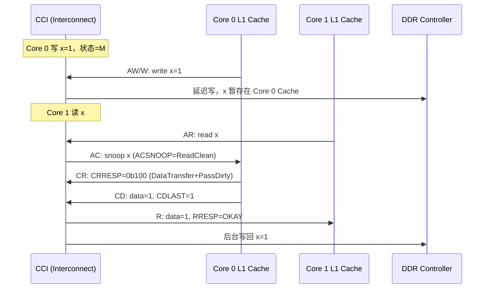
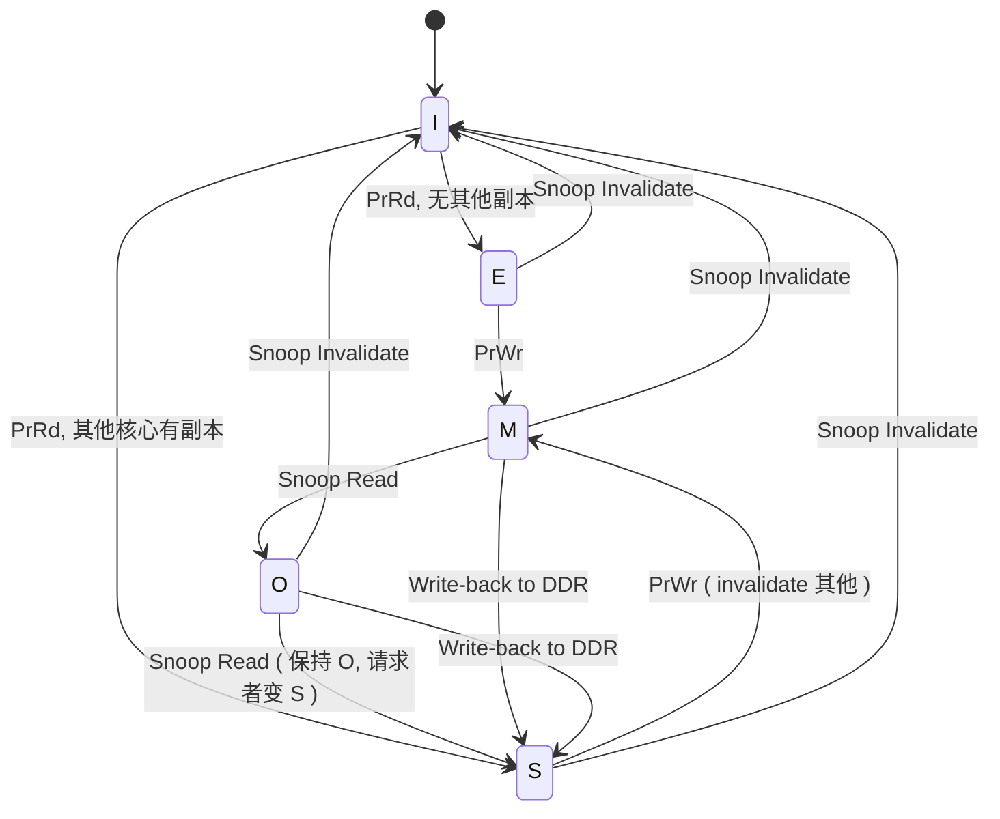
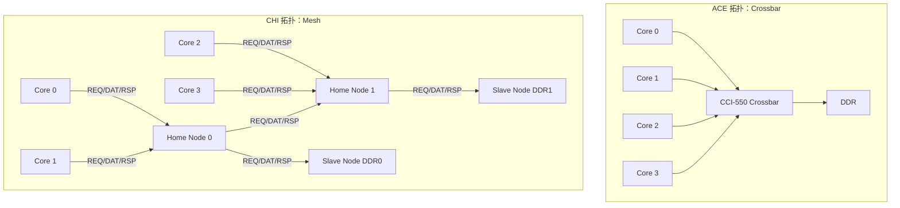
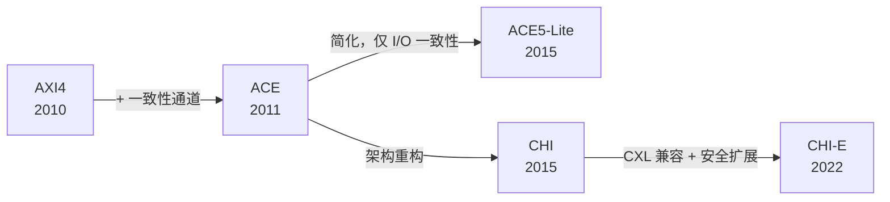

# AXI5与ACE——缓存一致性与系统扩展

<span class="badge-b">[B]</span> <span class="badge-i">[I]</span> <span class="badge-e">[E]</span> <span class="badge-m">[M]</span>

<span class="red">ACE（AXI Coherency Extensions）</span>是 ARM 在 AMBA 4 中引入的缓存一致性扩展协议。
<br>
它在 AXI4 的 5 个通道基础上增加了 3 个一致性通道（AC/CR/CD），
<br>
使多个 CPU 核心、GPU、DMA 和加速器能够共享同一份缓存数据视图。
<br>
<span class="blue">从 AXI4 到 ACE 再到 CHI，ARM 的一致性总线经历了从 "信号级广播" 到 "包化路由" 的范式转移。</span>
<br>

---

## 核心定义与价值

<span class="red">缓存一致性（Cache Coherency）</span>是多核 SoC 中最复杂的问题之一。
<br>
当 Core 0 修改了 L1 Cache 中的变量 x，Core 1 读取 x 时必须获得最新值，
<br>
而不是从自己的 L1 Cache 中读到旧值。
<br>

ACE 的解决思路是：在 AXI 的读写通道之外，增加一套 <span class="green">"窥探（Snoop）"</span> 机制，
<br>
让 Interconnect 主动查询其他核心的 Cache 状态，必要时强制回写或失效。
<br>

### 办公室白板类比

<span class="blue">把多核缓存一致性想象成一个开放办公区的共享白板：</span>
<br>

- 每个员工的 <span class="green">L1 Cache</span> = 自己桌上的便签本，记了白板上的关键数字。
<br>
- <span class="green">DDR 内存</span> = 走廊尽头的大白板，所有人理论上都能看到。
<br>
- <span class="green">ACE 的 AC 通道</span> = "广播喇叭"："谁有 x 的最新值？请举手！"
<br>
- <span class="green">ACE 的 CR 通道</span> = "举手回应"："我有，状态是 M（Modified）！"
<br>
- <span class="green">ACE 的 CD 通道</span> = "传递便签"：把最新值抄送给需要的人。
<br>

如果没有 ACE（纯 AXI4），员工之间不互通，各写各的便签，最终大白板上的数据就是混乱的。
<br>

---

## 核心机制原理解析

### <strong>1. ACE 的额外通道：AC / CR / CD</strong>

ACE 在 AXI4 的 5 通道基础上增加 3 个一致性专用通道：

| 通道 | 全称 | 方向 | 核心信号 | 功能说明 |
|------|------|------|---------|---------|
| AC | Snoop Address | Interconnect → Slave | ACADDR, ACSNOOP, ACPROT | 广播窥探地址与操作类型 |
| CR | Snoop Response | Slave → Interconnect | CRRESP | 返回本地 Cache 的命中状态 |
| CD | Snoop Data | Slave → Interconnect | CDDATA, CDLAST | 如果被窥探的 Cache 行是 M 状态，回写数据 |

<br>



<br>

<span class="blue">CD 通道仅在 Cache 行为 M 或 E 状态时激活：</span>
<br>
- 如果窥探的 Cache 行是 S 状态，说明数据与内存一致，无需回写。
<br>
- 如果是 I 状态，说明本地没有，Interconnect 转而从 DDR 读取。
<br>

### <strong>2. 缓存状态机：MESI → MOESI</strong>

<span class="red">MESI</span> 是最经典的缓存一致性协议，定义 4 个状态：

| 状态 | 编码 | 含义 | 允许操作 |
|------|------|------|---------|
| M (Modified) | — | 独占且已修改，与内存不一致 | 可读可写 |
| E (Exclusive) | — | 独占且未修改，与内存一致 | 可读可写 |
| S (Shared) | — | 共享，多核同时拥有只读副本 | 只读 |
| I (Invalid) | — | 无效，不包含有效数据 | 不可访问 |

<br>

ARM 在 ACE 中扩展为 <span class="green">MOESI</span>，增加一个 O (Owned) 状态：

| 状态 | 含义 | 与 MESI 的差异 |
|------|------|---------------|
| O (Owned) | 独占但不完整 | 数据有效，但可能不是最新完整副本；允许转发给其他核心 |

<br>

<span class="blue">O 状态的作用：</span>
<br>
在多核共享场景下，如果一个核心持有 M 状态的 Cache 行并收到读窥探，
<br>
传统 MESI 要求它立即回写内存（Write-back），然后从 M 降级为 S。
<br>
MOESI 允许它转为 O 状态，直接将数据转发给请求者，<span class="blue">避免了一次写回内存的延迟</span>。
<br>



<br>

### <strong>3. CCI（Cache Coherent Interconnect）</strong>

<span class="red">CCI（CoreLink Cache Coherent Interconnect）</span>是 ARM 实现 ACE 协议的硬件 Interconnect。

| 版本 | 名称 | 一致性协议 | 支持端口数 | 最大带宽 | 代表 SoC |
|------|------|-----------|-----------|---------|---------|
| CCI-400 | 首款 CCI | ACE | 4 ACE + 3 AXI | ~10 GB/s | Cortex-A15 big.LITTLE |
| CCI-500 | 增强版 | ACE + DVM | 6 ACE | ~25 GB/s | Cortex-A53/A57 |
| CCI-550 | 支持 QoS | ACE + PMU | 6 ACE | ~30 GB/s | Cortex-A73 |
| CMN-600 | Mesh 架构 | CHI | 多达 16 节点 | 100+ GB/s | Neoverse N1 |

<br>

<span class="blue">CCI 的内部仲裁流程：</span>
<br>
1. 收到来自 Core 1 的读请求。
<br>
2. 查询目录（Directory）记录哪些核心持有该地址的 Cache 行。
<br>
3. 向相关核心发送 AC 窥探。
<br>
4. 收集 CR 响应，决定数据来源（Core 0 Cache、L2 Cache 或 DDR）。
<br>
5. 将数据通过 R 通道返回 Core 1，必要时触发 CD 数据回写。
<br>

### <strong>4. CHI（Coherent Hub Interface）——AMBA 5 新协议</strong>

<span class="red">CHI</span> 是 AMBA 5 推出的新一代一致性协议，与 ACE 的根本差异在于架构层级：

| 特性 | ACE | CHI |
|------|-----|-----|
| 协议层级 | 信号级（AXI 风格） | 包级（网络风格） |
| 通道数 | 8 个（AXI5 + AC/CR/CD） | 3 个包通道（REQ/DAT/RSP） |
| 乱序支持 | 通过 ID | 原生支持，Transaction ID 独立 |
| 拓扑 | 交叉开关（Crossbar） | Mesh / Ring / Torus |
| 一致性范围 | 多核 + 部分加速器 | 全芯片 + CXL 互联 |
| 代表芯片 | Cortex-A73 | Cortex-A76, Neoverse |

<br>



<br>

<span class="blue">CHI 的 Home Node 机制：</span>
<br>
- 每个物理地址被哈希映射到一个固定的 Home Node。
<br>
- Home Node 负责维护该地址的一致性目录，处理所有窥探请求。
<br>
- 这种分布式设计使 CHI 可以扩展到 64+ 核心，而 CCI 的集中式 Crossbar 在 8 核以上出现瓶颈。
<br>

### <strong>5. 从 AXI4 到 CHI 的演进路径</strong>



<br>

| 阶段 | 适用场景 | 关键特征 |
|------|---------|---------|
| AXI4 | 单核/无一致性需求 | 简单、低功耗、面积小 |
| ACE | big.LITTLE 多核手机 | 全一致性，CCI Crossbar |
| ACE5-Lite | I/O 加速器（GPU/DMA） | 仅监听一致性，面积更小 |
| CHI | 服务器/AI 加速器 | Mesh 拓扑、包化、TB/s 带宽 |
| CHI-E | 云原生/CXL 互联 | 支持 CXL.mem 语义、安全域 |

---

## 嵌入式专属实战场景

### <strong>场景：big.LITTLE 架构中的 ACE 一致性调试</strong>

ARM big.LITTLE（如 Exynos 5422）包含 4 个 Cortex-A15（大核）和 4 个 Cortex-A7（小核），
<br>
通过 CCI-400 实现缓存一致性。

调试步骤：

1. <span class="green">确认 CCI-400 寄存器映射：</span>
<br>
   CCI-400 基址通常为 `0xF8800000`（SoC 特定）。
<br>

```bash
# 读取 CCI 配置寄存器
$ devmem 0xF8800000    # CCI 控制寄存器
0x00000001             # bit0=1: CCI 使能

$ devmem 0xF8809000    # Slave Interface 0 状态
0x00000003             # bit0=1: 激活, bit1=1: 窥探使能
```

2. <span class="green">读取性能计数器：</span>
<br>

```bash
$ devmem 0xF8800004    # 窥探事务计数
0x00012345

$ devmem 0xF8800008    # 窥探命中计数
0x0000ABCD
```

<span class="blue">命中率计算：</span>
<br>
- 命中率 = 0xABCD / 0x12345 ≈ 56%。
<br>
- 如果命中率低于 30%，说明核心间数据共享少，一致性开销（广播窥探）浪费较多带宽。
<br>
- 优化方向：调整任务调度策略，将共享数据的线程绑定到同一 Cluster。
<br>

---

## 技术教学与实战

### <strong>Linux 内核中的 ACE 一致性 API</strong>

Linux 内核通过 <span class="green">`dma_sync_single_for_cpu()`</span> 和 <span class="green">`dma_sync_single_for_device()`</span>
<br>
管理 CPU Cache 与 DMA 之间的一致性。底层在 ACE SoC 上会触发 Clean/Invalidate 操作。

```c
#include <linux/dma-mapping.h>

/* CPU 写入缓冲区后，刷新 Cache 使 DMA 能看到最新数据 */
dma_sync_single_for_device(dev, dma_handle, size, DMA_TO_DEVICE);
/* 底层在 ACE SoC 中执行： */
/* DCCMVAC (Clean D Cache by MVA to PoC) → 将 M 状态行写回 DDR */

/* DMA 写入后，使 CPU Cache 失效，确保 CPU 读到最新数据 */
dma_sync_single_for_cpu(dev, dma_handle, size, DMA_FROM_DEVICE);
/* 底层在 ACE SoC 中执行： */
/* DCIMVAC (Invalidate D Cache by MVA to PoC) → 将对应 Cache 行置 I */
```

<span class="blue">关键机制：</span>
<br>
- `DMA_TO_DEVICE`：CPU 写 → Clean Cache → 数据写回 DDR → DMA 从 DDR 读。
<br>
- `DMA_FROM_DEVICE`：DMA 写 DDR → Invalidate Cache → CPU 读 DDR 最新值。
<br>
- 在纯 ACE SoC 中，如果 DMA 走 ACP 端口，这些 sync 操作可由硬件自动完成，无需软件干预。
<br>

### <strong>C 语言：读取 ARM Cache 一致性状态（通过 CP15）</strong>

```c
/* ARMv7-A：读取 CCSIDR（Cache Size ID Register） */
static inline uint32_t read_ccsidr(void)
{
    uint32_t val;
    __asm__ volatile("mrc p15, 1, %0, c0, c0, 0" : "=r"(val));
    return val;
}

/* 解析 CCSIDR */
void parse_ccsidr(uint32_t val)
{
    int num_sets   = ((val >> 13) & 0x7FFF) + 1;
    int associativity = ((val >> 3) & 0x3FF) + 1;
    int line_size     = 1 << ((val & 0x7) + 4);   /* bytes */

    printf("Cache Sets       : %d\n", num_sets);
    printf("Associativity    : %d-way\n", associativity);
    printf("Line Size        : %d bytes\n", line_size);
    printf("Total Cache Size : %d KB\n",
           num_sets * associativity * line_size / 1024);
}
```

<span class="blue">解读：</span>
<br>
- `CCSIDR` 的 line_size 通常为 64 bytes，这是 ACE 窥探的最小粒度（一个 Cache line）。
<br>
- ACE 的 AC 地址始终对齐到 Cache line 边界（64-byte aligned），一次窥探覆盖 64 bytes。
<br>
- 如果数据结构小于 64 bytes 且多个变量共享同一 Cache line，会导致 <span class="green">"伪共享（False Sharing）"</span>，
<br>
  核心间频繁相互窥探，严重降低性能。
<br>

---

## 历史演进与前沿

### <strong>一致性协议演进：从监听总线到目录式</strong>

| 年代 | 协议/架构 | 一致性机制 | 扩展能力 | 代表系统 |
|------|----------|-----------|---------|---------|
| 1990 | Snoopy Bus | 广播监听 | 2～4 核 | Intel Pentium Pro |
| 2000 | MESI + Crossbar | 集中仲裁 | 4～8 核 | Intel Core 2 Quad |
| 2010 | ACE + CCI | 目录式监听 | 8～16 核 | ARM big.LITTLE |
| 2015 | CHI + CMN | 分布式目录 | 16～64 核 | Neoverse N1 |
| 2022 | CHI-E + CXL | 全局一致性域 | 100+ 核 | AWS Graviton3 |
| 2024 | CHI-F + UCIe | Chiplet 一致性 | 千核级 | 下一代数据中心 |

<br>

<span class="blue">前沿趋势：CXL（Compute Express Link）与 CHI 的融合：</span>
<br>
- CXL 基于 PCIe 物理层，提供缓存一致性内存扩展。
<br>
- ARM CHI-E 已加入对 CXL.mem 语法的原生支持，使 ARM SoC 可以通过 CXL 访问外部加速器的缓存一致内存。
<br>
- 未来数据中心可能出现 "ARM CPU + GPU + FPGA" 通过 CXL/CHI 构成全局一致性域。
<br>

---

## 本章小结

| 维度 | 要点 |
|------|------|
| ACE 是什么 | AXI4 + 3 个一致性通道（AC/CR/CD），实现多核缓存一致性 |
| MESI → MOESI | M/E/S/I 四态基础上增加 O（Owned），减少回写延迟 |
| CCI | ARM CoreLink 实现 ACE 的硬件 Interconnect，从 CCI-400 到 CCI-550 |
| CHI | AMBA 5 包化协议，Mesh 拓扑，支持 64+ 核心，替代 CCI |
| Linux API | dma_sync_single_for_cpu/device 管理 Cache 与 DMA 一致性 |
| 前沿趋势 | CHI-E 支持 CXL 互联，Chiplet 时代千核级一致性 |

---

## 练习

1. 画出 ACE 8 通道的完整信号方向图（AXI5 + AC/CR/CD），标注每个通道的源与目的。
<br>

2. 在 MOESI 中，O 状态相比 MESI 的 M 状态有什么优势？什么场景下会触发 M → O 的转换？
<br>
   <span class="purple">提示：从 "减少写回内存次数" 角度思考。</span>
<br>

3. 某 CCI-400 的窥探命中率为 25%。这暗示了什么问题？提出 2 种优化方案。
<br>

4. 在 Linux 驱动中，什么情况下可以省略 `dma_sync_single_for_device()`？
<br>
   <span class="purple">提示：从 ACP 端口、一致性 DMA、非缓存内存三个角度分析。</span>
<br>

5. 查阅 ARM IHI 0050F《AMBA 5 CHI Architecture Specification》，找到 CHI 中
   "Snoop request transaction" 的 REQ 包格式，列出其关键字段（TxnID、Addr、Opcode）。
<br>
   <span class="purple">延伸阅读：ARM IHI 0050F Chapter 4: Transaction Definitions。</span>
<br>
