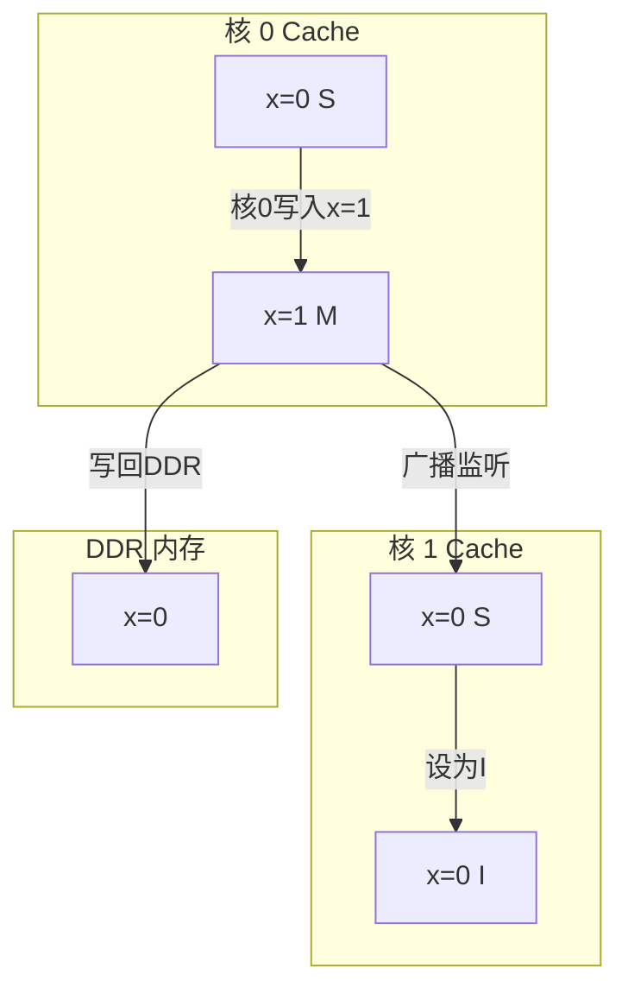
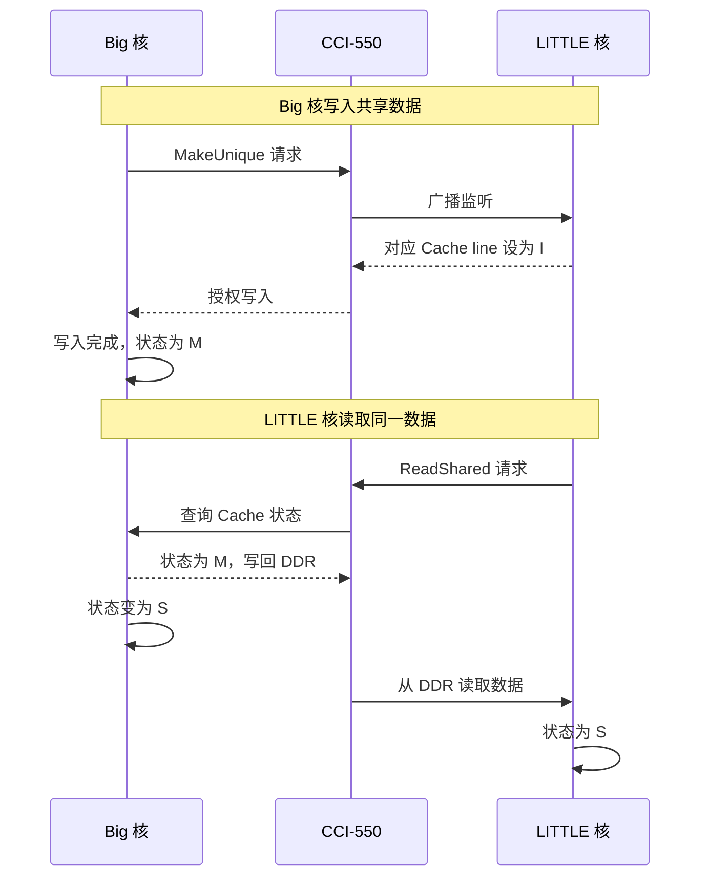

# AXI5 与 ACE 缓存一致性 [E→M]

> **本章学习目标**：
> - 理解 <span class="red">缓存一致性</span>问题的本质与 <span class="red">MESI 协议</span>
> - 掌握 <span class="red">ACE（AXI Coherency Extensions）</span> 的 5 种事务类型
> - 了解 <span class="red">CHI（Coherent Hub Interface）</span> 对 ACE 的演进

---

<span class="blue">从何而来 → 为什么需要 → 哪里用：</span><br>
<span class="red">缓存一致性协议</span>最早出现在 <span class="green">1980 年代</span>的多处理器系统中。<br>
随着 <span class="green">多核 SoC</span> 的普及，每个 CPU 核都有私有 L1 Cache，<br>
核间共享数据时可能出现"一个核改了数据，另一个核读到旧值"的问题。<span class="blue">ACE 在 AXI4 基础上新增 3 个监听通道，实现硬件级缓存一致性，无需软件干预。</span><br>
如今，ACE/CHI 广泛应用于 <span class="green">big.LITTLE</span> 架构、服务器级 SoC、<span class="green">ARM Neoverse</span> 平台。<br>

---

## 缓存一致性问题的本质

---

### <strong>为什么需要缓存一致性：多核共享数据的噩梦</strong>

<span class="red">缓存一致性（Cache Coherency）</span>是多核 SoC 中最复杂的问题之一。<br>

<span class="blue">类比理解：缓存一致性如同"办公室共享白板"</span><br>
每个核的 L1 Cache 是一块"个人小黑板"，DDR 是"办公室大白板"。<br>
核 0 在小黑板上改了数据，核 1 的小黑板还是旧的。<br>
如果没有通知机制，核 1 永远不知道自己看到的是"过期信息"。<br>

假设 <span class="green">双核 Cortex-A73</span> 共享 DDR 中的变量 <span class="green">x = 0</span>：<br>

<span class="orange"><strong>1. 核 0 读取 x → 加载到 L1 Cache</strong></span><br>
核 0 的 L1 Cache：x = 0（状态 S：Shared）<br>
核 1 的 L1 Cache：无 x<br>
DDR：x = 0<br>

<span class="orange"><strong>2. 核 1 读取 x → 也加载到 L1 Cache</strong></span><br>
核 0 的 L1 Cache：x = 0（状态 S）<br>
核 1 的 L1 Cache：x = 0（状态 S）<br>
DDR：x = 0<br>

<span class="orange"><strong>3. 核 0 写入 x = 1 → 仅修改本地 Cache</strong></span><br>
核 0 的 L1 Cache：x = 1（状态 M：Modified）<br>
核 1 的 L1 Cache：x = 0（状态 S，过时！）<br>
DDR：x = 0（未更新）<br>

<span class="blue">不一致出现：核 1 读到 x = 0，但核 0 已写入 x = 1。</span><br>

---

### <strong>MESI 协议：缓存行状态的 4 种状态</strong>

<span class="red">MESI</span> 是最经典的缓存一致性协议，定义 4 种状态：<br>

| 状态 | 缩写 | 含义 | 可读写 |
| --- | --- | --- | --- |
| Modified | M | 已修改，仅本 Cache 有最新数据 | 可读写 |
| Exclusive | E | 独占，仅本 Cache 有，且与内存一致 | 可读写 |
| Shared | S | 共享，多个 Cache 有相同副本 | 只读 |
| Invalid | I | 无效，数据已过时或不存在 | 不可访问 |

<span class="blue">状态转换由监听（Snoop）总线上的事务触发。</span><br>



<span class="blue">核 0 写入 x（M 状态）后广播监听，核 1 监听到后将 x 状态设为 I（Invalid）。</span><br>

---

## ACE 协议：AXI 的缓存一致性扩展

---

### <strong>ACE 在 AXI 基础上新增的通道与信号</strong>

<span class="red">ACE</span>是 AMBA 4 规范的一部分，<br>
在 AXI4 的 5 通道基础上新增 <span class="blue">3 个监听通道</span>：<br>

| 通道 | 信号 | 方向 | 作用 |
| --- | --- | --- | --- |
| AC | ACVALID/ACREADY | Interconnect→Master | 发送监听请求 |
| CD | CDVALID/CDREADY | Master→Interconnect | 返回监听数据 |
| CR | CRVALID/CRREADY | Master→Interconnect | 返回监听响应 |

<span class="blue">监听通道让 Interconnect 可以查询其他 Master 的 Cache 状态。</span><br>

---

### <strong>ACE 的 5 种一致性事务类型</strong>

| 事务类型 | ARSNOOP/WSNOOP | 作用 | 典型场景 |
| --- | --- | --- | --- |
| ReadNoSnoop | 0x0 | 不监听，直接读 | 非共享内存（如私有栈） |
| ReadOnce | 0x1 | 读一次，不保留 Cache | DMA 读（不需缓存） |
| ReadShared | 0x2 | 读并设为 S 状态 | 多核共享变量读取 |
| ReadUnique | 0x3 | 读并设为 E 状态，其他核变 I | 核即将写入前的读取 |
| CleanUnique | 0x4 | 将其他核的 M 状态写回，本核变 E | 核写入前的清理 |
| MakeUnique | 0x5 | 直接让其他核变 I，本核变 M | 核直接写入（已有数据） |

<span class="blue">ReadShared 用于首次读取共享变量，MakeUnique 用于后续写入。</span><br>

```verilog
// ACE Master 发起 ReadShared 事务（Verilog 伪代码）
assign ARADDR   = shared_var_addr;
assign ARSNOOP  = 4'b0010;   // ReadShared
assign ARDOMAIN = 2'b10;      // Inner Shareable（核间共享域）
assign ARBAR    = 2'b00;      // 非屏障事务
assign ARVALID  = 1'b1;
// Slave 返回 RDATA，核将 Cache line 设为 S 状态
```

---

### <strong>嵌入式案例：Cortex-A53 big.LITTLE 的一致性管理</strong>

在 <span class="green">ARM big.LITTLE</span>架构中：<br>
* <span class="green">Big 核（Cortex-A73）</span>：大 L2 Cache，高性能<br>
* <span class="green">LITTLE 核（Cortex-A53）</span>：小 L2 Cache，低功耗<br>

两者通过 <span class="green">CCI-550（Cache Coherent Interconnect）</span> 互联。<br>



<span class="blue">CCI-550 的监听延迟约 20~50ns，对实时性要求高的任务需避免频繁跨核共享数据。</span><br>

---

## CHI：AMBA 5 的下一代一致性协议

---

### <strong>CHI 对 ACE 的核心改进</strong>

<span class="red">CHI（Coherent Hub Interface）</span>是 AMBA 5 规范的一致性协议，<br>
面向 <span class="blue">服务器级 SoC 和超多核系统</span>。<br>

| 特性 | ACE | CHI | 影响 |
| --- | --- | --- | --- |
| 拓扑 | 总线/矩阵 | 片上网络（NoC） | 支持 64+ 核 |
| 包格式 | 固定信号 | 分层包头 | 更灵活，面积更小 |
| 事务类型 | 6 种 | 15+ 种 | 更细粒度控制 |
| QoS | 4-bit | 8-bit | 更精细优先级 |
| 错误处理 | 简单响应 | 端到端重试 | 可靠性更高 |

<span class="blue">CHI 将 AXI 的通道模型改为基于包的片上网络，每个传输被封装为请求/响应包。</span><br>

---

## 本章小结

| 概念 | 一句话总结 |
| --- | --- |
| 缓存一致性 | 多核共享数据时，确保所有核看到最新值 |
| MESI | 4 状态协议：M（修改）、E（独占）、S（共享）、I（无效） |
| ACE | AXI 的缓存一致性扩展，新增 AC/CD/CR 监听通道 |
| ReadShared | 读取共享变量，设为 S 状态 |
| MakeUnique | 写入前让其他核变 I，本核变 M |
| CCI-550 | ARM 缓存一致性互连，连接 big.LITTLE 核 |
| CHI | AMBA 5 的下一代，NoC 拓扑，支持 64+ 核 |

---

## 练习

1. 双核系统共享变量 x，核 0 先读后写，核 1 只读。用 MESI 描述完整的状态转换过程。<br>
2. 为什么 DMA 读内存通常用 ReadOnce 而不是 ReadShared？<br>
3. 在 big.LITTLE 系统中，任务从 Big 核迁移到 LITTLE 核时，缓存数据如何保持一致？
