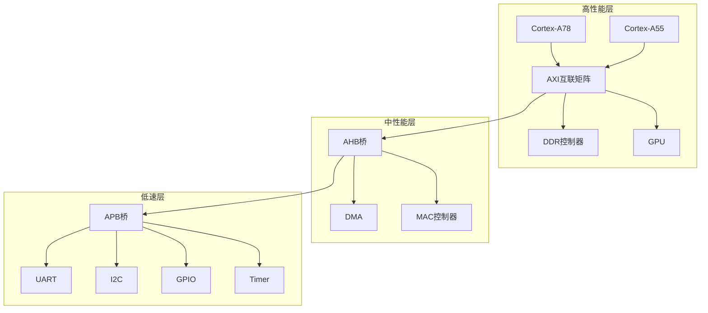
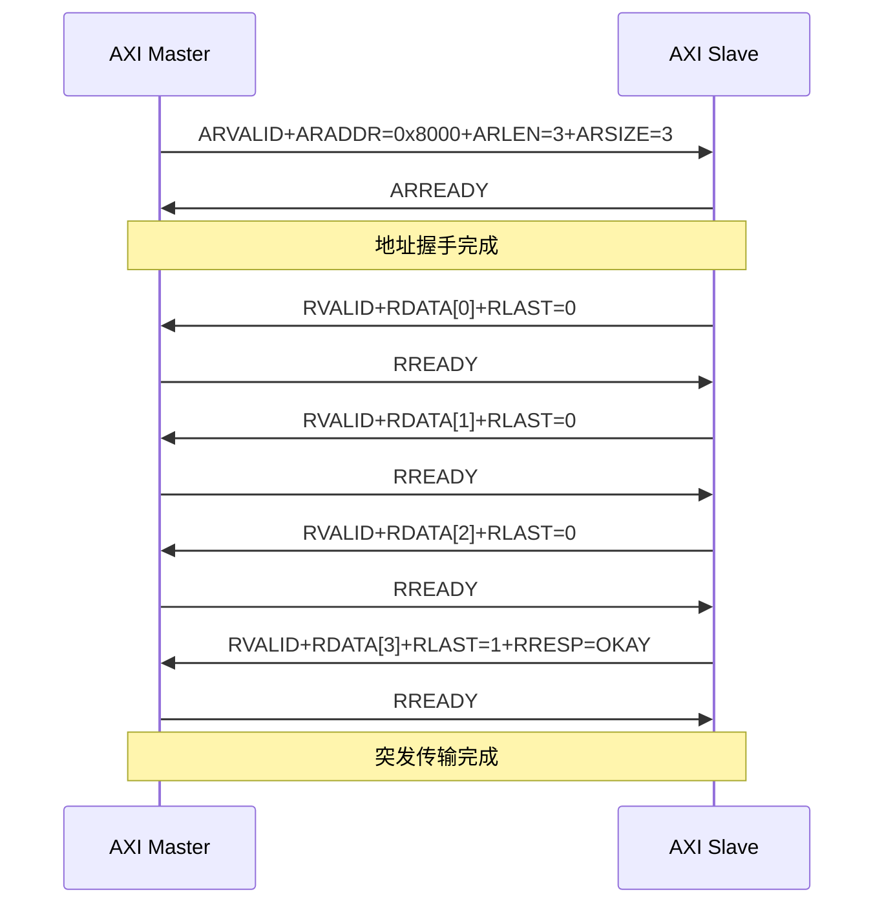
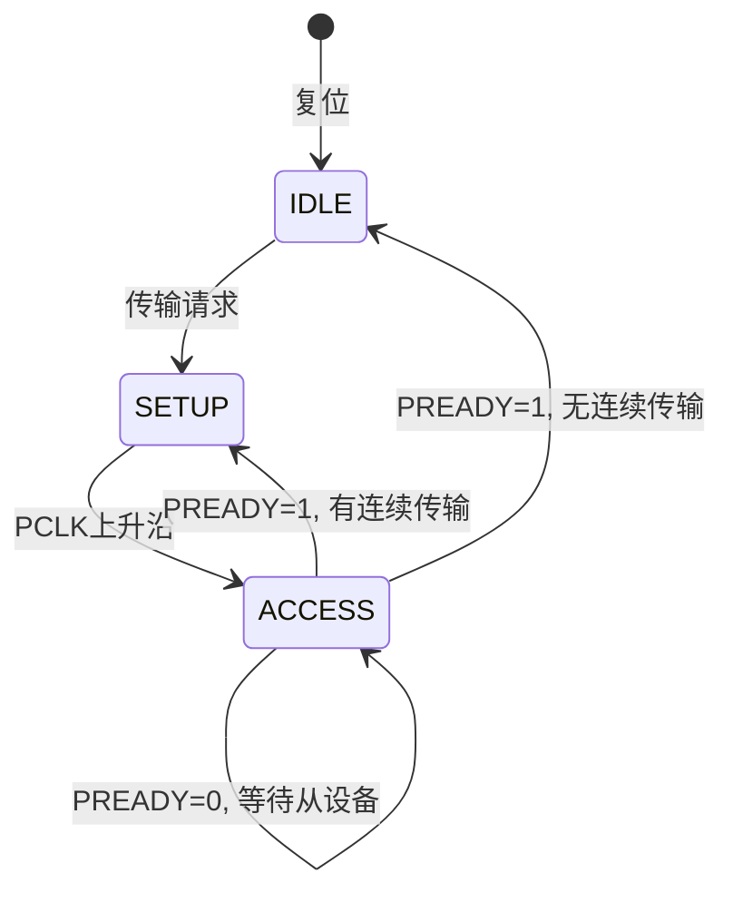
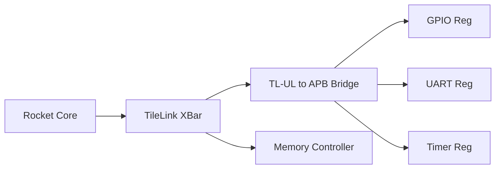
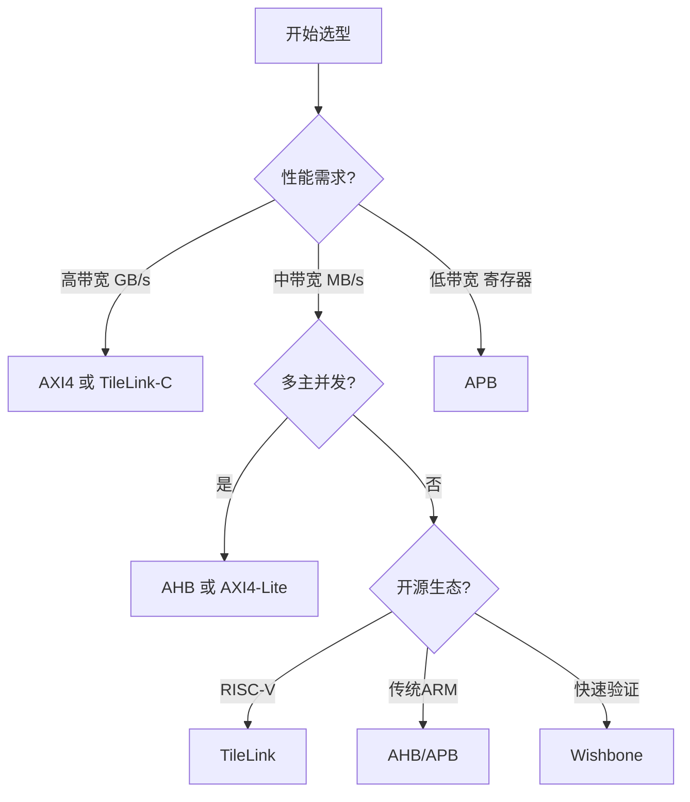

# 片内SoC总线

> 📊 **本节难度等级：** <span class="badge-i">I级</span><br>
> <span class="blue">核心认知目标：掌握AMBA家族（AXI/AHB/APB）、TileLink、Wishbone三大片内总线架构的协议差异、适用场景及Linux驱动配置方法，能在SoC设计中做出合理的总线选型决策。</span>

---

## 片内总线概述与对比

---

### <strong>什么是片内总线</strong>

<span class="badge-b">B</span><br>
<span class="red">片内总线</span>（On-Chip Bus）是连接SoC内部各IP核（CPU、DMA、内存控制器、外设等）的片上互连架构。<br>
与板级总线（I2C/SPI/USB等）不同，片内总线完全在芯片内部实现，<br>
不涉及物理连接器，信号完整性由布局布线保证。

片内总线的设计目标：<br>
<span class="orange"><strong>1. 高带宽：</strong></span>满足多核CPU、高吞吐量DMA的需求。<br>
<span class="orange"><strong>2. 低延迟：</strong></span>减少主设备访问从设备的等待周期。<br>
<span class="orange"><strong>3. 可扩展：</strong></span>支持IP核的即插即用与系统规模扩展。<br>
<span class="orange"><strong>4. 低功耗：</strong></span>静态/动态功耗可控，支持时钟门控。

---

### <strong>主流片内总线对比</strong>

<span class="badge-i">I</span><br>
<span class="red">AMBA、TileLink、Wishbone</span>是当前主流的三大片内总线标准，各自定位不同：

| 总线标准 | 发起方 | 典型速率 | 拓扑结构 | 线数 | 适用场景 |
|----------|--------|----------|----------|------|----------|
| AXI4 | ARM | 数GB/s | 交叉开关/多级互联 | 150+ | 高性能SoC、多核处理器 |
| AHB | ARM | 百MB/s~GB/s | 多主仲裁总线 | 50+ | 中性能外设、DMA |
| APB | ARM | 数十MB/s | 单主多从 | 20+ | 低速寄存器外设 |
| TileLink | UCB/RISC-V | 数GB/s | 点对点/网络拓扑 | 80+ | 开源芯片、RISC-V生态 |
| Wishbone | OpenCores | 百MB/s | 点对点/共享总线 | 30+ | 开源IP、教学验证 |

<span class="blue">关键洞察：AMBA是商业SoC的事实标准，TileLink是RISC-V阵营的新星，Wishbone适合快速原型验证。</span>

---

## AMBA总线家族深度解析

---

### <strong>AMBA架构的分层设计</strong>

<span class="badge-i">I</span><br>
<span class="red">AMBA</span>（Advanced Microcontroller Bus Architecture）是ARM定义的全套片内互联规范。<br>
现代SoC通常采用分层架构：



<span class="blue">AXI负责高带宽数据搬运，AHB负责中等吞吐量外设，APB负责寄存器配置类低速外设。</span>

---

### <strong>AXI4协议核心机制</strong>

<span class="badge-e">E</span><br>
<span class="red">AXI4</span>（Advanced eXtensible Interface 4）是AMBA的高性能协议，支持乱序传输、突发传输、多主并发。

AXI4五大独立通道：<br>
<span class="orange"><strong>1. 读地址通道 AR：</strong></span>主设备发送读地址和控制信息。<br>
<span class="orange"><strong>2. 读数据通道 R：</strong></span>从设备返回读数据和响应。<br>
<span class="orange"><strong>3. 写地址通道 AW：</strong></span>主设备发送写地址和控制信息。<br>
<span class="orange"><strong>4. 写数据通道 W：</strong></span>主设备发送写数据。<br>
<span class="orange"><strong>5. 写响应通道 B：</strong></span>从设备返回写完成确认。

关键信号定义：

```verilog
// AXI4读地址通道关键信号
input  wire [31:0] araddr,      // 读地址
input  wire [7:0]  arlen,       // 突发长度-1 (0-255)
input  wire [2:0]  arsize,      // 突发大小 (0=1B, 3=8B)
input  wire [1:0]  arburst,     // 突发类型 (FIX/INCR/WRAP)
input  wire        arvalid,
output wire        arready,

// AXI4读数据通道关键信号
output wire [63:0] rdata,       // 读数据 (64bit位宽)
output wire [1:0]  rresp,       // 响应 (OKAY/EXOKAY/SLVERR/DECERR)
output wire        rlast,       // 突发最后一个数据
output wire        rvalid,
input  wire        rready
```

突发传输示例（读4个64bit数据）：



---

### <strong>AHB协议核心机制</strong>

<span class="badge-i">I</span><br>
<span class="red">AHB</span>（Advanced High-performance Bus）是单时钟边沿触发的共享总线，采用中央仲裁器管理多主访问。

AHB关键特性：<br>
<span class="orange"><strong>1. 流水传输：</strong></span>地址和数据相位分离，支持流水线。<br>
<span class="orange"><strong>2. 突发传输：</strong></span>支持4/8/16拍固定增量突发。<br>
<span class="orange"><strong>3. 总线仲裁：</strong></span>多主设备通过HGRANT/ HBUSREQ竞争总线。

AHB信号（精简版）：

```verilog
// AHB主设备信号
input  wire        HCLK,
input  wire        HRESETn,
output wire [31:0] HADDR,       // 地址总线
output wire [2:0]  HBURST,      // 突发类型
output wire [2:0]  HSIZE,       // 传输大小
output wire [1:0]  HTRANS,      // 传输类型 (IDLE/BUSY/NONSEQ/SEQ)
output wire        HWRITE,      // 读/写方向
output wire [31:0] HWDATA,      // 写数据
input  wire [31:0] HRDATA,      // 读数据
input  wire        HREADY,      // 从设备就绪
input  wire [1:0]  HRESP        // 响应
```

---

### <strong>APB协议核心机制</strong>

<span class="badge-b">B</span><br>
<span class="red">APB</span>（Advanced Peripheral Bus）是最简单的AMBA协议，用于连接低速寄存器外设。

APB特性：<br>
<span class="orange"><strong>1. 单主架构：</strong></span>只有一个主设备（通常是AHB/APB桥）。<br>
<span class="orange"><strong>2. 无流水线：</strong></span>地址和数据在同一周期完成。<br>
<span class="orange"><strong>3. 低功耗：</strong></span>支持时钟门控，外设空闲时可关时钟。

APB状态机（状态转换）：



---

## TileLink与Wishbone解析

---

### <strong>TileLink协议</strong>

<span class="badge-e">E</span><br>
<span class="red">TileLink</span>是UC Berkeley为RISC-V生态设计的开源片内总线，被SiFive、Rocket Chip等广泛采用。

TileLink三个一致性层级：

| 层级 | 名称 | 特性 | 典型应用 |
|------|------|------|----------|
| TL-UL | Uncached Lightweight | 简单请求-响应，无缓存 | 寄存器访问 |
| TL-UH | Uncached Heavyweight | 支持突发、多主仲裁 | DMA、外设 |
| TL-C | Cached | 完整缓存一致性 | 多核缓存互联 |

TileLink消息类型（TL-C示例）：

```scala
// TileLink消息类型（Chisel/Scala定义）
sealed trait TLMessage
object Acquire extends TLMessage      // 获取缓存行权限
object Probe extends TLMessage        // 探查其他缓存
object Release extends TLMessage      // 写回脏数据
object Grant extends TLMessage        // 授权响应
object GrantAck extends TLMessage     // 授权确认
```

<span class="blue">TileLink的优势在于：开源免费、设计简洁、天生支持缓存一致性，与RISC-V生态深度绑定。</span>

---

### <strong>Wishbone协议</strong>

<span class="badge-i">I</span><br>
<span class="red">Wishbone</span>是OpenCores社区定义的开源总线标准，以极简设计著称。

Wishbone关键特性：<br>
<span class="orange"><strong>1. 信号精简：</strong></span>最少只需8根信号线。<br>
<span class="orange"><strong>2. 点对点：</strong></span>支持直接互联，无需复杂仲裁。<br>
<span class="orange"><strong>3. 开源IP丰富：</strong></span>OpenCores.org有大量现成Wishbone IP。

Wishbone信号定义：

```verilog
// Wishbone精简信号集
input  wire        CLK_I,
input  wire        RST_I,
input  wire [31:0] ADR_I,       // 地址
input  wire        WE_I,        // 写使能
input  wire [31:0] DAT_I,       // 写数据
output wire [31:0] DAT_O,       // 读数据
input  wire        STB_I,       // 选通
output wire        ACK_O,       // 确认
input  wire        CYC_I        // 总线周期
```

<span class="blue">Wishbone适合FPGA验证、教学、快速原型，但在高性能ASIC中已逐渐被AMBA/TileLink取代。</span>

---

## Linux驱动视角

---

### <strong>AMBA设备树配置</strong>

<span class="badge-i">I</span><br>
Linux内核通过 <span class="red">设备树</span>描述AMBA外设，驱动通过 <span class="green">platform_driver</span>匹配。

典型AMBA外设设备树节点：

```dts
// AXI DMA控制器节点
axi_dma: dma@40400000 {
    compatible = "xlnx,axi-dma-1.00.a";
    reg = <0x40400000 0x10000>;
    interrupts = <0 46 4>;
    interrupt-parent = <&gic>;
    clocks = <&clkc 15>;
    clock-names = "s_axi_lite_aclk";
    
    dma-channel@40400000 {
        compatible = "xlnx,axi-dma-s2mm-channel";
        interrupt-parent = <&gic>;
        interrupts = <0 47 4>;
        xlnx,datawidth = <64>;
    };
};

// AHB UART节点
uart0: serial@101f1000 {
    compatible = "arm,pl011", "arm,primecell";
    reg = <0x101f1000 0x1000>;
    interrupts = <12 4>;
    clocks = <&apb_pclk>;
    clock-names = "apb_pclk";
    arm,primecell-periphid = <0x00041011>;
};

// APB GPIO节点
gpio0: gpio@e0050000 {
    compatible = "snps,dw-apb-gpio";
    reg = <0xe0050000 0x100>;
    clocks = <&pclk>;
    gpio-controller;
    #gpio-cells = <2>;
    ngpios = <32>;
};
```

---

### <strong>AMBA核心驱动API</strong>

<span class="badge-e">E</span><br>
Linux内核为AMBA PrimeCell外设提供标准驱动框架。

驱动匹配与初始化：

```c
/* include/linux/amba/bus.h */
static struct amba_driver pl011_driver = {
    .drv = {
        .name = "uart-pl011",
    },
    .id_table = pl011_ids,
    .probe = pl011_probe,
    .remove = pl011_remove,
};

static int __init pl011_init(void)
{
    return amba_driver_register(&pl011_driver);
}
```

DMA引擎API（AXI DMA常用）：

```c
/* include/linux/dmaengine.h */
// 申请DMA通道
struct dma_chan *dma_request_chan(struct device *dev, const char *name);

// 准备内存到设备传输
struct dma_async_tx_descriptor *dmaengine_prep_slave_sg(
    struct dma_chan *chan,
    struct scatterlist *sgl, unsigned int sg_len,
    enum dma_data_direction dir,
    unsigned long flags);

// 提交并启动传输
dma_cookie_t dmaengine_submit(struct dma_async_tx_descriptor *desc);
dma_async_issue_pending(struct dma_chan *chan);
```

---

## 嵌入式实战案例

---

### <strong>案例一：Zynq SoC AXI DMA配置与验证</strong>

<span class="badge-e">E</span><br>
<span class="red">场景：</span>Xilinx Zynq-7000 PS-PL间高带宽数据传输，使用AXI DMA搬运ADC采样数据到DDR。

硬件接线：

```
┌──────────────┐          ┌──────────────┐
│   Zynq PS    │          │   Zynq PL    │
│              │  HP0_AXI │  ┌────────┐  │
│  ARM Cortex-A9│<══════════>││ AXI DMA│  │
│              │          │  │Engine  │  │
│  DDR3 Ctrl   │<══════════>│  └───┬──┘  │
│              │          │      │      │
└──────────────┘          │  ┌───▼──┐   │
                          │  │ADC IP│   │
                          │  └──────┘   │
                          └──────────────┘
```

设备树配置：

```dts
/ {
    amba_pl: amba_pl@0 {
        #address-cells = <2>;
        #size-cells = <2>;
        compatible = "simple-bus";
        ranges;
        
        axi_dma_0: dma@a0000000 {
            compatible = "xlnx,axi-dma-1.00.a";
            reg = <0x0 0xa0000000 0x0 0x10000>;
            interrupts = <0 88 4>, <0 89 4>;
            interrupt-parent = <&gic>;
            #dma-cells = <1>;
            
            dma-mm2s-channel@a0000000 {
                compatible = "xlnx,axi-dma-mm2s-channel";
                interrupts = <0 88 4>;
                xlnx,datawidth = <64>;
            };
            
            dma-s2mm-channel@a0000030 {
                compatible = "xlnx,axi-dma-s2mm-channel";
                interrupts = <0 89 4>;
                xlnx,datawidth = <64>;
            };
        };
    };
};
```

驱动验证：

```bash
# 查看DMA通道
$ ls /sys/class/dma/
dma0chan0  dma0chan1

# 查看DMA传输统计
cat /sys/kernel/debug/dma_buf/buffer
cat /proc/interrupts | grep dma

# 性能测试（使用dmatest模块）
modprobe dmatest channel=dma0chan0 timeout=3000 iterations=10
```

---

### <strong>案例二：RISC-V SoC TileLink外设访问</strong>

<span class="badge-e">E</span><br>
<span class="red">场景：</span>基于Rocket Chip的RISC-V SoC，通过TileLink访问自定义GPIO外设。

硬件架构：



设备树节点：

```dts
/ {
    soc {
        #address-cells = <2>;
        #size-cells = <2>;
        compatible = "sifive,fu540-c000", "sifive,fu540";
        ranges;
        
        tlclk: tlclk {
            #clock-cells = <0>;
            compatible = "fixed-clock";
            clock-frequency = <1000000000>;
            clock-output-names = "tlclk";
        };
        
        gpio@10060000 {
            compatible = "sifive,gpio0";
            reg = <0x0 0x10060000 0x0 0x1000>;
            interrupt-parent = <&plic>;
            interrupts = <3>;
            clocks = <&tlclk>;
            gpio-controller;
            #gpio-cells = <2>;
            interrupt-controller;
            #interrupt-cells = <2>;
        };
    };
};
```

寄存器访问代码：

```c
/* drivers/gpio/gpio-sifive.c */
#define SIFIVE_GPIO_OUTPUT_VAL  0x00
#define SIFIVE_GPIO_OUTPUT_EN   0x04
#define SIFIVE_GPIO_INPUT_VAL   0x08

static int sifive_gpio_probe(struct platform_device *pdev)
{
    void __iomem *base;
    struct resource *res;
    
    res = platform_get_resource(pdev, IORESOURCE_MEM, 0);
    base = devm_ioremap_resource(&pdev->dev, res);
    if (IS_ERR(base))
        return PTR_ERR(base);
    
    // 设置GPIO0为输出
    writel(0x1, base + SIFIVE_GPIO_OUTPUT_EN);
    // 输出高电平
    writel(0x1, base + SIFIVE_GPIO_OUTPUT_VAL);
    
    dev_info(&pdev->dev, "GPIO initialized\n");
    return 0;
}
```

---

## 总线选型决策指南

---

### <strong>选型决策树</strong>

<span class="badge-i">I</span><br>
根据应用场景选择合适的片内总线：



---

### <strong>场景化选型建议</strong>

<span class="badge-i">I</span><br>

| 场景 | 推荐总线 | 理由 |
|------|----------|------|
| 手机AP SoC | AXI4 | ARM生态成熟，IP丰富 |
| RISC-V多核 | TileLink-C | 原生缓存一致性支持 |
| FPGA验证 | Wishbone/AXI-Lite | 开源IP多，实现简单 |
| 车载MCU | AHB/APB | 功能安全认证完善 |
| IoT传感器 | APB | 面积最小，功耗最低 |
| AI加速卡 | AXI4-Stream | 流式数据传输高效 |

---

### <strong>性能与面积权衡</strong>

<span class="badge-e">E</span><br>
以28nm工艺为例的典型实现数据：

| 总线 | 面积 (门) | 典型频率 | 功耗 (动态) |
|------|-----------|----------|-------------|
| AXI4 64bit | ~50K | 1 GHz | 15 mW/Gbps |
| AHB 32bit | ~10K | 500 MHz | 5 mW/Gbps |
| APB 32bit | ~2K | 100 MHz | 1 mW/Gbps |
| TileLink-C 64bit | ~40K | 800 MHz | 12 mW/Gbps |
| Wishbone 32bit | ~3K | 200 MHz | 2 mW/Gbps |

<span class="blue">高带宽总线代价是面积和功耗，低速外设完全没必要上AXI。</span>

---

## 总结

<span class="blue">片内SoC总线是SoC架构的骨架，AMBA家族（AXI/AHB/APB）是商业SoC的事实标准，TileLink是RISC-V生态的新选择，Wishbone适合开源验证。</span>

| 总线 | 核心优势 | 适用场景 |
|------|----------|----------|
| AXI4 | 高带宽、乱序传输 | 高性能数据搬运 |
| AHB | 中等性能、仲裁简单 | DMA、MAC控制器 |
| APB | 极简、低功耗 | 寄存器配置外设 |
| TileLink | 开源、缓存一致性 | RISC-V多核系统 |
| Wishbone | 极简、开源IP丰富 | 教学、FPGA验证 |

掌握片内总线意味着：<br>
能在SoC架构设计阶段做出合理的互联决策，<br>
能根据性能需求选择正确的总线层级，<br>
能在设备树和驱动中正确配置AMBA外设。

---

> 🔖 **延伸阅读**
> - <span class="green">AMBA AXI4 Protocol Specification (ARM IHI 0022)</span>
> - <span class="green">TileLink Specification (SiFive)</span>
> - <span class="green">Wishbone B4 Specification (OpenCores)</span>
> - <span class="green">Documentation/devicetree/bindings/arm/amba.txt</span>
