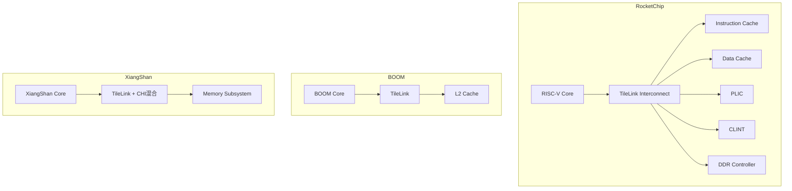
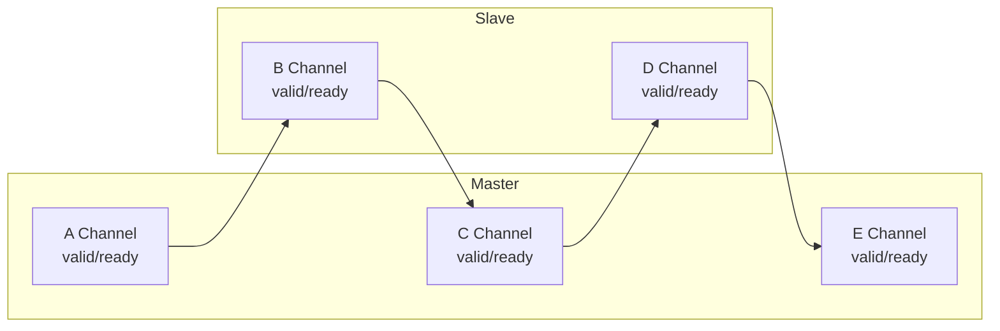

# TileLink基础认知与架构

<span class="badge-i">[I]</span>

---

### 为什么TileLink像"社区图书馆开放系统"

传统AMBA协议由ARM定义、授权使用，闭源且面向ARM生态。<br>
<span class="red">TileLink</span>是SiFive为RISC-V生态设计的开源片上总线协议，<br>
特点是协议级开源、与RISC-V微架构深度绑定、支持缓存一致性扩展。<br>

类比：社区图书馆开放系统——<br>
AMBA像连锁书店（标准化、付费会员制、总部统一规则）；<br>
TileLink像社区图书馆（免费开放、居民自治、可自建分馆）。<br>
任何人都能查看借阅规则（协议规范），并按需扩展（自定义opcode）。<br>

<span class="red">核心概念：TileLink不是ARM的竞争对手，而是RISC-V生态的"基础设施"——就像Linux不是Windows的对手，而是开源世界的地基。</span><br>

---

### 三级协议：TL-UL/UH/C

TileLink按功能复杂度分为三级，像图书馆的服务分层：<br>

| 协议级 | 全称 | 功能 | 典型场景 |
|--------|------|------|----------|
| TL-UL | Uncached Lightweight | 无缓存、单拍读写 | 外设寄存器、BootROM |
| TL-UH | Uncached Heavyweight | 多拍突发、Hints预取 | DMA、非缓存DDR访问 |
| TL-C | Cached | 全缓存一致性 | 多核CPU、多级缓存 |

功能差异的核心维度：<br>

| 能力 | TL-UL | TL-UH | TL-C |
|------|-------|-------|------|
| 突发传输 | 否 | 是 | 是 |
| 缓存一致性 | 无 | 无 | 有（5通道） |
| 消息类型 | Get/Put | Get/Put + Hint | Acquire/Release/Probe/Grant |
| 复杂度 | 低 | 中 | 高 |
| 面积开销 | ~2K门 | ~5K门 | ~20K门+ |
| 规范章节 | ~15页 | ~25页 | ~40页 |

<span class="blue">关键认知：TL-UL是APB的精神继任者，TL-C是ACE/CHI的开源替代。选型依据是是否需要缓存一致性。</span><br>

---

### 包化消息设计

AMBA是<span class="green">信号级协议（Signal-level）</span>——每个控制信号都有独立线。<br>
TileLink是<span class="green">消息级协议（Message-level）</span>——所有控制信息打包在通道内传输。<br>

| 对比维度 | AMBA AXI4 | TileLink |
|----------|-----------|----------|
| 地址 | AWADDR/ARADDR | 嵌入A通道消息 |
| 突发长度 | AWLEN/ARLEN | 嵌入A通道size+mask |
| 响应类型 | BRESP/RRESP | 嵌入D通道opcode |
| 缓存控制 | ARCACHE/AWCACHE | 嵌入A通道param |
| 用户扩展 | AxUSER | 自定义字段 |
| 错误报告 | RRESP=SLVERR | D通道denied+corrupt |

消息格式示例（TL-UL Get请求）：<br>

```
A Channel消息字段：
  opcode  = 4 (Get)          // 操作码
  param   = 0                  // 缓存参数
  size    = 2                  // log2(字节数) = 4字节
  source  = 3                  // 请求源ID
  address = 0x8000_0000        // 目标地址
  mask    = 0xF                // 字节有效掩码
  data    = 0                  // Get无写数据
```

消息格式示例（TL-UL PutFullData写）：<br>

```
A Channel消息字段：
  opcode  = 0 (PutFullData)    // 全字写
  param   = 0
  size    = 2                  // 4字节
  source  = 5
  address = 0x8000_1000
  mask    = 0xF                // 全部字节有效
  data    = 0xCAFEBABE         // 写数据
```

<span class="red">核心概念：TileLink用"消息"替代"信号束"，协议扩展只需增加opcode，无需新增物理线。这降低了RTL生成的复杂度。</span><br>

---

### Rocket Chip/BOOM/XiangShan中的应用

TileLink已成为RISC-V芯片的事实标准总线：<br>



| 项目 | 所属机构 | TileLink用法 |
|------|----------|--------------|
| Rocket Chip | UC Berkeley | 原生TileLink，全套生成器 |
| BOOM | UC Berkeley | 超标量核心 + TileLink缓存 |
| XiangShan | 中科院计算所 | TileLink + CHI混合互连 |
| Chipyard | UC Berkeley | 集成框架，TileLink为基础 |
| CVA6 | ETH Zurich | 部分TileLink接口 |

<span class="purple">扩展：香山（XiangShan）是国产高性能RISC-V处理器，其缓存子系统同时支持TileLink和ARM CHI两种协议，体现融合趋势。Rocket Chip则是学术界和初创公司的首选参考设计。</span><br>

---

### 与AMBA/CHI/Wishbone的对比

| 维度 | AMBA AXI | TileLink | CHI | Wishbone |
|------|----------|----------|-----|----------|
| 提出方 | ARM | SiFive | ARM | OpenCores |
| 开源 | 否（需授权） | 是 | 否（需授权） | 是 |
| 协议层级 | 信号级 | 消息级 | 消息级 | 信号级 |
| 缓存一致性 | ACE/CHI | TL-C原生 | 原生 | 无 |
| 生态绑定 | ARM SoC | RISC-V | 高端服务器 | FPGA/教育 |
| 规范页数 | ~300页 | ~80页 | ~500页 | ~20页 |
| 参考实现 | ARM IP | Rocket Chip | ARM CMN | OpenCores |
| 多核扩展 | ACE/CHI复杂 | TL-C轻量 | 原生重 | 无 |

<span class="blue">结论：TileLink以轻量规范+开源实现打动RISC-V社区；CHI以极致性能+企业支持主导服务器市场。两者不是零和竞争，而是不同生态的各自选择。</span><br>

---

### TileLink的物理实现形态

TileLink虽然是消息级协议，但在RTL层面仍表现为带ready/valid的通道：



每通道本质是一组信号线：

| 流控信号 | 方向 | 说明 |
|----------|------|------|
| valid | 发送方->接收方 | 本拍数据有效 |
| ready | 接收方->发送方 | 本拍可接收 |
| bits | 发送方->接收方 | 消息payload |

传输发生当且仅当 valid && ready = 1。<br>
这是TileLink与AXI的共同选择，也是RISC-V生态的通行握手方式。<br>

<span class="blue">结论："消息级"是抽象概念，"valid/ready握手"是物理实现。两者不矛盾——消息被拆成多拍时，每拍独立握手。</span><br>

---

**学习路径提示**：<br>
- <span class="badge-i">[I]</span> 读者：理解TileLink的三级分层逻辑——TL-UL对标APB，TL-C对标ACE/CHI。<br>
- 关键记忆点：消息级协议 vs 信号级协议是TileLink与AMBA的本质差异。
