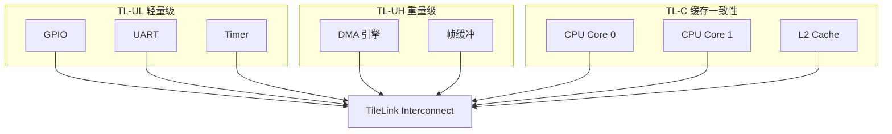

# TileLink 基础认知与架构 [I→E]

> **本章学习目标**：
> - 理解 TileLink 的设计哲学与 RISC-V 生态定位
> - 掌握 TileLink 三级一致性协议（TL-UL/TL-UH/TL-C）的区别
> - 建立 TileLink 在片上总线中的选型认知

---

从何而来 → 为什么需要 → 哪里用： 
TileLink 诞生于 2014 年，由 SiFive 公司提出。 
随着 RISC-V 开源指令集架构的兴起，需要一套与 RISC-V 哲学一致的开放总线标准。 
AMBA 协议受 ARM 公司版权约束，且面向 ARM 生态优化。TileLink 作为完全开放的标准，由 RISC-V 基金会维护，支持缓存一致性、乱序完成、QoS 等高级特性，成为 RISC-V SoC 的事实标准。 
如今，TileLink 广泛应用于 Rocket Chip、Chipyard、Berkeley Out-of-Order Machine 等开源 RISC-V 处理器。

---

## TileLink 的设计哲学与定位

---

### <strong>为什么需要 TileLink：RISC-V 的开放总线标准</strong>

TileLink 是 RISC-V 生态的片上总线协议。 
其设计初衷是为 RISC-V 处理器提供一套"与 ISA 同等开放"的总线标准。 

类比理解：TileLink 如同"开源社区的共享图书馆" 
AMBA 是"商业出版社的藏书"（质量高、需授权、面向特定群体）。 
TileLink 是"开源社区的共享图书馆"（免费开放、任何人可贡献、格式统一）。 
RISC-V 处理器设计者可以像借书一样免费使用 TileLink，无需担心版权和授权费用。 

<strong>1. 完全开放：无版权约束</strong> 
TileLink 规范由 RISC-V 基金会 维护，完全免费开放。 
与 AMBA 的 ARM 版权约束不同，任何人可自由实现和修改。 

<strong>2. 三级一致性：按需选择复杂度</strong> 
TileLink 定义 3 个一致性级别： 
* TL-UL（Uncached Lightweight）：无缓存，面向寄存器访问 
* TL-UH（Uncached Heavyweight）：无缓存但支持突发和乱序 
* TL-C（Cached）：完整缓存一致性，面向多核处理器 

<strong>3. Chisel 原生：与 RISC-V 工具链深度融合</strong> 
TileLink 的参考实现用 Chisel（Scala DSL 硬件描述语言）编写。 
与 Rocket Chip 生成器无缝集成，一行配置即可生成完整 SoC。 

---

### <strong>TileLink 与 AMBA 的核心差异</strong>

| 特性 | TileLink | AMBA AXI4 |
| --- | --- | --- |
| 版权 | 完全开放 | ARM 版权 |
| 一致性级别 | 3 级（UL/UH/C） | 需 ACE/CHI 扩展 |
| 通道模型 | 5 通道（A/C/D/E/B） | 5 通道（AW/W/B/AR/R） |
| 乱序完成 | 原生支持 | 原生支持 |
| 工具链 | Chisel/Rocket Chip | Verilog/SystemVerilog |
| 典型生态 | RISC-V | ARM |

关键差异：TileLink 的三级一致性内建，AXI 需 ACE 扩展；TileLink 原生面向 Chisel 设计流。 

---

## TileLink 三级一致性协议

---

### <strong>TL-UL：无缓存轻量级</strong>

TL-UL 是 TileLink 最简单的子集。 
面向寄存器访问和简单内存读写，无缓存、无突发、无乱序。 

| 特性 | TL-UL |
| --- | --- |
| 通道 | A（地址）+ D（数据/响应） |
| 突发 | 不支持 |
| 乱序 | 不支持 |
| 缓存 | 无 |
| 典型应用 | GPIO、UART、Timer 寄存器 |

TL-UL 的信号数量和复杂度与 APB 相当，但支持更灵活的地址映射。 

---

### <strong>TL-UH：无缓存重量级</strong>

TL-UH 在 TL-UL 基础上增加突发传输和乱序完成。 
面向 DMA、显存缓冲等需要高带宽但无需缓存的场景。 

| 特性 | TL-UH |
| --- | --- |
| 通道 | A + C + D + E |
| 突发 | 支持（最大 64 beat） |
| 乱序 | 支持（源 ID 区分） |
| 缓存 | 无 |
| 典型应用 | DMA 引擎、帧缓冲 |

---

### <strong>TL-C：完整缓存一致性</strong>

TL-C 是 TileLink 的完整版，支持多核缓存一致性。 
面向多核 RISC-V 处理器和共享内存系统。 

| 特性 | TL-C |
| --- | --- |
| 通道 | A + B + C + D + E（全部 5 通道） |
| 突发 | 支持 |
| 乱序 | 支持 |
| 缓存 | 支持（MESI/TMO 状态机） |
| 典型应用 | 多核 RISC-V 处理器 |

TileLink Interconnect 同时连接 TL-UL/UH/C 设备，通过协议转换器自动适配。 

---

## 本章小结

| 概念 | 一句话总结 |
| --- | --- |
| TileLink | RISC-V 开源总线标准，完全免费开放 |
| TL-UL | 无缓存轻量级，2 通道，面向寄存器 |
| TL-UH | 无缓存重量级，4 通道，支持突发和乱序 |
| TL-C | 完整缓存一致性，5 通道，面向多核 |
| Chisel | Scala DSL 硬件描述语言，TileLink 原生实现语言 |
| Rocket Chip | UC Berkeley 开源 RISC-V SoC 生成器 |

---

## 练习

1. 为什么 TileLink 选择三级一致性设计，而不是像 AXI 那样通过一个协议覆盖所有场景？ 
2. 对比 TL-UL 和 APB4 的信号数量，说明为什么 RISC-V 芯片常用 TL-UL 替代 APB。 
3. 在 Chipyard 中配置一个单核 RISC-V SoC，应使用 TL-UL 还是 TL-C？说明理由。
