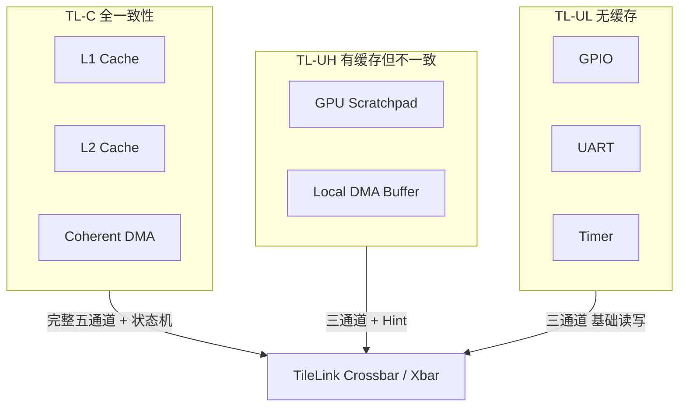
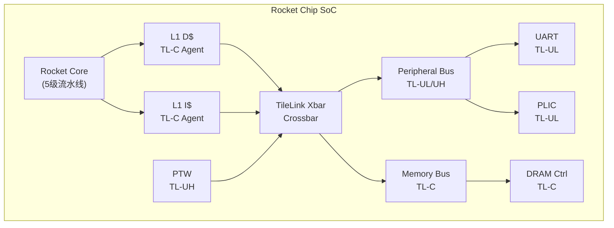
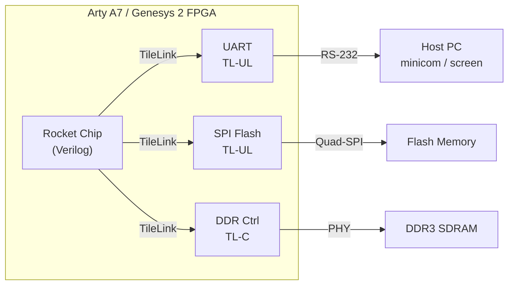

# TileLink是什么——RISC-V 生态的开源片上总线

[B] [I] [E] [M]

TileLink 是 SiFive 公司提出、现已成为 RISC-V 生态事实标准的开源片上互连协议。 它定位于芯片内部模块之间的数据交换，覆盖从无一致性简单外设到全缓存一致性多核系统的完整范围。

---

## 核心定义与价值

### <strong>TileLink 的定位</strong>

TileLink 诞生于 2015 年，由 SiFive 首席架构师 Henry Cook 团队设计。 最初作为 Rocket Chip 生成器的内部总线，随后开源并逐渐成为 RISC-V SoC 的首选互连方案。

 

| 维度 | TileLink | AMBA AXI/CHI | Intel UPI/CXL |
|------|----------|--------------|---------------|
| 发起方 | SiFive（开源） | ARM（商业授权） | Intel（商业） |
| 生态 | RISC-V 全生态 | ARM 全生态 | x86 服务器 |
| 设计哲学 | 包化消息 + 参数化 | 信号级 + 固定通道 | 物理层协议栈 |
| 一致性 | 内置三级一致性 | AXI 无 / ACE 有 / CHI 有 | CXL.mem 一致性 |
| 开源实现 | Rocket Chip、BOOM、香山 | ARM 官方 IP | 商业 IP |

 

TileLink 的核心价值在于：将"缓存一致性"作为一等公民设计，而非像 AXI 那样先有无一致性版本再补丁式添加一致性。

### <strong>类比：社区图书馆 vs 商业图书馆</strong>

想象你所在的社区需要一套图书借阅系统。

 

- AMBA（AXI/CHI） 像商业连锁图书馆的闭架系统： 书架排列、借阅流程由总部统一规定，功能完备但需要付费加盟，内部结构不对外公开

- TileLink 像社区共建的开放借阅系统： 任何人都可以查看完整的分类规则、借阅协议；社区可以根据自己的空间自由调整书架布局；一致性规则是公开的标准，不是黑箱

 

这个类比的核心在于：开源不意味着简陋，而是意味着透明和可裁剪。 TileLink 的协议规范完全公开，参数可自由配置，这正是 RISC-V "开放架构" 精神在片上互连层面的延伸。

---

## 核心机制原理解析

### <strong>1. 三级一致性协议：TL-UL / TL-UH / TL-C</strong>

TileLink 按一致性能力划分为三个层级，设计目标是从 GPIO 控制器到多核缓存一致性系统的全覆盖。

 

| 层级 | 全称 | 一致性能力 | 典型应用场景 |
|------|------|-----------|-------------|
| TL-UL | TileLink Uncached Lightweight | 无缓存、无一致性 | GPIO、UART、Timer 等外设 |
| TL-UH | TileLink Uncached Heavyweight | 有缓存但不参与一致性 | 本地 DMA buffer、GPU scratchpad |
| TL-C | TileLink Cached | 完整缓存一致性 | CPU L1/L2、缓存化 DMA |

 

**TL-UL** 是最轻量级子集。 仅支持最基本的读写事务，无缓存语义，相当于 AMBA APB 级别的复杂度。 信号通道只有 A/B/D 三个。

**TL-UH** 在中间层。 引入了 Hint（预取建议）、Acquire（缓存请求）消息，但 Agent 不维护一致性状态机。 适合需要缓存但不参与全局一致性的设备，如 GPU 本地显存。

**TL-C** 是完整协议。 包含全部五个通道（A/B/C/D/E）和完整的一致性状态机。 这是多核 CPU 系统必须实现的层级。

 

 

### <strong>2. 包化消息 vs 信号级总线</strong>

TileLink 采用"包化消息"（Message-Packet）抽象，与 AMBA 的信号级（Signal-Level）设计形成鲜明对比。

 

AMBA AXI 的通道设计： 每个通道由一组固定信号组成，如 AWADDR、AWID、AWLEN、AWSIZE 等。 逻辑通过信号组合表达，硬件直接映射到这些信号线。

TileLink 的消息设计： 每个通道传递的是结构化的"消息"（Message），消息内部包含 opcode、param、size、source、address 等字段。 这些字段被打包成总线上的数据包，类似于网络协议中的"帧"。

 

| 对比维度 | AMBA AXI | TileLink |
|----------|----------|----------|
| 抽象层级 | 信号级（物理信号线） | 包化消息（逻辑事务） |
| 通道数 | 5（AR/R/AW/W/B） | 5（A/B/C/D/E） |
| 一致性 | AXI4 无 / ACE 补丁式 | 原生内置 TL-C |
| 参数化 | 有限（ID 宽、数据宽） | 深度参数化（beatBytes、idBits 等） |
| 代码生成 | 手工或 IP 集成 | Rocket Chip Diplomacy 自动生成 |

 

包化消息的优势在于：协议逻辑与物理实现解耦。 同样的 TileLink 消息可以在窄总线（串行）或宽总线（并行）上传输，而不改变协议语义。 AMBA 要实现这一点需要单独的 ACE/CHI 分层。

---

## 技术教学与实战

### <strong>在 Rocket Chip 中定位 TileLink</strong>

Rocket Chip 是 UC Berkeley 开发的 RISC-V SoC 生成器，也是 TileLink 的发源地。 理解 Rocket Chip 的模块结构，是理解 TileLink 生态的最佳入口。

 

 

在 Rocket Chip 中： 
- CPU 核心的 L1 D/I Cache 作为 TL-C Agent 连接到交叉开关 
- 页表遍历器 PTW 作为 TL-UH 设备，需要读取内存但不缓存 
- UART、PLIC 等外设挂在 TL-UL 外设总线上 
- 所有通道经过 Diplomacy 框架自动协商参数（beatBytes、idBits 等）

---

## 嵌入式专属实战场景

### <strong>场景：在 FPGA 上运行 Rocket Chip</strong>

将 Rocket Chip 生成的 Verilog 烧录到 FPGA 是 TileLink 最直接的实战验证。

 

 

**配置要点：**

- 使用 Chipyard 框架选择 RocketConfig 或 SmallRocketConfig 
- 在 Diplomacy 配置中指定外设总线为 TL-UL、内存总线为 TL-C 
- 通过 FIRRTL 生成 Verilog 后，约束 TileLink 总线到 FPGA 的 clock domain

---

## 历史演进与前沿

### <strong>TileLink 的版本演进</strong>

 

| 时间 | 版本 | 里程碑 |
|------|------|--------|
| 2015 | TileLink 1.0 | SiFive 内部诞生，随 Rocket Chip 开源 |
| 2017 | TileLink 1.7 | 引入 Diplomacy 参数协商框架 |
| 2018 | TileLink 1.8 | 规范文档化，定义 TL-UL/UH/C 三级 |
| 2020 | TileLink 1.8.1 | 与 CHI 对比文档发布，推动标准化讨论 |
| 2022 | RISC-V 讨论 | RISC-V International 成立 TileLink 标准化工作组 |

 

扩展阅读： TileLink 规范最新版本可从 SiFive GitHub 获取： https://github.com/ucb-bar/rocket-chip/tree/master/src/main/tilelink

### <strong>与 AMBA CHI 的对比</strong>

 

| 特性 | TileLink | AMBA CHI |
|------|----------|----------|
| 设计层级 | 片上互连（On-chip） | 片上 + 片间互连 |
| 一致性协议 | 目录式（TL-C） | 目录式 + Snoop filter |
| 物理层 | 无定义（可配） | 定义明确（CXS、CCIX） |
| QoS 支持 | 基础（priority field） | 完整（QoS 值域 + 流量类别） |
| 标准化状态 | RISC-V 社区驱动 | ARM 官方标准 |
| 开源 EDA 支持 | Chipyard + FireSim | ARM 商业 IP + Verilog 授权 |

 

TileLink 在 PPA（性能、功耗、面积）上优于 AXI4 的开放实现，但在极致高性能服务器场景仍落后于 CHI。 两者的差距正在缩小，RISC-V 生态在香山处理器上的工程实践是关键推动力。

---

## 本章小结

| 主题 | 核心要点 |
|------|----------|
| TileLink 定位 | SiFive 提出，RISC-V 生态标准片上总线 |
| 三级协议 | TL-UL（无一致性）、TL-UH（有缓存但不一致）、TL-C（全一致性） |
| 设计哲学 | 包化消息 + 原生一致性 + 深度参数化 |
| 与 AMBA 对比 | 开源 vs 商业、包化 vs 信号级、原生一致 vs 补丁式 |
| 关键生态项目 | Rocket Chip、BOOM、XiangShan、Chipyard、FireSim |
| 类比 | 社区开放借阅系统 vs 商业闭架图书馆 |

---

## 练习

1. **概念题**：TL-UL、TL-UH、TL-C 三个层级的主要区别是什么？请各举一个应用场景。

2. **对比题**：TileLink 的"包化消息"设计与 AMBA AXI 的"信号级"设计各有什么优劣？在什么场景下包化消息更有优势？

3. **设计题**：假设你要设计一个 RISC-V SoC，包含 4 核 CPU、一个 GPU 本地显存、UART 和 SPI。请为每个模块选择合适的 TileLink 层级，并画出连接拓扑。

4. **分析题**：为什么说 TileLink 的一致性设计是"一等公民"设计，而 AXI 的一致性（ACE）是"补丁式"设计？从协议结构角度分析。
