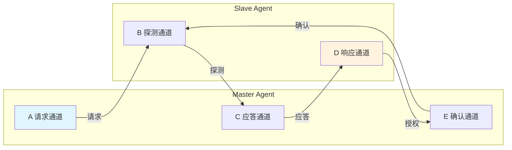

# TileLink怎么做——通道、事务与消息编码

<span class="badge-b">[B]</span> <span class="badge-i">[I]</span> <span class="badge-e">[E]</span> <span class="badge-m">[M]</span>

<span class="red">TileLink 的核心是 A/B/C/D/E 五个通道和精确定义的消息编码。
</span>理解每个通道的角色和消息字段的 bit 级定义，是掌握 TileLink 的关键。

---

## 核心定义与价值

### <strong>五通道架构总览</strong>

TileLink 定义了五个独立通道，每个通道承载特定方向的消息。

<br>

| 通道 | 方向 | 核心功能 | 对应 AXI 通道 |
|------|------|---------|--------------|
| A | Master → Slave | 请求（读写、Acquire） | AW + AR 合并 |
| B | Slave → Master | 探测/转发（Probe） | 无直接对应 |
| C | Master → Slave | 应答/释放（Release/ProbeAck） | 无直接对应 |
| D | Slave → Master | 响应/授权（Grant/AccessAck） | R + B 合并 |
| E | Master → Slave | 最终确认（GrantAck） | 无直接对应 |

<br>

<span class="blue">TileLink 的五通道设计与 AXI 的分离式读写通道形成鲜明对比。
</span>TileLink 的 A 通道同时承载读和写请求，通过 opcode 区分；D 通道同时承载读数据和写确认。

<br>



<br>

### <strong>类比：餐厅点餐的完整对话</strong>

想象你走进一家支持"预订座位 + 排队叫号"的餐厅。

<br>

- <span class="green">A 通道</span> = 你告诉服务员想吃什么（点餐请求）
- <span class="green">B 通道</span> = 服务员问你"这个菜需要等很久，你确定要等吗？"（探测/协商）
- <span class="green">C 通道</span> = 你回复"我确定等"或者"算了换一道"（应答/释放旧选择）
- <span class="green">D 通道</span> = 服务员上菜或告诉你"菜已售罄"（响应/授权）
- <span class="green">E 通道</span> = 你接过菜说"谢谢，我收到了"（最终确认）

<br>

这个类比的关键是：
<span class="blue">B 和 C 通道的存在是为了处理"多人同时想要同一份菜"的冲突。
</span>如果没有 B/C，餐厅可能出现两个人同时拿走同一份菜的问题——这就是缓存一致性冲突。

---

## 核心机制原理解析

### <strong>1. A 通道：请求发起</strong>

<span class="red">A 通道是 TileLink 中最活跃的通道，所有事务从这里开始。
</span>Master 通过 A 通道发送 Get、Put、Acquire 等请求。

<br>

A 通道消息字段（bit 级定义）：

<br>

| 字段 | 位宽 | 方向 | 说明 |
|------|------|------|------|
| opcode | 3 | M→S | 请求类型编码 |
| param | 3 | M→S | 请求参数（缓存状态目标） |
| size | 4 | M→S | 数据大小（log₂字节数） |
| source | w | M→S | Master 源 ID（宽度可配） |
| address | 64 | M→S | 目标地址（字节对齐） |
| mask | 8 | M→S | 字节有效掩码（写操作） |
| data | d | M→S | 写数据（仅写请求） |
| corrupt | 1 | M→S | 数据损坏标记（ECC/Parity） |

<br>

<span class="blue">source 字段宽度由 idBits 参数决定，直接影响系统最大并发事务数。
</span>在 4 位 idBits 下，最多支持 16 个并发请求。

### <strong>2. opcode 编码：精确到 3-bit</strong>

<br>

| opcode[2:0] | TL-UL 名称 | TL-C 名称 | 功能 |
|-------------|-----------|-----------|------|
| 3'b000 | PutFullData | AcquireBlock | 全字写入 / 请求缓存块 |
| 3'b001 | PutPartialData | AcquirePerm | 部分写入 / 请求权限 |
| 3'b010 | ArithmeticData | Probe | 原子算术 / 探测 |
| 3'b011 | LogicalData | ProbeAck | 原子逻辑 / 探测应答 |
| 3'b100 | Get | ProbeAckData | 读取 / 探测应答带数据 |
| 3'b101 | Hint | Grant | 预取提示 / 授权 |
| 3'b110 | - | GrantData | - / 授权带数据 |
| 3'b111 | - | Release | - / 释放缓存 |

<br>

<span class="blue">注意：同样的 opcode 在不同层级下含义不同。
</span>例如 opcode=3'b000 在 TL-UL 是 PutFullData，在 TL-C 是 AcquireBlock。

### <strong>3. param 字段：缓存状态转换目标</strong>

param 字段在 TL-C 中编码目标缓存状态，是理解一致性的关键。

<br>

| param[2:0] | 含义 | Acquire 目标状态 |
|-----------|------|-----------------|
| 3'b000 | toT | 获取 Trunk（唯一完整副本）权限 |
| 3'b001 | toB | 获取 Branch（共享只读）权限 |
| 3'b010 | toN | 获取 Nothing（无效）权限 |
| 3'b011-111 | 保留 | - |

<br>

<span class="green">toT、toB、toN</span> 对应 TileLink 的缓存状态命名：
- <span class="green">T (Trunk)</span>：唯一完整副本，可读写
- <span class="green">B (Branch)</span>：共享只读副本
- <span class="green">N (Nothing)</span>：无效/无缓存

### <strong>4. D 通道：响应返回</strong>

D 通道携带 Slave 对请求的响应，同时承载读数据和写确认。

<br>

| 字段 | 位宽 | 方向 | 说明 |
|------|------|------|------|
| opcode | 3 | S→M | 响应类型 |
| param | 3 | S→M | 授权参数（ granted 权限） |
| size | 4 | S→M | 数据大小 |
| source | w | S→M | 回显请求的 source ID |
| sink | w | S→M | Slave 分配的 sink ID |
| denied | 1 | S→M | 请求被拒绝 |
| corrupt | 1 | S→M | 数据损坏标记 |
| data | d | S→M | 读数据（仅读响应） |

<br>

<span class="blue">sink 字段是 TileLink 的关键设计。
</span>Master 使用 source ID 标识自己的请求，Slave 使用 sink ID 标识自己的响应。
这种分离使得多对多连接中的路由无需中央仲裁。

---

## 技术教学与实战

### <strong>Rocket Chip 中的 TileLink Bundle 定义</strong>

以下是从 Rocket Chip 源码提取的 TileLink Bundle 定义（Chisel/Scala）：

```scala
// TileLink A 通道 Bundle（简化版）
class TLBundleA(params: TLBundleParameters) extends Bundle {
  val opcode  = UInt(3.W)           // 请求类型
  val param   = UInt(3.W)           // 请求参数
  val size    = UInt(params.sizeBits.W)   // 大小：log2(bytes)
  val source  = UInt(params.sourceBits.W) // Master ID
  val address = UInt(params.addressBits.W)// 地址
  val mask    = UInt((params.dataBits/8).W) // 字节掩码
  val data    = UInt(params.dataBits.W)     // 写数据
  val corrupt = Bool()              // ECC 错误标记
}

// TileLink D 通道 Bundle
class TLBundleD(params: TLBundleParameters) extends Bundle {
  val opcode  = UInt(3.W)
  val param   = UInt(3.W)
  val size    = UInt(params.sizeBits.W)
  val source  = UInt(params.sourceBits.W)
  val sink    = UInt(params.sinkBits.W)
  val denied  = Bool()
  val corrupt = Bool()
  val data    = UInt(params.dataBits.W)
}
```

<br>

参数说明：

- <span class="green">dataBits</span>：总线数据宽度，常见 64/128/256-bit
- <span class="green">sourceBits</span>：source ID 位宽，决定并发请求数上限
- <span class="green">sinkBits</span>：sink ID 位宽
- <span class="green">sizeBits</span>：通常为 4，支持 2^4=16 种大小

### <strong>Linux 驱动视角：TileLink 设备树节点</strong>

在 RISC-V Linux 中，TileLink 设备通常通过设备树描述：

```dts
// arch/riscv/boot/dts/sifive/hifive-unleashed-a00.dts（节选）
plic: interrupt-controller@c000000 {
    compatible = "sifive,plic-1.0.0";
    reg = <0x0 0xc000000 0x0 0x4000000>;
    // TileLink 地址映射由 SoC 生成器决定
    // 驱动通过 reg 字段直接访问，无需关心底层总线协议
};

uart0: serial@10010000 {
    compatible = "sifive,uart0";
    reg = <0x0 0x10010000 0x0 0x1000>;
    clock-frequency = <500000000>;
    interrupts-extended = <&cpu0_intc 4>;
};
```

<br>

<span class="blue">对软件来说，TileLink 是透明的。
</span>驱动程序看到的是标准的 MMIO 地址映射，TileLink 的通道和消息编码由硬件自动处理。

---

## 嵌入式专属实战场景

### <strong>场景：手动构造一个 TileLink Get 事务</strong>

假设你需要用 Verilog 验证环境发送一个读取 8 字节数据的请求。

<br>

```verilog
// TileLink A 通道：Get 请求（读取 8 字节）
// 参数：sourceBits=4, addressBits=64, dataBits=64
// 目标地址：0x8000_0000

wire [2:0]  a_opcode = 3'b100;        // Get
wire [2:0]  a_param  = 3'b000;        // 无特殊参数
wire [3:0]  a_size   = 4'b0011;       // log2(8) = 3
wire [3:0]  a_source = 4'b0001;       // Master ID = 1
wire [63:0] a_address = 64'h8000_0000;
wire [7:0]  a_mask   = 8'hFF;         // 全部 8 字节有效
wire [63:0] a_data   = 64'h0;         // Get 无写数据
wire        a_corrupt = 1'b0;

// A 通道有效信号
assign a_valid = (state == STATE_REQ);
assign a_bits  = {a_corrupt, a_data, a_mask, a_address,
                  a_source, a_size, a_param, a_opcode};
```

<br>

对应的 D 通道响应：

```verilog
// TileLink D 通道：AccessAckData 响应
wire [2:0]  d_opcode = 3'b110;        // GrantData / AccessAckData
wire [3:0]  d_source = 4'b0001;       // 回显 source = 1
wire [3:0]  d_sink   = 4'b1010;       // Slave 分配的 sink ID
wire [63:0] d_data;                   // 读取到的 8 字节数据
wire        d_denied = 1'b0;          // 请求被接受
wire        d_corrupt = 1'b0;
```

<br>

<span class="blue">调试技巧：在仿真波形中搜索 "opcode=3'b100 && valid" 可快速定位所有 Get 请求。
</span>

---

## 历史演进与前沿

### <strong>TileLink 消息格式的演进</strong>

<br>

| 版本 | 变化 | 影响 |
|------|------|------|
| 1.0-1.6 | 通道数从 3 扩展到 5 | 引入 B/C/E 支持 TL-C |
| 1.7 | 规范化 opcode 编码 | 统一 TL-UL/UH/C 的 opcode 空间 |
| 1.8 | 增加 corrupt 字段 | 支持端到端数据完整性检查 |
| 1.8.1 | 增加 size 字段位宽 | 支持更大粒度的事务 |

<br>

<span class="purple">扩展阅读：
</span>TileLink 的 opcode 编码与 PCIe TLP Type、AXI AxCACHE 字段的设计哲学对比可参考：
<br>Henry Cook 的论文 "TileLink: A free and open-source standard interface for on-chip memory systems"

---

## 本章小结

| 主题 | 核心要点 |
|------|----------|
| 五通道 | A(请求) → B(探测) → C(应答) → D(响应) → E(确认) |
| A 通道字段 | opcode/param/size/source/address/mask/data/corrupt |
| D 通道字段 | opcode/param/size/source/sink/denied/corrupt/data |
| opcode | 3-bit，不同层级含义不同（TL-UL vs TL-C） |
| param | 缓存状态目标：toT/toB/toN |
| source/sink | Master/Slave 各自的 ID 空间，解耦路由 |
| 数据宽度 | dataBits 参数化，常见 64/128/256-bit |

---

## 练习

1. **编码题**：构造一个 TileLink A 通道的 PutPartialData 请求，向地址 0x1000 写入 4 字节（mask=4'b1100，即只写高 4 字节）。写出所有字段的值。

2. **分析题**：为什么 TileLink 将读和写请求合并到 A 通道，而 AXI 分离为 AR 和 AW？从面积和延迟两个角度分析优劣。

3. **设计题**：在一个 4 Master、8 Slave 的系统中，sourceBits 和 sinkBits 各需要多少位才能保证不冲突？

4. **调试题**：在仿真波形中看到 D 通道的 denied=1，可能的原因是什么？从协议和实现两个层面分析。

5. **对比题**：画出 TileLink 的 A→B→C→D→E 握手流程与 AXI 的 AW→W→B 和 AR→R 流程的对比时序图（用 Mermaid）。
