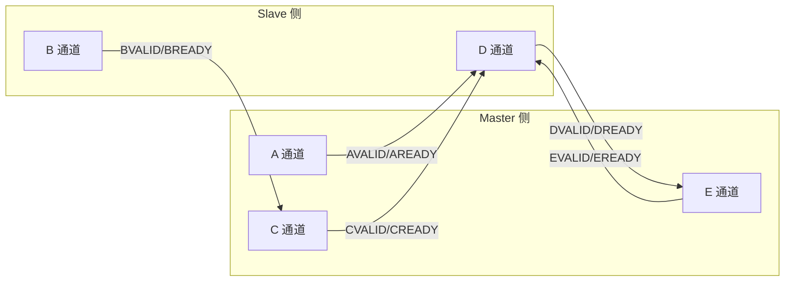

# TileLink 通道与事务类型 [I→E]

> **本章学习目标**：
> - 理解 <span class="red">TileLink 五通道</span>（A/B/C/D/E）的独立握手
> - 掌握 TileLink <span class="red">七种事务类型</span>（Put/Get/Arithmetic/Logical/Hint/Acquire/Release）
> - 了解 TileLink <span class="red">突发传输</span>与地址增量规则

---

<span class="blue">从何而来 → 为什么需要 → 哪里用：</span><br>
<span class="red">TileLink 五通道</span>架构诞生于 <span class="green">2014 年</span> SiFive 的设计实践。<br>
与 AXI 的 5 通道（AW/W/B/AR/R）不同，TileLink 的通道命名更抽象，面向"请求-响应"模型而非"读写方向"。<br>
<span class="blue">TileLink 用 A（请求）、C（控制）、D（数据/响应）、E（确认）、B（广播）五通道实现所有事务类型，包括缓存一致性操作。</span><br>
如今，TileLink 五通道是 <span class="green">Rocket Chip</span>、<span class="green">Chipyard</span> 等开源 SoC 的核心互联机制。<br>

---

## TileLink 五通道架构

---

### <strong>五通道的定义与流向</strong>

<span class="red">TileLink</span> 定义 5 个通道，每个通道有独立的 VALID/READY 握手。<br>

<span class="blue">类比理解：TileLink 五通道如同"快递公司的五类单据"</span><br>
* <span class="green">A 通道</span> = "发货申请单"（Master 向 Slave 请求操作）<br>
* <span class="green">B 通道</span> = "总部调拨单"（广播给其他 Master 的监听）<br>
* <span class="green">C 通道</span> = "调拨回执"（Master 回应广播请求）<br>
* <span class="green">D 通道</span> = "签收单 + 货物"（Slave 回应请求，含数据）<br>
* <span class="green">E 通道</span> = "签收确认"（Master 确认收到响应）<br>

| 通道 | 方向 | 作用 | 出现级别 |
| --- | --- | --- | --- |
| A | Master→Slave | 发起请求（地址、操作类型） | TL-UL/UH/C |
| B | Slave→Master | 广播监听请求 | 仅 TL-C |
| C | Master→Slave | 回应广播或主动控制 | TL-UH/C |
| D | Slave→Master | 响应请求（数据/确认） | TL-UL/UH/C |
| E | Master→Slave | 确认收到响应 | TL-UH/C |

<span class="blue">TL-UL 仅需 A+D，TL-UH 需 A+C+D+E，TL-C 需全部 5 通道。</span><br>



---

### <strong>通道间的依赖规则</strong>

<span class="red">TileLink</span> 规范定义严格的通道依赖关系。<br>

| 依赖关系 | 规则 | 原因 |
| --- | --- | --- |
| A → D | D 必须在 A 之后 | 响应必须对应请求 |
| B → C | C 必须在 B 之后 | 监听响应必须在监听请求后 |
| C → D | D 必须在 C 之后 | 控制响应必须在控制请求后 |
| D → E | E 必须在 D 之后 | 确认必须在收到响应后 |
| A → 新 A | 无强制依赖 | 可连续发多个请求 |

<span class="blue">E 通道是 TileLink 的关键创新：Master 必须发 E 确认，Slave 才能释放事务资源。</span><br>

---

## TileLink 事务类型

---

### <strong>七种事务类型总览</strong>

<span class="red">TileLink</span> 定义 7 种事务类型，覆盖所有内存操作。<br>

| 事务类型 | 操作码 | 功能 | 出现级别 |
| --- | --- | --- | --- |
| PutFullData | 0 | 写完整数据 | TL-UL/UH/C |
| PutPartialData | 1 | 写字节掩码数据 | TL-UL/UH/C |
| ArithmeticData | 2 | 原子算术操作（ADD/MIN/MAX） | TL-UH/C |
| LogicalData | 3 | 原子逻辑操作（XOR/AND/OR） | TL-UH/C |
| Get | 4 | 读数据 | TL-UL/UH/C |
| Hint | 5 | 预取/刷新提示 | TL-UH/C |
| Acquire | 6 | 获取缓存权限 | 仅 TL-C |
| Release | 7 | 释放缓存权限 | 仅 TL-C |

<span class="blue">Acquire/Release 是 TileLink 缓存一致性的核心事务，仅在 TL-C 中出现。</span><br>

---

### <strong>Put/Get 事务：基本读写</strong>

<span class="red">PutFullData</span> 和 <span class="red">Get</span> 是最常用的事务类型。<br>

```scala
// Chisel 代码：发起 TileLink Get 事务
val get = edge.Get(
  fromSource = 0.U,      // 源 ID
  toAddress  = 0x8000.U, // 目标地址
  lgSize     = 3.U       // log2(8 bytes) = 64-bit
)
// 生成 A 通道请求
a.bits.opcode  := TLMessages.Get
a.bits.address := 0x8000.U
a.bits.size    := 3.U
a.valid        := true.B
```

<span class="blue">TileLink 的 Chisel API 比 AXI 的 Verilog 实现更抽象、更易读。</span><br>

---

### <strong>Acquire/Release：缓存一致性事务</strong>

<span class="red">Acquire</span> 用于获取缓存行的访问权限。<br>
<span class="red">Release</span> 用于释放缓存行并写回数据。<br>

| 参数 | 含义 | 典型值 |
| --- | --- | --- |
| param | 请求权限类型 | NtoB（无→Branch）、NtoT（无→Trunk） |
| param | 释放权限类型 | TtoN（Trunk→无）、BtoN（Branch→无） |

```scala
// Chisel：发起 Acquire 获取 Trunk 权限
val acquire = edge.AcquireBlock(
  fromSource = 0.U,
  toAddress  = addr.U,
  lgSize     = 6.U,  // 64-byte Cache line
  param      = TLPermissions.NtoT  // 获取写权限
)
```

<span class="blue">NtoT = None to Trunk，获取独占写权限；TtoN = Trunk to None，写回后释放。</span><br>

---

## TileLink 突发传输

---

### <strong>突发传输与地址对齐</strong>

<span class="red">TileLink</span> 的突发传输通过 <span class="green">size</span> 和 <span class="green">mask</span> 字段控制。<br>

| 字段 | 含义 | 示例 |
| --- | --- | --- |
| size | log2(传输字节数) | size=6 → 64 bytes |
| mask | 字节使能掩码 | mask=0xFF → 全字节有效 |
| address | 起始地址 | 必须对齐到 size 边界 |

```scala
// Chisel：64-byte 突发读（一个 Cache line）
a.bits.opcode  := TLMessages.Get
a.bits.address := 0x8000.U
a.bits.size    := 6.U     // 64 bytes
a.bits.mask    := 0xFF.U  // 全字节有效
```

<span class="blue">TileLink 的突发传输天然对齐到 2^size 边界，无需像 AXI 那样处理 WRAP 边界。</span><br>

---

## 本章小结

| 概念 | 一句话总结 |
| --- | --- |
| A 通道 | Master→Slave 请求通道 |
| B 通道 | Slave→Master 广播监听通道 |
| C 通道 | Master→Slave 回应/控制通道 |
| D 通道 | Slave→Master 响应/数据通道 |
| E 通道 | Master→Slave 确认通道 |
| Acquire | 获取缓存行权限（TL-C） |
| Release | 释放缓存行权限（TL-C） |
| 突发传输 | size 字段定义，对齐到 2^size 边界 |

---

## 练习

1. 对比 TileLink 的 A/D 通道与 AXI 的 AW/W/B 通道，说明功能对应关系。<br>
2. 为什么 TileLink 需要 E 通道确认，而 AXI 不需要？<br>
3. 用 Chisel 写一个 TileLink PutFullData 事务，写入地址 0x1000，数据 0xDEADBEEF。
