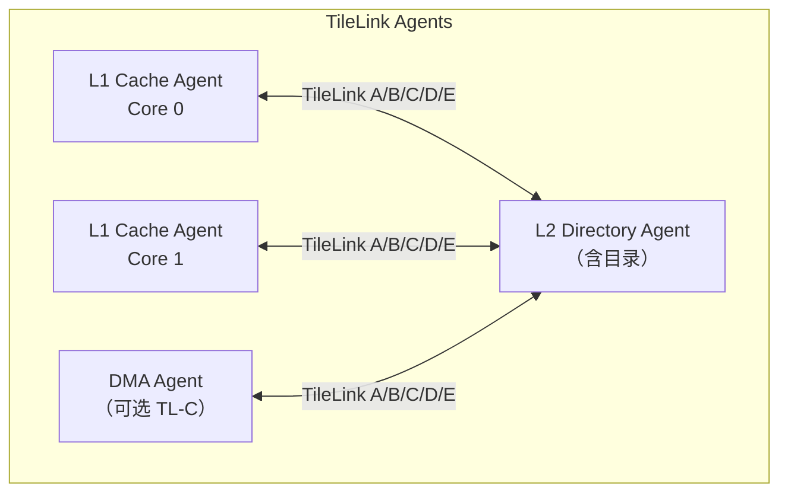
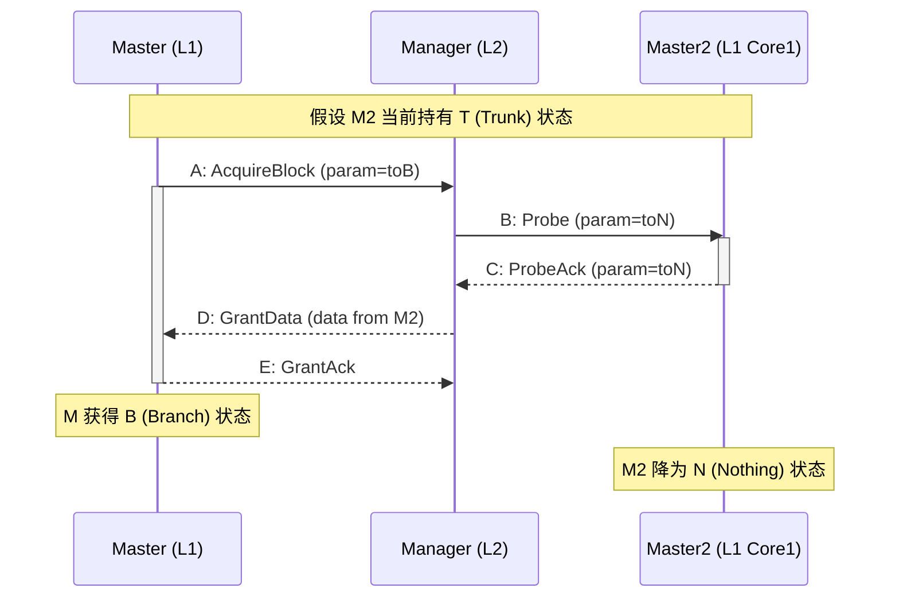
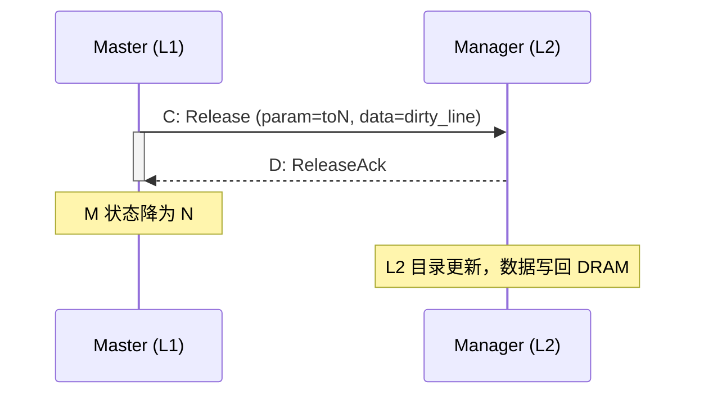
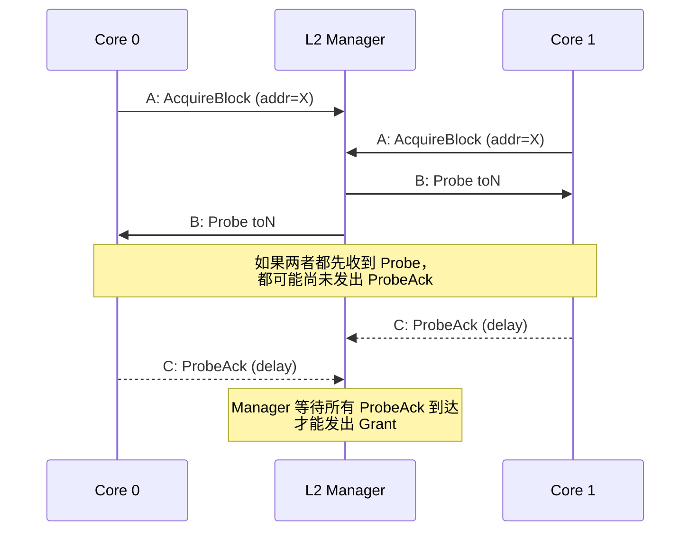

# TileLink为什么能实现缓存一致性——目录式协议与代理机制

<span class="badge-b">[B]</span> <span class="badge-i">[I]</span> <span class="badge-e">[E]</span> <span class="badge-m">[M]</span>

<span class="red">TileLink 的 TL-C 层级通过目录式（Directory-based）协议和"代理"（Agent）模型实现缓存一致性，避免了传统侦听式（Snooping）协议的广播开销。</span> 这是 TileLink 在 SoC 设计中的核心竞争力。

---

## 核心定义与价值

### <strong>目录式 vs 侦听式</strong>

缓存一致性协议分为两大类：侦听式和目录式。

<br>

| 维度 | 侦听式（Snooping） | 目录式（Directory） |
|------|-------------------|-------------------|
| 一致性维护 | 广播到所有缓存 | 查询中央目录 |
| 总线带宽 | 随核心数线性增长 | 与核心数关系更弱 |
| 延迟 | 通常更低（本地广播） | 需要目录查询延迟 |
| 可扩展性 | 8-16 核后效率下降 | 可扩展到数百核 |
| 代表协议 | MESI/MOESI、ACE | CHI、TileLink TL-C |

<br>

<span class="blue">侦听式适合小核数系统，目录式适合大核数系统。</span><br>
TileLink 采用目录式，是因为它面向的目标场景是从嵌入式到服务器的 RISC-V SoC。<br>
当核心数超过 8 时，侦听广播的带宽开销变得不可接受。

### <strong>类比：快递配送的两种模式</strong>

想象一个城市的快递配送系统。

<br>

- <span class="green">侦听式（Snooping）</span> = 所有快递员在同一个对讲机频道里：<br>
每次派件前都要在对讲机里喊"谁有某某小区的包裹？"<br>
所有人同时听到并回答。小区少时很高效，小区多了对讲机被喊爆。

- <span class="green">目录式（Directory）</span> = 中央调度中心：<br>
每个包裹的去向记录在调度中心的表格里。<br>
快递员只需要查表就知道该把包裹送给谁，不需要大喊。

<br>

这个类比的关键是：<span class="blue">侦听式的瓶颈是"通信介质"（总线带宽），目录式的瓶颈是"查询延迟"（目录访问时间）。</span><br>
随着核心数增加，通信介质比查询延迟更快成为瓶颈，因此目录式更适合扩展。

---

## 核心机制原理解析

### <strong>1. TileLink 的 Agent 模型</strong>

<span class="red">TileLink 将每个参与一致性的模块抽象为"代理"（Agent），每个 Agent 维护自己的一致性状态机。</span>

<br>



<br>

Agent 的类型：

- <span class="green">Client Agent</span>：请求缓存的模块，如 CPU L1 Cache<br>
- <span class="green">Manager Agent</span>：维护目录并授权缓存权限的模块，如 L2 Cache<br>
- <span class="green">Bypass Agent</span>：不参与一致性，仅转发请求的外设

<br>

<span class="blue">Agent 模型的精髓在于：每个 Agent 本地维护自己的状态，通过消息交换达成一致。</span><br>
不需要全局状态广播，也不需要锁——消息的顺序性和握手协议本身就保证了正确性。

### <strong>2. TL-C 缓存状态机</strong>

TL-C 定义了五个缓存状态，精确描述每个缓存块（cache line）的权限。

<br>

| 状态 | 含义 | 读 | 写 | 其他缓存持有 |
|------|------|----|----|-------------|
| Invalid (I) | 无效，无副本 | 否 | 否 | 可能有 |
| Invalidated (I_v) | 正在失效中 | - | - | 过渡状态 |
| Branch (B) | 共享只读 | 是 | 否 | 可能有 B |
| Trunk (T) | 唯一可读写 | 是 | 是 | 无其他副本 |
| Dirty (D) | 已修改的唯一副本 | 是 | 是 | 无其他副本，与内存不一致 |

<br>

<span class="blue">TL-C 的状态命名与传统 MESI 不同，但语义等价。</span>

| TL-C | MESI | 说明 |
|------|------|------|
| Invalid | I | 无效 |
| Branch | S | 共享（Sharable） |
| Trunk | E | 独占（Exclusive） |
| Dirty | M | 修改（Modified） |

<br>

<span class="blue">注意：TL-C 没有 MESI 的 E（Exclusive）状态，只有 T（Trunk）。</span><br>
T 语义等价于 E+M 的组合——如果数据干净则是 E，如果脏则是 M。<br>
这种简化减少了状态转换数量，降低了实现复杂度。

### <strong>3. Acquire → Grant 完整握手流程</strong>

<span class="red">当 CPU 核心需要读取一个 cache line 时，完整的 TileLink 一致性事务经历 5 个阶段。</span>

<br>



<br>

阶段解析：

1. <span class="green">A: AcquireBlock</span><br>
Master 向 Manager 请求缓存块，param=toB 表示"我只要只读权限"。

2. <span class="green">B: Probe</span><br>
Manager 查询目录，发现 M2 持有 T 状态。<br>
向 M2 发送 Probe 消息，要求 M2 放弃权限。

3. <span class="green">C: ProbeAck</span><br>
M2 放弃权限，状态降为 N，如果数据是 Dirty 则回写到 L2。

4. <span class="green">D: GrantData</span><br>
Manager 将数据（可能从 M2 的 writeback 获得）发送给 M。<br>
param 字段告知 M 获得的新状态（B）。

5. <span class="green">E: GrantAck</span><br>
Master 确认收到授权，Manager 更新目录记录 M 持有 B 状态。

### <strong>4. Release 与 Writeback 时序</strong>

当缓存需要替换一个 line 时，通过 Release 消息将数据写回。

<br>



<br>

Release 消息的 param 字段编码状态转换目标：

| Release param | 含义 |
|---------------|------|
| toN | 完全释放，降为 Invalid |
| toB | 降为 Branch（只保留只读副本） |
| toT | 保留 Trunk（通常不用于 Release） |

<br>

<span class="blue">如果 Release 携带数据（dirty），Manager 必须将数据写回下一级存储。</span><br>
如果 Release 不携带数据（clean），Manager 只需更新目录。

---

## 技术教学与实战

### <strong>Chisel 中的状态机实现</strong>

以下是从 Rocket Chip L2 Cache（InclusiveCache）中提取的简化状态机片段：

```scala
// TL-C 状态机（简化示意）
object ClientStates {
  val I = 0.U  // Invalid
  val B = 1.U  // Branch
  val T = 2.U  // Trunk
}

// 目录条目结构
class DirectoryEntry extends Bundle {
  val state = UInt(2.W)    // I/B/T
  val clients = UInt(nClients.W) // 哪些 client 持有副本
}

// Acquire 处理逻辑
when (io.a.opcode === AcquireBlock) {
  val dirEntry = directory.read(io.a.address)
  when (dirEntry.state === T && dirEntry.clients =/= 0.U) {
    // 当前有 Trunk 持有者，需要 Probe
    probeTarget := OHToUInt(dirEntry.clients)
    state := s_probe
  }.otherwise {
    // 无冲突，直接 Grant
    state := s_grant
  }
}
```

<br>

<span class="blue">Rocket Chip 的 L2 目录使用 Sparse Directory（稀疏目录）。</span><br>
每个 cache line 对应一个目录条目，记录持有者和状态。<br>
目录大小 = cache_size / line_size × entry_size，通常只占 cache 面积的 5-10%。

---

## 嵌入式专属实战场景

### <strong>场景：调试一个死锁的一致性事务</strong>

在多核 SoC 仿真中，如果两个核心同时 Acquire 同一个 cache line，可能出现死锁。

<br>



<br>

**死锁原因**：<br>
如果 Manager 在等待 M0 的 ProbeAck 时，同时又向 M0 发送了新的 Probe——M0 可能处于"等待自己释放权限，才能响应新 Probe"的循环。

**解决方案**：<br>
<span class="blue">TileLink 协议规定 Agent 必须能在收到 Probe 时立即响应，即使自己正在等待 Grant。</span><br>
这是 TileLink 代理模型的关键不变量——每个 Agent 对 Probe 的响应优先级高于对其他事务的处理。

---

## 历史演进与前沿

### <strong>TileLink 与 CHI/MESI 的对比</strong>

<br>

| 特性 | TileLink TL-C | AMBA CHI | MESI (侦听式) |
|------|---------------|----------|---------------|
| 一致性类型 | 目录式 | 目录式 + Snoop filter | 侦听式 |
| 状态数 | 5（I/I_v/B/T/D） | 7+ | 4（MESI）/ 5（MOESI） |
| 状态命名 | 自定义（T/B/D） | 标准（UC/UD/SC/SD） | 标准（M/E/S/I） |
| 请求-响应 | 5 阶段（A/B/C/D/E） | 5+ 阶段（Snp/Comp） | 2-3 阶段（Req/Snp/Resp） |
| 目录位置 | L2 Cache | 可分布在 Home Node | 无目录（广播） |
| 最大扩展 | 理论上百核 | 服务器级（64+ 核） | 通常 8-16 核 |

<br>

<span class="blue">TileLink 的设计目标是"够用且简单"，而非极致性能。</span><br>
在 16 核以下的场景，TileLink TL-C 的性能与 CHI 相当；<br>
在 64 核以上，CHI 的精细 QoS 和分布式目录更具优势。

---

## 本章小结

| 主题 | 核心要点 |
|------|----------|
| 一致性模型 | 目录式，避免侦听式广播开销 |
| Agent 模型 | Client/Manager/Bypass 三类代理 |
| 缓存状态 | I/B/T/D + I_v（Invalidated 过渡态） |
| 状态等价 | T ≈ MESI E+M，B ≈ MESI S，I ≈ MESI I |
| Acquire 流程 | A→B→C→D→E 五阶段握手 |
| Release 流程 | C→D 两阶段，param 编码目标状态 |
| 死锁避免 | Probe 响应必须无条件优先 |

---

## 练习

1. **概念题**：目录式和侦听式各在什么核心数下更有优势？为什么？

2. **分析题**：TL-C 将 MESI 的 E 和 M 合并为 T，这样做有什么好处？代价是什么？

3. **设计题**：画出一个双核系统中，Core 0 从地址 X 读取（Acquire toB），而 Core 1 当前持有 T 状态的完整消息序列图。

4. **调试题**：在仿真波形中看到 Master 长时间停留在"等待 Grant"状态，但 Manager 已经发出了 D 通道消息。列出 3 种可能的原因。

5. **对比题**：TileLink 的 E 通道（GrantAck）在 CHI 中对应什么机制？为什么 TileLink 需要这个额外的确认阶段？
