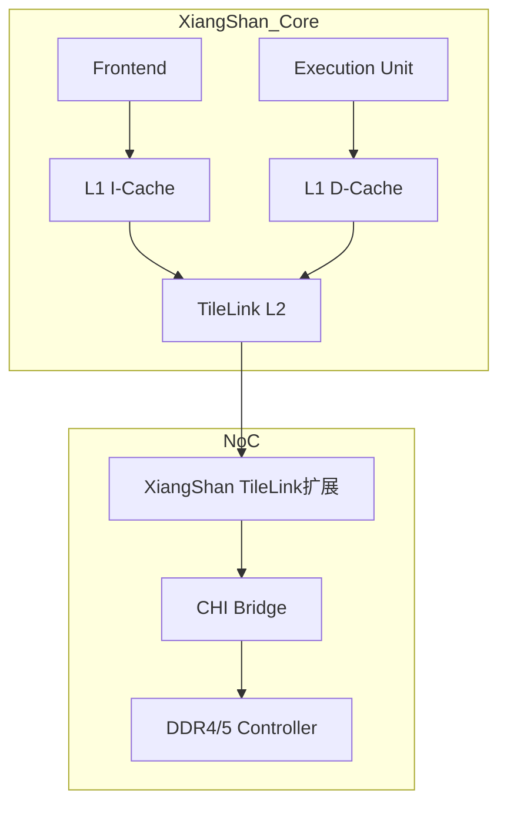

# TileLink实战与RISC-V生态

<span class="badge-e">[E]</span>

---

### Chipyard环境搭建

Chipyard是UC Berkeley提供的RISC-V SoC生成框架，内置全套TileLink互连。

环境依赖：
<br>
- Java 8+（sbt需要）
<br>
- Verilator（开源仿真器）
<br>
- RISC-V工具链
<br>

核心命令：
<br>

```bash
# 克隆仓库
git clone https://github.com/ucb-bar/chipyard.git
cd chipyard
./scripts/init-submodules-no-riscv-tools.sh

# 安装工具链
./scripts/build-toolchains.sh riscv-tools

# 进入项目，生成默认Rocket Chip
sbt "project chipyard" "runMain chipyard.RocketConfig"

# 编译Verilator仿真
make -C sims/verilator CONFIG=RocketConfig

# 运行测试
./simulator-chipyard-RocketConfig +verbose ../tests/hello.riscv
```

<span class="blue">关键认知：Chipyard用sbt（Scala构建工具）管理依赖，用Chisel生成RTL，Verilator编译C++仿真模型。</span><br>

---

### Diplomacy参数协商

Diplomacy是Rocket Chip独创的参数协商框架，让TileLink节点自动协商总线宽度、 outstanding数量等。

类比：餐厅预订系统——
<br>
每个模块声明自己的"餐桌大小"（支持的最大参数），
<br>
Diplomacy在各模块间协商出"最终菜单"（实际使用参数），
<br>
无需人工计算每段互连的位宽。
<br>

核心参数表：

| 参数 | 含义 | 默认值 | 影响 |
|------|------|--------|------|
| beatBytes | 每拍字节数 | 8 | 总线数据位宽 = beatBytes × 8 |
| idBits | 事务ID位宽 | 4 | 最大outstanding = 2^idBits |
| maxXferBytes | 最大传输字节 | 64 | 突发长度上限 |
| addressBits | 地址位宽 | 32 | 寻址空间 |

Chisel中声明参数：
<br>

```scala
// 声明一个TL-UL从节点，支持8字节拍、4位ID
val node = TLManagerNode(Seq(TLSlavePortParameters.v1(
  beatBytes = 8,
  managers = Seq(TLSlaveParameters.v1(
    address = Seq(AddressSet(0x80000000L, 0xFFFFFFL)),
    resources = device.reg,
    regionType = RegionType.UNCACHED,
    executable = true,
    supportsGet = TransferSizes(1, 8),
    supportsPutFull = TransferSizes(1, 8)
  ))
)))
```

<span class="blue">易错点：Diplomacy在elaboration阶段运行，不是运行时。协商失败会在编译时报错，不会生成错误RTL。</span><br>

---

### 带宽公式

TileLink系统带宽由三个变量决定：
<br>

```
Bandwidth = beatBytes × frequency × outstanding
```

| 变量 | 含义 | 典型值 | 优化方向 |
|------|------|--------|----------|
| beatBytes | 每拍数据量 | 8B (64位) | 增宽总线 |
| frequency | 时钟频率 | 1GHz | 提升时序 |
| outstanding | 并发事务数 | 4~16 | 增加缓冲深度 |

示例计算：
<br>
64位TileLink总线 @ 1GHz，支持8个outstanding：
<br>
Bandwidth = 8B × 1GHz × 8 = 64GB/s
<br>

<span class="red">核心概念：TileLink是流水线协议，outstanding是带宽的关键杠杆—— unlike APB的2周期固定延迟。</span><br>

---

### 仿真波形分析：GTKWave + VCD

Chipyard生成Verilator仿真后输出VCD波形文件，用GTKWave分析TileLink握手：
<br>

```bash
# 运行仿真生成VCD
./simulator-chipyard-RocketConfig +vcd +verbose ../tests/hello.riscv

# 打开GTKWave
gtkwave chipyard.TestHarness.RocketConfig.vcd
```

关键观察信号：

| 信号名 | 通道 | 观察目的 |
|--------|------|----------|
| a_valid / a_ready | A | 请求是否被阻塞 |
| d_valid / d_ready | D | 响应是否及时 |
| a_opcode | A | 事务类型分布 |
| a_source / d_source | A/D | 多outstanding匹配 |
| d_denied | D | 总线错误统计 |
| c_valid / c_ready | C | 释放事务频率 |

典型波形截图解读：
<br>

```
Cycle:    100    101    102    103    104    105
a_valid:   1      1      0      1      1      0
a_ready:   1      0      1      1      1      1
a_opcode: Get(4) Get(4)  --   Put(0) Put(0)  --
d_valid:   0      0      1      0      0      1
d_ready:   1      1      1      1      1      1
```

带宽利用率计算：
<br>

```
利用率 = 实际传输周期 / 总周期
      = (valid && ready 拍数) / 总拍数
```

<span class="blue">结论：Cycle101的a_ready=0表示从机忙，这是性能瓶颈信号——如果频繁出现，需检查Slave响应能力或增加 outstanding深度。TileLink的valid/ready握手天然适合波形分析。</span><br>

---

### 香山处理器中的TileLink实现

香山（XiangShan）是国产开源高性能RISC-V处理器，由中科院计算所开发。
<br>
其缓存子系统采用TileLink + 自研扩展的混合架构：
<br>



香山TileLink增强点：
<br>

| 特性 | 标准TileLink | 香山扩展 |
|------|-------------|----------|
| 原子操作 | LR/SC | 支持AMO全套（Add/Swap/AND/OR/XOR） |
| 缓存替换 | PLRU | 改进的DRRIP |
| 预取 | 无原生 | 流预取 + 跨页预取 |
| 一致性 | TL-C | 与CHI混合，支持远端访问 |

<span class="purple">扩展：香山的"昆明湖"和"南湖"两代微架构均开源在GitHub（OpenXiangShan），其TileLink实现已成为国内RISC-V芯片的重要参考。</span><br>

---

### 与CHI/CXL的融合趋势

TileLink作为RISC-V标准总线，正与业界主流协议融合：
<br>

| 融合方向 | 现状 | 意义 |
|----------|------|------|
| TileLink→CHI | 香山已实现 | 兼容ARM服务器生态 |
| TileLink→CXL | 研究阶段 | 对接PCIe/CXL内存池 |
| TileLink→AXI | 开源桥接器成熟 | FPGA综合兼容 |

协议转换的挑战：
<br>
- TileLink的消息级语义与CHI的transaction级语义粒度不同。
<br>
- TileLink的目录式一致性需映射到CHI的snoop过滤。
<br>
- CXL的内存语义（如Type 2/3设备）需要TileLink新增opcode支持。
<br>

<span class="blue">结论：TileLink的未来不是替代CHI/CXL，而是在RISC-V生态内扮演"内部 lingua franca"，通过桥接器对外兼容。</span><br>

---

**学习路径提示**：<br>
- <span class="badge-e">[E]</span> 读者：动手跑Chipyard，观察VCD波形中TileLink握手时序。<br>
- 关键练习：修改Diplomacy参数中的beatBytes，测量hello.riscv运行周期差异。
