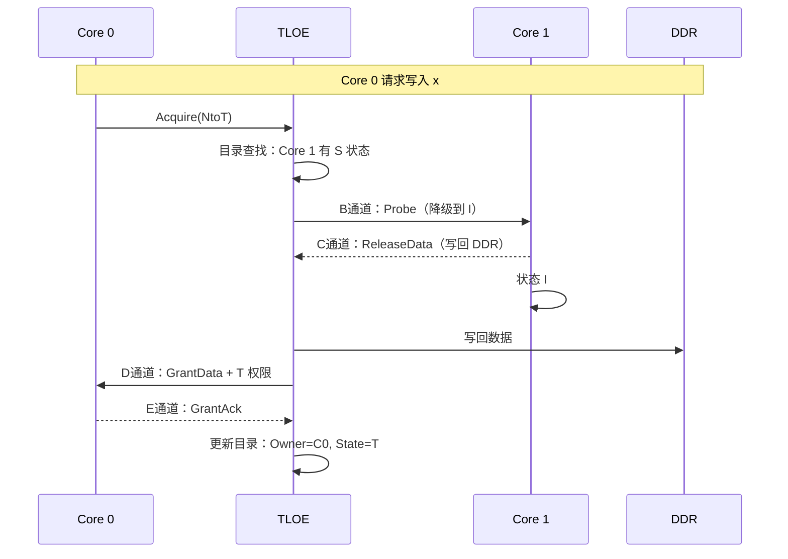
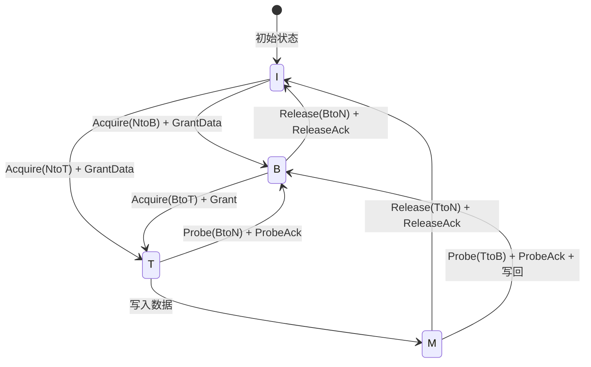

# TileLink 缓存一致性机制 [E]

> **本章学习目标**：
> - 理解 TLOE（TileLink Ownership Engine） 的角色
> - 掌握 目录式一致性协议 的工作原理
> - 了解 TileLink 缓存状态机（TMO/B/M/S）的转换规则

---

从何而来 → 为什么需要 → 哪里用： 
TileLink 缓存一致性机制诞生于 2016 年 UC Berkeley 的 Rocket Chip 项目。 
随着 RISC-V 多核处理器的发展，需要一套与 AXI ACE/CHI 同等水平但完全开放的缓存一致性方案。 
TileLink 的 TL-C 协议定义了基于目录的一致性机制，支持 MESI 的扩展状态机（TMO/B/M/S），已被 Rocket Chip、Chipyard 等开源项目广泛验证。 
如今，TileLink 缓存一致性是 RISC-V 多核处理器的标准配置。 

---

## TLOE：TileLink 所有权引擎

---

### <strong>TLOE 的角色：一致性事务的仲裁者</strong>

TLOE（TileLink Ownership Engine）是 TileLink 一致性系统的核心组件。 
它维护每个缓存行的"所有者记录"，决定哪个 Master 拥有读写权限。 

类比理解：TLOE 如同"图书馆借阅系统" 
每本书（缓存行）有一个借阅记录（目录项）。 
读者（CPU 核）借书时，系统查询记录，如果书在别人手上，需要先从别人那里要回来。 
TLOE 就是这个借阅系统的后台数据库。 

TLOE 的核心职责： 
* 维护 目录表：记录每个缓存行在哪个 Master 的 Cache 中 
* 处理 Acquire 请求：查询并授权缓存行访问 
* 发送 广播监听：通知其他 Master 状态变更 
* 处理 Release 响应：接收写回数据并更新目录 

---

### <strong>TLOE 与 AXI CCI 的对比</strong>

| 特性 | TileLink TLOE | AXI CCI-550 |
| --- | --- | --- |
| 实现方式 | 基于 Chisel 的参数化模块 | ARM 商业 IP |
| 目录存储 | 可配置（on-chip SRAM） | 固定实现 |
| 监听延迟 | 10~30 cycle（参数化） | 20~50ns（固定） |
| 开源 | 是（Rocket Chip） | 否（ARM 授权） |
| 扩展性 | 支持 N 核（参数化） | 通常 2~8 核 |

TLOE 的优势在于完全参数化和开源，可根据 SoC 规模灵活调整目录大小和监听策略。 

---

## 目录式一致性协议

---

### <strong>目录结构：缓存行的全局视图</strong>

目录（Directory）是 TLOE 的核心数据结构。 
每个目录项对应一个 Cache line（通常为 64 bytes）。 

| 字段 | 宽度 | 含义 |
| --- | --- | --- |
| State | 2 bit | 缓存行状态（T/M/S/I） |
| Owner | log2(N) bit | 当前所有者核 ID |
| Sharers | N bit | 位图：哪些核有共享副本 |
| Dirty | 1 bit | 是否被修改（需写回） |

目录表通常存储在 on-chip SRAM 中，大小为：Cache line 数 × 目录项宽度。 

---

### <strong>目录查询流程</strong>

当 CPU Core 0 发起 Acquire 请求时，TLOE 执行以下步骤： 

<strong>1. 目录查找</strong> 
根据地址计算 Cache line 索引，查询目录表。 
如果命中，获取当前状态和所有者。 

<strong>2. 权限检查</strong> 
检查请求的权限（NtoT/NtoB）与当前状态是否冲突。 
如果冲突，需要通知当前所有者降级或写回。 

<strong>3. 广播监听</strong> 
通过 B 通道 向所有相关 Master 发送监听请求。 
等待 C 通道 的回应。 

<strong>4. 授权响应</strong> 
通过 D 通道 向请求者发送数据和授权。 
更新目录表状态。 

---

## 缓存状态机

---

### <strong>TMO/B/M/S：TileLink 的五状态模型</strong>

TileLink 定义 5 种缓存行状态，扩展了传统 MESI。 

| 状态 | 缩写 | 含义 | 可读写 |
| --- | --- | --- | --- |
| Trunk | T | 独占写权限，无其他副本 | 可读写 |
| Branch | B | 只读权限，可能有其他副本 | 只读 |
| Modified | M | 已修改，仅本 Cache 有最新数据 | 可读写 |
| Shared | S | 共享只读，多个 Cache 有副本 | 只读 |
| Invalid | I | 无效，数据不存在或已过时 | 不可访问 |

T（Trunk）和 B（Branch）是 TileLink 的扩展状态，比 MESI 更细粒度地描述权限层级。 

---

### <strong>状态转换规则</strong>

关键转换：T→M 是写入操作，M→I 需要写回 DDR；B→I 无需写回（数据未修改）。 

---

## 本章小结

| 概念 | 一句话总结 |
| --- | --- |
| TLOE | TileLink 所有权引擎，维护目录表和仲裁一致性事务 |
| 目录表 | 记录每个 Cache line 的状态、所有者、共享者位图 |
| Trunk（T） | 独占写权限，无其他副本 |
| Branch（B） | 只读权限，可能有其他副本 |
| Acquire | 请求缓存行权限（NtoB/NtoT/BtoT） |
| Release | 释放缓存行权限（TtoN/BtoN） |
| Probe | 强制降级（TtoB/BtoN） |

---

## 练习

1. 双核系统共享变量 x，核 0 先 Acquire(NtoB) 后 Acquire(BtoT)，核 1 持有 B 状态。描述完整的事务序列。 
2. 为什么 TileLink 需要 Trunk 和 Branch 两种状态，而 MESI 只有 Modified 和 Shared？ 
3. 在 Chipyard 中配置一个 4 核 RISC-V 处理器，TLOE 的目录表需要多大 SRAM？（假设 32KB L1 Cache，64-byte line）
