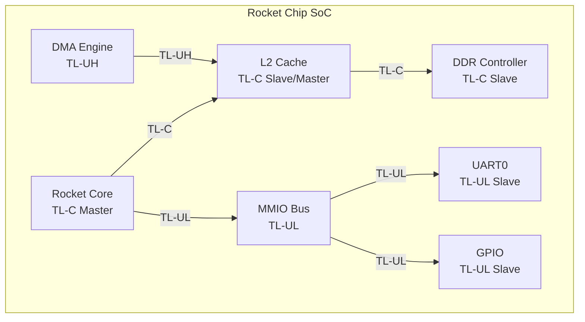

# TileLink 实战与 RISC-V 生态 [E]

> **本章学习目标**：
> - 掌握 <span class="red">Rocket Chip</span> 生成器的 TileLink 配置
> - 了解 <span class="red">Chipyard</span> 实战：自定义 SoC 生成流程
> - 学会用 <span class="red">FireSim</span> 在 AWS FPGA 上仿真 TileLink SoC
> - 对比 <span class="red">TileLink 与 AXI</span> 的选型逻辑

---

<span class="blue">从何而来 → 为什么需要 → 哪里用：</span><br>
<span class="red">TileLink 实战工具链</span>随着 RISC-V 生态的成熟而发展。<br>
<span class="green">2014 年</span> UC Berkeley 发布 <span class="green">Rocket Chip</span>，首次实现参数化 RISC-V SoC 生成。<br>
<span class="green">2018 年</span> Chipyard 框架整合了 Rocket Chip、FireSim、Berkeley HardFloat 等工具，<span class="blue">使"一行 Scala 代码生成完整 SoC"成为现实。</span><br>
如今，FireSim 在 AWS F1 FPGA 上实现周期精确的 TileLink SoC 仿真，<br>
成为 RISC-V 学术研究和工业验证的标准平台。<br>

---

## Rocket Chip：参数化 SoC 生成器

---

### <strong>Rocket Chip 的 TileLink 架构</strong>

<span class="red">Rocket Chip</span> 是 UC Berkeley 开源的 RISC-V SoC 生成器。<br>
所有片上互连均基于 TileLink，从 <span class="green">TL-UL</span> 到 <span class="green">TL-C</span>。<br>



<span class="blue">Rocket Chip 的 TileLink 网络自动生成，用户只需指定核数、Cache 大小和外设列表。</span><br>

---

### <strong>Rocket Chip 配置示例</strong>

```scala
// Rocket Chip 配置：双核 + 16KB L1 + 256KB L2
class DualCoreConfig extends Config(
  new freechips.rocketchip.subsystem.WithNBigCores(2) ++      // 2 核
  new freechips.rocketchip.subsystem.WithInclusiveCache(      // L2 Cache
    size = 256,                // 256 KB
    ways = 8                   // 8-way
  ) ++
  new freechips.rocketchip.subsystem.WithDefaultMemPort ++   // DDR 接口
  new freechips.rocketchip.subsystem.WithDefaultMMIOPort ++  // MMIO 总线
  new freechips.rocketchip.system.BaseConfig
)
```

<span class="blue">Rocket Chip 的 Scala 配置比传统 Verilog 手写 SoC 效率提升 10 倍以上。</span><br>

---

## Chipyard 实战：自定义 SoC 生成

---

### <strong>Chipyard 框架简介</strong>

<span class="red">Chipyard</span> 是 UC Berkeley 的 SoC 设计与仿真框架。<br>
整合 Rocket Chip、FireSim、Hwacha 加速器、Gemmini AI 引擎等。<br>

<span class="orange"><strong>1. 生成 Verilog</strong></span><br>

```bash
# Chipyard 目录
cd chipyard/sims/verilator
make CONFIG=DualCoreConfig -j16
# 输出：generated-src/ 目录下的 Verilog 文件
```

<span class="orange"><strong>2. 运行仿真</strong></span><br>

```bash
# 编译 RISC-V 测试程序
make run-binary-debug BINARY=hello.riscv CONFIG=DualCoreConfig
# 输出：波形文件 + 仿真日志
```

<span class="orange"><strong>3. 抓取 TileLink 事务</strong></span><br>

```bash
# 用 Dromajo 调试器追踪 TileLink 事务
dromajo --trace tilelink_dualcore.cfg hello.riscv
# 输出：每个 TileLink 事务的 opcode、address、source、sink
```

---

## FireSim：AWS FPGA 上的周期精确仿真

---

### <strong>FireSim 的工作流程</strong>

<span class="red">FireSim</span> 将 SoC 映射到 AWS F1 FPGA，实现周期精确仿真。<br>
相比软件仿真（Verilator）快 <span class="blue">100~1000 倍</span>。<br>

<span class="blue">类比理解：FireSim 如同"赛车模拟器"</span><br>
软件仿真（Verilator）= "电脑赛车游戏"（慢、便宜、可暂停调试）。<br>
FireSim = "专业赛车模拟器"（快、贵、接近真实驾驶）。<br>
对于需要运行 Linux 和真实负载的验证，FireSim 是不可替代的平台。<br>

```bash
# FireSim 启动流程
# 1. 在 Chipyard 中配置 FireSim 编译
make CONFIG=FireSimDualCoreConfig -C sims/firesim/sim

# 2. 部署到 AWS F1 FPGA
firesim launchrunfarm
firesim infrasetup
firesim runworkload

# 3. 抓取 TileLink 波形
firesim getwaveform
```

<span class="blue">FireSim 的仿真速度约 100 MHz FPGA 时钟，运行 Linux 只需数分钟。</span><br>

---

## TileLink 与 AXI 的选型对比

---

### <strong>技术选型决策树</strong>

| 场景 | 推荐总线 | 理由 |
| --- | --- | --- |
| ARM Cortex-A SoC | AXI4 + ACE | ARM 生态原生支持 |
| RISC-V SoC | TileLink TL-C | 开源、Chisel 原生、Rocket Chip 集成 |
| FPGA 原型验证 | AXI4（Xilinx IP） | Vivado 自带 AXI Interconnect IP |
| 学术教学 | TileLink | 完全开源，可修改协议细节 |
| 工业级芯片 | AXI4/CHI | EDA 工具链成熟，IP 库丰富 |
| AI 加速器 | TileLink（Chipyard） | 易于集成自定义加速器 |

<span class="blue">关键结论：ARM 生态选 AXI，RISC-V 生态选 TileLink，FPGA 快速原型可两者混用。</span><br>

---

## 本章小结

| 概念 | 一句话总结 |
| --- | --- |
| Rocket Chip | UC Berkeley 参数化 RISC-V SoC 生成器，全部 TileLink 互连 |
| Chipyard | SoC 设计框架，整合 Rocket Chip + FireSim + 加速器 |
| FireSim | AWS FPGA 周期精确仿真，速度比软件仿真快 100~1000 倍 |
| Dromajo | RISC-V 调试器，可追踪 TileLink 事务 |
| 选型逻辑 | ARM 生态选 AXI，RISC-V 选 TileLink，FPGA 可混用 |

---

## 练习

1. 在 Chipyard 中配置一个 4 核 Rocket Chip，开启 L2 Cache，生成 Verilog。<br>
2. 对比 FireSim 和 Verilator 的仿真速度和调试能力，说明各自适用场景。<br>
3. 如果你要设计一个 RISC-V AI 加速器 SoC，选择 TileLink 还是 AXI？说明技术理由。
