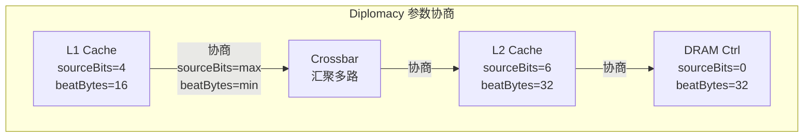

# TileLink怎么调——Chipyard 实战与性能分析

<span class="badge-b">[B]</span> <span class="badge-i">[I]</span> <span class="badge-e">[E]</span> <span class="badge-m">[M]</span>

<span class="red">TileLink 的参数化设计使其性能高度依赖于配置选择。
</span>通过 Chipyard 框架调整 beatBytes、idBits、buffer 深度等参数，可以显著改变 SoC 的带宽、延迟和面积。

---

## 核心定义与价值

### <strong>Chipyard 框架简介</strong>

<span class="green">Chipyard</span> 是 UC Berkeley 开发的 RISC-V SoC 集成框架。
<br>
它将 Rocket Chip、BOOM、XiangShan 等核心与 TileLink 互连、外设、加速器统一封装。

<br>

| 组件 | 功能 | 版本要求 |
|------|------|----------|
| sbt | Scala 构建工具 | 1.4+ |
| FIRRTL | RTL 中间表示编译器 | 随 Chipyard 捆绑 |
| Verilator | 开源 Verilog 仿真器 | 4.028+ |
| GTKWave | 波形查看器 | 3.3+ |
| riscv-tools | RISC-V 交叉编译工具链 | 随 Chipyard 捆绑 |

<br>

<span class="blue">Chipyard 的核心优势是"配置即代码"。
</span>
<br>
所有 TileLink 参数、核心数量、缓存大小都在 Scala 配置文件中定义，
<br>
框架自动生成完整的 SoC RTL。

---

## 核心机制原理解析

### <strong>1. Diplomacy 参数协商机制</strong>

<span class="red">TileLink 的连接不是硬编码的，而是通过 Diplomacy 框架自动协商参数。</span>

<br>



<br>

Diplomacy 的协商规则：

- <span class="green">sourceBits</span>：取连接两端的最大值
<br>
如果一端需要 4 位、另一端需要 6 位，整条链路使用 6 位

- <span class="green">beatBytes</span>：取连接两端的最小值
<br>
宽总线向窄总线连接时，自动插入宽度转换器（Width Widget）

- <span class="green">maxXferBytes</span>：事务最大字节数，取最小值

<br>

<span class="blue">Diplomacy 的协商是编译时完成的，不增加运行时开销。</span>
<br>
生成的 Verilog 中所有参数已经是协商后的常量。

### <strong>2. 关键参数对性能的影响</strong>

<br>

| 参数 | 位宽/范围 | 性能影响 | 面积影响 |
|------|----------|--------|---------|
| beatBytes | 8/16/32/64 | 数据宽度，直接决定峰值带宽 | 数据通路面积线性增长 |
| idBits | 2-8 | 并发请求数上限 = 2^idBits | 路由 buffer 指数增长 |
| maxXferBytes | 64B-4KB | 单次事务最大数据量 | Burst buffer 大小 |
| bufferDepth | 1-16 | 流水线深度，影响吞吐量 | FIFO 面积 |

<br>

带宽计算公式：

<br>

```
理论带宽 = beatBytes × 时钟频率 × 并发事务数

示例：
- beatBytes = 16（128-bit 总线）
- 频率 = 1 GHz
- 并发 = 4（idBits=2）
- 带宽 = 16 × 1G × 4 = 64 GB/s
```

<br>

<span class="blue">注意：实际带宽受限于最慢的环节。
</span>
<br>
如果 DRAM 控制器只能提供 16 GB/s，那么 TileLink 总线的 64 GB/s 能力无法完全利用。

---

## 技术教学与实战

### <strong>Chipyard 环境搭建</strong>

<br>

```bash
# 克隆 Chipyard 仓库
git clone https://github.com/ucb-bar/chipyard.git
cd chipyard

# 初始化所有子模块
./scripts/init-submodules-no-riscv-tools.sh

# 安装 RISC-V 工具链（耗时较长）
./scripts/build-toolchains.sh riscv-tools

# 设置环境变量
source env.sh

# 编译默认 Rocket 配置（生成 Verilog）
cd sims/verilator
make CONFIG=RocketConfig
```

<br>

编译成功后的输出：

<br>

```
[info] Generated Verilog file: generated-src/chipyard.TestHarness.RocketConfig/chipyard.TestHarness.RocketConfig.top.v
[info] Verilator compile complete.
[success] Total time: 487 s
```

<br>

### <strong>修改 TileLink 参数配置</strong>

在 Chipyard 中，TileLink 参数在 Scala 配置文件中定义：

```scala
// generators/chipyard/src/main/scala/config/RocketConfigs.scala

class CustomTileLinkConfig extends Config(
  // 修改系统总线 beatBytes
  new freechips.rocketchip.subsystem.WithSystemBusWidth(128) ++  // 128-bit = 16 beatBytes
  
  // 修改内存总线参数
  new freechips.rocketchip.subsystem.WithInclusiveCache(
    nWays = 8,        // L2 8-way 组相联
    capacityKB = 512, // L2 容量 512KB
    outerLatencyCycles = 20, // L2→DRAM 延迟
    subBankingFactor = 4     // 子bank并行度
  ) ++
  
  // 核心参数
  new freechips.rocketchip.subsystem.WithNBigCores(4) ++
  
  // 基础配置
  new chipyard.config.AbstractConfig
)
```

<br>

<span class="blue">关键配置项解析：</span>

- <span class="green">WithSystemBusWidth(128)</span>：系统总线宽度改为 128-bit（默认 64-bit）
<br>
  TileLink beatBytes 自动调整为 16

- <span class="green">nWays/capacityKB</span>：L2 Cache 的组数和容量
<br>
  更大的 L2 减少 DRAM 访问，提高 TileLink 有效带宽利用率

- <span class="green">outerLatencyCycles</span>：L2 到 DRAM 的延迟周期数
<br>
  用于仿真时模拟真实 DRAM 延迟

### <strong>仿真波形分析</strong>

<br>

```bash
# 运行仿真，生成 VCD 波形
cd sims/verilator
make run-binary-debug CONFIG=RocketConfig BINARY=../../software/hello.riscv

# 波形文件位置
generated-src/chipyard.TestHarness.RocketConfig/chipyard.TestHarness.RocketConfig.vcd

# 用 GTKWave 打开
gtkwave chipyard.TestHarness.RocketConfig.vcd
```

<br>

在 GTKWave 中关注以下信号：

<br>

| 信号路径 | 含义 | 检查点 |
|----------|------|--------|
| tile_clock | TileLink 时钟域 | 确认频率符合预期 |
| tl_a_* | A 通道请求 | 检查 opcode 和 address |
| tl_d_* | D 通道响应 | 检查 source 匹配和 latency |
| tl_b_* / tl_c_* | B/C 通道（TL-C） | 一致性事务的 Probe/Release |
| buffer_full | FIFO 状态 | 判断是否需要增加 bufferDepth |

<br>

<span class="blue">典型调试场景：检查 A→D 的往返延迟。</span>
<br>
在波形中标记 a_valid 上升沿和对应 source 的 d_valid 上升沿，
<br>
两者之间的周期数即为 TileLink 事务延迟。

---

## 嵌入式专属实战场景

### <strong>场景：定位 TileLink 带宽瓶颈</strong>

假设仿真结果显示实际带宽远低于理论值。

<br>

```bash
# 使用 Chipyard 内置的性能计数器
# 编译时启用 --with-firesim 或添加自定义 PerfCounter

# 运行测试程序后查看日志
make run-binary CONFIG=RocketConfig BINARY=../../tests/stream.riscv
```

<br>

可能的原因和排查方法：

<br>

| 现象 | 可能原因 | 排查方法 |
|------|----------|---------|
| 带宽低，A 通道空闲 | idBits 不足，并发受限 | 检查波形中 a_valid 的占空比 |
| 带宽低，A 通道满 | buffer 深度不足 | 检查 FIFO 满信号 |
| 带宽低，D 通道延迟大 | L2/DRAM 延迟高 | 测量 A→D 往返周期数 |
| 带宽低，B/C 通道活跃 | 一致性冲突频繁 | 统计 Probe 消息频率 |
| 带宽波动大 | DRAM refresh / 行冲突 | 检查 DRAM 控制器日志 |

<br>

<span class="blue">优化顺序：先确认并发是否饱和 → 再检查 buffer 是否溢出 → 最后优化 DRAM 访问模式。</span>

---

## 历史演进与前沿

### <strong>性能分析工具演进</strong>

<br>

| 工具 | 年代 | 功能 | 局限 |
|------|------|------|------|
| VCD + GTKWave | 2015+ | 波形查看 | 手动分析，效率低 |
| FireSim | 2018+ | FPGA 加速仿真 | 需要 AWS FPGA 实例 |
| Chipyard Trace | 2020+ | 内置性能计数器 | 只有 Rocket/BOOM 支持 |
| Spike + Proxy Kernel | 2021+ | 指令级仿真 | 无缓存/一致性模型 |

<br>

<span class="purple">扩展阅读：</span>
<br>
FireSim 论文 "FireSim: FPGA-Accelerated Cycle-Exact Scale-Out System Simulation in the Public Cloud" (IEEE Micro 2018)
<br>
提供了在 AWS F1 实例上运行 TileLink 全系统仿真的方法。

---

## 本章小结

| 主题 | 核心要点 |
|------|----------|
| 配置框架 | Chipyard + Diplomacy 参数自动协商 |
| 关键参数 | beatBytes、idBits、maxXferBytes、bufferDepth |
| 带宽公式 | beatBytes × frequency × outstanding |
| 瓶颈排查 | 并发 → buffer → DRAM 延迟 |
| 波形工具 | VCD + GTKWave，关注 A→D 往返延迟 |
| 优化路径 | 参数调整 → buffer 加深 → 访存模式优化 |

---

## 练习

1. **计算题**：beatBytes=32、频率=1.5GHz、idBits=3、bufferDepth=4。计算理论最大带宽，并说明为什么实际带宽通常只有理论值的 60-80%。

2. **配置题**：在 Chipyard 配置文件中，如何将系统总线从 64-bit 改为 256-bit？写出需要修改的 Scala 代码行。

3. **调试题**：在 GTKWave 中看到 tl_a_valid 长时间为高，但 tl_d_valid 极少出现。列出 3 种可能原因和对应的信号检查方法。

4. **优化题**：一个 8 核系统 TileLink 带宽利用率只有 30%，波形显示大量 B/C 通道消息。分析原因并提出优化方案。

5. **设计题**：为嵌入式 FPGA 平台（100MHz 时钟）设计 TileLink 参数，目标带宽 400 MB/s，面积最小化。
