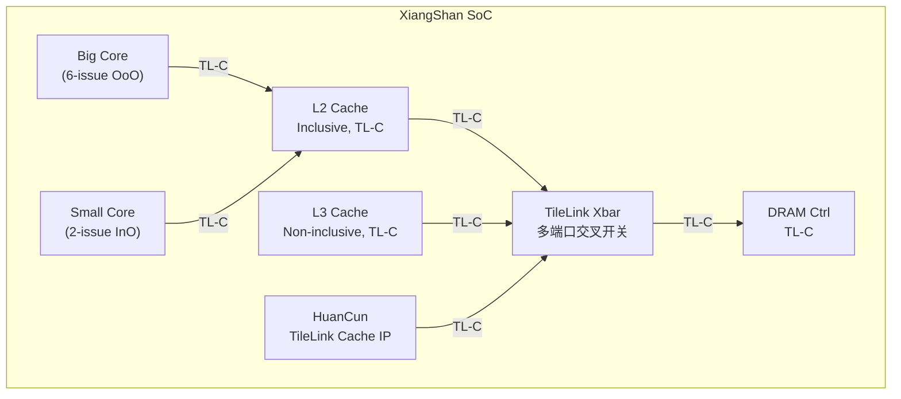
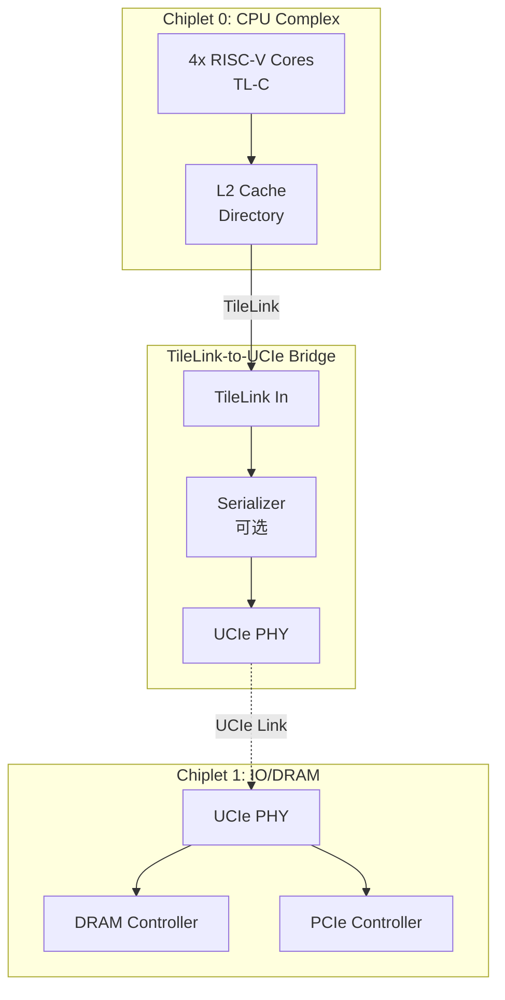

# TileLink往哪去——生态演进与前沿方向

<span class="badge-b">[B]</span> <span class="badge-i">[I]</span> <span class="badge-e">[E]</span> <span class="badge-m">[M]</span>

<span class="red">TileLink 作为 RISC-V 生态的核心互连协议，正在从学术原型走向工业级部署，并在 AI 加速器、Chiplet 互联等前沿领域探索新的可能性。</span>

---

## 核心定义与价值

### <strong>TileLink 的当前生态位</strong>

截至 2025 年，TileLink 已经不仅仅是一个片上总线，而是 RISC-V 硬件生态的基础设施。

<br>

| 项目 | 机构 | TileLink 角色 | 状态 |
|------|------|-------------|------|
| Rocket Chip | UC Berkeley | 原生总线，发源地 | 稳定维护 |
| BOOM | UC Berkeley | 乱序核，TL-C 一致性 | 活跃开发 |
| XiangShan | 中科院计算所 | 高性能 RISC-V 核，TL-C | 量产前 |
| Gemmini | UC Berkeley | AI 加速器，TL-UH 接口 | 活跃 |
| FireSim | UC Berkeley | FPGA 仿真平台，TileLink 全系统 | 成熟 |
| Chipyard | UC Berkeley | SoC 集成框架，Diplomacy + TileLink | 成熟 |

<br>

<span class="blue">TileLink 生态的显著特点是"学术界驱动 + 工业界采用"。</span>
<br>
与 AMBA 由 ARM 官方强推不同，TileLink 的标准化进程相对缓慢但社区参与度更高。

---

## 核心机制原理解析

### <strong>1. XiangShan 处理器中的 TileLink 实现</strong>

<span class="red">XiangShan（香山）是中科院计算所开发的高性能 RISC-V 处理器，其 TileLink 实现代表了当前工业级最高水平。</span>

<br>



<br>

香山的关键设计特点：

- <span class="green">HuanCun</span>：香山团队开源的 TileLink Cache IP，支持多级缓存一致性
<br>
- <span class="green">非包含式 L3</span>：降低目录开销，支持更多核心
<br>
- <span class="green">TileLink-to-CHI 桥接</span>：在服务器级 SoC 中与 CHI 子系统共存

<br>

<span class="blue">香山项目证明了 TileLink 可以支撑乱序执行、多级缓存、高性能存储子系统。</span>

### <strong>2. 从 TileLink 到 CXL.mem 的扩展可能</strong>

CXL（Compute Express Link）是 x86 生态正在推进的内存一致性互联标准。

<br>

| 特性 | TileLink | CXL.mem |
|------|----------|---------|
| 协议层级 | 片上（on-chip） | 片间（off-chip） |
| 物理层 | 未定义（可配） | PCIe 物理层 |
| 一致性 | 目录式（TL-C） | 基于内存的一致性 |
| 扩展性 | SoC 内部 | 服务器/机架级 |
| 标准化 | RISC-V 社区 | CXL Consortium |

<br>

<span class="red">TileLink 与 CXL.mem 的融合是 RISC-V 服务器生态的关键方向。</span>
<br>
可能的融合路径：

- 在 Chiplet 内部使用 TileLink 互联
<br>
- 在 Chiplet 之间通过 TileLink-to-CXL 桥接器连接
<br>
- RISC-V International 正在讨论将 TileLink 扩展为支持片间一致性的版本

---

## 技术教学与实战

### <strong>在 Gemmini AI 加速器中使用 TileLink</strong>

Gemmini 是 UC Berkeley 的 DNN 加速器生成器，通过 TileLink 接口与 CPU 共享内存。

<br>

```scala
// Gemmini 连接到 TileLink 总线（简化配置）
class GemminiTileLinkConfig extends Config(
  new gemmini.DefaultGemminiConfig ++
  new freechips.rocketchip.subsystem.WithInclusiveCache ++
  new chipyard.config.AbstractConfig
)

// Gemmini 作为 TL-UH Agent，通过 DMA 访存
trait HasTileLinkDMA {
  val dma = LazyModule(new TLDMA(   // TileLink DMA 引擎
    beatBytes = 16,                  // 128-bit 数据通路
    maxBytes = 64,                   // 最大 burst 64 字节
    memAlignment = 64                // cache line 对齐
  ))
}
```

<br>

Gemmini 的 TileLink 使用模式：

- 权重加载：通过 TileLink DMA 从 DRAM 读取到本地 SRAM
<br>
- 激活值流式处理：TileLink burst 传输，最大化带宽利用
<br>
- 结果写回：通过 TileLink 写回 DRAM，CPU 可直接读取

<br>

<span class="blue">AI 加速器使用 TileLink 的核心优势：开源 + 一致性集成。</span>
<br>
商业 AI 加速器通常需要 AXI 接口转接才能接入 ARM SoC，
<br>
而 Gemmini 通过 TL-UH 原生接入 RISC-V SoC，一致性由硬件自动维护。

---

## 嵌入式专属实战场景

### <strong>场景：评估 TileLink 在 Chiplet 设计中的可行性</strong>

假设你正在设计一个 Chiplet-based RISC-V 处理器，需要评估 TileLink 作为 Die-to-Die 互联的可行性。

<br>



<br>

可行性分析：

| 挑战 | 分析 | 结论 |
|------|------|------|
| 延迟 | Die-to-Die 额外 10-20ns | 可接受，TileLink 本身容忍延迟 |
| 带宽 | UCIe 64 GT/s × 16 lane = 128 GB/s | 远超 TileLink 需求 |
| 一致性 | TileLink 目录式天然支持分布式 | 优势，无需额外协议转换 |
| 功耗 | SerDes 功耗较高 | 需要评估，可能限制小规模 Chiplet |

<br>

<span class="blue">结论：TileLink 用于 Chiplet 内部互联是自然的，扩展到 Die-to-Die 需要 PHY 层桥接。</span>

---

## 历史演进与前沿

### <strong>TileLink 标准化进程</strong>

<br>

| 时间 | 事件 | 意义 |
|------|------|------|
| 2015 | TileLink 1.0 发布 | 学术原型 |
| 2018 | TileLink 1.8 规范稳定 | 社区广泛采用 |
| 2020 | SiFive 7-series 采用 TileLink | 商业芯片验证 |
| 2022 | RISC-V International 讨论标准化 | 从社区协议走向国际标准 |
| 2024 | 香山处理器流片 | 中国高性能 RISC-V 的 TileLink 实践 |
| 2025+ | TileLink 2.0 讨论 | 可能引入 QoS、安全扩展、片间一致性 |

<br>

### <strong>与 CHI 融合趋势</strong>

RISC-V International 的 Unprivileged Spec 工作组正在讨论 TileLink 与 CHI 的关系：

- <span class="green">短期</span>：TileLink 和 CHI 在 RISC-V SoC 中各自独立使用，通过桥接器互连
<br>
- <span class="green">中期</span>：TileLink 吸收 CHI 的 QoS 和错误处理机制
<br>
- <span class="green">长期</span>：统一的 RISC-V 互连标准，可能命名为 "RV-Link" 或其他

<br>

<span class="blue">融合的核心驱动力：RISC-V 需要一套从 IoT 到服务器的统一互连标准。</span>
<br>
TileLink 覆盖低端到中端，CHI 覆盖高端，两者互补但统一更有利于生态。

---

## 本章小结

| 主题 | 核心要点 |
|------|----------|
| 香山处理器 | HuanCun + 多级 TL-C，验证 TileLink 支撑高性能 |
| CXL 融合 | TileLink 用于 Chiplet 内部，桥接到 CXL/UCIe 片间 |
| AI 加速器 | Gemmini 通过 TL-UH 原生接入，DMA + 一致性 |
| 标准化 | RISC-V International 推动，可能走向 RV-Link |
| 与 CHI 关系 | 短期互补，中期融合，长期统一 |
| 前沿方向 | QoS、安全扩展、片间一致性、Chiplet 支持 |

---

## 练习

1. **分析题**：为什么 TileLink 需要与 CXL 融合，而不能直接作为片间协议使用？从物理层、延迟和标准化三个角度分析。

2. **设计题**：为一个 AI 推理加速器设计 TileLink 接口。它需要加载 4MB 权重、读取输入激活值、写回输出结果。选择合适的 TileLink 层级并说明理由。

3. **对比题**：比较 TileLink 和 CHI 在 64 核服务器场景下的优劣势。什么情况下你会选择 TileLink？什么情况下选择 CHI？

4. **预测题**：如果 RISC-V International 最终发布统一的 "RV-Link" 标准，你认为它会吸收 TileLink 的哪些设计？吸收 CHI 的哪些设计？
