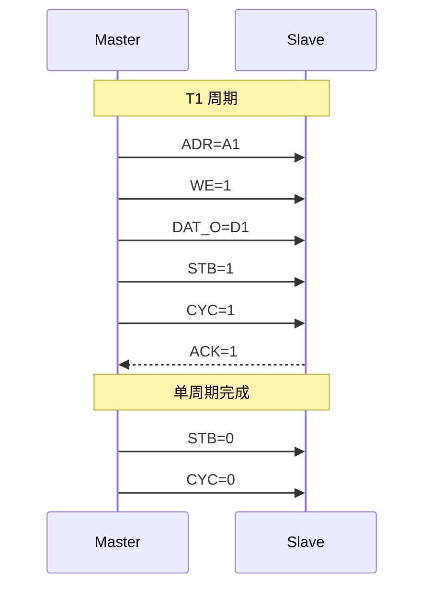
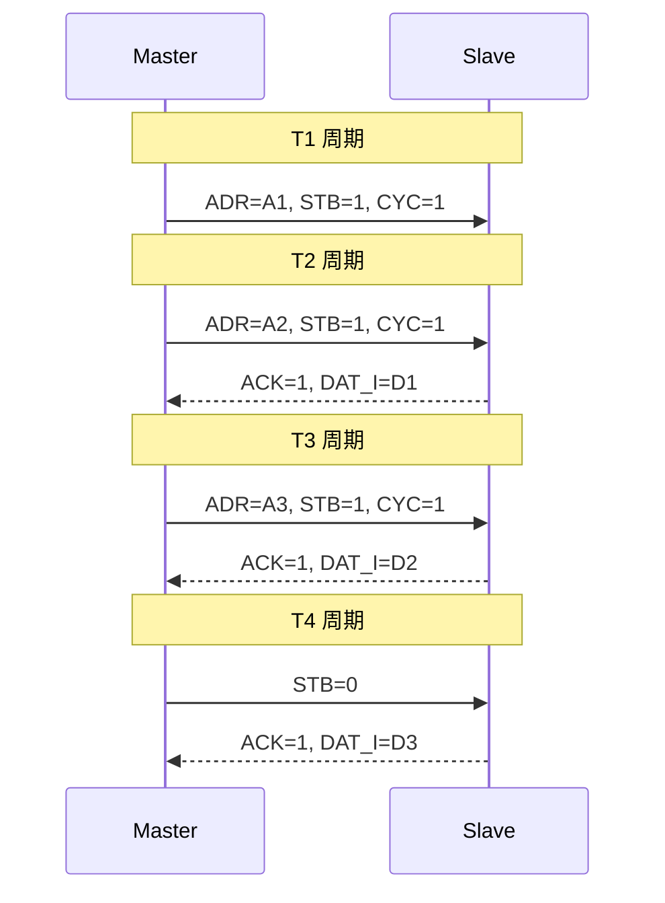

# Wishbone 基础认知与架构 [B→I]

> **本章学习目标**：
> - 理解 Wishbone 的开放设计哲学与 OpenCores 生态
> - 掌握 Wishbone 信号定义（ADR/DAT/WE/STB/CYC/ACK/ERR/RTY）
003cbr>
> - 了解 Wishbone 单周期与流水线传输模式

---

从何而来 → 为什么需要 → 哪里用： 
Wishbone 诞生于 1999 年，由 OpenCores 组织提出。 
当时，开源硬件运动兴起，但缺乏一套免费、简单、通用的片内总线标准。 
AMBA 受 ARM 版权约束，PCI 面向板级互联。Wishbone 用不到 10 个信号实现单周期读写，完全免费开放，成为开源硬件社区的事实标准。 
如今，Wishbone 广泛应用于 FPGA 开源 SoC、OpenRISC 处理器、Lattice 和 Microsemi 的参考设计中。 

---

## Wishbone 的设计哲学

---

### <strong>为什么需要 Wishbone：开源硬件的通用语言</strong>

Wishbone 是开源硬件运动的产物。 
其设计目标可归纳为三点： 

类比理解：Wishbone 如同"开源社区的通用接头" 
商业总线（AMBA）= "苹果 Lightning 接口"（精致、封闭、需授权）。 
Wishbone = "USB Type-A"（简单、通用、任何人可制造）。 
开源硬件设计者可以像插 U 盘一样，将任何 Wishbone 兼容的 IP 核接入自己的 SoC。 

<strong>1. 完全开放：无版权、无授权费</strong> 
Wishbone 规范由 OpenCores 维护，以 LGPL 协议发布。 
任何人可自由实现、修改、商业化，无需支付版权费。 

<strong>2. 极简设计：10 个信号完成所有操作 
Wishbone 仅需 ADR、DAT、WE、STB、CYC、ACK、ERR、RTY、SEL、CLK。 
信号数量与 APB 相当，但支持流水线传输。 

<strong>3. 灵活扩展：支持单周期/流水线/块传输</strong> 
Wishbone 定义 4 种传输模式： 
* 单周期读写（Single Read/Write） 
* 块传输（Block Read/Write） 
* 流水线读写（Pipelined Read/Write） 
* 突发传输（Burst Read/Write） 

---

## Wishbone 信号定义

---

### <strong>核心信号与方向</strong>

Wishbone 信号命名直观，功能明确。 

| 信号名 | 宽度 | 方向 | 说明 |
| --- | --- | --- | --- |
| CLK_I | 1 | 全局 | 总线时钟 |
| RST_I | 1 | 全局 | 同步复位 |
| ADR_O | 32 | Master→Slave | 目标地址 |
| DAT_O | 32/64 | Master→Slave | 写数据 |
| DAT_I | 32/64 | Slave→Master | 读数据 |
| WE_O | 1 | Master→Slave | 1=写，0=读 |
| STB_O | 1 | Master→Slave | 选通信号，标志有效周期 |
| CYC_O | 1 | Master→Slave | 总线周期信号，占用总线 |
| ACK_I | 1 | Slave→Master | 传输完成 |
| ERR_I | 1 | Slave→Master | 传输错误 |
| RTY_I | 1 | Slave→Master | 重试请求 |
| SEL_O | 4/8 | Master→Slave | 字节使能 |

STB_O 和 CYC_O 的区别：STB 标志当前周期有效，CYC 标志 Master 占用总线（支持仲裁）。 

---

## Wishbone 单周期与流水线传输

---

### <strong>单周期传输时序</strong>

单周期传输是 Wishbone 最简单的模式。 
一个完整传输固定 1 个时钟周期。 

单周期模式要求 Slave 在 CLK 上升沿前准备好 ACK，对 Slave 的时序要求严格。 

---

### <strong>流水线传输时序</strong>

流水线传输允许 Master 在当前周期 ACK 前发送下一个地址。 

流水线模式地址和数据重叠，理论吞吐量与 AHB 相当。 

---

## 本章小结

| 概念 | 一句话总结 |
| --- | --- |
| Wishbone | OpenCores 开源总线标准，完全免费开放 |
| STB | 选通信号，标志当前周期有效 |
| CYC | 总线周期信号，标志 Master 占用总线 |
| ACK | Slave 传输完成确认 |
| SEL | 字节使能（类似 AXI WSTRB） |
| 单周期 | 1 周期完成，Slave 时序要求严格 |
| 流水线 | 地址和数据重叠，吞吐量更高 |

---

## 练习

1. 对比 Wishbone 和 APB 的信号数量，说明两者在设计哲学上的差异。 
2. 为什么 Wishbone 需要同时有 STB 和 CYC 两个信号？ 
3. 设计一个 Wishbone Slave：基地址 0x0000_0000，4 个 32-bit 寄存器，支持单周期响应。
